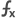
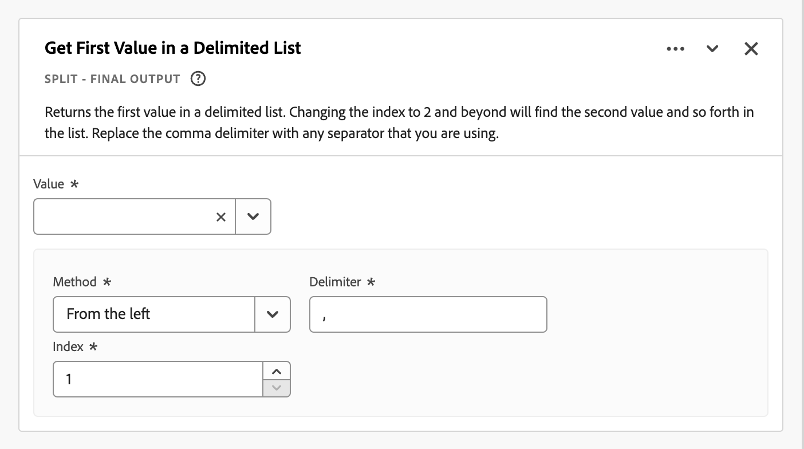
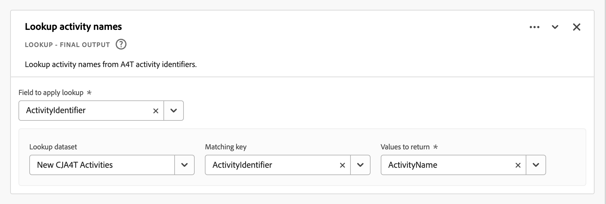

# Champs dérivés

Les champs dérivés sont un aspect important de la fonctionnalité de création de rapports en temps réel dans Adobe Customer Journey Analytics. Un champ dérivé vous permet de définir à la volée des manipulations de données (souvent complexes) par le biais d’un créateur de règles personnalisable. Vous pouvez ensuite utiliser ce champ dérivé comme composant (mesure ou dimension) dans [Workspace](../../analysis-workspace/home.md) ou même définir plus précisément le champ dérivé en tant que composant dans [Vue des données](../data-views.md).

Les champs dérivés permettent de gagner beaucoup de temps et d’efforts, par rapport à la transformation ou à la manipulation de vos données à d’autres endroits en dehors de Customer Journey Analytics. Par exemple : [Préparation de données](https://experienceleague.adobe.com/docs/experience-platform/data-prep/home.html), [Distiller de données](https://experienceleague.adobe.com/docs/experience-platform/query/data-distiller/overview.html)ou dans vos propres processus Extract Transform Load (ETL)/Extract Load Transform (ELT).

Les champs dérivés sont définis dans [Vues des données](../data-views.md), sont basées sur un ensemble de fonctions définies en tant que règles et appliquées aux champs standard et/ou de schéma disponibles.

Voici des exemples de cas d’utilisation :

- Définissez un champ Nom de page dérivé qui corrige les valeurs de nom de page collectées incorrectes afin de corriger les valeurs de nom de page.

- Définissez un champ Canal marketing dérivé qui détermine le canal marketing approprié en fonction d’une ou de plusieurs conditions (par exemple, un paramètre d’URL, une URL de page, un nom de page).

## Interface de champ dérivée

Lorsque vous créez ou modifiez un champ dérivé, vous utilisez l’interface de champ dérivé.

|  | Nom | Description |
|---------|----------|--------|
| 1 | **Sélecteur** | Utilisez la zone de sélecteur pour sélectionner et faire glisser votre fonction, modèle de fonction, champ de schéma ou champ standard vers le créateur de règles.  Utilisez la liste déroulante pour effectuer une sélection parmi :   [!UICONTROL Fonctions] - listes disponibles [fonctions](#function-reference),   [!UICONTROL Modèles de fonction] - listes disponibles [modèle de fonction](#function-templates),    [!UICONTROL Champs de schéma] - répertorie les champs disponibles des catégories de jeux de données (événement, profil, recherche) et des champs dérivés précédemment définis ; et   [!UICONTROL Champs standard] : champs disponibles standard (comme l’identifiant du jeu de données Platform). Seuls les champs standard de type chaîne et numérique s’affichent dans le sélecteur. Si la fonction prend en charge d’autres types de données, il est possible de sélectionner des champs standard avec ces autres types de données pour les valeurs ou les champs dans l’interface des règles. Vous pouvez rechercher des champs de fonction, de modèle de fonction, de schéma et standard à l’aide de la variable  Zone de recherche.  Vous pouvez filtrer la liste d’objets sélectionnée en sélectionnant  Filtrez et spécifiez des filtres dans la variable [!UICONTROL Filtrage des champs par] boîte de dialogue. Vous pouvez facilement supprimer des filtres à l’aide de  pour chaque filtre. |
| 2 | **Créateur de règles** | Vous créez votre champ dérivé de manière séquentielle à l’aide d’une ou de plusieurs règles. Une règle est une implémentation spécifique d’une fonction et est donc toujours associée à une seule fonction. Pour créer une règle, faites-la glisser et déposez-la dans le créateur de règles. Le type de fonction détermine l’interface de la règle. Voir [Interface des règles](#rule-interface) pour plus d’informations.  Vous pouvez insérer une fonction au début, à la fin ou entre les règles déjà disponibles dans le créateur de règles. La dernière règle du créateur de règles détermine la sortie finale du champ dérivé. |
| 3 | **[!UICONTROL ** Paramètres des champs **]** | Vous pouvez nommer et décrire votre champ dérivé et inspecter son type de champ. |
| 4 | **[!UICONTROL ** Sortie finale **]** | Cette zone affiche un aperçu mis à jour à la volée des valeurs de sortie, en fonction des données des 30 derniers jours et des modifications apportées au champ dérivé dans le créateur de règles. |

{style="table-layout:auto"}

## Assistant de modèle de champ

Lorsque vous accédez pour la première fois à l’interface de champ dérivé, la variable [!UICONTROL Commencer avec un modèle de champ] s’affiche.

1. Sélectionnez le modèle qui décrit le mieux le type de champ que vous essayez de créer.
2. Sélectionnez la variable **[!UICONTROL ** Sélectionner **]** pour continuer.

La boîte de dialogue de champ dérivé est remplie avec des règles (et fonctions) requises ou utiles pour le type de champ que vous avez sélectionné. Voir [Modèles de fonction](#function-templates) pour plus d’informations sur les modèles disponibles.

## Interface des règles

Lorsque vous définissez une règle dans le créateur de règles, vous utilisez l’interface des règles.

|  | Nom | Description |
|---------|----------|--------|
| A | **Nom de la règle** | Par défaut, le nom de la règle est **Règle X** (X faisant référence à un numéro de séquence). Pour modifier le nom d’une règle, sélectionnez-la, puis saisissez le nouveau nom, par exemple `Query Parameter`. |
| B | **Nom de la fonction** | Nom de fonction sélectionné pour la règle, par exemple [!UICONTROL PARTAGE D’URL]. Lorsque la fonction est la dernière de la séquence de fonctions et qu’elle détermine les valeurs de sortie finales, le nom de la fonction est suivi de [!UICONTROL - SORTIE FINALE], par exemple [!UICONTROL URL PARSE - SORTIE FINALE].  Pour afficher une fenêtre contextuelle contenant plus d’informations sur la fonction, sélectionnez . |
| C | **Description de la règle** | Vous pouvez éventuellement ajouter une description à une règle. Sélectionner , puis sélectionnez **[!UICONTROL ** Ajouter une description **]** pour ajouter une description ou **[!UICONTROL ** Modifier la description **]** pour modifier une description existante. Utilisez l’éditeur pour saisir une description. Vous pouvez utiliser la barre d’outils pour mettre en forme le texte (à l’aide du sélecteur de style, du gras, de l’italique, du souligné, de la droite, de la gauche, du centré, de la couleur, de la liste à puces) et ajouter des liens vers des informations externes.  Pour terminer la modification de la description, cliquez en dehors de l’éditeur. |
| D | **Zone de fonction** | Définit la logique de la fonction. L’interface dépend du type de fonction. Liste déroulante pour [!UICONTROL Champ] ou [!UICONTROL Valeur] affiche toutes les catégories de champs (règles, champs standard, champs) disponibles, en fonction du type d’entrée attendu par la fonction. Vous pouvez également faire glisser un champ du sélecteur de champs Schéma et Standard vers un champ ou une valeur. Lorsque ce champ déplacé provient d’un jeu de données de recherche, une fonction de recherche est automatiquement insérée avant la fonction que vous définissez.  Voir [Référence de fonction](#function-reference) sur des informations détaillées sur chacune des fonctions prises en charge. |

{style="table-layout:auto"}

## Création d’un champ dérivé

1. Sélectionnez une vue de données existante ou créez une vue de données. Voir [Vues des données](../data-views.md) pour plus d’informations.

2. Sélectionnez la variable **[!UICONTROL ** Composants **]** de la vue Données.

3. Sélectionner **[!UICONTROL ** Créer un champ dérivé&#x200B;**]** dans le rail de gauche.

4. Pour définir votre champ dérivé, utilisez la méthode [!UICONTROL Créer un champ dérivé] . Voir [Interface de champ dérivée](#derived-field-interface).

   Pour enregistrer votre nouveau champ dérivé, sélectionnez **[!UICONTROL ** Enregistrer **]**.

5. Votre nouveau champ dérivé est ajouté à la variable [!UICONTROL Champs dérivés >] conteneur, dans le cadre d’ **[!UICONTROL ** Champs de schéma **]** dans le rail gauche de votre vue de données.

## Modification d’un champ dérivé

1. Sélectionnez une vue de données existante. Voir [Vues des données](../data-views.md) pour plus d’informations.

2. Sélectionnez la variable **[!UICONTROL ** Composants **]** de la vue Données.

3. Sélectionner **[!UICONTROL ** Champs de schéma **]** dans le [!UICONTROL Connexion] sur la gauche.

4. Sélectionner **[!UICONTROL ** Champs dérivés >**]** conteneur.

5. Pointez sur le champ dérivé à modifier, puis sélectionnez .

6. Pour modifier votre champ dérivé, utilisez la méthode [!UICONTROL Modifier le champ dérivé] . Voir [Interface de champ dérivée](#derived-field-interface).

   - Sélectionner **[!UICONTROL ** Enregistrer **]** pour enregistrer votre champ dérivé mis à jour.

   - Sélectionner **[!UICONTROL ** Annuler **]** pour annuler les modifications que vous avez apportées au champ dérivé.

   - Sélectionner **[!UICONTROL ** Enregistrer sous **]** pour enregistrer le champ dérivé en tant que nouveau champ dérivé. Le nouveau champ dérivé porte le même nom que le champ dérivé modifié d’origine avec `(copy)` ajoutée à .

Vous pouvez également utiliser un champ dérivé comme composant pour des dimensions ou des mesures dans votre vue de données :

1. Sélectionnez le composant. Notez que le composant peut avoir un nom différent de celui de votre champ dérivé.

1. Dans le panneau Composant , sélectionnez la variable  en regard de votre champ dérivé, sous le nom du champ de schéma.

1. Pour modifier votre champ dérivé, utilisez la méthode [!UICONTROL Modifier le champ dérivé] . Voir [Interface de champ dérivée](#derived-field-interface).

   - Sélectionner **[!UICONTROL ** Enregistrer **]** pour enregistrer votre champ dérivé mis à jour.

   - Sélectionner **[!UICONTROL ** Annuler **]** pour annuler les modifications que vous avez apportées au champ dérivé.

   - Sélectionner **[!UICONTROL ** Enregistrer sous **]** pour enregistrer le champ dérivé en tant que nouveau champ dérivé. Le nouveau champ dérivé porte le même nom que le champ dérivé modifié d’origine avec `(copy)` ajoutée à .

## Suppression d’un champ dérivé

1. Sélectionnez une vue de données existante. Voir [Vues des données](../data-views.md) pour plus d’informations.

2. Sélectionnez la variable **[!UICONTROL ** Composants **]** de la vue Données.

3. Sélectionner **[!UICONTROL ** Champs de schéma **]** dans [!UICONTROL Connexion] volet.

4. Sélectionner **[!UICONTROL ** Champs dérivés >**]** conteneur.

5. Pointez sur le champ dérivé à supprimer, puis sélectionnez .

6. Dans le [!UICONTROL Modifier le champ dérivé] interface, sélectionnez **[!UICONTROL Supprimer]**.

   A [!UICONTROL Supprimer le composant] vous demande de confirmer la suppression. Tenez compte des références externes qui peuvent exister au champ dérivé en dehors de la vue de données.

   - Sélectionner **[!UICONTROL ** Continuer **]** pour supprimer le champ dérivé.

Vous pouvez également utiliser un champ dérivé comme composant pour des dimensions ou des mesures dans votre vue de données :

1. Sélectionnez le composant. Notez que le composant peut avoir un nom différent de celui de votre champ dérivé.

1. Dans le panneau Composant , sélectionnez la variable  en regard de votre champ dérivé, sous le nom du champ de schéma.

1. Dans le [!UICONTROL Modifier le champ dérivé] interface, sélectionnez **[!UICONTROL Supprimer]**.

   A [!UICONTROL Supprimer le composant] vous demande de confirmer la suppression. Tenez compte des références externes qui peuvent exister au champ dérivé en dehors de la vue de données.

   - Sélectionner **[!UICONTROL ** Continuer **]** pour supprimer le champ dérivé.

>[!NOTE]
>
>Les champs dérivés sont gérés au niveau de la connexion dans Customer Journey Analytics. Toute modification apportée à un champ dérivé dans l’une des vues de données associées à cette connexion s’applique à toutes ces vues de données associées.

## Modèles de fonction

Pour créer rapidement un champ dérivé en fonction de cas d’utilisation spécifiques, des modèles de fonction sont disponibles. Ces modèles de fonction sont accessibles à partir de la zone de sélecteur de l’interface de champ dérivé ou sont présentés lors de la première utilisation dans la section [!UICONTROL Commencer avec un modèle de champ] assistant.

### Canaux marketing

Ce modèle de fonction utilise un ensemble de règles pour créer des canaux marketing.

+++ Détails

Pour utiliser le modèle, vous devez spécifier les paramètres corrects pour chaque fonction répertoriée comme faisant partie des règles du modèle. Voir [Référence de fonction](#function-reference) pour plus d’informations.

+++

### Rebonds

Ce modèle de fonction utilise un ensemble de règles pour identifier les rebonds au site.

+++ Détails

Pour utiliser le modèle, vous devez spécifier les paramètres corrects pour chaque fonction répertoriée comme faisant partie des règles du modèle. Voir [Référence de fonction](#function-reference) pour plus d’informations.

+++

### Combinaison multidimensionnelle

Ce modèle de fonction combine deux valeurs en une seule.

+++ Détails

Pour utiliser le modèle, vous devez spécifier les paramètres corrects pour chaque fonction répertoriée comme faisant partie des règles du modèle. Voir [Référence de fonction](#function-reference) pour plus d’informations.

+++

### Nom convivial de jeu de données

Ce modèle de fonction fournit un nom de jeu de données lisible.

+++ Détails

Pour utiliser le modèle, vous devez spécifier les paramètres corrects pour chaque fonction répertoriée comme faisant partie des règles du modèle. Voir [Référence de fonction](#function-reference) pour plus d’informations.

+++

### Nom de page à partir d’une URL

Ce modèle de fonction crée un nom de page simple.

+++ Détails

Pour utiliser le modèle, vous devez spécifier les paramètres corrects pour chaque fonction répertoriée comme faisant partie des règles du modèle. Voir [Référence de fonction](#function-reference) pour plus d’informations.

+++

### Saison de fêtes

Ce modèle de fonction classe les heures clés de l’année.

+++ Détails

Pour utiliser le modèle, vous devez spécifier les paramètres corrects pour chaque fonction répertoriée comme faisant partie des règles du modèle. Voir [Référence de fonction](#function-reference) pour plus d’informations.

+++

### Objectifs mensuels

Ce modèle de fonction définit des objectifs mensuels personnalisés.

+++ Détails

Pour utiliser le modèle, vous devez spécifier les paramètres corrects pour chaque fonction répertoriée comme faisant partie des règles du modèle. Voir [Référence de fonction](#function-reference) pour plus d’informations.

+++

### Obtenir toutes les valeurs dans la liste délimitée

Ce modèle de fonction convertit une liste limitée en tableau.

+++ Détails

Pour utiliser le modèle, vous devez spécifier les paramètres corrects pour chaque fonction répertoriée comme faisant partie des règles du modèle. Voir [Référence de fonction](#function-reference) pour plus d’informations.

+++

### Obtenir la première valeur dans la liste délimitée

Ce modèle de fonction récupère la première valeur d’une liste délimitée.

+++ Détails

Pour utiliser le modèle, vous devez spécifier les paramètres corrects pour chaque fonction répertoriée comme faisant partie des règles du modèle. Voir [Référence de fonction](#function-reference) pour plus d’informations.

+++

### Obtenir la dernière valeur dans une liste délimitée

Ce modèle de fonction récupère la dernière valeur d’une liste délimitée.

+++ Détails

Pour utiliser le modèle, vous devez spécifier les paramètres corrects pour chaque fonction répertoriée comme faisant partie des règles du modèle. Voir [Référence de fonction](#function-reference) pour plus d’informations.

+++

### Nom de domaine

Ce modèle de fonction extrait le nom de domaine à l’aide d’une expression régulière.

+++ Détails

Pour utiliser le modèle, vous devez spécifier les paramètres corrects pour chaque fonction répertoriée comme faisant partie des règles du modèle. Voir [Référence de fonction](#function-reference) pour plus d’informations.

+++

### Obtenir le paramètre de la chaîne de requête

Ce modèle de fonction extrait les valeurs de chaîne de requête.

+++ Détails

Pour utiliser le modèle, vous devez spécifier les paramètres corrects pour chaque fonction répertoriée comme faisant partie des règles du modèle. Voir [Référence de fonction](#function-reference) pour plus d’informations.

+++

### Champ de transition

Ce modèle de fonction transforme les rapports d’un champ à un autre.

+++ Détails

Pour utiliser le modèle, vous devez spécifier les paramètres corrects pour chaque fonction répertoriée comme faisant partie des règles du modèle. Voir [Référence de fonction](#function-reference) pour plus d’informations.

+++

### Détection simple des robots

Ce modèle de fonction met en oeuvre l’identification des robots légers.

+++ Détails

Pour utiliser le modèle, vous devez spécifier les paramètres corrects pour chaque fonction répertoriée comme faisant partie des règles du modèle. Voir [Référence de fonction](#function-reference) pour plus d’informations.

+++

### Lien de sortie

Ce modèle de fonction identifie le dernier lien cliqué dans une session.

+++ Détails

Pour utiliser le modèle, vous devez spécifier les paramètres corrects pour chaque fonction répertoriée comme faisant partie des règles du modèle. Voir [Référence de fonction](#function-reference) pour plus d’informations.

+++

### Lien de téléchargement

Ce modèle de fonction signale les liens de téléchargement courants.

+++ Détails

Pour utiliser le modèle, vous devez spécifier les paramètres corrects pour chaque fonction répertoriée comme faisant partie des règles du modèle. Voir [Référence de fonction](#function-reference) pour plus d’informations.

+++

<!--

+++ Data clean up template

>[!WARNING]
>
>Could not find any information on this template.
+++

-->

## Référence de fonction

{{select-package}}

Pour chaque fonction prise en charge, recherchez les détails ci-dessous sur :

- spécifications :
   - type de données d&#39;entrée : type de données prises en charge,
   - input : valeurs possibles de saisie,
   - opérateurs inclus : opérateurs pris en charge pour cette fonction (le cas échéant),
   - limitations : limitations qui s&#39;appliquent à cette fonction spécifique,
   - sortie.

- cas d’utilisation, notamment :
   - données avant de définir le champ dérivé,
   - comment définir le champ dérivé,
   - données après avoir défini le champ dérivé.

- contraintes (le cas échéant).

>[!NOTE]
>
>La fonction Lookup a été renommée [Classifier](#classify). Voir [Classifier](#classify) pour plus d’informations.

<!-- CASE WHEN -->

### Cas si

Applique des conditions, selon des critères définis à partir d’un ou de plusieurs champs. Ces critères sont ensuite utilisés pour définir les valeurs d’un nouveau champ dérivé, selon l’ordre des conditions.

+++ Détails

## Spécifications {#casewhen-io}

| Input Data Type | Entrée | Opérateurs inclus | Limites | Sortie |
|---|---|---|---|---|
| <ul><li>Chaîne</li><li>Numérique</li><li>Date</li></ul> | <ul><li>[!UICONTROL If], [!UICONTROL Sinon si] container :
<ul><li>[!UICONTROL Valeur]</li><ul><li>Règles</li><li>Champs standard</li><li>Champs</li></ul><li>[!UICONTROL Critère] (voir opérateurs inclus, selon le type de valeur sélectionné)</li></ul></li><li>[!UICONTROL Ensuite, définissez la valeur sur], [!UICONTROL Sinon, définissez la valeur sur]:
<ul><li>[!UICONTROL Valeur]</li><ul><li>Règles</li><li>Champs standard</li><li>Champs</li></ul></ul></li></ul> | 
Chaînes
<ul><li>Est égal à</li><li>Est égal à l’un des termes</li><li>Contient l’expression</li><li>Contient n’importe quel terme</li><li>Contient tous les termes</li><li>Commence par</li><li>Commence par tout terme</li><li>Se termine par</li><li>Se termine par un terme</li><li>N’est pas égal à</li><li>N’est égal à aucun terme</li><li>Ne contient pas l’expression</li><li>Ne contient aucun terme</li><li>Ne contient pas tous les termes</li><li>Ne commence pas par</li><li>Ne commence par aucun terme</li><li>Ne se termine pas par</li><li>Ne se termine par aucun terme</li><li>Est défini</li><li>N’est pas défini</li></ul>
Numérique
<ul><li>Est égal à</li><li>N’est pas égal à</li><li>Est supérieur à</li><li>Est supérieur ou égal à</li><li>Est inférieur à</li><li>Est inférieur ou égal à</li><li>Est défini</li><li>N’est pas défini</li></ul>
Dates
<ul><li>Est égal à</li><li>N’est pas égal à</li><li>Est ultérieur(e) à</li><li>Est ultérieur(e) ou égal(e) à</li><li>Est antérieur(e) à</li><li>Est antérieur(e) ou égal(e) à</li><li>Est défini</li><li>N’est pas défini</li></ul> | <ul><li>5 fonctions par champ dérivé</li><li>200 [opérateurs](#operators) par champ dérivé. Un exemple d’opérateur unique est &quot;Domaine référent contient google&quot;. </li></ul> | 
Nouveau champ dérivé
 |

{style="table-layout:auto"}

## Cas d’utilisation 1 {#casewhen-uc1}

Vous souhaitez définir des règles pour identifier différents canaux marketing, en appliquant une logique en cascade pour définir un champ de canal marketing sur la valeur appropriée :

- Si le référent provient d’un moteur de recherche et que la page comporte une valeur de chaîne de requête où `cid` contains `ps_`, le canal marketing doit être identifié comme [!DNL *Recherche payante*].
- Si le référent provient d’un moteur de recherche et que la page ne comporte pas de chaîne de requête `cid`, le canal marketing doit être identifié comme [!DNL *Recherche naturelle*].
- Si une page a une valeur de chaîne de requête où `cid` contains `em_`, le canal marketing doit être identifié comme [!DNL *Email*].
- Si une page a une valeur de chaîne de requête où `cid` contains `ds_`, le canal marketing doit être identifié comme [!DNL *Afficher la publicité*].
- Si une page a une valeur de chaîne de requête où `cid` contains `so_`, le canal marketing doit être identifié comme [!DNL *Social payant*].
- Si le référent provient d’un domaine référent de [!DNL twitter.com], [!DNL facebook.com], [!DNL linkedin.com], ou [!DNL tiktok.com], le canal marketing doit être identifié comme [!DNL *Social naturel*].
- Si aucune des règles ci-dessus ne correspond, le canal marketing doit être identifié comme [!DNL *Autre référent*].

Si votre site reçoit les exemples d’événements suivants, contenant [!UICONTROL Référent] et [!UICONTROL URL de la page], ces événements doivent être identifiés comme suit :

| [!DNL Event] | [!DNL Referrer] | [!DNL Page URL] | [!DNL Marketing Channel] |
|:--:|----|----|----|
| 1 | `https://facebook.com` | `https://site.com/home` | [!DNL Natural Social] |
| 2 | `https://abc.com` | `https://site.com/?cid=ds_12345678` | [!DNL Display] |
| 3 | | `https://site.com/?cid=em_12345678` | [!DNL Email] |
| 4 | `https://google.com` | `https://site.com/?cid=ps_abc098765` | [!DNL Paid Search] |
| 5 | `https://google.com` | `https://site.com/?cid=em_765544332` | [!DNL Email] |
| 6 | `https://google.com` |  | [!DNL Natural Search] |

{style="table-layout:auto"}

### Données avant {#casewhen-uc1-databefore}

| [!DNL Referrer] | [!DNL Page URL] |
|----|----|
| `https://facebook.com` | `https://site.com/home` |
| `https://abc.com` | `https://site.com/?cid=ds_12345678` |
|  | `https://site.com/?cid=em_12345678` |
| `https://google.com` | `https://site.com/?cid=ps_abc098765` |
| `https://google.com` | `https://site.com/?cid=em_765544332` |
| `https://google.com` | |

{style="table-layout:auto"}

### Champ dérivé {#casewhen-uc1-derivedfield}

Vous définissez une `Marketing Channel` champ dérivé. Vous utilisez la variable [!UICONTROL CAS LORSQUE] fonctions permettant de définir des règles qui créent des valeurs pour en fonction des valeurs existantes pour les deux fonctions `Page URL` et `Referring URL` champ .

Notez l’utilisation de la fonction [!UICONTROL PARTAGE D’URL] pour définir des règles pour récupérer les valeurs de `Page Url` et `Referring Url` avant la [!UICONTROL CAS LORSQUE] les règles sont appliquées.

### Données après {#casewhen-uc1-dataafter}

| [!DNL Marketing Channel] |
|----|
| [!DNL Natural Social] |
| [!DNL Display] |
| [!DNL Email] |
| [!DNL Paid Search] |
| [!DNL Email] |
| [!DNL Natural Search] |

{style="table-layout:auto"}

## Cas d’utilisation 2 {#casewhen-uc2}

Vous avez collecté plusieurs variantes de recherche dans votre [!DNL Product Finding Methods] dimension. Pour comprendre les performances globales de la recherche par rapport à la navigation, vous devez passer beaucoup de temps à combiner les résultats manuellement.

Votre site collecte les valeurs suivantes pour votre [!DNL Product Finding Methods] dimension. À la fin, toutes ces valeurs indiquent une recherche.

| Valeur collectée | Valeur réelle |
|---|---|
| [!DNL search p13n_no] | [!DNL search] |
| [!DNL search p13n_yes] | [!DNL search] |
| [!DNL search refine p13n_no] | [!DNL search] |
| [!DNL search refine p13n_yes] | [!DNL search] |
| [!DNL search redirect p13n_yes] | [!DNL search] |
| [!DNL search-redirect] | [!DNL search] |

{style="table-layout:auto"}

### Données avant {#casewhen-uc2-databefore}

| [!DNL Product Finding Methods] |
|----|
| [!DNL search p13_no] |
| [!DNL search p13_yes] |
| [!DNL browse] |
| [!DNL search refine p13_no] |
| [!DNL search refine p13_yes] |
| [!DNL browse] |
| [!DNL search redirect p13_yes] |
| [!DNL search-redirect] |
| [!DNL browse] |

{style="table-layout:auto"}

### Champ dérivé {#casewhen-uc2-derivedfield}

Vous définissez une `Product Finding Methods (new)` champ dérivé. Vous créez les éléments suivants : [!UICONTROL CAS LORSQUE] règles dans le créateur de règles. Ces règles appliquent la logique à toutes les variantes possibles de l’ancienne [!UICONTROL Méthodes de recherche de produits] valeurs de champ pour `search` et `browse` en utilisant la variable [!UICONTROL Contient l’expression] critère.

### Données après {#casewhen-uc2-dataafter}

| [!DNL Product Finding Methods (new)] |
|----|
| [!DNL search] |
| [!DNL search] |
| [!DNL browse] |
| [!DNL search] |
| [!DNL search] |
| [!DNL browse] |
| [!DNL search] |
| [!DNL search] |
| [!DNL browse] |

{style="table-layout:auto"}

## Cas d’utilisation 3 {#casewhen-uc3}

En tant qu’agence de voyages, vous souhaitez regrouper la durée des voyages réservés afin que vous puissiez établir des rapports sur la durée des voyages regroupés.

Hypothèses :

- L’organisation collecte la durée du voyage dans un champ numérique.
- Ils souhaitent regrouper des durées de 1 à 3 jours dans un compartiment appelé &quot;&quot;[!DNL short trip]&#39;
- Ils souhaitent regrouper des durées de 4 à 7 jours dans un compartiment appelé &quot;&quot;[!DNL medium trip]&#39;
- Ils souhaitent regrouper 8 durées de plus de 8 jours dans un compartiment appelé &quot;&quot;[!DNL long trip]&#39;
- 132 trajets ont été réservés pour une durée d&#39;une journée
- 110 trajets ont été réservés pour une durée de 2 jours
- 105 trajets ont été réservés pour une durée de 3 jours
- 99 trajets ont été réservés pour une durée de 4 jours
- 92 trajets ont été réservés pour une durée de 5 jours
- 85 trajets ont été réservés pour une durée de 6 jours
- 82 trajets ont été réservés pour une durée de 7 jours
- 78 trajets ont été réservés pour une durée de 8 jours
- 50 trajets ont été réservés pour une durée de 9 jours
- 44 trajets ont été réservés pour une durée de 10 jours
- 38 trajets ont été réservés pour une durée de 11 jours
- 31 trajets ont été réservés pour une durée de 12 jours

Le rapport souhaité doit se présenter comme suit :

| [!DNL Trip Duration Type] | [!DNL Bookings] |
|----|---:|
| [!DNL medium trip] | 358 |
| [!DNL short trip] | 347 |
| [!DNL long trip] | 241 |

{style="table-layout:auto"}

### Données avant {#casewhen-uc3-databefore}

| [!DNL Trip Duration] |
|---:|
| 1 |
| 12 |
| 3 |
| 6 |
| 4 |
| 8 |
| 6 |
| 2 |
| 1 |
| 2 |
| 21 |
| 8 |

### Champ dérivé {#casewhen-uc3-derivedfield}

Vous définissez une `Trip Duration (bucketed)` champ dérivé. Vous créez les éléments suivants : [!UICONTROL CAS LORSQUE] dans le créateur de règles. Cette règle applique la logique pour regrouper l’ancienne [!UICONTROL Durée du voyage] valeurs de champ en trois valeurs : `short trip`, `medium  trip`, et `long trip`.

### Données après {#casewhen-uc3-dataafter}

| [!DNL Trip Duration (bucketed)] |
|---|
| [!DNL short trip] |
| [!DNL long trip] |
| [!DNL short trip] |
| [!DNL medium trip] |
| [!DNL medium trip] |
| [!DNL long trip] |
| [!DNL medium trip] |
| [!DNL short trip] |
| [!DNL short trip] |
| [!DNL short trip] |
| [!DNL long trip] |
| [!DNL long trip] |

## Informations supplémentaires {#casewhen-more-info}

Customer Journey Analytics utilise une structure de conteneur imbriquée, modelée sur Adobe Experience Platform [XDM](https://experienceleague.adobe.com/docs/experience-platform/xdm/home.html?lang=fr) (Modèle de données d’expérience). Voir [Conteneurs](../create-dataview.md#containers) et [Filtrage des conteneurs](../../components/filters/filters-overview.md#filter-containers) pour plus d’informations. Ce modèle de conteneur, bien que flexible par nature, impose certaines contraintes lors de l’utilisation du créateur de règles.

Customer Journey Analytics utilise le modèle de conteneur par défaut suivant :

Les contraintes suivantes s’appliquent et sont appliquées lorsque *Sélection* et *paramètre* valeurs.

|  | Contraintes |
|:---:|----|
| **A** | Valeurs *select* dans le même [!UICONTROL If], [!UICONTROL Sinon si] concept (à l’aide de [!UICONTROL Et] ou [!UICONTROL Ou]) d’une règle doit provenir du même conteneur et peut être de n’importe quel type (chaîne , numérique , etc.).   |
| **B** | Toutes les valeurs que vous *set* dans une règle doit provenir du même conteneur et avoir le même type ou une valeur dérivée du même type.    |
| **C** | Les valeurs que vous *select* cross [!UICONTROL If], [!UICONTROL Sinon si] éléments dans la règle do *not* doivent provenir du même conteneur et doivent *not* doivent être du même type.    |

{style="table-layout:auto"}

+++

<!-- CLASSIFY -->

### Classer

Définit un ensemble de valeurs qui sont remplacées par des valeurs correspondantes dans un nouveau champ dérivé.

+++ Détails

>[!NOTE]
>
>Cette fonction s’appelait d’abord Lookup, mais a été renommée Classify pour s’adapter à la fonction Lookup avec différentes fonctionnalités.

## Spécifications {#classify-io}

| Input Data Type | Entrée | Opérateurs inclus | Limites | Sortie |
|---|---|---|---|---|
| <ul><li>Chaîne</li><li>Numérique</li><li>Date</li></ul> | <ul><li>[!UICONTROL Champ à classer]:<ul><li>Règles</li><li>Champs standard</li><li>Champs</li></ul></li><li>[!UICONTROL Lorsque la valeur est égale à] et [!UICONTROL Remplacer les valeurs par]:
<ul><li>Chaîne</li></ul><li>Afficher les valeurs d’origine<ul><li>Booléen</li></ul></li></ul> | 
S.O.
 | <ul><li>5 fonctions par champ dérivé</li><li>200 [opérateurs](#operators) par champ dérivé. Chaque entrée pour [!UICONTROL Lorsque la valeur est égale à la valeur d’origine] [!UICONTROL Remplacer la valeur par Nouvelle valeur] est considérée comme une opération.</li></ul> | 
Nouveau champ dérivé
 |

{style="table-layout:auto"}

## Cas d’utilisation 1 {#classify-uc1}

Vous disposez d’un fichier CSV contenant une colonne clé pour `hotelID` et une ou plusieurs colonnes supplémentaires associées à la variable `hotelID`: `city`, `rooms`, `hotel name`.
Vous collectez des [!DNL Hotel ID] dans une dimension, mais que souhaitez créer une [!DNL Hotel Name] dimension dérivée de `hotelID` dans le fichier CSV.

**Structure et contenu du fichier CSV**

| [!DNL hotelID] | [!DNL city] | [!DNL rooms] | [!DNL hotel name] |
|---|---|---:|---|
| [!DNL SLC123] | [!DNL Salt Lake City] | 40 | [!DNL SLC Downtown] |
| [!DNL LAX342] | [!DNL Los Angeles] | 60 | [!DNL LA Airport] |
| [!DNL SFO456] | [!DNL San Francisco] | 75 | [!DNL Market Street] |
| [!DNL AMS789] | [!DNL Amsterdam] | 50 | [!DNL Okura] |

{style="table-layout:auto"}

**Rapport actuel**

| [!DNL Hotel ID] | Consultations de produit |
|---|---:|
| [!DNL SLC123] | 200 |
| [!DNL LX342] | 198 |
| [!DNL SFO456] | 190 |
| [!DNL AMS789] | 150 |

{style="table-layout:auto"}

**Rapport souhaité**

| [!DNL Hotel Name] | Consultations de produit |
|----|----:|
| [!DNL SLC Downtown] | 200 |
| [!DNL LA Airport] | 198 |
| [!DNL Market Street] | 190 |

{style="table-layout:auto"}

### Données avant {#classify-uc1-databefore}

| [!DNL Hotel ID] |
|----|
| [!DNL SLC123] |
| [!DNL LAX342] |
| [!DNL SFO456] |
| [!DNL AMS789] |

{style="table-layout:auto"}

### Champ dérivé {#classify-uc1-derivedfield}

Vous définissez une `Hotel Name` champ dérivé. Vous utilisez la variable [!UICONTROL CLASSIFY] pour définir une règle dans laquelle vous pouvez classer les valeurs de la variable [!UICONTROL ID de l&#39;hôtel] et remplacez par de nouvelles valeurs.

Si vous souhaitez inclure des valeurs d’origine que vous n’avez pas définies comme faisant partie des valeurs à classer (par exemple, l’ID d’hôtel AMS789), veillez à sélectionner **[!UICONTROL Afficher les valeurs d’origine]**. Cela garantit que AMS789 fait partie de la sortie pour le champ dérivé, bien que cette valeur ne soit pas classée.

### Données après {#classify-uc1-dataafter}

| [!DNL Hotel Name] |
|----|
| [!DNL SLC Downtown] |
| [!DNL LA Airport] |
| [!DNL Market Street] |

{style="table-layout:auto"}

## Cas d’utilisation 2 {#classify-uc2}

Vous avez collecté des URL au lieu du nom de page convivial pour plusieurs pages. Cette collection mixte de valeurs rompt la création de rapports.

### Données avant {#classify-uc2-databefore}

| [!DNL Page Name] |
|---|
| [!DNL Home Page] |
| [!DNL Flight Search] |
| `http://www.adobetravel.ca/Hotel-Search` |
| `https://www.adobetravel.com/Package-Search` |
| [!DNL Deals & Offers] |
| `http://www.adobetravel.ca/user/reviews` |
| `https://www.adobetravel.com.br/Generate-Quote/preview` |

{style="table-layout:auto"}

### Champ dérivé {#classify-uc2-derivedfield}

Vous définissez une `Page Name (updated)` champ dérivé. Vous utilisez la variable [!UICONTROL CLASSIFY] pour définir une règle dans laquelle vous pouvez classer les valeurs de votre [!UICONTROL Nom de la page] et remplacez par les valeurs correctes mises à jour.

### Données après {#classify-uc2-dataafter}

| [!DNL Page Name (updated)] |
|---|
| [!DNL Home Page] |
| [!DNL Flight Search] |
| [!DNL Hotel Search] |
| [!DNL Package Search] |
| [!DNL Deals & Offers] |
| [!DNL Reviews] |
| [!DNL Generate Quote] |

## Informations supplémentaires {#classify-moreinfo}

Les fonctionnalités supplémentaires suivantes sont disponibles dans l’interface des règles de classification :

- Pour effacer rapidement toutes les valeurs du tableau, sélectionnez  **[!UICONTROL Effacer toutes les valeurs du tableau]**.
- Pour charger un fichier CSV contenant les valeurs d’origine pour les valeurs Lorsque sont égales à et les nouvelles valeurs pour Remplacer les valeurs par, sélectionnez  **[!UICONTROL Téléchargement d’un fichier CSV]**.
- Pour télécharger un modèle de création d’un fichier CSV avec les valeurs d’origine et les nouvelles valeurs à charger, sélectionnez  **[!UICONTROL Téléchargement d’un modèle CSV]**.
- Pour télécharger un fichier CSV contenant toutes les valeurs d’origine et les nouvelles valeurs renseignées dans l’interface des règles, sélectionnez  **[!UICONTROL Téléchargement de valeurs CSV]**.

+++

<!-- CONCATENATE -->

### Concaténer

Combine les valeurs de champ dans un nouveau champ dérivé unique avec des délimiteurs définis.

+++ Détails

## Spécifications {#concatenate-io}

| Input Data Type | Entrée | Opérateurs inclus | Limites | Sortie |
|---|---|---|---|---|
| <ul><li>Chaîne</li></ul> | <ul><li>[!UICONTROL Valeur]:<ul><li>Règles</li><li>Champs standard</li><li>Champs</li><li>Chaîne</li></ul></li><li>[!UICONTROL Délimiteur]:<ul><li>Chaîne</li></ul></li> </ul> | 
S.O.
 | 
2 fonctions par champ dérivé
 | 
Nouveau champ dérivé
 |

{style="table-layout:auto"}

## Cas d’utilisation {#concatenate-uc}

Vous collectez actuellement les codes d’origine et d’aéroport de destination sous la forme de champs distincts. Vous souhaitez regrouper les deux champs dans une seule dimension séparée par un trait d’union (-). Vous pouvez donc analyser la combinaison de l’origine et de la destination pour identifier les itinéraires les plus réservés.

Hypothèses :

- Les valeurs d’origine et de destination sont collectées dans des champs distincts dans le même tableau.
- L’utilisateur détermine d’utiliser le délimiteur &quot;-&quot; entre les valeurs.

Imaginez que les réservations suivantes se produisent :

- ABC123 livre un vol entre Salt Lake City (SLC) et Orlando (MCO)
- ABC456 livre un vol entre Salt Lake City (SLC) et Los Angeles (LAX)
- ABC789 livre un vol entre Salt Lake City (SLC) et Seattle (SEA)
- ABC987 livre un vol entre Salt Lake City (SLC) et San Jose (SJO)
- ABC654 livre un vol entre Salt Lake City (SLC) et Orlando (MCO)

Le rapport souhaité doit se présenter comme suit :

| Origine/destination | Réservations |
|----|---:|
| SLC-MCO | 2 |
| SLC-LAX | 1 |
| SLC-SEA | 1 |
| SLC-SJO | 1 |

{style="table-layout:auto"}

### Données avant {#concatenate-uc-databefore}

| Origin | Destination |
|----|---:|
| SLC | MCO |
| SLC | LAX |
| SLC | SEA |
| SLC | SJO |
| SLC | MCO |

{style="table-layout:auto"}

### Champ dérivé {#concatenate-derivedfield}

Vous pouvez définir une `Origin - Destination` champ dérivé. Vous utilisez la variable [!UICONTROL CONCATENATE] pour définir une règle afin de concaténer la variable [!UICONTROL Original] et [!UICONTROL Destination] à l’aide des champs `-` [!UICONTROL Délimiteur].

### Données après {#concatenate-dataafter}

| Origine - Destination (champ dérivé) |
|---|
| SLC-MCO |
| SLC-LAX |
| SLC-SEA |
| SLC-SJO |
| SLC-MCO |

{style="table-layout:auto"}

+++

<!-- DEDUPLICATE -->

### Dédupliquer

Permet d’empêcher la comptabilisation d’une valeur plusieurs fois.

+++ Détails

{{release-limited-testing-section}}

## Spécifications {#deduplicate-io}

| Input Data Type | Entrée | Opérateurs inclus | Limites | Sortie |
|---|---|---|---|---|
| <ul><li>Chaîne</li><li>Numérique</li></ul> | <ul><li>[!UICONTROL Valeur]:<ul><li>Règles</li><li>Champs standard</li><li>Champs</li><li>Chaîne</li></ul></li><li>[!UICONTROL Portée]:<ul><li>Personne</li><li>Session</li></ul></li><li>[!UICONTROL Identifiant de déduplication]:<ul><li>Règles</li><li>Champs standard</li><li>Champs</li><li>Chaîne</li></ul><li>[!UICONTROL Valeur à conserver]:<ul><li>Conserver la première instance</li><li>Conserver la dernière instance</li></ul></li></ul> | 
S.O.
 | 
5 fonctions par champ dérivé
 | 
Nouveau champ dérivé
 |

{style="table-layout:auto"}

## Cas d’utilisation 1 {#deduplicate-uc1}

Vous souhaitez empêcher la comptabilisation des recettes en double lorsqu’un utilisateur recharge la page de confirmation de réservation. Vous utilisez l’identifiant de confirmation de réservation à l’identifiant pour ne pas comptabiliser à nouveau les recettes, lorsqu’elles sont reçues pour le même événement.

### Données avant {#deduplicate-uc1-databefore}

| ID de confirmation de réservation | Chiffre dʼaffaires |
|----|---:|
| ABC123456789 | 359 |
| ABC123456789 | 359 |
| ABC123456789 | 359 |

{style="table-layout:auto"}

### Champ dérivé {#deduplicate-uc1-derivedfield}

Vous définissez une `Booking Confirmation` champ dérivé. Vous utilisez la variable [!UICONTROL DEDUPLICATE] pour définir une règle afin de dédupliquer la fonction [!UICONTROL Valeur] [!DNL Booking] pour [!UICONTROL Portée] [!DNL Person] using [!UICONTROL Identifiant de déduplication] [!UICONTROL ID de confirmation de réservation]. Vous sélectionnez [!UICONTROL Conserver la première instance] as [!UICONTROL Valeur à conserver].

### Données après {#deduplicate-uc1-dataafter}

| ID de confirmation de réservation | Chiffre dʼaffaires |
|----|---:|
| ABC123456789 | 359 |
| ABC123456789 | 0 |
| ABC123456789 | 0 |

{style="table-layout:auto"}

## Cas d’utilisation 2 {#deduplicate-uc2}

Vous utilisez les événements comme proxy pour les clics publicitaires de campagne avec des campagnes marketing externes. Les actualisations et redirections provoquent une augmentation de la mesure d’événement. Vous souhaitez dédupliquer la dimension du code de suivi afin que seule la première soit collectée et minimiser la surcharge de l’événement.

### Données avant {#deduplicate-uc2-databefore}

| Identifiant visiteur | Canal marketing | Événements |
|----|---|---:|
| ABC123 | référencement payant | 1 |
| ABC123 | référencement payant | 1 |
| ABC123 | référencement payant | 1 |
| DEF123 | adresse e-mail | 1 |
| DEF123 | adresse e-mail | 1 |
| JKL123 | référencement naturel | 1 |
| JKL123 | référencement naturel | 1 |

{style="table-layout:auto"}

### Champ dérivé {#deduplicate-uc2-derivedfield}

Vous définissez une nouvelle `Tracking Code (deduplicated)` champ dérivé. Vous utilisez la variable [!UICONTROL DEDUPLICATE] pour définir une règle afin de dédupliquer la fonction [!UICONTROL Code de suivi] avec un [!UICONTROL Périmètre de déduplication] de [!UICONTROL Session] et [!UICONTROL Conserver la première instance] comme la propriété [!UICONTROL Valeur à conserver].

### Données après {#deduplicate-uc2-dataafter}

| Identifiant visiteur | Canal marketing | Événements |
|----|---|---:|
| ABC123 | référencement payant | 1 |
| DEF123 | adresse e-mail | 1 |
| JKL123 | référencement naturel | 1 |

{style="table-layout:auto"}

+++

<!-- FIND AND REPLACE -->

### Rechercher et remplacer

Recherche toutes les valeurs d’un champ sélectionné et remplace ces valeurs par une valeur différente dans un nouveau champ dérivé.

+++ Détails

## Spécifications {#findreplace-io}

| Input Data Type | Entrée | Opérateurs inclus | Limites | Sortie |
|---|---|---|---|---|
| <ul><li>Chaîne</li></ul> | <ul><li>[!UICONTROL Valeur]<ul><li>Règles</li><li>Champs standard</li><li>Champs</li></ul></li><li>[!UICONTROL Tout rechercher], [!UICONTROL et tout remplacer par]:<ul><li>Chaîne</li></ul></li></ul></ul> | 
Chaînes
<ul><li>[!UICONTROL Tout rechercher], [!UICONTROL et tout remplacer par]</li></ul> | 
5 fonctions par champ dérivé
 | 
Nouveau champ dérivé
 |

{style="table-layout:auto"}

## Cas d’utilisation {#findreplace-uc}

Vous avez reçu des valeurs incorrectes pour votre rapport de canaux marketing externes, par exemple `email%20 marketing` au lieu de `email marketing`. Ces valeurs incorrectes divisent vos rapports et rendent plus difficile l’affichage des performances des emails. Vous souhaitez remplacer `email%20marketing` avec `email marketing`.

**Rapport d’origine**

| [!DNL External Marketing Channels] | [!DNL Sessions] |
|---|--:|
| [!DNL email marketing] | 500 |
| [!DNL email %20marketing] | 24 |

{style="table-layout:auto"}

**Rapport Préféré**

| [!DNL External Marketing Channels] | [!DNL Sessions] |
|---|--:|
| [!DNL email marketing] | 524 |

### Données avant {#findreplace-uc-databefore}

| [!DNL External Marketing] |
|----|
| [!DNL email marketing] |
| [!DNL email%20marketing] |
| [!DNL email marketing] |
| [!DNL email marketing] |
| [!DNL email%20marketing] |

{style="table-layout:auto"}

### Champ dérivé {#findreplace-uc-derivedfield}

Vous pouvez définir une `Email Marketing (updated)` champ dérivé. Vous utilisez la variable [!UICONTROL RECHERCHER ET REMPLACER] pour définir une règle permettant de rechercher et de remplacer toutes les occurrences de `email%20marketing` avec `email marketing`.

### Données après {#findreplace-uc-dataafter}

| [!DNL External Marketing (updated)] |
|----|
| [!DNL email marketing] |
| [!DNL email marketing] |
| [!DNL email marketing] |
| [!DNL email marketing] |
| [!DNL email marketing] |

{style="table-layout:auto"}

+++

<!-- LOOKUP -->

### Recherche

Rechercher des valeurs à l’aide d’un champ d’un jeu de données de recherche et renvoyer une valeur dans un nouveau champ dérivé ou pour un traitement de règle supplémentaire.

+++ Détails

## Spécification {#lookup-io}

| Input Data Type | Entrée | Opérateurs inclus | Limite | Sortie |
|---|---|---|---|---|
| <ul><li>Chaîne</li><li>Numérique</li><li>Date</li></ul> | <ul><li>[!UICONTROL Champ à appliquer à la recherche]:</li><ul><li>Règles</li><li>Champs standard</li><li>Champs</li></ul><li>[!UICONTROL Jeu de données de recherche]</li><ul><li>Jeu de données</li></ul><li>[!UICONTROL Clé correspondante]<ul><li>Règles</li><li>Champs</li></ul></li><li>Valeurs à renvoyer<ul><li>Règles</li><li>Champs</li></ul></li></ul> | 
S.O.
 | 
3 fonctions par champ dérivé
 | 
Nouveau champ ou valeur dérivé à traiter dans la règle suivante
 |

{style="table-layout:auto"}

## Cas d’utilisation {#lookup-uc}

Vous souhaitez rechercher le nom de l’activité à l’aide de l’ID d’activité collecté lorsque vos clients ont cliqué sur une bannière personnalisée affichée via Adobe Target. Vous souhaitez utiliser un jeu de données de recherche avec des activités Analytics for Target (A4T) contenant des identifiants d’activité et des noms d’activité.

### Jeu de données de recherche A4T {#lookup-uc-lookup}

| Identifiant d’activité | Nom de l’activité |
|---|---|
| 415851 | Pages de catégories de test MVT |
| 415852 | Luma - Campaign Max 2022 |
| 402922 | Bannières de page d’accueil |

{style="table-layout:auto"}

### Champ dérivé {#lookup-uc-derivedfield}

Vous pouvez définir une `Activity Name` champ dérivé. Vous utilisez la variable [!UICONTROL RECHERCHE] pour définir une règle permettant de rechercher la valeur de vos données collectées, spécifiée dans la variable [!UICONTROL Champ à appliquer à la recherche] champ (par exemple, **[!DNL ActivityIdentifier]**). Vous sélectionnez le jeu de données de recherche dans la variable [!UICONTROL Jeu de données de recherche] list (par exemple **[!DNL New CJA4T Activities]**). Sélectionnez ensuite le champ d’identifiant (par exemple **[!DNL ActivityIdentifier]**) de la variable [!UICONTROL Clé correspondante] et le champ à renvoyer à partir du [!UICONTROL Valeurs à renvoyer] list (par exemple **[!DNL ActivityName]**).

## Informations supplémentaires {#lookup-more-info}

Vous pouvez insérer rapidement une [!UICONTROL Recherche] dans le créateur de règles, qui contient déjà une ou plusieurs autres fonctions.

1. Sélectionner **[!UICONTROL Champs de schéma]** du sélecteur .
1. Sélectionner  **[!UICONTROL Jeux de données de recherche]**.
1. Sélectionnez votre jeu de données de recherche et recherchez le champ à utiliser pour la recherche.
1. Faites glisser et déposez le champ de recherche dans l’un des champs de saisie disponibles pour une fonction (par exemple, Cas où). Lorsqu’elle est valide, une zone bleue est étiquetée **[!UICONTROL + Ajouter]**, vous permet de déposer le champ et d’insérer automatiquement une fonction de recherche avant la fonction sur laquelle vous avez déposé le champ de recherche. La fonction de recherche insérée est automatiquement renseignée avec les valeurs appropriées pour tous les champs.
   

+++

<!-- LOWERCASE -->

### Minuscule

Convertit les valeurs d’un champ en minuscules et les stocke dans un nouveau champ dérivé.

+++ Détails

## Spécification {#lowercase-io}

| Input Data Type | Entrée | Opérateurs inclus | Limite | Sortie |
|---|---|---|---|---|
| <ul><li>Chaîne</li><li>Numérique</li><li>Date</li></ul> | <ul><li>[!UICONTROL Champ]:</li><ul><li>Règles</li><li>Champs standard</li><li>Champs</li></ul> | 
S.O.
 | 
2 fonctions par champ dérivé
 | 
Nouveau champ dérivé
 |

{style="table-layout:auto"}

## Cas d’utilisation {#lowercase-uc}

Vous souhaitez convertir tous les noms de produits collectés en minuscules pour un reporting correct.

### Données avant {#lowercase-uc-databefore}

| Noms de produits collectés | Consultations de produit |
|---|---:|
| Racket de tennis | 35 |
| Racket de tennis | 33 |
| raquette de tennis | 21 |
| Bateau de base-ball | 15 |
| Bat de baseball | 12 |
| batte de baseball | 10 |

{style="table-layout:auto"}

### Champ dérivé {#lowercase-uc-derivedfield}

Vous définissez une `Product Names` champ dérivé. Vous utilisez la variable [!UICONTROL LOWERCASE] pour définir une règle afin de convertir la valeur de la fonction [!UICONTROL Noms de produits collectés] pour les minuscules et les stocker dans le nouveau champ dérivé.

### Données après {#lowercase-uc-dataafter}

| Noms de produit | Consultations de produit |
|---|---|
| raquette de tennis | 89 |
| batte de baseball | 37 |

{style="table-layout:auto"}

+++

<!-- MATH -->

### Math

Utiliser des opérateurs mathématiques de base (ajouter, soustraire, multiplier, diviser et augmenter en puissance) sur des champs numériques.

+++ Détails

## Spécification {#math-io}

| Input Data Type | Entrée | Opérateurs inclus | Limite | Sortie |
|---|---|---|---|---|
| <ul><li>Numérique</li></ul> | <ul><li>Un ou plusieurs champs numériques</li><li>Un ou plusieurs opérateurs (ajouter, soustraire, multiplier, diviser, augmenter en puissance)</li><li>Valeur d’entrée utilisateur</li></ul> | <ul><li>`+` (add)</li><li>`-` (soustraire)</li><li>`*` (multiply)</li><li>`/` (diviser)</li><li>`^` (accéder au pouvoir)</li></ul> | <ul><li>25 opérations par champ dérivé</li><li>5 fonctions mathématiques par champ dérivé</li></ul> | 
Nouveau champ dérivé
 |

{style="table-layout:auto"}

## Cas d’utilisation {#math-uc}

En raison de l’inflation, vous souhaitez corriger les chiffres de recettes des données de gestion de la relation client ingérées avec une inflation de 5 %.

### Données avant {#math-uc-databefore}

| Identifiant CRM | Recettes annuelles |
|---|---:|
| 1234 | 35 070 000 |
| 4133 | 7 500 000 |
| 8110 | 10 980 |
| 2201 | 42 620 |

{style="table-layout:auto"}

### Champ dérivé {#math-uc-derivedfield}

Vous définissez une `Corrected Annual Revenue` champ dérivé. Vous utilisez la variable [!UICONTROL MATH] pour définir une règle qui multiplie le nombre de recettes annuelles d’origine par 1,05.

### Données après {#math-uc-dataafter}

| Identifiant CRM | Recettes annuelles corrigées |
|---|---:|
| 1234 | 36 823 500 |
| 4133 | 7 875 000 |
| 8110 | 11 529 000 |
| 2201 | 44 751 |

{style="table-layout:auto"}

## Informations supplémentaires {#math-more-info}

Pour créer une formule :

1. Il vous suffit de commencer à saisir dans le champ Formule et les champs numériques qui correspondent à ce que vous tapez s’affichent dans un menu contextuel. Vous pouvez également faire glisser et déposer un champ numérique à partir des champs disponibles dans le volet de gauche.
   

1. Ajoutez l’opérande (par exemple `*` à multiplier) suivi d’un autre champ ou d’une valeur statique. Vous pouvez utiliser des parenthèses pour définir des formules plus complexes.

1. Pour insérer une valeur statique (par exemple `1.05`), saisissez la valeur et sélectionnez **[!UICONTROL Ajouter *x* comme valeur statique]** ou **[!UICONTROL Add -*x* comme valeur statique négative]** dans le menu contextuel.
   

1. Coche verte  indique si votre formule mathématique est valide, sinon un avertissement s’affiche.  et le message [!UICONTROL Expression de formule non valide].
   

Certaines considérations importantes doivent être prises en compte lorsque vous utilisez des nombres statiques dans la variable [!UICONTROL MATH] function:

- Les valeurs statiques doivent être associées à un champ. Par exemple, en utilisant la variable [!UICONTROL MATH] avec uniquement des champs statiques n’est pas prise en charge.
- Vous ne pouvez pas utiliser l&#39;augmentation pour l&#39;opérateur d&#39;alimentation (`ˆ`) sur une valeur statique.
- Si vous utilisez plusieurs valeurs statiques dans une formule, ces valeurs statiques doivent être regroupées à l’aide de parenthèses pour que la formule soit valide. Par exemple :

   - Cette formule renvoie une erreur.
     

   - Cette formule est valide.
     

Utilisez la fonction Math pour les calculs basés sur les accès. Utilisez la variable [Résumé](#summarize) pour les calculs basés sur la portée d’un événement, d’une session ou d’une personne.

+++

<!-- MERGE FIELDS -->

### Fusionner les champs

Fusionne les valeurs de deux champs différents en un nouveau champ dérivé.

+++ Détails

## Spécification {#merge-fields-io}

| Input Data Type | Entrée | Opérateurs inclus | Limite | Sortie |
|---|---|---|---|---|
| <ul><li>Chaîne</li><li>Numérique</li><li>Date</li></ul> | <ul><li>[!UICONTROL Champ]:</li><ul><li>Règles</li><li>Champs standard</li><li>Champs</li></ul> | 
S.O.
 | 
5 fonctions par champ dérivé
 | 
Nouveau champ dérivé
 |

{style="table-layout:auto"}

## Cas d’utilisation {#merge-fields-uc}

Vous souhaitez créer une dimension composée du champ nom de page et du champ raison de l’appel dans le but d’analyser le parcours entre les canaux.

### Données avant {#merge-fields-uc-databefore}

| Nom de la page | Session | Visiteurs |
|---|--:|--:|
| page d’aide | 250 | 200 |
| page d&#39;accueil | 500 | 250 |
| page des détails du produit | 300 | 200 |

{style="table-layout:auto"}

| Raison de l’appel | Session | Visiteurs |
|---|--:|--:|
| questions relatives à ma commande | 275 | 250 |
| apporter une modification à ma commande ; | 150 | 145 |
| problème lié à l’ordonnancement | 100 | 95 |

{style="table-layout:auto"}

### Champ dérivé {#merge-fields-uc-derivedfield}

Vous définissez une `Cross Channel Interactions` champ dérivé. Vous utilisez la variable [!UICONTROL FUSION DE CHAMPS] pour définir une règle pour fusionner les valeurs de la fonction [!UICONTROL Nom de la page] champ et [!UICONTROL Raison de l’appel] et stockez-les dans le nouveau champ dérivé.

### Données après {#merge-fields-uc-dataafter}

| Interactions cross-canal | Sessions | Visiteurs |
|---|--:|--:|
| page d&#39;accueil | 500 | 250 |
| page des détails du produit | 300 | 200 |
| questions relatives à ma commande | 275 | 250 |
| page d’aide | 250 | 200 |
| apporter une modification à ma commande ; | 150 | 145 |
| problème lié à l’ordonnancement | 100 | 95 |

{style="table-layout:auto"}

## Informations supplémentaires {#merge-fields-moreinfo}

Vous devez sélectionner le même type de champ dans une règle Fusionner les champs . Par exemple, si vous sélectionnez un champ Date , tous les autres champs que vous souhaitez fusionner doivent être des champs Date .

+++

<!-- NEXT OR PREVIOUS -->

### Suivant ou Précédent

Prend un champ comme entrée et résout la valeur précédente ou suivante de ce champ dans la portée de la session ou de l’utilisation. Cela s’applique uniquement aux champs du tableau Visite et Événement .

+++ Détails

## Spécification {#prevornext-io}

| Input Data Type | Entrée | Opérateurs inclus | Limite | Sortie |
|---|---|---|---|---|
| <ul><li>Chaîne</li><li>Numérique</li><li>Date</li></ul> | <ul><li>[!UICONTROL Champ]:</li><ul><li>Règles</li><li>Champs standard</li><li>Champs</li></ul><li>[!UICONTROL Méthode]:<ul><li>Valeur précédente</li><li>Valeur suivante</li></ul></li><li>[!UICONTROL Portée]:<ul><li>Personne</li><li>Session</li></ul></li><li>[!UICONTROL Index]:<ul><li>Numérique</li></ul><li>[!UICONTROL Inclure les répétitions]:<ul><li>Booléen</li></ul></li><li>[!UICONTROL Inclure &quot;Aucune valeur&quot;]:<ul><li>Booléen</li></ul></li></ul> | 
S.O.
 | 
3 fonctions par champ dérivé
 | 
Nouveau champ dérivé
 |

{style="table-layout:auto"}

## Cas d’utilisation {#prevornext-uc1}

Vous souhaitez comprendre ce que la variable **next** ou **previous** est la valeur des données que vous recevez, prise en compte des valeurs répétées.

### Données {#prevornext-uc1-databefore}

**Exemple 1 - Gestion des répétitions d’inclusion**

| Données reçues | Valeur suivante Session Index = 1 Inclure les répétitions | Valeur suivante Session Index = 1 NOT Include Repeats | Valeur précédente Session Index = 1 Inclure les répétitions | Valeur précédente Session Index = 1 NOT Include Repeats |
|---|---|---|---|---|
| Creative Cloud | Creative Cloud | recherche | *Aucune valeur* | *Aucune valeur* |
| Creative Cloud | recherche | recherche | Creative Cloud | *Aucune valeur* |
| recherche | recherche | détail du produit | Creative Cloud | Creative Cloud |
| recherche | détail du produit | détail du produit | recherche | Creative Cloud |
| détail du produit | recherche | recherche | recherche | recherche |
| recherche | détails du produit | détail du produit | détail du produit | détail du produit |
| détail du produit | recherche | recherche | recherche | recherche |
| recherche | recherche | *Aucune valeur* | détail du produit | détail du produit |
| recherche | *Aucune valeur* | *Aucune valeur* | recherche | détail du produit |

{style="table-layout:auto"}

**Exemple 2 - Gestion des répétitions d’inclusion avec des valeurs vides dans les données reçues**

| Données reçues | Valeur suivante Session Index = 1 Inclure les répétitions | Valeur suivante Session Index = 1 NOT Include Repeats | Valeur précédente Session Index = 1 Inclure les répétitions | Valeur précédente Session Index = 1 NOT Include Repeats |
|---|---|---|---|---|
| Creative Cloud | Creative Cloud | recherche | *Aucune valeur* | *Aucune valeur* |
| Creative Cloud | Creative Cloud | recherche | Creative Cloud | *Aucune valeur* |
| Creative Cloud | recherche | recherche | Creative Cloud | *Aucune valeur* |
| recherche | recherche | détail du produit | Creative Cloud | Creative Cloud |
|   |   |   |   |   |
| recherche | recherche | détail du produit | recherche | Creative Cloud |
| recherche | détail du produit | détail du produit | recherche | Creative Cloud |
| détail du produit | *Aucune valeur* | *Aucune valeur* | recherche | recherche |
|   |   |   |   |   |

{style="table-layout:auto"}

### Champ dérivé {#prevnext-uc1-derivedfield}

Vous définissez une `Next Value` ou `Previous value` champ dérivé. Vous utilisez la variable [!UICONTROL SUIVANT OU PRÉCÉDENT] pour définir une règle qui sélectionne la variable [!UICONTROL Données reçues] champ, sélectionnez [!UICONTROL Valeur suivante] ou [!UICONTROL Valeur précédente] as [!UICONTROL Méthode], [!UICONTROL Session] comme Portée et définissez la valeur de [!UICONTROL Index] to `1`.

## Informations supplémentaires {#prevnext-moreinfo}

Vous ne pouvez sélectionner que les champs appartenant au tableau Visite ou Événement .

[!UICONTROL Inclure les répétitions] détermine comment gérer les valeurs qui se répètent pour la variable [!UICONTROL SUIVANT OU PRÉCÉDENT] de la fonction

- Inclure les répétitions et les valeurs suivantes ou précédentes. If [!UICONTROL Inclure les répétitions] est sélectionnée, elle ignorera toutes les répétitions séquentielles des valeurs suivantes ou précédentes de l’accès actif.

- Les lignes sans valeurs (vierges) pour un champ sélectionné ne verront pas les valeurs précédente ou suivante renvoyées dans le cadre du [!UICONTROL SUIVANT OU PRÉCÉDENT] sortie de la fonction .

+++

<!-- REGEX REPLACE -->

### Remplacement d’expression régulière

Remplace une valeur d’un champ à l’aide d’une expression régulière par un nouveau champ dérivé.

+++ Détails

## Spécification {#regex-replace-io}

| Input Data Type | Entrée | Opérateurs inclus | Limite | Sortie |
|---|---|---|---|---|
| <ul><li>Chaîne</li><li>Numérique</li></ul> | <ul><li>[!UICONTROL Champ]:</li><ul><li>Règles</li><li>Champs standard</li><li>Champs</li></ul></ul><ul><li>[!UICONTROL Regex]:</li><ul><li>Chaîne</li></ul></li><li>[!UICONTROL Format de sortie]:<ul><li>Chaîne</li></ul></ul><ul><li>Respect de la casse</li><ul><li>Booléen</li></ul></li></ul></li> | 
S.O.
 | 
1 fonction par champ dérivé
 | 
Nouveau champ dérivé
 |

{style="table-layout:auto"}

## Cas d’utilisation {#regex-replace-uc}

Vous souhaitez saisir une option d’URL et l’utiliser comme identifiant de page unique pour analyser le trafic. Vous utilisez `[^/]+(?=/$|$)` pour que l’expression régulière capture la fin de l’URL et `$1` comme modèle de sortie.

### Données avant {#regex-replace-uc-databefore}

| URL de la page |
|---|
| `https://business.adobe.com/products/analytics/adobe-analytics-benefits.html` |
| `https://business.adobe.com/products/analytics/adobe-analytics.html` |
| `https://business.adobe.com/products/experience-platform/customer-journey-analytics.html` |
| `https://business.adobe.com/products/experience-platform/adobe-experience-platform.html` |

{style="table-layout:auto"}

### Champ dérivé {#regex-replace-uc-derivedfield}

Vous créez une `Page Identifier` champ dérivé. Vous utilisez la variable [!UICONTROL REGEX REPLACE] pour définir une règle afin de remplacer la valeur de la fonction [!UICONTROL URL de référence] à l’aide d’un [!UICONTROL Regex] de `[^/]+(?=/$|$)` et [!UICONTROL Format de sortie] de `$1`.

### Données après {#regex-replace-uc-dataafter}

| Identifiant de page |
|---|
| adobe-analytics-benefits.html |
| adobe-analytics.html |
| customer-journey-analytics.html |
| adobe-experience-platform.html |

## Informations supplémentaires {#regex-replace-more-info}

Customer Journey Analytics utilise un sous-ensemble de la syntaxe de l’expression régulière Perl. Les expressions ci-dessous sont prises en charge :

| Expression | Description |
| --- | --- |
| `a` | Un seul caractère `a`. |
| `a\|b` | Un seul caractère `a` ou `b`. |
| `[abc]` | Un seul caractère `a`, `b` ou `c`. |
| `[^abc]` | N’importe quel caractère sauf `a`, `b` ou `c`. |
| `[a-z]` | N’importe quel caractère entre `a`-`z`. |
| `[a-zA-Z0-9]` | N’importe quel caractère entre `a`-`z`, `A`-`Z`, ou entre `0`-`9`. |
| `^` | Correspond au début de la ligne. |
| `$` | Correspond à la fin de la ligne. |
| `\A` | Début de chaîne. |
| `\z` | Fin de chaîne. |
| `.` | Correspond à n’importe quel caractère. |
| `\s` | N’importe quel espace. |
| `\S` | N’importe quel caractère sauf espace. |
| `\d` | N’importe quel chiffre. |
| `\D` | N’importe quel caractère non numérique. |
| `\w` | N’importe quel caractère de soulignement, lettre ou chiffre. |
| `\W` | N’importe quel caractère n’appartenant pas à un mot. |
| `\b` | N’importe quelle limite de mot. |
| `\B` | N’importe quel caractère qui n’est pas une limite de mot. |
| `\<` | Début de mot. |
| `\>` | Fin de mot. |
| `(...)` | Acquérir tout ce qui est compris. |
| `(?:...)` | Capture sans marquage. Empêche la référence de la correspondance dans la chaîne de sortie. |
| `a?` | Zéro ou un de : `a`. |
| `a*` | Zéro ou plus de : `a`. |
| `a+` | Un ou plus de : `a`. |
| `a{3}` | Exactement 3 de : `a`. |
| `a{3,}` | 3 ou plus de : `a`. |
| `a{3,6}` | Entre 3 et 6 de : `a`. |

Vous pouvez utiliser ces séquences au [!UICONTROL Format de sortie] le nombre de fois désiré et dans n’importe quel ordre pour obtenir la sortie de chaîne souhaitée.

| Séquence d’espace réservé de sortie | Description |
| --- | --- |
| `$&` | Génère ce qui correspondait à l’expression entière. |
| `$n` | Génère ce qui correspondait à la énième sous-expression. Par exemple : `$1` génère la première sous-expression. |
| ``$` `` | Génère le texte entre la fin de la dernière correspondance trouvée (ou le début du texte si aucune correspondance précédente n’a été trouvée) et le début de la correspondance actuelle. |
| `$+` | Génère ce qui correspond à la dernière sous-expression marquée dans l’expression régulière. |
| `$$` | Génère le caractère de chaîne `"$"`. |

{style="table-layout:auto"}

+++

<!-- SPLIT -->

### Split

Divise une valeur d’un champ en un nouveau champ dérivé.

+++ Détails

## Spécification {#split-io}

| Input Data Type | Entrée | Opérateurs inclus | Limite | Sortie |
|---|---|---|---|---|
| <ul><li>Chaîne</li><li>Numérique</li></ul> | <ul><li>[!UICONTROL Champ]:</li><ul><li>Règles</li><li>Champs standard</li><li>Champs</li></ul></ul><ul><li>[!UICONTROL Méthode]:</li><ul><li>De la gauche</li><li>De la droite</li><li>Convertir en tableau</li></ul></li><li>Pour le délimiteur :<ul><li>Chaîne</li></ul><li>Pour l’index :<ul><li>Numérique</li></ul></li> | 
S.O.
 | 
5 fonctions par champ dérivé
 | 
Nouveau champ dérivé
 |

{style="table-layout:auto"}

## Cas d’utilisation 1 {#split-uc1}

Vous collectez les réponses des applications vocales dans une liste délimitée dans une seule dimension. Vous souhaitez que chaque valeur de la liste soit une valeur unique dans le rapport de réponses.

### Données avant {#split-uc1-databefore}

| Réponses de l’application vocale | Événements |
|---|--:|
| C&#39;était génial, c&#39;était tout à fait logique, il recommanderait aux autres | 1 |
| C&#39;était génial, un peu confus, je recommanderai aux autres | 1 |
| ce n&#39;était pas génial, très déroutant, ne recommandera pas aux autres. | 1 |

{style="table-layout:auto"}

### Champ dérivé {#split-u1-derivedfield}

Vous créez une `Responses` champ dérivé. Vous utilisez la variable [!UICONTROL PARTAGE] pour définir une règle permettant d’utiliser la fonction  [!UICONTROL Convertir en tableau] pour convertir les valeurs de la méthode [!UICONTROL Réponse de l’application vocale] champ utilisant `,` comme la propriété [!UICONTROL Délimiteur].

### Données après {#split-uc1-dataafter}

| Réponses | Événements |
|---|--:|
| c&#39;était génial | 2 |
| recommandera aux autres | 2 |
| ce n&#39;était pas génial | 1 |
| parfaitement logique | 1 |
| un peu confus | 1 |
| très déroutant | 1 |
| ne recommande pas aux autres | 1 |

{style="table-layout:auto"}

## Cas d’utilisation 2 {#split-uc2}

Vous collectez les réponses des applications vocales dans une liste délimitée dans une seule dimension. Vous souhaitez que les réponses de la première valeur de la liste apparaissent dans sa propre dimension. Vous souhaitez placer la dernière valeur de la liste dans sa propre dimension.

### Données avant {#split-uc2-databefore}

| Réponses | Événements |
|---|--:|
| C&#39;était génial, logique, recommandera aux autres. | 1 |
| C&#39;était génial, un peu confus, je recommanderai aux autres | 1 |
| ce n&#39;était pas génial, très déroutant, ne recommandera pas aux autres. | 1 |

{style="table-layout:auto"}

### Champ dérivé {#split-u2-derivedfield}

Vous créez une  `First Response` champ dérivé. Vous utilisez la variable [!UICONTROL PARTAGE] pour définir une règle permettant de récupérer la première valeur de la fonction [!UICONTROL Réponses] champ à gauche de la réponse `,` comme délimiteur.

Vous créez une `Second Response` champ dérivé pour extraire la dernière valeur de la propriété [!UICONTROL Réponses] en sélectionnant À partir de la droite, 1 comme Délimiteur et 1 comme Index.

### Données après {#split-uc2-dataafter}

| Première réponse | Événements |
|---|--:|
| c&#39;était génial | 2 |
| ce n&#39;était pas génial | 1 |

{style="table-layout:auto"}

| Deuxième réponse | Événements |
|---|--:|
| recommandera aux autres | 2 |
| ne recommande pas aux autres | 1 |

{style="table-layout:auto"}

+++

<!-- SUMMARIZE -->

### Résumer

Applique des fonctions de type agrégation aux mesures ou dimensions aux niveaux de l’événement, de la session et de l’utilisateur.

+++ Détails

{{release-limited-testing-section}}

## Spécification {#summarize-io}

| Input Data Type | Entrée | Opérateurs inclus | Limite | Sortie |
|---|---|---|---|---|
| <ul><li>Chaîne</li><li>Numérique</li><li>Date</li></ul> | <ul><li>Valeur<ul><li>Règles</li><li>Champs standard</li><li>Champs</li></ul></li><li>Résumer les méthodes</li><li>Portée<ul><li>Événement</li><li>Session</li><li>Personne</li></ul></li></ul> | <ul><li>Numérique<ul><li>MAX : renvoie la plus grande valeur d’un ensemble de valeurs.</li><li>MIN : renvoie la valeur la plus petite d’un ensemble de valeurs.</li><li>MEDIAN : renvoie une médiane pour un ensemble de valeurs.</li><li>MOYEN : renvoie la moyenne pour un ensemble de valeurs.</li><li>SUM : renvoie la somme d’un ensemble de valeurs.</li><li>COUNT : renvoie le nombre de valeurs reçues</li><li>DISTINCT - renvoie un ensemble de valeurs distinctes.</li></ul></li><li>Chaînes<ul><li>DISTINCT - renvoie un ensemble de valeurs distinctes.</li><li>COUNT DISTINCT : renvoie le nombre de valeurs distinctes.</li><li>MOST COMMON - renvoie la valeur de chaîne la plus souvent reçue</li><li>LEAST COMMON - renvoie la valeur de chaîne la moins souvent reçue</li><li>PREMIÈRE - Première valeur reçue ; applicable uniquement aux tables de session et d’événement.</li><li>LAST - Dernière valeur reçue ; applicable uniquement aux tables de session et d’événement</li></ul></li><li>Dates<ul><li>DISTINCT - renvoie un ensemble de valeurs distinctes.</li><li>COUNT DISTINCT : renvoie le nombre de valeurs distinctes.</li><li>MOST COMMON - renvoie la valeur de chaîne la plus souvent reçue</li><li>LEAST COMMON - renvoie la valeur de chaîne la moins souvent reçue</li><li>PREMIÈRE - Première valeur reçue ; applicable uniquement aux tables de session et d’événement.</li><li>LAST - Dernière valeur reçue ; applicable uniquement aux tables de session et d’événement</li><li>PREMIER : valeur la plus ancienne reçue (déterminée par l’heure) ; applicable uniquement aux tables de session et d’événement.</li><li>LATEST - Dernière valeur reçue (déterminée par l’heure) ; applicable uniquement pour les tables de session et d’événement.</li></ul></li></ul> | 3 fonction par champ dérivé | Nouveau champ dérivé |

{style="table-layout:auto"}

## Cas d’utilisation {#summarize-uc}

Vous souhaitez classer l’option Ajouter aux recettes du panier en trois catégories différentes : Petit, Moyen et Grand. Vous pouvez ainsi analyser et identifier les caractéristiques des clients à forte valeur ajoutée.

### Données avant {#summarize-uc-databefore}

Hypothèses :

- Ajouter au panier : les recettes sont collectées sous la forme d’un champ numérique.

Scénarios :

- CustomerABC123 ajoute 35 € au panier pour ProductABC, puis ajoute séparément ProductDEF à son panier pour 75 €.
- CustomerDEF456 ajoute 50 € au panier pour ProductGHI, puis ajoute séparément ProductJKL à son panier pour 275 €.
- CustomerGHI789 ajoute 500 $ au panier pour ProductMNO.

Logique :

- Si le total des recettes ajoutées au panier d’un visiteur est inférieur à 150 €, définissez cette valeur sur Petit.
- Si le total des recettes ajoutées au panier d’un visiteur est supérieur à 150 €, mais inférieur à 500 €, définissez cette valeur sur Moyen.
- Si le total des recettes d’ajout au panier d’un visiteur est supérieur ou égal à 500 $, définissez cette valeur sur Grand.

Résultats :

- Total des recettes ajoutées au panier pour 110 $ pour CustomerABC123.
- Total des recettes ajoutées au panier pour 325 $ pour CustomerDEF456.
- Total des recettes ajoutées au panier pour 500 $ pour CustomerGHI789.

### Champ dérivé {#summarize-uc-derivedfield}

Vous pouvez créer une `Add To Cart Revenue Size` champ dérivé. Vous utilisez la variable [!UICONTROL SUMMARIZE] et la fonction [!UICONTROL Somme] [!UICONTROL Méthode de résumé] avec [!UICONTROL Portée] défini sur [!UICONTROL Personne] pour additionner les valeurs de la variable [!UICONTROL cart_add] champ . Ensuite, vous utilisez une seconde [!UICONTROL CAS LORSQUE] pour fractionner le résultat dans les tailles des catégories de l’arborescence.

### Données après {#summarize-uc-dataafter}

| Ajouter à la taille des recettes du panier | Visiteurs |
|---|--:|
| Petit | 1 |
| Méthode | 1 |
| Grand | 1 |

{style="table-layout:auto"}

## Informations supplémentaires {#summarize-more-info}

Utilisez la fonction de résumé pour les calculs basés sur la portée d’un événement, d’une session ou d’une personne. Utilisez la variable [Mathématiques](#math) pour les calculs basés sur les accès.

+++

<!-- TRIM -->

### Supprimer

Détermine les espaces, les caractères spéciaux ou le nombre de caractères à partir du début ou de la fin des valeurs de champ dans un nouveau champ dérivé.

+++ Détails

## Spécification {#trim-io}

| Input Data Type | Entrée | Opérateurs inclus | Limite | Sortie |
|---|---|---|---|---|
| <ul><li>Chaîne</li></ul> | <ul><li>[!UICONTROL Champ]<ul><li>Règles</li><li>Champs standard</li><li>Champs</li></ul></li><li>Supprimer les espaces</li><li>Supprimer les caractères spéciaux<ul><li>Saisie de caractères spéciaux</li></ul></li><li>Rogner à gauche<ul><li>De <ul><li>Début de chaîne</li><li>Position<ul><li>Position #</li></ul></li><li>Chaîne<ul><li>Valeur de chaîne</li><li>Index</li><li>Indicateur pour inclure une chaîne</li></ul></li></ul></li><li>À<ul><li>Fin de chaîne</li><li>Position<ul><li>Position #</li></ul></li><li>Chaîne<ul><li>Valeur de chaîne</li><li>Index</li><li>Indicateur pour inclure une chaîne</li></ul></li><li>Longueur</li></ul></li></ul></li><li>Rogner à partir de la droite<ul><li>De <ul><li>Fin de chaîne</li><li>Position<ul><li>Position #</li></ul></li><li>Chaîne<ul><li>Valeur de chaîne</li><li>Index</li><li>Indicateur pour inclure une chaîne</li></ul></li></ul></li><li>À<ul><li>Début de chaîne</li><li>Position<ul><li>Position #</li></ul></li><li>Chaîne<ul><li>Valeur de chaîne</li><li>Index</li><li>Indicateur pour inclure une chaîne</li></ul></li><li>Longueur</li></ul></li></ul></li></ul> | 
S.O.
 | 
1 fonction par champ dérivé
 | 
Nouveau champ dérivé
 |

## Cas d’utilisation 1 {#trim-uc1}

Vous collectez des données sur les produits, mais ces données contiennent des caractères d’espace blanc masqués qui fragmentent les rapports. Vous souhaitez facilement supprimer tout espace blanc excessif.

### Données avant {#trim-uc1-databefore}

| ID de produit | Événements |
|---|--:|
| `"prod12356 "` | 1 |
| `"prod12356"` | 1 |
| `" prod12356"` | 1 |

{style="table-layout:auto"}

### Champ dérivé {#trim-u1-derivedfield}

Vous créez une `Product Identifier` champ dérivé. Vous utilisez la variable [!UICONTROL TRIM] pour définir une règle à **[!UICONTROL Rogner un espace blanc]** de la **[!UICONTROL ID de produit]** champ .

### Données après {#trim-uc1-dataafter}

| Identifiant de produit | Événements |
|---|--:|
| `"prod12356"` | 3 |

{style="table-layout:auto"}

## Cas d’utilisation 2 {#trim-uc2}

Les données relatives aux noms de page collectées comprennent des caractères spéciaux erronés à la fin du nom de page qui doivent être supprimés.

### Données avant {#trim-uc2-databefore}

| Nom | Événements |
|---|--:|
| page d’accueil | 1 |
| page d&#39;accueil ? | 1 |
| page d’accueil % | 1 |
| page d’accueil | 1 |
| page d’accueil/ | 1 |

{style="table-layout:auto"}

### Champ dérivé {#trim-u2-derivedfield}

Vous créez une  `Page Name` champ dérivé. Vous utilisez la variable [!UICONTROL TRIM] pour définir une règle à [!UICONTROL Rogner les caractères spéciaux] de la [!UICONTROL Nom] à l’aide du champ [!UICONTROL Caractères spéciaux] `#?%&/`.

### Données après {#trim-uc2-dataafter}

| Nom de la page | Événements |
|---|--:|
| page d&#39;accueil | 5 |

{style="table-layout:auto"}

## Cas d’utilisation 3 {#trim-uc3}

Vous collectez des données, y compris un identifiant de magasin. Le paramètre storeID contient le code d’état américain abrégé sous la forme des deux premiers caractères. Vous souhaitez uniquement utiliser ce code d’état dans vos rapports.

### Données avant {#trim-uc3-databefore}

| storeID | Événements |
|---|--:|
| CA293842 | 1 |
| CA423402 | 1 |
| UT123418 | 1 |
| UT189021 | 1 |
| ID028930 | 1 |
| OR234223 | 1 |
| NV22342 | 1 |

{style="table-layout:auto"}

### Champ dérivé {#trim-u3-derivedfield}

Vous créez une  `Store Identifier` champ dérivé. Vous utilisez la variable [!UICONTROL TRIM] pour définir une règle à [!UICONTROL Tronquer depuis la droite] la valeur [!UICONTROL storeID] champ de chaîne de fin à position `3`.

### Données après {#trim-uc3-dataafter}

| Identifiant de magasin | Événements |
|---|--:|
| CA | 2 |
| UT | 2 |
| ID | 1 |
| OU | 1 |
| NV | 1 |

{style="table-layout:auto"}
+++

<!-- URL PARSE -->

### Analyse de l’URL

Analyse différentes parties d’une URL, y compris le protocole, l’hôte, le chemin ou les paramètres de requête.

+++ Détails

## Spécifications {#urlparse-io}

| Input Data Type | Entrée | Opérateurs inclus | Limite | Sortie |
|---|---|---|---|---|
| <ul><li>Chaîne</li></ul> | <ul><li>[!UICONTROL Champ]:</li><ul><li>Règles</li><li>Champs standard</li><li>Champs</li></ul><li>[!UICONTROL Option]:<ul><li>[!UICONTROL Protocole Get]</li><li>[!UICONTROL Obtenir l’hôte]</li><li>[!UICONTROL Obtenir le chemin]</li><li>[!UICONTROL Obtenir la valeur de chaîne de requête]<ul><li>[!UICONTROL Paramètre de requête]:<ul><li>Chaîne</li></ul></li></ul></li><li>[!UICONTROL Obtention de la valeur de hachage]</li></ul></li></ul></li></ul> | 
S.O.
 | 
5 fonctions par champ dérivé
 | 
Nouveau champ dérivé
 |

{style="table-layout:auto"}

## Cas d’utilisation 1 {#urlparse-uc1}

Vous souhaitez uniquement utiliser le domaine référent de l’URL de référence dans le cadre de l’ensemble de règles d’un canal marketing.

### Données avant {#urlparse-uc1-databefore}

| [!DNL Referring URL] |
|----|
| `https://www.google.com/` |
| `https://duckduckgo.com/` |
| `https://t.co/` |
| `https://l.facebook.com/` |

{style="table-layout:auto"}

### Champ dérivé {#urlparse-uc1-derivedfield}

Vous définissez une  `Referring Domain` champ dérivé. Vous utilisez la variable [!UICONTROL PARTAGE D’URL] pour définir une règle permettant de récupérer l’hôte à partir de la fonction [!UICONTROL URL de référence] et stockez-les dans le nouveau champ dérivé.

### Données après {#urlparse-uc1-dataafter}

| [!DNL Referrer Domain] |
|----|
| [!DNL www.google.com] |
| [!DNL duckduckgo.com] |
| [!DNL t.co] |
| [!DNL l.facebook.com] |

{style="table-layout:auto"}

## Cas d’utilisation 2 {#urlparse-uc2}

Vous souhaitez utiliser la valeur de la variable `cid` paramètre d’une chaîne de requête dans une [!DNL Page URL] dans le cadre de la sortie d’un rapport de code de suivi dérivé.

### Données avant {#urlparse-uc2-databefore}

| [!DNL Page URL] |
|----|
| `https://www.adobe.com/?cid=abc123` |
| `https://www.adobe.com/?em=email1234&cid=def123` |
| `https://www.adobe.com/landingpage?querystring1=test&test2=1234&cid=xyz123` |

{style="table-layout:auto"}

### Champ dérivé {#urlparse-uc2-derivedfield}

Vous définissez une `Query String CID` champ dérivé. Vous utilisez la variable [!UICONTROL PARTAGE D’URL] pour définir une règle permettant de récupérer la valeur du paramètre de chaîne de requête dans la variable [!UICONTROL URL de la page] champ, spécification `cid` comme paramètre de requête. La valeur de sortie est stockée dans le nouveau champ dérivé.

### Données après {#urlparse-uc2-dataafter}

| [!DNL Query String CID] |
|----|
| [!DNL abc123] |
| [!DNL def123] |
| [!DNL xyz123] |

{style="table-layout:auto"}

+++

## Limites

Les restrictions suivantes s’appliquent à la fonctionnalité Champ dérivé en général :

- Vous pouvez utiliser un maximum de dix champs de schéma différents (ne comprenant pas les champs standard) lors de la définition de règles pour un champ dérivé.
   - Sur dix champs de schéma différents au maximum, seuls trois champs de schéma de recherche ou de schéma de profil sont autorisés.
- Vous pouvez avoir un maximum de 100 champs dérivés par connexion de Customer Journey Analytics.

### Résumé des limitations de fonctions

| Fonction | Limites |
|---|---|
| 
Cas si
 | <ul><li>5 Cas Lorsque des fonctions remplissent un champ dérivé</li><li>200 [opérateurs](#operators) par champ dérivé</li></ul> |
| 
Classer
 | <ul><li>5 Classification des fonctions par champ dérivé</li><li>200 [opérateurs](#operators) par champ dérivé</li></ul> |
| 
Concaténer
 | <ul><li>2 Fonctions de concaténation par champ dérivé</li></ul> |
| 
Dédupliquer
 | <ul><li>5 Déduplication des fonctions par champ dérivé</li></ul> |
| 
Chercher et remplacer
 | <ul><li>2 Fonctions Chercher et Remplacer par champ dérivé</li></ul> |
| 
Recherche
 | <ul><li>5 fonctions de recherche par champ dérivé</li></ul> |
| 
Minuscule
 | <ul><li>2 fonctions en minuscules par champ dérivé</li></ul> |
| 
Math
 | <ul><li>25 opérations par champ dérivé</li><li>5 fonctions mathématiques par champ dérivé</li></ul> |
| 
Fusionner les champs
 | <ul><li>2 Fonctions de fusion de champs par champ dérivé</li></ul> |
| 
Suivant ou Précédent
 | <ul><li>3 fonctions suivantes ou précédentes par champ dérivé</li></ul> |
| 
Remplacement d’expression régulière
 | <ul><li>1 fonction de remplacement de Regex par champ dérivé</li></ul> |
| 
Split
 | <ul><li>5 Fonctions de partage par champ dérivé</li></ul> |
| 
Résumer
 | <ul><li>3 Résumer les fonctions par champ dérivé</li></ul> |
| 
Supprimer
 | <ul><li>1 fonction de rognage par champ dérivé</li></ul> |
| 
Analyse de l’URL
 | <ul><li>5 fonctions d’analyse d’URL par champ dérivé</li></ul> |

{style="table-layout:auto"}

### Opérateurs

Un opérateur dans un concept If ou Else If dans un cas Lorsque la fonction est la combinaison d’un critère avec **one** . Chaque valeur supplémentaire du critère s&#39;ajoute au nombre d&#39;opérateurs.

Par exemple, la condition ci-dessous utilise 13 opérateurs.

Un opérateur de la fonction Classifier est une entrée unique pour [!UICONTROL Lorsque la valeur est égale à la valeur d’origine] [!UICONTROL Remplacer la valeur par Nouvelle valeur].

Par exemple, la règle Classifier ci-dessous utilise 3 opérateurs.

## Informations supplémentaires {#trim-more-info}

[`Trim`](#trim) et [`Lowercase`](#lowercase) sont des fonctionnalités déjà disponibles dans les paramètres du composant dans [Vues des données](../component-settings/overview.md). L’utilisation de champs dérivés vous permet de combiner ces fonctions pour effectuer une transformation de données plus complexe directement dans Customer Journey Analytics. Par exemple, vous pouvez utiliser `Lowercase` pour supprimer le respect de la casse dans un champ d’événement, puis utilisez [`Lookup`](#lookup) pour faire correspondre le nouveau champ minuscule à un jeu de données de recherche dont les clés de recherche sont uniquement en minuscules. Ou vous pouvez utiliser `Trim` pour supprimer des caractères avant de configurer `Lookup` sur le nouveau champ.

La prise en charge des champs de recherche et de profil dans les champs dérivés vous permet de transformer des données en fonction de recherches d’événements et d’attributs de profil. Cela peut s’avérer particulièrement utile dans les scénarios B2B avec des données au niveau du compte dans les jeux de données de recherche ou de profil. En outre, cette prise en charge est utile pour manipuler les données des champs communs à partir des données de recherche (comme les informations de campagne et le type d’offre) ou à partir des données de profil (comme le niveau membre et le type de compte).

Voir pour plus d’informations sur les champs dérivés :

- [Tirer le meilleur parti de vos données : une structure pour utiliser les champs dérivés dans Customer Journey Analytics](https://experienceleaguecommunities.adobe.com/t5/adobe-analytics-blogs/making-the-most-of-your-data-a-framework-for-using-derived/ba-p/601670)

- [Cas d’utilisation des champs dérivés pour Customer Journey Analytics](https://experienceleaguecommunities.adobe.com/t5/adobe-analytics-blogs/derived-fields-use-cases-for-customer-journey-analytics/ba-p/601679)
