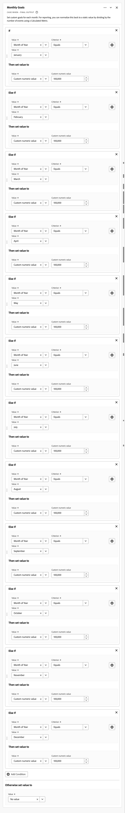
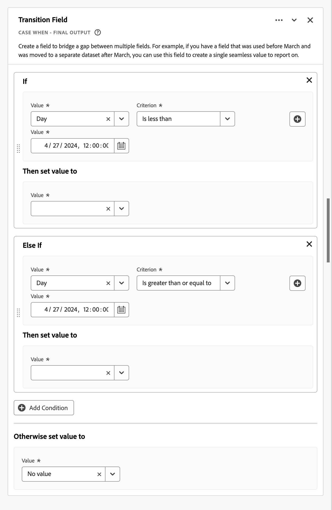
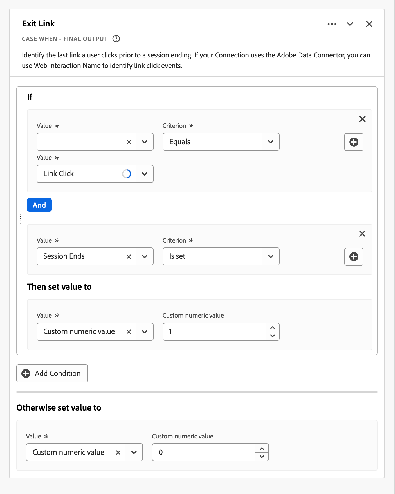

# Champs dérivés {#derived-fields}

>[!CONTEXTUALHELP]
>id="dataview_derivedfields"
>title="Champs dérivés"
>abstract="Un champ dérivé vous permet de définir à la volée des manipulations de données par le biais d’un créateur de règles personnalisable. Vous pouvez ensuite utiliser ce champ dérivé comme composant (mesure ou dimension) dans Workspace ou encore le définir comme composant dans la vue de données."

<!-- BEGIN
     Temporarily have these entries at the top; once functions are documented
     move them to appropriate function section
-->

>[!CONTEXTUALHELP]
>id="dataview_derivedfields_datemath"
>title="Mathématiques des dates"
>abstract="Cette fonction permet de renvoyer la différence entre deux champs de date ou de date et d’heure."

>[!CONTEXTUALHELP]
>id="dataview_derivedfields_typecast"
>title="Typecast"
>abstract="Cette fonction permet de modifier le type de champ à la volée pour rendre le champ disponible pour des transformations supplémentaires dans Customer Journey Analytics."

>[!CONTEXTUALHELP]
>id="dataview_derivedfields_depth"
>title="Profondeur"
>abstract="Cette fonction permet de renvoyer la profondeur de n’importe quel champ, comme la fonctionnalité du composant standard de profondeur d’événement."

<!-- END -->

Les champs dérivés sont un aspect important de la fonctionnalité de création de rapports en temps réel dans Adobe Customer Journey Analytics. Un champ dérivé vous permet de définir à la volée des manipulations de données (souvent complexes) par le biais d’un créateur de règles personnalisable. Vous pouvez ensuite utiliser ce champ dérivé comme composant (mesure ou dimension) dans [Workspace](../../analysis-workspace/home.md) ou encore le définir comme composant dans la [vue de données](../data-views.md).

Les champs dérivés peuvent vous faire gagner beaucoup de temps et vous épargner beaucoup d’efforts par rapport à la transformation ou à la manipulation de vos données à d’autres emplacements en dehors de Customer Journey Analytics. Par exemple, [Préparation de données](https://experienceleague.adobe.com/fr/docs/experience-platform/data-prep/home), [Data Distiller](https://experienceleague.adobe.com/docs/experience-platform/query/data-distiller/overview.html?lang=fr) ou au sein de vos propres processus Extract Transform Load (ETL) / Extract Load Transform (ELT).

Les champs dérivés sont définis dans des [Vues de données](../data-views.md), reposent sur un ensemble de fonctions définies en tant que règles et sont appliqués aux champs standard et/ou de schéma disponibles.

Les cas d’utilisation disponibles sont les suivants :

- Définissez un champ Nom de page dérivé qui corrige les valeurs de nom de page collectées incorrectes afin de corriger les valeurs de nom de page.

- Définissez un champ Canal marketing dérivé qui détermine le canal marketing approprié en fonction d’une ou de plusieurs conditions (par exemple, le paramètre d’URL, l’URL de la page, le nom de la page).

## Interface de champ dérivé {#interface}

Lorsque vous créez ou modifiez un champ dérivé, vous utilisez l’interface des champs dérivés.

|  | Nom | Description |
|---------|----------|--------|
| 1 | **Sélecteur** | Utilisez la zone de sélection pour sélectionner une fonction, un modèle de fonction, un champ de schéma ou un champ standard, puis faire glisser l’élément sur le créateur de règles.  Utilisez la liste déroulante pour sélectionner entre :   [!UICONTROL Fonctions] - répertorie les [fonctions](#function-reference),   [!UICONTROL Modèles de fonction] disponibles - répertorie les [modèles de fonction](#function-templates),   [!UICONTROL Champs de schéma] - répertorie les champs disponibles à partir des catégories de jeux de données (événement, profil, recherche) et les champs dérivés définis précédemment, et les   [!UICONTROL Champs standard] - champs standard disponibles (tels que l’identifiant de jeu de données Platform). Seuls les champs de chaîne et les champs numériques standard sont affichés dans le sélecteur. Si la fonction prend en charge d’autres types de données, les champs standard avec ces autres types de données peuvent être sélectionnés pour les valeurs ou les champs de l’interface de règle. Vous pouvez rechercher une fonction, des modèles de fonction, un schéma et des champs standard à l’aide de la zone de recherche .  Vous pouvez filtrer la liste d’objets sélectionnée en sélectionnant  Filtrer et spécifier des filtres dans la boîte de dialogue [!UICONTROL Filtrer les champs par]. Vous pouvez facilement supprimer des filtres à l’aide de l’ pour chaque filtre. |
| 2 | **Créateur de règles** | Vous créez votre champ dérivé de manière séquentielle à l’aide d’une ou de plusieurs règles. Une règle est une implémentation spécifique d’une fonction et n’est donc toujours associée qu’à une seule fonction. Pour créer une règle, faites glisser une fonction dans le créateur de règles, puis déposez-la. Le type de fonction détermine l’interface de la règle. Consultez la section [Interface de règle](#rule-interface) pour plus dʼinformations.  Vous pouvez insérer une fonction au début, à la fin ou entre des règles déjà disponibles dans le créateur de règles. La dernière règle du créateur de règles détermine la sortie finale du champ dérivé. |
| 3 | **[!UICONTROL **&#x200B; Paramètres de champ &#x200B;**]** | Vous pouvez nommer et décrire votre champ dérivé et inspecter son type de champ. |
| 4 | **[!UICONTROL **&#x200B; Sortie finale &#x200B;**]** | Cette zone affiche un aperçu mis à jour à la volée des valeurs de sortie, en fonction des données des 30 derniers jours et des modifications que vous apportez au champ dérivé dans le créateur de règles. |

{style="table-layout:auto"}

## Assistant Modèle de champ {#wizard}

Lorsque vous accédez pour la première fois à l’interface des champs dérivés, l’assistant [!UICONTROL Commencer par un modèle de champ] s’affiche.

1. Sélectionnez le modèle qui décrit le mieux le type de champ que vous essayez de créer.
2. Sélectionnez le bouton **[!UICONTROL **&#x200B; Sélectionnez &#x200B;**]** pour continuer.

La boîte de dialogue du champ dérivé est renseignée avec les règles (et fonctions) requises ou utiles pour le type de champ que vous avez sélectionné. Consultez [Modèles de fonction](#function-templates) pour plus d’informations sur les modèles disponibles.

## Interface des règles {#rules}

Lorsque vous définissez une règle dans le créateur de règles, vous utilisez l’interface de règle.

|  | Nom | Description |
|---------|----------|--------|
| A | **Nom de la règle** | Par défaut, le nom de la règle est **Règle X** (X faisant référence à un numéro de séquence). Pour modifier le nom d’une règle, sélectionnez son nom et saisissez le nouveau nom, par exemple `Query Parameter`. |
| B | **Nom de la fonction** | Nom de la fonction sélectionnée pour la règle, par exemple [!UICONTROL URL PARSE]. Lorsque la fonction est la dernière de la séquence de fonctions et détermine les valeurs de sortie finales, le nom de la fonction est suivi de [!UICONTROL &#x200B; - SORTIE FINALE], par exemple [!UICONTROL URL PARSE - SORTIE FINALE].  Pour afficher une fenêtre contextuelle contenant plus d’informations sur la fonction, sélectionnez . |
| C | **Description de la règle** | Vous pouvez éventuellement ajouter une description à une règle. Sélectionnez , puis sélectionnez **[!UICONTROL ** Ajouter une description **]** pour ajouter une description ou **[!UICONTROL **&#x200B; Modifier la description &#x200B;**]** pour modifier une description existante. Utilisez l’éditeur pour saisir une description. Vous pouvez utiliser la barre d’outils pour mettre en forme le texte (à l’aide du sélecteur de style, en gras, en italique, en soulignement, à droite, à gauche, centré, en couleur, en liste numérique et à puces) et ajouter des liens à des informations externes.  Pour terminer la modification de la description, cliquez en dehors de l’éditeur. |
| D | **Zone de fonction** | Définit la logique de la fonction. L’interface dépend du type de fonction. Le menu déroulant [!UICONTROL Champ] ou [!UICONTROL Valeur] affiche toutes les catégories de champs (règles, champs standard, champs) disponibles, en fonction du type d’entrée attendu par la fonction. Vous pouvez également faire glisser et déposer un champ du sélecteur de schémas et de champs standard vers un champ ou une valeur. Lorsque ce champ déplacé provient d’un jeu de données de recherche, une fonction de recherche est automatiquement insérée avant la fonction que vous définissez.  Consultez [Référence des fonctions](#function-reference) pour des informations détaillées sur chacune des fonctions prises en charge. |

{style="table-layout:auto"}

## Créer un champ dérivé {#create}

1. Sélectionnez une vue de données existante ou créez une vue de données. Pour plus d’informations, reportez-vous à la section [Vues de données](../data-views.md).

2. Sélectionnez l’onglet **[!UICONTROL **&#x200B; Composants &#x200B;**]** de la vue de données.

3. Sélectionnez **[!UICONTROL **&#x200B; Créer un champ dérivé&#x200B;**]** dans le rail de gauche.

4. Pour définir votre champ dérivé, utilisez l’interface [!UICONTROL Créer un champ dérivé]. Consultez [Interface des champs dérivés](#derived-field-interface).

   Pour enregistrer votre nouveau champ dérivé, sélectionnez **[!UICONTROL **&#x200B; Enregistrer &#x200B;**]**.

5. Votre nouveau champ dérivé est ajouté au conteneur [!UICONTROL Champs dérivés >], dans le cadre des **[!UICONTROL **&#x200B; Champs de schéma &#x200B;**]** dans le rail gauche de votre vue de données.

## Modifier un champ dérivé {#edit}

1. Sélectionnez une vue de données existante. Pour plus d’informations, reportez-vous à la section [Vues de données](../data-views.md).

2. Sélectionnez l’onglet **[!UICONTROL **&#x200B; Composants &#x200B;**]** de la vue de données.

3. Sélectionnez l’onglet **[!UICONTROL **&#x200B; Champs de schéma &#x200B;**]** dans le volet [!UICONTROL Connexion] à gauche.

4. Sélectionnez le conteneur **[!UICONTROL **&#x200B; Champs dérivés >**]**.

5. Pointez sur le champ dérivé à modifier, puis sélectionnez .

6. Pour modifier le champ dérivé, utilisez l’interface [!UICONTROL Modifier le champ dérivé]. Consultez [Interface des champs dérivés](#derived-field-interface).

   - Sélectionnez **[!UICONTROL **&#x200B; Enregistrer &#x200B;**]** pour enregistrer le champ dérivé mis à jour.

   - Sélectionnez **[!UICONTROL **&#x200B; Annuler &#x200B;**]** pour annuler les modifications apportées au champ dérivé.

   - Sélectionnez **[!UICONTROL **&#x200B; Enregistrer sous &#x200B;**]** pour enregistrer le champ dérivé en tant que nouveau champ dérivé. Le nouveau champ dérivé porte le même nom que le champ dérivé modifié d’origine, avec `(copy)` en plus.

Si vous avez également utilisé un champ dérivé en tant que composant pour des dimensions ou des mesures dans votre vue de données :

1. Sélectionnez le composant. Notez que le composant peut avoir un nom différent de celui de votre champ dérivé.

1. Dans le panneau Composant, sélectionnez l’ à côté de votre champ dérivé, sous le nom du champ de schéma.

1. Pour modifier le champ dérivé, utilisez l’interface [!UICONTROL Modifier le champ dérivé]. Consultez [Interface des champs dérivés](#derived-field-interface).

   - Sélectionnez **[!UICONTROL **&#x200B; Enregistrer &#x200B;**]** pour enregistrer le champ dérivé mis à jour.

   - Sélectionnez **[!UICONTROL **&#x200B; Annuler &#x200B;**]** pour annuler les modifications apportées au champ dérivé.

   - Sélectionnez **[!UICONTROL **&#x200B; Enregistrer sous &#x200B;**]** pour enregistrer le champ dérivé en tant que nouveau champ dérivé. Le nouveau champ dérivé porte le même nom que le champ dérivé modifié d’origine, avec `(copy)` en plus.

## Supprimer un champ dérivé {#delete}

1. Sélectionnez une vue de données existante. Pour plus d’informations, reportez-vous à la section [Vues de données](../data-views.md).

2. Sélectionnez l’onglet **[!UICONTROL **&#x200B; Composants &#x200B;**]** de la vue de données.

3. Sélectionnez l’onglet **[!UICONTROL **&#x200B; Champs de schéma &#x200B;**]** dans le volet [!UICONTROL Connexion].

4. Sélectionnez **[!UICONTROL **&#x200B; Champs dérivés >**]** Conteneur.

5. Pointez sur le champ dérivé à supprimer, puis sélectionnez .

6. Dans l’interface [!UICONTROL Modifier le champ dérivé], sélectionnez **[!UICONTROL Supprimer]**.

   Une boîte de dialogue [!UICONTROL Supprimer le composant] vous demande de confirmer la suppression. Tenez compte des références externes qui peuvent exister au champ dérivé en dehors de la vue de données.

   - Sélectionnez **[!UICONTROL **&#x200B; Continuer &#x200B;**]** pour supprimer le champ dérivé.

Si vous avez également utilisé un champ dérivé en tant que composant pour des dimensions ou des mesures dans votre vue de données :

1. Sélectionnez le composant. Notez que le composant peut avoir un nom différent de celui de votre champ dérivé.

1. Dans le panneau Composant, sélectionnez l’ à côté de votre champ dérivé, sous le nom du champ de schéma.

1. Dans l’interface [!UICONTROL Modifier le champ dérivé], sélectionnez **[!UICONTROL Supprimer]**.

   Une boîte de dialogue [!UICONTROL Supprimer le composant] vous demande de confirmer la suppression. Tenez compte des références externes qui peuvent exister au champ dérivé en dehors de la vue de données.

   - Sélectionnez **[!UICONTROL **&#x200B; Continuer &#x200B;**]** pour supprimer le champ dérivé.

>[!NOTE]
>
>Les champs dérivés sont gérés au niveau de la connexion dans Customer Journey Analytics. Toute modification apportée à un champ dérivé dans l’une des vues de données associées à cette connexion s’applique à toutes ces vues de données associées.

## Modèles de fonction {#templates}

Pour créer rapidement un champ dérivé pour des cas d’utilisation spécifiques, des modèles de fonction sont disponibles. Ces modèles de fonction sont accessibles à partir de la zone du sélecteur dans l’interface des champs dérivés ou sont présentés lors de leur première utilisation dans l’assistant [!UICONTROL Commencer par un modèle de champ].

### Canaux marketing {#mchannel}

Ce modèle de fonction utilise un ensemble de règles pour créer des canaux marketing.

+++ Détails

Pour utiliser le modèle, vous devez spécifier les paramètres appropriés pour chaque fonction répertoriée comme faisant partie des règles du modèle. Consultez [Référence de fonction](#function-reference) pour en savoir plus.

+++

### Rebonds {#bounces}

Ce modèle de fonction utilise un ensemble de règles pour identifier les rebonds de site.

+++ Détails

{{select-package}}

Pour utiliser le modèle, vous devez spécifier les paramètres appropriés pour chaque fonction répertoriée comme faisant partie des règles du modèle. Consultez [Référence de fonction](#function-reference) pour en savoir plus.

+++

### Combinaison multidimensionnelle {#multi-dim}

Ce modèle de fonction combine deux valeurs en une seule.

+++ Détails

{{select-package}}

Pour utiliser le modèle, vous devez spécifier les paramètres appropriés pour chaque fonction répertoriée comme faisant partie des règles du modèle. Consultez [Référence de fonction](#function-reference) pour en savoir plus.

+++

### Nom convivial de jeu de données {#friendlyname}

Ce modèle de fonction fournit un nom de jeu de données lisible.

+++ Détails

{{select-package}}

Pour utiliser le modèle, vous devez spécifier les paramètres appropriés pour chaque fonction répertoriée comme faisant partie des règles du modèle. Consultez [Référence de fonction](#function-reference) pour en savoir plus.

+++

### Nom de page à partir d’une URL {#pagename}

Ce modèle de fonction crée un nom de page simple.

+++ Détails

{{select-package}}

Pour utiliser le modèle, vous devez spécifier les paramètres appropriés pour chaque fonction répertoriée comme faisant partie des règles du modèle. Consultez [Référence de fonction](#function-reference) pour en savoir plus.

+++

### Saison de fêtes {#holiday}

Ce modèle de fonction classe les périodes clés de l’année.

+++ Détails

{{select-package}}

Pour utiliser le modèle, vous devez spécifier les paramètres appropriés pour chaque fonction répertoriée comme faisant partie des règles du modèle. Consultez [Référence de fonction](#function-reference) pour en savoir plus.

+++

### Objectifs mensuels {#goals}

Ce modèle de fonction définit des objectifs mensuels personnalisés.

+++ Détails

{{select-package}}

Pour utiliser le modèle, vous devez spécifier les paramètres appropriés pour chaque fonction répertoriée comme faisant partie des règles du modèle. Consultez [Référence de fonction](#function-reference) pour en savoir plus.

+++

### Obtenir toutes les valeurs dans la liste délimitée {#allvalues}

Ce modèle de fonction convertit une liste limitée en tableau.

+++ Détails

{{select-package}}

Pour utiliser le modèle, vous devez spécifier les paramètres appropriés pour chaque fonction répertoriée comme faisant partie des règles du modèle. Consultez [Référence de fonction](#function-reference) pour en savoir plus.

+++

### Obtenir la première valeur dans la liste délimitée {#firstvalue}

Ce modèle de fonction récupère la première valeur d’une liste délimitée.

+++ Détails

{{select-package}}

Pour utiliser le modèle, vous devez spécifier les paramètres appropriés pour chaque fonction répertoriée comme faisant partie des règles du modèle. Consultez [Référence de fonction](#function-reference) pour en savoir plus.

+++

### Obtenir la dernière valeur dans une liste délimitée {#lastvalue}

Ce modèle de fonction récupère la dernière valeur d’une liste délimitée.

+++ Détails

{{select-package}}

Pour utiliser le modèle, vous devez spécifier les paramètres appropriés pour chaque fonction répertoriée comme faisant partie des règles du modèle. Consultez [Référence de fonction](#function-reference) pour en savoir plus.

+++

### Nom de domaine {#domain}

Ce modèle de fonction extrait le nom de domaine à l’aide d’une expression régulière.

+++ Détails

{{select-package}}

Pour utiliser le modèle, vous devez spécifier les paramètres appropriés pour chaque fonction répertoriée comme faisant partie des règles du modèle. Consultez [Référence de fonction](#function-reference) pour en savoir plus.

+++

### Obtenir le paramètre de la chaîne de requête {#querystring}

Ce modèle de fonction extrait les valeurs de chaîne de requête.

+++ Détails

{{select-package}}

Pour utiliser le modèle, vous devez spécifier les paramètres appropriés pour chaque fonction répertoriée comme faisant partie des règles du modèle. Consultez [Référence de fonction](#function-reference) pour en savoir plus.

+++

### Champ de transition {#transition}

Ce modèle de fonction fait passer la création de rapports d’un champ à un autre.

+++ Détails

{{select-package}}

Pour utiliser le modèle, vous devez spécifier les paramètres appropriés pour chaque fonction répertoriée comme faisant partie des règles du modèle. Consultez [Référence de fonction](#function-reference) pour en savoir plus.

+++

### Détection simple des robots {#botdetection}

Ce modèle de fonction implémente l’identification simple des robots.

+++ Détails

{{select-package}}

Pour utiliser le modèle, vous devez spécifier les paramètres appropriés pour chaque fonction répertoriée comme faisant partie des règles du modèle. Consultez [Référence de fonction](#function-reference) pour en savoir plus.

+++

### Lien de sortie {#exit}

Ce modèle de fonction identifie le dernier lien sur lequel la personne a cliqué au cours d’une session.

+++ Détails

{{select-package}}

Pour utiliser le modèle, vous devez spécifier les paramètres appropriés pour chaque fonction répertoriée comme faisant partie des règles du modèle. Consultez [Référence de fonction](#function-reference) pour en savoir plus.

+++

### Lien de téléchargement {#download}

Ce modèle de fonction signale les liens de téléchargement courants.

+++ Détails

{{select-package}}

Pour utiliser le modèle, vous devez spécifier les paramètres appropriés pour chaque fonction répertoriée comme faisant partie des règles du modèle. Consultez [Référence de fonction](#function-reference) pour en savoir plus.

+++

<!--

+++ Data clean up template

>[!WARNING]
>
>Could not find any information on this template.
+++

-->

## Référence de fonction {#functionref}

{{select-package}}

Pour chaque fonction prise en charge, consultez les détails ci-dessous sur :

- Spécifications :
   - Type de données en entrée : type de données pris en charge,
   - Entrée : valeurs possibles pour l’entrée,
   - Opérateurs inclus : opérateurs pris en charge pour cette fonction (le cas échéant),
   - Limitations : limitations qui s’appliquent à cette fonction spécifique,
   - Sortie.

- Cas d’utilisation, notamment :
   - Données avant de définir le champ dérivé,
   - Comment définir le champ dérivé,
   - Données après avoir défini le champ dérivé.

- Contraintes (le cas échéant).

<!-- CASE WHEN -->

### Cas si {#casewhen}

<!-- markdownlint-disable MD034 -->

>[!CONTEXTUALHELP]
>id="dataview_derivedfields_casewhen"
>title="Cas si"
>abstract="Cette fonction permet d’appliquer des conditions basées sur des critères définis à partir d’un ou de plusieurs champs. Ces critères sont ensuite utilisés pour définir les valeurs du nouveau champ dérivé en fonction de la séquence des conditions."

<!-- markdownlint-enable MD034 -->

Applique des conditions, en fonction de critères définis à partir d’un ou de plusieurs champs. Ces critères sont ensuite utilisés pour définir les valeurs du nouveau champ dérivé en fonction de la séquence des conditions.

+++ Détails

## Spécifications {#casewhen-io}

| Type de données d’entrée | Entrée | Opérateurs inclus | Limites | Sortie |
|---|---|---|---|---|
| <ul><li>Chaîne</li><li>Numérique</li><li>Date</li></ul> | <ul><li>Conteneur [!UICONTROL Si], [!UICONTROL Sinon, si] :
<ul><li>[!UICONTROL Valeur]</li><ul><li>Règles</li><li>Champs standard</li><li>Champs</li></ul><li>[!UICONTROL Critère] (voir les opérateurs inclus, en fonction du type de valeur sélectionné)</li></ul></li><li>[!UICONTROL Ensuite, définir la valeur sur], [!UICONTROL Sinon, définir la valeur sur] :
<ul><li>[!UICONTROL Valeur]</li><ul><li>Règles</li><li>Champs standard</li><li>Champs</li></ul></ul></li></ul> | 
Chaînes
<ul><li>Est égal à</li><li>Est égal à l’un des termes</li><li>Contient l’expression</li><li>Contient n’importe quel terme</li><li>Contient tous les termes</li><li>Commence par</li><li>Commence par un terme quelconque</li><li>Se termine par</li><li>Se termine par un terme</li><li>N’est pas égal à</li><li>N’est égal à aucun terme</li><li>Ne contient pas l’expression</li><li>Ne contient aucun terme</li><li>Ne contient pas tous les termes</li><li>Ne commence pas par</li><li>Ne commence par aucun terme</li><li>Ne se termine pas par</li><li>Ne se termine par aucun terme</li><li>Est défini</li><li>N’est pas défini</li></ul>
Numérique
<ul><li>Est égal à</li><li>N’est pas égal à</li><li>Est supérieur à</li><li>Est supérieur ou égal à</li><li>Est inférieur à</li><li>Est inférieur ou égal à</li><li>Est défini</li><li>N’est pas défini</li></ul>
Dates
<ul><li>Est égal à</li><li>N’est pas égal à</li><li>Est ultérieur(e) à</li><li>Est ultérieur(e) ou égal(e) à</li><li>Est antérieur(e) à</li><li>Est antérieur(e) ou égal(e) à</li><li>Est défini</li><li>N’est pas défini</li></ul> | <ul><li>5 fonctions par champ dérivé</li><li>200 [opérateurs](#operators) par champ dérivé. Un exemple d’opérateur unique est « Le domaine référent contient Google ». </li></ul> | 
Nouveau champ dérivé
 |

{style="table-layout:auto"}

## Cas d’utilisation 1 {#casewhen-uc1}

Vous souhaitez définir des règles pour identifier différents canaux marketing en appliquant une logique en cascade pour définir un champ de canal marketing sur la valeur appropriée :

- Si le référent provient d’un moteur de recherche et que la page comporte une valeur de chaîne de requête où `cid` contient `ps_`, le canal marketing doit être identifié comme un [!DNL *référencement payant*].
- Si le référent provient d’un moteur de recherche et que la page ne contient pas la chaîne de requête `cid`, le canal marketing doit être identifié comme une [!DNL *recherche naturelle*].
- Si une page comporte une valeur de chaîne de requête où `cid` contient `em_`, le canal marketing doit être identifié comme un [!DNL *e-mail*].
- Si une page comporte une valeur de chaîne de requête où `cid` contient `ds_`, le canal marketing doit être identifié comme une [!DNL *publicité display*].
- Si une page comporte une valeur de chaîne de requête où `cid` contient `so_`, le canal marketing doit être identifié comme un [!DNL *référencement social payant*].
- Si le référent provient d’un domaine référent de [!DNL twitter.com], [!DNL facebook.com], [!DNL linkedin.com] ou [!DNL tiktok.com], le canal marketing doit être identifié comme un [!DNL *référencement social naturel*].
- Si aucune des règles ci-dessus ne correspond, le canal marketing doit être identifié comme [!DNL *Autre référent*].

Si votre site reçoit les exemples d’événements suivants, contenant [!UICONTROL Référent] et [!UICONTROL URL de la page], ces événements doivent être identifiés comme suit :

| [!DNL Event] | [!DNL Referrer] | [!DNL Page URL] | [!DNL Marketing Channel] |
|:--:|----|----|----|
| 1 | `https://facebook.com` | `https://site.com/home` | [!DNL Natural Social] |
| 2 | `https://abc.com` | `https://site.com/?cid=ds_12345678` | [!DNL Display] |
| 3 | | `https://site.com/?cid=em_12345678` | [!DNL Email] |
| 4 | `https://google.com` | `https://site.com/?cid=ps_abc098765` | [!DNL Paid Search] |
| 5 | `https://google.com` | `https://site.com/?cid=em_765544332` | [!DNL Email] |
| 6 | `https://google.com` |  | [!DNL Natural Search] |

{style="table-layout:auto"}

### Données antérieures {#casewhen-uc1-databefore}

| [!DNL Referrer] | [!DNL Page URL] |
|----|----|
| `https://facebook.com` | `https://site.com/home` |
| `https://abc.com` | `https://site.com/?cid=ds_12345678` |
|  | `https://site.com/?cid=em_12345678` |
| `https://google.com` | `https://site.com/?cid=ps_abc098765` |
| `https://google.com` | `https://site.com/?cid=em_765544332` |
| `https://google.com` | |

{style="table-layout:auto"}

### Champs dérivés {#casewhen-uc1-derivedfield}

Vous définissez un champ dérivé `Marketing Channel`. Les fonctions [!UICONTROL CAS SI] permettent de définir des règles qui créent des valeurs pour un champ en fonction de valeurs existantes pour les champs `Page URL` et `Referring URL`.

Notez l’utilisation de la fonction [!UICONTROL ANALYSE D’URL] pour définir des règles afin de récupérer les valeurs `Page Url` et `Referring Url` avant l’application des règles [!UICONTROL CAS SI].

### Données après {#casewhen-uc1-dataafter}

| [!DNL Marketing Channel] |
|----|
| [!DNL Natural Social] |
| [!DNL Display] |
| [!DNL Email] |
| [!DNL Paid Search] |
| [!DNL Email] |
| [!DNL Natural Search] |

{style="table-layout:auto"}

## Cas d’utilisation 2 {#casewhen-uc2}

Vous avez collecté plusieurs variantes de recherche dans votre dimension [!DNL Product Finding Methods]. Pour comprendre les performances globales de la recherche par rapport à la navigation, vous devez passer beaucoup de temps à combiner manuellement les résultats.

Votre site collecte les valeurs suivantes pour votre dimension [!DNL Product Finding Methods]. En fin de compte, toutes ces valeurs indiquent une recherche.

| Valeur collectée | Valeur réelle |
|---|---|
| [!DNL search p13n_no] | [!DNL search] |
| [!DNL search p13n_yes] | [!DNL search] |
| [!DNL search refine p13n_no] | [!DNL search] |
| [!DNL search refine p13n_yes] | [!DNL search] |
| [!DNL search redirect p13n_yes] | [!DNL search] |
| [!DNL search-redirect] | [!DNL search] |

{style="table-layout:auto"}

### Données antérieures {#casewhen-uc2-databefore}

| [!DNL Product Finding Methods] |
|----|
| [!DNL search p13_no] |
| [!DNL search p13_yes] |
| [!DNL browse] |
| [!DNL search refine p13_no] |
| [!DNL search refine p13_yes] |
| [!DNL browse] |
| [!DNL search redirect p13_yes] |
| [!DNL search-redirect] |
| [!DNL browse] |

{style="table-layout:auto"}

### Champs dérivés {#casewhen-uc2-derivedfield}

Vous définissez un champ dérivé `Product Finding Methods (new)`. Vous créez les règles [!UICONTROL CAS SI] suivantes dans le créateur de règles. Ces règles appliquent la logique à toutes les variations possibles des anciennes valeurs de champ [!UICONTROL Méthodes de recherche de produit] pour `search` et `browse` à l’aide du critère [!UICONTROL Contient l’expression].

### Données après {#casewhen-uc2-dataafter}

| [!DNL Product Finding Methods (new)] |
|----|
| [!DNL search] |
| [!DNL search] |
| [!DNL browse] |
| [!DNL search] |
| [!DNL search] |
| [!DNL browse] |
| [!DNL search] |
| [!DNL search] |
| [!DNL browse] |

{style="table-layout:auto"}

## Cas d’utilisation 3 {#casewhen-uc3}

En tant qu’agence de voyages, vous souhaitez regrouper la durée des voyages pour les voyages réservés afin de pouvoir générer des rapports sur la durée regroupée des voyages.

Hypothèses :

- L’organisation collecte la durée du voyage dans un champ numérique.
- Elle souhaite regrouper les durées de 1 à 3 jours dans un compartiment appelé « [!DNL short trip] ».
- Elle souhaite regrouper les durées de 4 à 7 jours dans un compartiment appelé « [!DNL medium trip] ».
- Elle souhaite regrouper les durées de 8 jours et plus dans un compartiment appelé « [!DNL long trip] ».
- 132 voyages ont été réservés pour une durée d’1 jour.
- 110 voyages ont été réservés pour une durée de 2 jours.
- 105 voyages ont été réservés pour une durée de 3 jours.
- 99 voyages ont été réservés pour une durée de 4 jours.
- 92 voyages ont été réservés pour une durée de 5 jours.
- 85 voyages ont été réservés pour une durée de 6 jours.
- 82 voyages ont été réservés pour une durée de 7 jours.
- 78 voyages ont été réservés pour une durée de 8 jours.
- 50 voyages ont été réservés pour une durée de 9 jours.
- 44 voyages ont été réservés pour une durée de 10 jours.
- 38 voyages ont été réservés pour une durée de 11 jours.
- 31 voyages ont été réservés pour une durée de 12 jours.

Le rapport voulu doit se présenter comme suit :

| [!DNL Trip Duration Type] | [!DNL Bookings] |
|----|---:|
| [!DNL medium trip] | 358 |
| [!DNL short trip] | 347 |
| [!DNL long trip] | 241 |

{style="table-layout:auto"}

### Données antérieures {#casewhen-uc3-databefore}

| [!DNL Trip Duration] |
|---:|
| 1 |
| 12 |
| 3 |
| 6 |
| 4 |
| 8 |
| 6 |
| 2 |
| 1 |
| 2 |
| 21 |
| 8 |

### Champs dérivés {#casewhen-uc3-derivedfield}

Vous définissez un champ dérivé `Trip Duration (bucketed)`. Vous créez la règle [!UICONTROL CAS SI] suivante dans le créateur de règles. Cette règle applique une logique pour regrouper les anciennes valeurs de champ [!UICONTROL Durée du voyage] en trois valeurs : `short trip`, `medium  trip` et `long trip`.

### Données après {#casewhen-uc3-dataafter}

| [!DNL Trip Duration (bucketed)] |
|---|
| [!DNL short trip] |
| [!DNL long trip] |
| [!DNL short trip] |
| [!DNL medium trip] |
| [!DNL medium trip] |
| [!DNL long trip] |
| [!DNL medium trip] |
| [!DNL short trip] |
| [!DNL short trip] |
| [!DNL short trip] |
| [!DNL long trip] |
| [!DNL long trip] |

## Informations supplémentaires {#casewhen-more-info}

Customer Journey Analytics utilise une structure de conteneurs imbriqués, modélisée d’après le modèle de données d’expérience [XDM](https://experienceleague.adobe.com/docs/experience-platform/xdm/home.html?lang=fr) d’Adobe Experience Platform. Voir [Conteneurs](../create-dataview.md#containers) et [Conteneurs de segments](/help/components/segments/seg-overview.md#containers) pour plus d’informations. Ce modèle de conteneur, bien que flexible par nature, impose certaines contraintes lors de l’utilisation du créateur de règles.

Customer Journey Analytics utilise le modèle de conteneur par défaut suivant :

Les contraintes suivantes s’appliquent et sont appliquées lors de la *sélection* et de la *définition* des valeurs.

|  | Contraintes |
|:---:|----|
| **A** | Les valeurs que vous *sélectionnez* dans la même construction [!UICONTROL Si], [!UICONTROL Sinon, si] (à l’aide des opérateurs [!UICONTROL Et] ou [!UICONTROL Ou]) dans une règle doivent provenir du même conteneur et peuvent être de n’importe quel type (chaîne , numérique , etc.).   |
| **B** | Toutes les valeurs que vous *définissez* dans une règle doivent provenir du même conteneur et avoir le même type ou une valeur dérivée du même type.    |
| **C** | Les valeurs que vous *sélectionnez* dans les constructions [!UICONTROL Si], [!UICONTROL Sinon, si] de la règle ne doivent *pas* nécessairement provenir du même conteneur et ne doivent *pas* nécessairement être du même type.    |

{style="table-layout:auto"}

+++

<!-- CLASSIFY -->

### Classifier {#classify}

<!-- markdownlint-disable MD034 -->

>[!CONTEXTUALHELP]
>id="dataview_derivedfields_classify"
>title="Classifier"
>abstract="Cette fonction permet de définir un ensemble de valeurs qui sont remplacées par des valeurs correspondantes par le biais d’une saisie de texte."

<!-- markdownlint-enable MD034 -->

Définit un ensemble de valeurs qui sont remplacées par les valeurs correspondantes dans un nouveau champ dérivé.

+++ Détails

## Spécifications {#classify-io}

| Type de données d’entrée | Entrée | Opérateurs inclus | Limites | Sortie |
|---|---|---|---|---|
| <ul><li>Chaîne</li><li>Numérique</li><li>Date</li></ul> | <ul><li>[!UICONTROL Champ à classer] :<ul><li>Règles</li><li>Champs standard</li><li>Champs</li></ul></li><li>[!UICONTROL Lorsque la valeur est égale à] et [!UICONTROL Remplacer les valeurs par] :
<ul><li>Chaîne</li></ul><li>Afficher les valeurs d’origine<ul><li>Booléen</li></ul></li></ul> | 
S.O.
 | <ul><li>5 fonctions par champ dérivé</li><li>200 [opérateurs](#operators) par champ dérivé. Chaque entrée pour [!UICONTROL Lorsque la valeur est égale à la valeur d’origine] [!UICONTROL Remplacer la valeur par la nouvelle valeur] est considérée comme une opération.</li></ul> | 
Nouveau champ dérivé
 |

{style="table-layout:auto"}

## Cas d’utilisation 1 {#classify-uc1}

Vous disposez d’un fichier CSV qui comprend une colonne clé pour `hotelID` et une ou plusieurs colonnes supplémentaires associées à `hotelID` : `city`, `rooms`, `hotel name`.
Vous collectez [!DNL Hotel ID] dans une dimension mais souhaitez créer une dimension [!DNL Hotel Name] dérivée de `hotelID` dans le fichier CSV.

**Structure et contenu de fichier CSV**

| [!DNL hotelID] | [!DNL city] | [!DNL rooms] | [!DNL hotel name] |
|---|---|---:|---|
| [!DNL SLC123] | [!DNL Salt Lake City] | 40 | [!DNL SLC Downtown] |
| [!DNL LAX342] | [!DNL Los Angeles] | 60 | [!DNL LA Airport] |
| [!DNL SFO456] | [!DNL San Francisco] | 75 | [!DNL Market Street] |
| [!DNL AMS789] | [!DNL Amsterdam] | 50 | [!DNL Okura] |

{style="table-layout:auto"}

**Rapport actuel**

| [!DNL Hotel ID] | Vues de produit |
|---|---:|
| [!DNL SLC123] | 200 |
| [!DNL LX342] | 198 |
| [!DNL SFO456] | 190 |
| [!DNL AMS789] | 150 |

{style="table-layout:auto"}

**Rapport souhaité**

| [!DNL Hotel Name] | Vues de produit |
|----|----:|
| [!DNL SLC Downtown] | 200 |
| [!DNL LA Airport] | 198 |
| [!DNL Market Street] | 190 |

{style="table-layout:auto"}

### Données antérieures {#classify-uc1-databefore}

| [!DNL Hotel ID] |
|----|
| [!DNL SLC123] |
| [!DNL LAX342] |
| [!DNL SFO456] |
| [!DNL AMS789] |

{style="table-layout:auto"}

### Champs dérivés {#classify-uc1-derivedfield}

Vous définissez un champ dérivé `Hotel Name`. Utilisez la fonction [!UICONTROL CLASSIFIER] pour définir une règle dans laquelle vous pouvez classer les valeurs du champ [!UICONTROL ID d’hôtel] et les remplacer par de nouvelles valeurs.

Si vous souhaitez inclure des valeurs d’origine que vous n’avez pas définies dans les valeurs à classer (par exemple, ID d’hôtel AMS789), veillez à sélectionner **[!UICONTROL Afficher les valeurs d’origine]**. Cela garantit que AMS789 fait partie de la sortie du champ dérivé, même si cette valeur n’est pas classée.

### Données après {#classify-uc1-dataafter}

| [!DNL Hotel Name] |
|----|
| [!DNL SLC Downtown] |
| [!DNL LA Airport] |
| [!DNL Market Street] |

{style="table-layout:auto"}

## Cas d’utilisation 2 {#classify-uc2}

Vous avez collecté des URL au lieu du nom convivial de page pour plusieurs pages. Cette collection mixte de valeurs rompt la création de rapports.

### Données antérieures {#classify-uc2-databefore}

| [!DNL Page Name] |
|---|
| [!DNL Home Page] |
| [!DNL Flight Search] |
| `http://www.adobetravel.ca/Hotel-Search` |
| `https://www.adobetravel.com/Package-Search` |
| [!DNL Deals & Offers] |
| `http://www.adobetravel.ca/user/reviews` |
| `https://www.adobetravel.com.br/Generate-Quote/preview` |

{style="table-layout:auto"}

### Champs dérivés {#classify-uc2-derivedfield}

Vous définissez un champ dérivé `Page Name (updated)`. Utilisez la fonction [!UICONTROL CLASSIFIER] pour définir une règle dans laquelle vous pouvez classer les valeurs de votre champ [!UICONTROL Nom de page] existant et remplacer par des valeurs correctes mises à jour.

### Données après {#classify-uc2-dataafter}

| [!DNL Page Name (updated)] |
|---|
| [!DNL Home Page] |
| [!DNL Flight Search] |
| [!DNL Hotel Search] |
| [!DNL Package Search] |
| [!DNL Deals & Offers] |
| [!DNL Reviews] |
| [!DNL Generate Quote] |

## Informations supplémentaires {#classify-moreinfo}

Les fonctionnalités supplémentaires suivantes sont disponibles dans l’interface de règle Classifier :

- Pour effacer rapidement toutes les valeurs du tableau, sélectionnez  **[!UICONTROL Effacer toutes les valeurs du tableau]**.
- Pour charger un fichier CSV contenant les valeurs d’origine pour Lorsque les valeurs sont égales à et les nouvelles valeurs pour Remplacer les valeurs par, sélectionnez  **[!UICONTROL Charger CSV]**.
- Pour télécharger un modèle permettant de créer un fichier CSV avec les valeurs d’origine et les nouvelles valeurs à charger, sélectionnez  **[!UICONTROL Télécharger le modèle CSV]**.
- Pour télécharger un fichier CSV avec toutes les valeurs d’origine et les nouvelles valeurs renseignées dans l’interface de règle, sélectionnez  **[!UICONTROL Télécharger les valeurs CSV]**.

+++

<!-- CONCATENATE -->

### Concaténer {#concatenate}

<!-- markdownlint-disable MD034 -->

>[!CONTEXTUALHELP]
>id="dataview_derivedfields_concatenate"
>title="Concaténer"
>abstract="Cette fonction permet de combiner plusieurs champs, champs dérivés ou valeurs de chaîne saisies par l’utilisateur ou l’utilisatrice dans un seul champ avec des délimiteurs définis."

<!-- markdownlint-enable MD034 -->

Combine les valeurs de champ en un nouveau champ dérivé unique avec des délimiteurs définis.

+++ Détails

## Spécifications {#concatenate-io}

| Type de données d’entrée | Entrée | Opérateurs inclus | Limites | Sortie |
|---|---|---|---|---|
| <ul><li>Chaîne</li></ul> | <ul><li>[!UICONTROL Valeur] :<ul><li>Règles</li><li>Champs standard</li><li>Champs</li><li>Chaîne</li></ul></li><li>[!UICONTROL Délimiteur] :<ul><li>Chaîne</li></ul></li> </ul> | 
S.O.
 | 
2 fonctions par champ dérivé
 | 
Nouveau champ dérivé
 |

{style="table-layout:auto"}

## Cas d’utilisation {#concatenate-uc}

Vous collectez actuellement les codes d’aéroport d’origine et de destination dans des champs distincts. Vous souhaitez combiner les deux champs en une seule dimension séparée par un trait d’union (-). Vous pouvez ainsi analyser la combinaison de l’origine et de la destination pour identifier les principaux itinéraires réservés.

Hypothèses :

- Les valeurs d’origine et de destination sont collectées dans des champs distincts, dans le même tableau.
- L’utilisateur ou l’utilisatrice détermine d’utiliser le délimiteur « - » entre les valeurs.

Imaginez que les réservations suivantes soient effectuées :

- Client ABC123 réserve un vol entre Salt Lake City (SLC) et Orlando (MCO).
- Client ABC456 réserve un vol entre Salt Lake City (SLC) et Los Angeles (LAX).
- Client ABC789 réserve un vol entre Salt Lake City (SLC) et Seattle (SEA).
- Client ABC987 réserve un vol entre Salt Lake City (SLC) et San Jose (SJO).
- Client ABC654 réserve un vol entre Salt Lake City (SLC) et Orlando (MCO).

Le rapport souhaité doit se présenter comme suit :

| Origine/Destination | Réservations |
|----|---:|
| SLC-MCO | 2 |
| SLC-LAX | 1 |
| SLC-SEA | 1 |
| SLC-SJO | 1 |

{style="table-layout:auto"}

### Données antérieures {#concatenate-uc-databefore}

| Origine | Destination |
|----|---:|
| SLC | MCO |
| SLC | LAX |
| SLC | SEA |
| SLC | SJO |
| SLC | MCO |

{style="table-layout:auto"}

### Champs dérivés {#concatenate-derivedfield}

Vous définissez un champ dérivé `Origin - Destination`. Utilisez la fonction [!UICONTROL CONCATÉNER] pour définir une règle afin de concaténer les champs [!UICONTROL Origine] et [!UICONTROL Destination] à l’aide du [!UICONTROL Délimiteur] `-`.

### Données après {#concatenate-dataafter}

| Origine - Destination (champ dérivé) |
|---|
| SLC-MCO |
| SLC-LAX |
| SLC-SEA |
| SLC-SJO |
| SLC-MCO |

{style="table-layout:auto"}

+++

### Dédupliquer {#dedup}

<!-- markdownlint-disable MD034 -->

>[!CONTEXTUALHELP]
>id="dataview_derivedfields_deduplicate"
>title="Dédupliquer"
>abstract="Cette fonction permet de configurer un champ pour qu’il comptabilise uniquement les valeurs de manière non répétitive au niveau de la session ou de la personne. De plus, vous pouvez utiliser un ID de déduplication pour vous assurer qu’en fonction d’un ID donné (un ID d’achat, par exemple), une seule valeur est utilisée (soit la première instance, soit la dernière instance)."

<!-- markdownlint-enable MD034 -->

Empêche de compter une valeur plusieurs fois.

+++ Détails

## Spécifications {#deduplicate-io}

| Type de données d’entrée | Entrée | Opérateurs inclus | Limites | Sortie |
|---|---|---|---|---|
| <ul><li>Chaîne</li><li>Numérique</li></ul> | <ul><li>[!UICONTROL Valeur] :<ul><li>Règles</li><li>Champs standard</li><li>Champs</li><li>Chaîne</li></ul></li><li>[!UICONTROL Portée] :<ul><li>Personne</li><li>Session</li></ul></li><li>[!UICONTROL ID de la déduplication] :<ul><li>Règles</li><li>Champs standard</li><li>Champs</li><li>Chaîne</li></ul><li>[!UICONTROL Valeur à conserver] :<ul><li>Conserver la première instance</li><li>Conserver la dernière instance</li></ul></li></ul> | 
S.O.
 | 
5 fonctions par champ dérivé
 | 
Nouveau champ dérivé
 |

{style="table-layout:auto"}

## Cas d’utilisation 1 {#deduplicate-uc1}

Vous souhaitez éviter de compter les revenus en double lorsqu’une personne recharge la page de confirmation de réservation. Vous utilisez l’ID de confirmation de réservation à l’identifiant pour ne plus comptabiliser le chiffre d’affaires une fois reçu lors du même événement.

### Données antérieures {#deduplicate-uc1-databefore}

| ID de confirmation de réservation | Chiffre dʼaffaires |
|----|---:|
| ABC123456789 | 359 |
| ABC123456789 | 359 |
| ABC123456789 | 359 |

{style="table-layout:auto"}

### Champs dérivés {#deduplicate-uc1-derivedfield}

Vous définissez un champ dérivé `Booking Confirmation`. Utilisez la fonction [!UICONTROL DÉDUPLIQUER] pour définir une règle afin de dédupliquer la [!UICONTROL Valeur] [!DNL Booking] pour [!UICONTROL Portée] [!DNL Person] avec [!UICONTROL ID de déduplication] [!UICONTROL ID de confirmation de réservation]. Sélectionnez [!UICONTROL Conserver la première instance] comme [!UICONTROL Valeur à conserver].

### Données après {#deduplicate-uc1-dataafter}

| ID de confirmation de réservation | Chiffre dʼaffaires |
|----|---:|
| ABC123456789 | 359 |
| ABC123456789 | 0 |
| ABC123456789 | 0 |

{style="table-layout:auto"}

## Cas d’utilisation 2 {#deduplicate-uc2}

Vous utilisez des événements comme proxy pour les clics publicitaires de campagne avec des campagnes marketing externes. Les rechargements et les redirections entraînent une inflation de la mesure d’événement. Vous souhaitez dédupliquer la dimension du code de suivi afin que seule la première soit collectée et minimiser le surcomptage de l’événement.

### Données antérieures {#deduplicate-uc2-databefore}

| Identifiant visiteur | Canal marketing | Événements |
|----|---|---:|
| ABC123 | Référencement payant | 1 |
| ABC123 | Référencement payant | 1 |
| ABC123 | Référencement payant | 1 |
| DEF123 | E-mail | 1 |
| DEF123 | E-mail | 1 |
| JKL123 | Recherche naturelle | 1 |
| JKL123 | Recherche naturelle | 1 |

{style="table-layout:auto"}

### Champs dérivés {#deduplicate-uc2-derivedfield}

Vous définissez un nouveau champ dérivé `Tracking Code (deduplicated)`. Utilisez la fonction [!UICONTROL DÉDUPLIQUER] pour définir une règle afin de dédupliquer le [!UICONTROL code de suivi] avec une [!UICONTROL portée de déduplication] de [!UICONTROL session] et [!UICONTROL conserver la première instance] comme [!UICONTROL valeur à conserver].

### Données après {#deduplicate-uc2-dataafter}

| Identifiant visiteur | Canal marketing | Événements |
|----|---|---:|
| ABC123 | Référencement payant | 1 |
| DEF123 | E-mail | 1 |
| JKL123 | Recherche naturelle | 1 |

{style="table-layout:auto"}

+++

<!-- FIND AND REPLACE -->

### Recherche et remplacement {#find-and-replace}

<!-- markdownlint-disable MD034 -->

>[!CONTEXTUALHELP]
>id="dataview_derivedfields_findandreplace"
>title="Recherche et remplacement"
>abstract="Cette fonction permet de trouver toutes les valeurs d’un champ sélectionné et de les remplacer par une autre valeur dans un nouveau champ dérivé."

<!-- markdownlint-enable MD034 -->

Cette fonction permet de trouver toutes les valeurs dans un champ sélectionné et de remplacer ces valeurs par une valeur différente dans un nouveau champ dérivé.

+++ Détails

## Spécifications {#findreplace-io}

| Type de données d’entrée | Entrée | Opérateurs inclus | Limites | Sortie |
|---|---|---|---|---|
| <ul><li>Chaîne</li></ul> | <ul><li>[!UICONTROL Valeur]<ul><li>Règles</li><li>Champs standard</li><li>Champs</li></ul></li><li>[!UICONTROL Rechercher tout], [!UICONTROL et remplacer tout par] :<ul><li>Chaîne</li></ul></li></ul></ul> | 
Chaînes
<ul><li>[!UICONTROL Rechercher tout], [!UICONTROL et remplacer tout par]</li></ul> | 
5 fonctions par champ dérivé
 | 
Nouveau champ dérivé
 |

{style="table-layout:auto"}

## Cas d’utilisation {#findreplace-uc}

Vous avez reçu des valeurs incorrectes pour votre rapport sur les canaux marketing externes, par exemple `email%20 marketing` au lieu de `email marketing`. Ces valeurs incorrectes fracturent vos rapports et rendent plus difficile la visualisation des performances des e-mails. Vous souhaitez remplacer `email%20marketing` par `email marketing`.

**Rapport original**

| [!DNL External Marketing Channels] | [!DNL Sessions] |
|---|--:|
| [!DNL email marketing] | 500 |
| [!DNL email %20marketing] | 24 |

{style="table-layout:auto"}

**Rapport préféré**

| [!DNL External Marketing Channels] | [!DNL Sessions] |
|---|--:|
| [!DNL email marketing] | 524 |

### Données antérieures {#findreplace-uc-databefore}

| [!DNL External Marketing] |
|----|
| [!DNL email marketing] |
| [!DNL email%20marketing] |
| [!DNL email marketing] |
| [!DNL email marketing] |
| [!DNL email%20marketing] |

{style="table-layout:auto"}

### Champs dérivés {#findreplace-uc-derivedfield}

Vous définissez un champ dérivé `Email Marketing (updated)`. La fonction [!UICONTROL RECHERCHER ET REMPLACER] permet de définir une règle pour rechercher et remplacer toutes les occurrences de `email%20marketing` par `email marketing`.

### Données après {#findreplace-uc-dataafter}

| [!DNL External Marketing (updated)] |
|----|
| [!DNL email marketing] |
| [!DNL email marketing] |
| [!DNL email marketing] |
| [!DNL email marketing] |
| [!DNL email marketing] |

{style="table-layout:auto"}

+++

<!-- LOOKUP -->

### Recherche {#lookup}

<!-- markdownlint-disable MD034 -->

>[!CONTEXTUALHELP]
>id="dataview_derivedfields_lookup"
>title="Recherche"
>abstract="Cette fonction permet d’utiliser les champs d’un jeu de données de recherche à l’aide d’une clé correspondante entre les jeux de données."

<!-- markdownlint-enable MD034 -->

Rechercher des valeurs à l’aide d’un champ d’un jeu de données de recherche et renvoyer une valeur dans un nouveau champ dérivé ou pour un traitement ultérieur de la règle.

+++ Détails

## Spécification {#lookup-io}

| Type de données d’entrée | Entrée | Opérateurs inclus | Limite | Sortie |
|---|---|---|---|---|
| <ul><li>Chaîne</li><li>Numérique</li><li>Date</li></ul> | <ul><li>[!UICONTROL Champ pour appliquer la recherche]</li><ul><li>Règles</li><li>Champs standard</li><li>Champs</li></ul><li>[!UICONTROL Jeu de données de recherche]</li><ul><li>Jeu de données</li></ul><li>[!UICONTROL Clé correspondante]<ul><li>Règles</li><li>Champs</li></ul></li><li>Valeurs à renvoyer<ul><li>Règles</li><li>Champs</li></ul></li></ul> | 
S.O.
 | 
3 fonctions par champ dérivé
 | 
Nouveau champ dérivé ou nouvelle valeur pour un traitement ultérieur dans la règle suivante
 |

{style="table-layout:auto"}

## Cas d’utilisation {#lookup-uc}

Vous souhaitez rechercher le nom de l’activité à l’aide de l’identifiant d’activité collecté lorsque vos clientes et clients cliquaient sur une bannière personnalisée affichée via Adobe Target. Vous souhaitez utiliser un jeu de données de recherche avec des activités Analytics for Target (A4T) contenant des identifiants d’activité et des noms d’activité.

### Jeu de données de recherche A4T {#lookup-uc-lookup}

| Identifiant d’activité | Nom de l’activité |
|---|---|
| 415851 | Pages de catégorie de test MVT |
| 415852 | Luma - Campagne Max 2022 |
| 402922 | Bannières de page d’accueil |

{style="table-layout:auto"}

### Champs dérivés {#lookup-uc-derivedfield}

Vous définissez un champ dérivé `Activity Name`. Vous utilisez la fonction [!UICONTROL RECHERCHE] pour définir une règle de recherche de la valeur des données collectées, spécifiée dans le champ [!UICONTROL Champ pour appliquer la recherche] (par exemple, **[!DNL ActivityIdentifier]**). Sélectionnez le jeu de données de recherche dans la liste [!UICONTROL Jeu de données de recherche] (par exemple, **[!DNL New CJA4T Activities]**). Sélectionnez ensuite le champ de l’identifiant (par exemple, **[!DNL ActivityIdentifier]**) dans la liste [!UICONTROL Clé correspondante] et le champ à renvoyer dans la liste [!UICONTROL Valeurs à renvoyer] (par exemple, **[!DNL ActivityName]**).

## Informations supplémentaires {#lookup-more-info}

La fonction de recherche est appliquée au moment du rapport aux données récupérées par Customer Journey Analytics à partir du jeu de données de recherche que vous avez configuré dans le cadre de votre connexion.

Vous pouvez rapidement insérer une fonction [!UICONTROL Recherche] dans le créateur de règles, contenant déjà une ou plusieurs autres fonctions.

1. Sélectionnez **[!UICONTROL Champs de schéma]** dans le sélecteur.
1. Sélectionnez  **[!UICONTROL Jeux de données de recherche]**.
1. Sélectionnez votre jeu de données de recherche et recherchez le champ à utiliser pour la recherche.
1. Faites glisser et déposez le champ de recherche sur l’un des champs d’entrée disponibles pour une fonction (par exemple, Cas si). Lorsqu’il est valide, une zone bleue, intitulée **[!UICONTROL + Ajouter]**, vous permet de déposer le champ et d’insérer automatiquement une fonction de recherche avant la fonction sur laquelle vous avez déposé le champ de recherche. La fonction de recherche insérée est automatiquement renseignée avec des valeurs pertinentes pour tous les champs.
   

+++

<!-- LOWERCASE -->

### Minuscules {#lowercase}

<!-- markdownlint-disable MD034 -->

>[!CONTEXTUALHELP]
>id="dataview_derivedfields_lowercase"
>title="Minuscules"
>abstract="Cette fonction convertit l’intégralité du texte de la chaîne en valeurs en minuscules."

<!-- markdownlint-enable MD034 -->

Convertit les valeurs d’un champ en minuscules et les stocke dans un nouveau champ dérivé.

+++ Détails

## Spécification {#lowercase-io}

| Type de données d’entrée | Entrée | Opérateurs inclus | Limite | Sortie |
|---|---|---|---|---|
| <ul><li>Chaîne</li><li>Numérique</li><li>Date</li></ul> | <ul><li>[!UICONTROL Champ] :</li><ul><li>Règles</li><li>Champs standard</li><li>Champs</li></ul> | 
S.O.
 | 
2 fonctions par champ dérivé
 | 
Nouveau champ dérivé
 |

{style="table-layout:auto"}

## Cas d’utilisation {#lowercase-uc}

Vous souhaitez convertir tous les noms de produit collectés en minuscules pour des rapports appropriés.

### Données antérieures {#lowercase-uc-databefore}

| Noms de produit collectés | Vues de produit |
|---|---:|
| Raquette de tennis | 35 |
| Raquette De Tennis | 33 |
| raquette de tennis | 21 |
| Batte de baseball | 15 |
| Batte De Baseball | 12 |
| batte de baseball | 10 |

{style="table-layout:auto"}

### Champs dérivés {#lowercase-uc-derivedfield}

Vous définissez un champ dérivé `Product Names`. Utilisez la fonction [!UICONTROL MINUSCULES] pour définir une règle afin de convertir la valeur du champ [!UICONTROL Noms de produits collectés] en minuscules et de la stocker dans le nouveau champ dérivé.

### Données après {#lowercase-uc-dataafter}

| Noms des produits | Vues de produit |
|---|---|
| raquette de tennis | 89 |
| batte de baseball | 37 |

{style="table-layout:auto"}

+++

<!-- MATH -->

### Math {#math}

<!-- markdownlint-disable MD034 -->

>[!CONTEXTUALHELP]
>id="dataview_derivedfields_math"
>title="Math"
>abstract="Cette fonction permet d’effectuer des opérations mathématiques sur un champ. Vous pouvez utiliser cette fonction pour effectuer des opérations arithmétiques de base, telles que l’addition, la soustraction, la multiplication et la division."

<!-- markdownlint-enable MD034 -->

Utilisez des opérateurs mathématiques de base (ajouter, soustraire, multiplier, diviser et élever à une puissance) sur des champs numériques.

+++ Détails

## Spécification {#math-io}

| Type de données d’entrée | Entrée | Opérateurs inclus | Limite | Sortie |
|---|---|---|---|---|
| <ul><li>Numérique</li></ul> | <ul><li>Un ou plusieurs champs numériques</li><li>Un ou plusieurs opérateurs (ajouter, soustraire, multiplier, diviser, élever à une puissance)</li><li>Valeur d’entrée d’utilisateur ou d’utilisatrice</li></ul> | <ul><li>`+` (addition)</li><li>`-` (soustraction)</li><li>`*` (multiplication)</li><li>`/` (division)</li><li>`^` (puissance)</li></ul> | <ul><li>25 opérations par champ dérivé</li><li>5 fonctions mathématiques par champ dérivé</li></ul> | 
Nouveau champ dérivé
 |

{style="table-layout:auto"}

## Cas d’utilisation {#math-uc}

En raison de l’inflation, vous souhaitez corriger les chiffres d’affaires des données CRM ingérées avec une inflation de 5 %.

### Données antérieures {#math-uc-databefore}

| ID CRM | Chiffre d’affaires annuel |
|---|---:|
| 1234 | 35 070 000 |
| 4133 | 7 500 000 |
| 8110 | 10 980 |
| 2201 | 42 620 |

{style="table-layout:auto"}

### Champs dérivés {#math-uc-derivedfield}

Vous définissez un champ dérivé `Corrected Annual Revenue`. Utilisez la fonction [!UICONTROL MATH] pour définir une règle qui multiplie le chiffre d’affaires annuel d’origine par 1,05.

### Données après {#math-uc-dataafter}

| ID CRM | Recettes annuelles corrigées |
|---|---:|
| 1234 | 36 823 500 |
| 4133 | 7 875 000 |
| 8110 | 11 529,00 |
| 2201 | 44 751 |

{style="table-layout:auto"}

## Informations supplémentaires {#math-more-info}

Pour créer une formule, procédez comme suit :

1. Commencez simplement à saisir dans le champ Formule et les champs numériques qui correspondent à ce que vous saisissez apparaîtront dans un menu contextuel. Vous pouvez également faire glisser et déposer un champ numérique à partir des champs disponibles dans le volet de gauche.
   

1. Ajoutez l’opérande (par exemple, `*` à multiplier) suivi d’un autre champ ou d’une valeur statique. Vous pouvez utiliser des parenthèses pour définir des formules plus complexes.

1. Pour insérer une valeur statique (par exemple, `1.05`), saisissez la valeur et sélectionnez **[!UICONTROL Ajouter *x* comme valeur statique]** ou **[!UICONTROL Ajouter -*x* comme valeur statique négative]** dans le menu contextuel.
   

1. Une coche verte  indique si votre formule mathématique est valide, sinon un avertissement  et le message [!UICONTROL Expression de formule non valide] s’affichent.
   

Certaines considérations importantes doivent être prises en compte lorsque vous utilisez des nombres statiques dans la fonction [!UICONTROL MATH] :

- Les valeurs statiques doivent être associées à un champ. Par exemple, l’utilisation de la fonction [!UICONTROL MATH] avec uniquement des champs statiques n’est pas prise en charge.
- Vous ne pouvez pas utiliser l’opérateur de montée en puissance (`ˆ`) sur une valeur statique.
- Si vous utilisez plusieurs valeurs statiques dans une formule, ces valeurs statiques doivent être regroupées à l’aide de parenthèses pour que la formule soit valide. Par exemple :

   - Cette formule renvoie une erreur.

     

   - Cette formule est valide.

     

Utilisez la fonction Math pour les calculs basés sur le niveau de l’accès. Utilisez la fonction [Résumer](#summarize) pour les calculs basés sur l’événement, la session ou la portée de la personne.

+++

<!-- MERGE FIELDS -->

### Fusionner les champs {#merge}

<!-- markdownlint-disable MD034 -->

>[!CONTEXTUALHELP]
>id="dataview_derivedfields_mergefields"
>title="Fusionner les champs"
>abstract="Cette fonction permet d’extraire des valeurs de deux champs différents et de les inclure dans une seule dimension. La règle vérifie d’abord si la première valeur est définie. Si ce n’est pas le cas, elle utilise la seconde valeur qu’elle vérifie à son tour, etc."

<!-- markdownlint-enable MD034 -->

Fusionne les valeurs de deux champs différents en un nouveau champ dérivé.

+++ Détails

## Spécification {#merge-fields-io}

| Type de données d’entrée | Entrée | Opérateurs inclus | Limite | Sortie |
|---|---|---|---|---|
| <ul><li>Chaîne</li><li>Numérique</li><li>Date</li></ul> | <ul><li>[!UICONTROL Champ] :</li><ul><li>Règles</li><li>Champs standard</li><li>Champs</li></ul> | 
S.O.
 | 
5 fonctions par champ dérivé
 | 
Nouveau champ dérivé
 |

{style="table-layout:auto"}

## Cas d’utilisation {#merge-fields-uc}

Vous souhaitez créer une dimension composée du champ nom de la page et du champ motif de l’appel dans le but d’analyser le parcours sur plusieurs canaux.

### Données antérieures {#merge-fields-uc-databefore}

| Nom de la page | Session | Visiteurs et visiteuses |
|---|--:|--:|
| Page d’aide | 250 | 200 |
| Page d’accueil | 500 | 250 |
| Page des détails du produit | 300 | 200 |

{style="table-layout:auto"}

| Raison de lʼappel | Session | Visiteurs et visiteuses |
|---|--:|--:|
| Questions sur ma commande | 275 | 250 |
| Apporter une modification à ma commande | 150 | 145 |
| Problème de commande | 100 | 95 |

{style="table-layout:auto"}

### Champs dérivés {#merge-fields-uc-derivedfield}

Vous définissez un champ dérivé `Cross Channel Interactions`. Utilisez la fonction [!UICONTROL FUSIONNER LES CHAMPS] pour définir une règle afin de fusionner les valeurs du champ [!UICONTROL Nom de page] et du champ [!UICONTROL Motif de l’appel] et de les stocker dans le nouveau champ dérivé.

### Données après {#merge-fields-uc-dataafter}

| Interactions muticanales | Sessions | Visiteurs et visiteuses |
|---|--:|--:|
| Page d’accueil | 500 | 250 |
| Page des détails du produit | 300 | 200 |
| Questions sur ma commande | 275 | 250 |
| Page d’aide | 250 | 200 |
| Apporter une modification à ma commande | 150 | 145 |
| Problème de commande | 100 | 95 |

{style="table-layout:auto"}

## Informations supplémentaires {#merge-fields-moreinfo}

Vous devez sélectionner le même type de champs dans une règle Fusionner les champs. Par exemple, si vous sélectionnez un champ Date, tous les autres champs que vous souhaitez fusionner doivent être des champs Date.

+++

<!-- NEXT OR PREVIOUS -->

### Suivant ou Précédent {#next-previous}

<!-- markdownlint-disable MD034 -->

>[!CONTEXTUALHELP]
>id="dataview_derivedfields_nextprevious"
>title="Suivant ou Précédent"
>abstract="Cette fonction permet d’examiner la valeur suivante ou précédente collectée pour un champ donné."

<!-- markdownlint-enable MD034 -->

Prend un champ en entrée et résout la valeur suivante ou précédente pour ce champ dans la portée de la session ou de l’utilisation. Cela s’appliquera uniquement aux champs du tableau Visite et Événement.

+++ Détails

## Spécification {#prevornext-io}

| Type de données d’entrée | Entrée | Opérateurs inclus | Limite | Sortie |
|---|---|---|---|---|
| <ul><li>Chaîne</li><li>Numérique</li><li>Date</li></ul> | <ul><li>[!UICONTROL Champ] :</li><ul><li>Règles</li><li>Champs standard</li><li>Champs</li></ul><li>[!UICONTROL Méthode] :<ul><li>Valeur précédente</li><li>Valeur suivante</li></ul></li><li>[!UICONTROL Portée] :<ul><li>Personne</li><li>Session</li></ul></li><li>[!UICONTROL Index] :<ul><li>Numérique</li></ul><li>[!UICONTROL Inclure les répétitions] :<ul><li>Booléen</li></ul></li></ul> | 
S.O.
 | 
3 fonctions par champ dérivé
 | 
Nouveau champ dérivé
 |

{style="table-layout:auto"}

## Cas d’utilisation {#prevornext-uc1}

Vous souhaitez comprendre quelle est la valeur **suivante** ou **précédente** des données que vous recevez, en tenant compte des valeurs de répétition.

### Données {#prevornext-uc1-databefore}

**Exemple 1 - Gestion des répétitions d’inclusion**

| Données reçues | Valeur suivante  Session Index = 1 Inclure les répétitions | Valeur suivante  Session Index = 1 NE PAS inclure les répétitions | Valeur précédente  Session Index = 1 Inclure les répétitions | Valeur précédente  Session Index = 1 NE PAS inclure les répétitions |
|---|---|---|---|---|
| Accueil | Accueil | Recherche | *Aucune valeur* | *Aucune valeur* |
| Accueil | Recherche | Recherche | Accueil | *Aucune valeur* |
| Recherche | Recherche | Détails du produit | Accueil | Accueil |
| Recherche | Détails du produit | Détails du produit | Recherche | Accueil |
| Détails du produit | Recherche | Recherche | Recherche | Recherche |
| Recherche | Détails du produit | Détails du produit | Détails du produit | Détails du produit |
| Détails du produit | Recherche | Recherche | Recherche | Recherche |
| Recherche | Recherche | *Aucune valeur* | Détails du produit | Détails du produit |
| Recherche | *Aucune valeur* | *Aucune valeur* | Recherche | Détails du produit |

{style="table-layout:auto"}

**Exemple 2 - Gestion des répétitions incluant des valeurs vides dans les données reçues**

| Données reçues | Valeur suivante  Session Index = 1 Inclure les répétitions | Valeur suivante  Session Index = 1 NE PAS inclure les répétitions | Valeur précédente  Session Index = 1 Inclure les répétitions | Valeur précédente  Session Index = 1 NE PAS inclure les répétitions |
|---|---|---|---|---|
| Accueil | Accueil | Recherche | *Aucune valeur* | *Aucune valeur* |
| Accueil | Accueil | Recherche | Accueil | *Aucune valeur* |
| Accueil | Recherche | Recherche | Accueil | *Aucune valeur* |
| Recherche | Recherche | Détails du produit | Accueil | Accueil |
|   |   |   |   |   |
| Recherche | Recherche | Détails du produit | Recherche | Accueil |
| Recherche | Détails du produit | Détails du produit | Recherche | Accueil |
| Détails du produit | *Aucune valeur* | *Aucune valeur* | Recherche | Recherche |
|   |   |   |   |   |

{style="table-layout:auto"}

### Champs dérivés {#prevnext-uc1-derivedfield}

Vous définissez un champ dérivé `Next Value` ou `Previous value`. Utilisez la fonction [!UICONTROL SUIVANT OU PRÉCÉDENT] pour définir une règle qui sélectionne le champ [!UICONTROL Données reçues], sélectionnez [!UICONTROL Valeur suivante] ou [!UICONTROL Valeur précédente] comme [!UICONTROL Méthode], [!UICONTROL Session] comme Étendue et définissez la valeur d’[!UICONTROL Index] sur `1`.

## Informations supplémentaires {#prevnext-moreinfo}

Vous pouvez uniquement sélectionner des champs appartenant au tableau Visite ou Événement.

[!UICONTROL Inclure les répétitions] détermine comment gérer les valeurs de répétition pour la fonction [!UICONTROL SUIVANT OU PRÉCÉDENT].

- Incluez les recherches répétées et les valeurs suivantes ou précédentes. Si l’option [!UICONTROL Inclure les répétitions] est sélectionnée, elle ignore les répétitions séquentielles des valeurs suivantes ou précédentes de l’accès actuel.

- Les valeurs suivantes ou précédentes ne seront pas renvoyées dans les lignes sans valeur (vide) pour un champ sélectionné dans le cadre de la sortie de la fonction [!UICONTROL SUIVANT OU PRÉCÉDENT].

+++

<!-- REGEX REPLACE -->

### Remplacement d’expression régulière {#regex-replace}

<!-- markdownlint-disable MD034 -->

>[!CONTEXTUALHELP]
>id="dataview_derivedfields_regexreplace"
>title="Remplacement d’expression régulière"
>abstract="Cette fonction permet d’extraire les parties d’une chaîne à l’aide d’expressions régulières."

<!-- markdownlint-enable MD034 -->

Remplace une valeur d’un champ à l’aide d’une expression régulière par un nouveau champ dérivé.

+++ Détails

## Spécification {#regex-replace-io}

| Type de données d’entrée | Entrée | Opérateurs inclus | Limite | Sortie |
|---|---|---|---|---|
| <ul><li>Chaîne</li><li>Numérique</li></ul> | <ul><li>[!UICONTROL Champ] :</li><ul><li>Règles</li><li>Champs standard</li><li>Champs</li></ul></ul><ul><li>[!UICONTROL Expression régulière] :</li><ul><li>Chaîne</li></ul></li><li>[!UICONTROL Format de sortie] :<ul><li>Chaîne</li></ul></ul><ul><li>Respect de la casse</li><ul><li>Booléen</li></ul></li></ul></li> | 
S.O.
 | 
1 fonction par champ dérivé
 | 
Nouveau champ dérivé
 |

{style="table-layout:auto"}

## Cas d’utilisation {#regex-replace-uc}

Vous souhaitez capturer une partie d’une URL et l’utiliser comme identifiant de page unique pour analyser le trafic. Vous utilisez `[^/]+(?=/$|$)` pour l’expression régulière afin de capturer la fin de l’URL et `$1` comme modèle de sortie.

### Données antérieures {#regex-replace-uc-databefore}

| URL de la page |
|---|
| `https://business.adobe.com/products/analytics/adobe-analytics-benefits.html` |
| `https://business.adobe.com/products/analytics/adobe-analytics.html` |
| `https://business.adobe.com/products/experience-platform/customer-journey-analytics.html` |
| `https://business.adobe.com/products/experience-platform/adobe-experience-platform.html` |

{style="table-layout:auto"}

### Champs dérivés {#regex-replace-uc-derivedfield}

Vous créez un champ dérivé `Page Identifier`. Utilisez la fonction [!UICONTROL REMPLACEMENT D’EXPRESSION RÉGULIÈRE] pour définir une règle afin de remplacer la valeur du champ [!UICONTROL URL de référence] à l’aide d’une [!UICONTROL expression régulière] `[^/]+(?=/$|$)` et d’un [!UICONTROL format de sortie] `$1`.

### Données après {#regex-replace-uc-dataafter}

| Identifiant de la page |
|---|
| adobe-analytics-benefits.html |
| adobe-analytics.html |
| customer-journey-analytics.html |
| adobe-experience-platform.html |

## Informations supplémentaires {#regex-replace-more-info}

Customer Journey Analytics utilise un sous-ensemble de la syntaxe de l’expression régulière Perl. Les expressions ci-dessous sont prises en charge :

| Expression | Description |
| --- | --- |
| `a` | Un seul caractère `a`. |
| `a\|b` | Un seul caractère `a` ou `b`. |
| `[abc]` | Un seul caractère `a`, `b` ou `c`. |
| `[^abc]` | N’importe quel caractère sauf `a`, `b` ou `c`. |
| `[a-z]` | N’importe quel caractère entre `a`-`z`. |
| `[a-zA-Z0-9]` | N’importe quel caractère entre `a`-`z`, `A`-`Z`, ou entre `0`-`9`. |
| `^` | Correspond au début de la ligne. |
| `$` | Correspond à la fin de la ligne. |
| `\A` | Début de chaîne. |
| `\z` | Fin de chaîne. |
| `.` | Correspond à n’importe quel caractère. |
| `\s` | N’importe quel espace. |
| `\S` | N’importe quel caractère sauf espace. |
| `\d` | N’importe quel chiffre. |
| `\D` | N’importe quel caractère non numérique. |
| `\w` | N’importe quel caractère de soulignement, lettre ou chiffre. |
| `\W` | N’importe quel caractère n’appartenant pas à un mot. |
| `\b` | N’importe quelle limite de mot. |
| `\B` | N’importe quel caractère qui n’est pas une limite de mot. |
| `\<` | Début de mot. |
| `\>` | Fin de mot. |
| `(...)` | Acquérir tout ce qui est compris. |
| `(?:...)` | Capture sans marquage. Empêche la référence de la correspondance dans la chaîne de sortie. |
| `a?` | Zéro ou un de : `a`. |
| `a*` | Zéro ou plus de : `a`. |
| `a+` | Un ou plus de : `a`. |
| `a{3}` | Exactement 3 de : `a`. |
| `a{3,}` | 3 ou plus de : `a`. |
| `a{3,6}` | Entre 3 et 6 de : `a`. |

Vous pouvez utiliser ces séquences au [!UICONTROL Format de sortie] le nombre de fois désiré et dans n’importe quel ordre pour obtenir la sortie de chaîne souhaitée.

| Séquence d’espace réservé de sortie | Description |
| --- | --- |
| `$&` | Génère ce qui correspondait à l’expression entière. |
| `$n` | Génère ce qui correspondait à la énième sous-expression. Par exemple, `$1` génère la première sous-expression. |
| ``$` `` | Génère le texte entre la fin de la dernière correspondance trouvée (ou le début du texte si aucune correspondance précédente n’a été trouvée) et le début de la correspondance actuelle. |
| `$+` | Génère ce qui correspondait à la dernière sous-expression marquée dans l’expression régulière. |
| `$$` | Génère le caractère de chaîne `"$"`. |

{style="table-layout:auto"}

+++

<!-- SPLIT -->

### Partage {#split}

<!-- markdownlint-disable MD034 -->

>[!CONTEXTUALHELP]
>id="dataview_derivedfields_split"
>title="Partage"
>abstract="Cette fonction permet de partager un champ en plusieurs champs en fonction d’un délimiteur."

<!-- markdownlint-enable MD034 -->

Fractionne une valeur d’un champ en un nouveau champ dérivé.

+++ Détails

## Spécification {#split-io}

| Type de données d’entrée | Entrée | Opérateurs inclus | Limite | Sortie |
|---|---|---|---|---|
| <ul><li>Chaîne</li><li>Numérique</li></ul> | <ul><li>[!UICONTROL Champ] :</li><ul><li>Règles</li><li>Champs standard</li><li>Champs</li></ul></ul><ul><li>[!UICONTROL Méthode] :</li><ul><li>De la gauche</li><li>De la droite</li><li>Convertir en tableau</li></ul></li><li>Pour le délimiteur :<ul><li>Chaîne</li></ul><li>Pour l’index :<ul><li>Numérique</li></ul></li> | 
S.O.
 | 
2 fonctions par champ dérivé
 | 
Nouveau champ dérivé
 |

{style="table-layout:auto"}

## Cas d’utilisation 1 {#split-uc1}

Vous collectez les réponses des applications vocales dans une liste délimitée dans une seule dimension. Vous souhaitez que chaque valeur de la liste soit une valeur unique dans le rapport des réponses.

### Données antérieures {#split-uc1-databefore}

| Réponses de l’application vocale | Événements |
|---|--:|
| Elle était géniale, tout à fait sensée, je recommande. | 1 |
| Elle était géniale, un peu déroutante, je recommande. | 1 |
| Elle n’était pas géniale, très déroutante, je ne le recommande pas. | 1 |

{style="table-layout:auto"}

### Champs dérivés {#split-u1-derivedfield}

Vous créez un champ dérivé `Responses`. Utilisez la fonction [!UICONTROL PARTAGE] pour définir une règle afin d’utiliser la méthode [!UICONTROL Convertir en tableau] pour convertir les valeurs du champ [!UICONTROL Réponse de l’application vocale] en utilisant `,` comme [!UICONTROL Délimiteur].

### Données après {#split-uc1-dataafter}

| Réponses | Événements |
|---|--:|
| Elle était géniale. | 2 |
| Je recommande. | 2 |
| Elle n’était pas géniale. | 1 |
| Elle était tout à fait sensée. | 1 |
| Elle était un peu déroutante. | 1 |
| Elle était très déroutante. | 1 |
| Je ne recommande pas. | 1 |

{style="table-layout:auto"}

## Cas d’utilisation 2 {#split-uc2}

Vous collectez les réponses des applications vocales dans une liste délimitée dans une seule dimension. Vous souhaitez que les réponses de la première valeur de la liste soient intégrées à sa propre dimension. Vous souhaitez placer la dernière valeur de la liste dans sa propre dimension.

### Données antérieures {#split-uc2-databefore}

| Réponses | Événements |
|---|--:|
| Elle était géniale, tout à fait sensée, je recommande. | 1 |
| Elle était géniale, un peu déroutante, je recommande. | 1 |
| Elle n’était pas géniale, très déroutante, je ne le recommande pas. | 1 |

{style="table-layout:auto"}

### Champs dérivés {#split-u2-derivedfield}

Vous créez un champ dérivé `First Response`. Utilisez la fonction [!UICONTROL Partage] pour définir une règle afin de prendre la première valeur du champ [!UICONTROL Réponses] situé à gauche du `,` de réponse comme délimiteur.

Vous créez un champ dérivé `Second Response` pour prendre la dernière valeur du champ [!UICONTROL Réponses] en sélectionnant De la droite, 1 comme délimiteur et 1 comme index.

### Données après {#split-uc2-dataafter}

| Première réponse | Événements |
|---|--:|
| Elle était géniale. | 2 |
| Elle n’était pas géniale. | 1 |

{style="table-layout:auto"}

| Seconde réponse | Événements |
|---|--:|
| Je recommande. | 2 |
| Je ne recommande pas. | 1 |

{style="table-layout:auto"}

+++

<!-- SUMMARIZE -->

### Résumer {#summarize}

<!-- markdownlint-disable MD034 -->

>[!CONTEXTUALHELP]
>id="dataview_derivedfields_summarize"
>title="Résumer"
>abstract="Cette fonction permet d’agréger des valeurs au niveau d’un événement, d’une session ou d’une personne. En fonction du type de champ sélectionné, différentes options sont disponibles."

<!-- markdownlint-enable MD034 -->

Permet d’appliquer des fonctions de type agrégation à des mesures ou à des dimensions aux niveaux de l’événement, de la session et de l’utilisateur ou de l’utilisatrice.

+++ Détails

## Spécification {#summarize-io}

| Type de données d’entrée | Entrée | Opérateurs inclus | Limite | Sortie |
|---|---|---|---|---|
| <ul><li>Chaîne</li><li>Numérique</li><li>Date</li></ul> | <ul><li>Valeur<ul><li>Règles</li><li>Champs standard</li><li>Champs</li></ul></li><li>Résumer les méthodes</li><li>Portée<ul><li>Événement</li><li>Session</li><li>Personne</li></ul></li></ul> | <ul><li>Numérique<ul><li>MAX - Renvoie la valeur la plus grande à partir d’un ensemble de valeurs.</li><li>MIN - renvoie la plus petite valeur d’un ensemble de valeurs.</li><li>MEDIANE - renvoie la médiane d’un ensemble de valeurs.</li><li>MOYENNE - renvoie la moyenne d’un ensemble de valeurs.</li><li>SOMME - renvoie la somme d’un ensemble de valeurs.</li><li>NOMBRE - Renvoie le nombre de valeurs reçues.</li><li>DISTINCT - Renvoie un ensemble de valeurs distinctes.</li></ul></li><li>Chaînes<ul><li>DISTINCT - Renvoie un ensemble de valeurs distinctes.</li><li>NOMBRE DISTINCT - Renvoie le nombre de valeurs distinctes.</li><li>LE PLUS COURANT - Renvoie la valeur de chaîne la plus souvent reçue.</li><li>LE MOINS COURANT - Renvoie la valeur de chaîne la moins souvent reçue.</li><li>PREMIÈRE - Première valeur reçue ; applicable uniquement aux tableaux de session et d’événement.</li><li>DERNIÈRE - Dernière valeur reçue ; applicable uniquement aux tableaux de session et d’événement.</li></ul></li><li>Dates<ul><li>DISTINCT - Renvoie un ensemble de valeurs distinctes.</li><li>NOMBRE DISTINCT - Renvoie le nombre de valeurs distinctes.</li><li>LE PLUS COURANT - Renvoie la valeur de chaîne la plus souvent reçue.</li><li>LE MOINS COURANT - Renvoie la valeur de chaîne la moins souvent reçue.</li><li>PREMIÈRE - Première valeur reçue ; applicable uniquement aux tableaux de session et d’événement.</li><li>DERNIÈRE - Dernière valeur reçue ; applicable uniquement aux tableaux de session et d’événement.</li><li>LE PLUS TÔT - Première valeur reçue (déterminée par le temps) ; applicable uniquement aux tableaux de session et d’événement.</li><li>LE PLUS RÉCENT - Dernière valeur reçue (déterminée par le temps) ; applicable uniquement aux tableaux de session et d’événement.</li></ul></li></ul> | 3 fonctions par champ dérivé | Nouveau champ dérivé |

{style="table-layout:auto"}

## Cas d’utilisation {#summarize-uc}

Vous souhaitez catégoriser les Revenus d’ajout au panier en trois catégories différentes : Petit, Moyen et Grand. Vous pouvez ainsi analyser et identifier les caractéristiques des clientes et clients à forte valeur ajoutée.

### Données antérieures {#summarize-uc-databefore}

Hypothèses :

- La valeur pour Revenus d’ajout au panier est collectée sous la forme d’un champ numérique.

Scénarios :

- ClientABC123 ajoute 35 $ à son panier pour ProductABC, puis ajoute séparément ProduitDEF à son panier pour 75 $.
- ClientDEF456 ajoute 50 $ à son panier pour ProduitGHI, puis ajoute séparément ProduitJKL à son panier pour 275 $.
- ClientGHI789 ajoute 500 $ à son panier pour ProduitMNO.

Logique :

- Si le chiffre d’affaires total des ajouts au panier d’une personne est inférieur à 150 $, définissez sur Petit.
- Si le chiffre d’affaires total des ajouts au panier d’une personne est supérieur à 150 $, mais inférieur à 500 $, définissez sur Moyen.
- Si le chiffre d’affaires total des ajouts au panier d’une personne est supérieur ou égal à 500 $, définissez sur Grand.

Résultats :

- Chiffre d’affaires total des ajouts au panier : 110 $ pour ClientABC123.
- Chiffre d’affaires total des ajouts au panier : 325 $ pour ClientDEF456.
- Chiffre d’affaires total des ajouts au panier : 500 $ pour ClientGHI789.

### Champs dérivés {#summarize-uc-derivedfield}

Vous créez un champ dérivé `Add To Cart Revenue Size`. Vous utilisez la fonction [!UICONTROL RÉSUMER] et la méthode [!UICONTROL Somme] [!UICONTROL Résumer] avec [!UICONTROL Portée] définie sur [!UICONTROL Personne] pour additionner les valeurs du champ [!UICONTROL cart_add]. Utilisez ensuite une deuxième règle [!UICONTROL CAS SI] pour partager le résultat dans les trois tailles de catégorie.

### Données après {#summarize-uc-dataafter}

| Taille du chiffre d’affaires d’ajout au panier | Visiteurs et visiteuses |
|---|--:|
| Petit | 1 |
| Méthode | 1 |
| Grand | 1 |

{style="table-layout:auto"}

## Informations supplémentaires {#summarize-more-info}

Utilisez la fonction Résumer pour les calculs basés sur l’événement, la session ou la portée de la personne. Utilisez la fonction [Math](#math) pour les calculs basés sur le niveau de l’accès.

+++

<!-- TRIM -->

### Rogner {#trim}

<!-- markdownlint-disable MD034 -->

>[!CONTEXTUALHELP]
>id="dataview_derivedfields_trim"
>title="Rogner"
>abstract="Cette fonction permet de rogner des espaces ou des caractères spéciaux à partir du début ou de la fin d’une chaîne. Elle permet également de spécifier le nombre de caractères à utiliser pour la valeur renvoyée, à partir du début ou de la fin de la chaîne."

<!-- markdownlint-enable MD034 -->

Rogne les espaces, les caractères spéciaux ou le nombre de caractères du début ou de la fin des valeurs de champ dans un nouveau champ dérivé.

+++ Détails

## Spécification {#trim-io}

| Type de données d’entrée | Entrée | Opérateurs inclus | Limite | Sortie |
|---|---|---|---|---|
| <ul><li>Chaîne</li></ul> | <ul><li>[!UICONTROL Champ]<ul><li>Règles</li><li>Champs standard</li><li>Champs</li></ul></li><li>Supprimer les espaces</li><li>Supprimer les caractères spéciaux<ul><li>Saisie de caractères spéciaux</li></ul></li><li>Rogner à partir de la gauche<ul><li>De<ul><li>Début de chaîne</li><li>Position<ul><li>Position #</li></ul></li><li>Chaîne<ul><li>Valeur de chaîne</li><li>Index</li><li>Indicateur pour inclure la chaîne</li></ul></li></ul></li><li>À<ul><li>Fin de chaîne</li><li>Position<ul><li>Position #</li></ul></li><li>Chaîne<ul><li>Valeur de chaîne</li><li>Index</li><li>Indicateur pour inclure la chaîne</li></ul></li><li>Longueur</li></ul></li></ul></li><li>Rogner à partir de la droite<ul><li>De<ul><li>Fin de chaîne</li><li>Position<ul><li>Position #</li></ul></li><li>Chaîne<ul><li>Valeur de chaîne</li><li>Index</li><li>Indicateur pour inclure la chaîne</li></ul></li></ul></li><li>À<ul><li>Début de chaîne</li><li>Position<ul><li>Position #</li></ul></li><li>Chaîne<ul><li>Valeur de chaîne</li><li>Index</li><li>Indicateur pour inclure la chaîne</li></ul></li><li>Longueur</li></ul></li></ul></li></ul> | 
S.O.
 | 
1 fonction par champ dérivé
 | 
Nouveau champ dérivé
 |

## Cas d’utilisation 1 {#trim-uc1}

Vous collectez des données de produit, mais ces données contiennent des espaces masqués qui fragmentent les rapports. Vous souhaitez supprimer facilement les espaces en excès.

### Données antérieures {#trim-uc1-databefore}

| ID de produit | Événements |
|---|--:|
| `"prod12356 "` | 1 |
| `"prod12356"` | 1 |
| `" prod12356"` | 1 |

{style="table-layout:auto"}

### Champs dérivés {#trim-u1-derivedfield}

Vous créez un champ dérivé `Product Identifier`. Utilisez la fonction [!UICONTROL ROGNER] pour définir une règle pour **[!UICONTROL Rogner les espaces]** à partir du champ **[!UICONTROL ID de produit]**.

### Données après {#trim-uc1-dataafter}

| Identifiant du produit | Événements |
|---|--:|
| `"prod12356"` | 3 |

{style="table-layout:auto"}

## Cas d’utilisation 2 {#trim-uc2}

Vos données sur les noms de page collectées incluent certains caractères spéciaux erronés à la fin du nom de la page, qui doivent être supprimés.

### Données antérieures {#trim-uc2-databefore}

| Nom | Événements |
|---|--:|
| Page d’accueil# | 1 |
| Page d’accueil? | 1 |
| Page d’accueil% | 1 |
| Page d’accueil&amp; | 1 |
| Page d’accueil/ | 1 |

{style="table-layout:auto"}

### Champs dérivés {#trim-u2-derivedfield}

Vous créez un champ dérivé `Page Name`. Utilisez la fonction [!UICONTROL ROGNER] pour définir une règle afin de [!UICONTROL Rogner les caractères spéciaux] à partir du champ [!UICONTROL Nom] à l’aide des [!UICONTROL Caractères spéciaux] `#?%&/`.

### Données après {#trim-uc2-dataafter}

| Nom de la page | Événements |
|---|--:|
| Page d’accueil | 5 |

{style="table-layout:auto"}

## Cas d’utilisation 3 {#trim-uc3}

Vous collectez des données, y compris un storeID. storeID contient le code d’État américain abrégé comme les deux premiers caractères. Vous souhaitez utiliser uniquement ce code d’État dans vos rapports.

### Données antérieures {#trim-uc3-databefore}

| storeID | Événements |
|---|--:|
| CA293842 | 1 |
| CA423402 | 1 |
| UT123418 | 1 |
| UT189021 | 1 |
| ID028930 | 1 |
| OR234223 | 1 |
| NV22342 | 1 |

{style="table-layout:auto"}

### Champs dérivés {#trim-u3-derivedfield}

Vous créez un champ dérivé `Store Identifier`. Utilisez la fonction [!UICONTROL ROGNER] pour définir une règle pour [!UICONTROL Rogner à partir de la droite] le champ [!UICONTROL storeID] de la fin de la chaîne à la position `3`.

### Données après {#trim-uc3-dataafter}

| Identifiant du magasin | Événements |
|---|--:|
| CA | 2 |
| UT | 2 |
| ID | 1 |
| OU | 1 |
| NV | 1 |

{style="table-layout:auto"}
+++

<!-- URL PARSE -->

### Analyse de l’URL {#urlparse}

<!-- markdownlint-disable MD034 -->

>[!CONTEXTUALHELP]
>id="dataview_derivedfields_urlparse"
>title="Analyse de l’URL"
>abstract="Cette fonction permet d’analyser différentes parties d’une URL, y compris les paramètres d’hôte, de chemin d’accès ou de requête."

<!-- markdownlint-enable MD034 -->

Analyse différentes parties d’une URL, y compris le protocole, l’hôte, le chemin ou les paramètres de requête.

+++ Détails

## Spécifications {#urlparse-io}

| Type de données d’entrée | Entrée | Opérateurs inclus | Limite | Sortie |
|---|---|---|---|---|
| <ul><li>Chaîne</li></ul> | <ul><li>[!UICONTROL Champ] :</li><ul><li>Règles</li><li>Champs standard</li><li>Champs</li></ul><li>[!UICONTROL Option] :<ul><li>[!UICONTROL Obtenir le protocole]</li><li>[!UICONTROL Obtenir lʼhôte]</li><li>[!UICONTROL Obtenir le chemin d’accès]</li><li>[!UICONTROL Obtenir la valeur de la chaîne de requête]<ul><li>[!UICONTROL Paramètre de requête] :<ul><li>Chaîne</li></ul></li></ul></li><li>[!UICONTROL Obtenir la valeur de hachage]</li></ul></li></ul></li></ul> | 
S.O.
 | 
5 fonctions par champ dérivé
 | 
Nouveau champ dérivé
 |

{style="table-layout:auto"}

## Cas d’utilisation 1 {#urlparse-uc1}

Vous ne souhaitez utiliser le domaine référent de l’URL référente que dans le cadre d’un ensemble de règles d’un canal marketing.

### Données antérieures {#urlparse-uc1-databefore}

| [!DNL Referring URL] |
|----|
| `https://www.google.com/` |
| `https://duckduckgo.com/` |
| `https://t.co/` |
| `https://l.facebook.com/` |

{style="table-layout:auto"}

### Champs dérivés {#urlparse-uc1-derivedfield}

Vous définissez un champ dérivé `Referring Domain`. Utilisez la fonction [!UICONTROL ANALYSE D’URL] pour définir une règle afin de récupérer l’hôte à partir du champ [!UICONTROL URL de référence] et de le stocker dans le nouveau champ dérivé.

### Données après {#urlparse-uc1-dataafter}

| [!DNL Referrer Domain] |
|----|
| [!DNL www.google.com] |
| [!DNL duckduckgo.com] |
| [!DNL t.co] |
| [!DNL l.facebook.com] |

{style="table-layout:auto"}

## Cas d’utilisation 2 {#urlparse-uc2}

Vous souhaitez utiliser la valeur du paramètre `cid` d’une chaîne de requête dans une [!DNL Page URL] dans le cadre de la sortie d’un rapport de code de suivi dérivé.

### Données antérieures {#urlparse-uc2-databefore}

| [!DNL Page URL] |
|----|
| `https://www.adobe.com/?cid=abc123` |
| `https://www.adobe.com/?em=email1234&cid=def123` |
| `https://www.adobe.com/landingpage?querystring1=test&test2=1234&cid=xyz123` |

{style="table-layout:auto"}

### Champs dérivés {#urlparse-uc2-derivedfield}

Vous définissez un champ dérivé `Query String CID`. Utilisez la fonction [!UICONTROL ANALYSE D’URL] pour définir une règle afin de récupérer la valeur du paramètre de chaîne de requête dans le champ [!UICONTROL URL de page], en spécifiant `cid` comme paramètre de requête. La valeur de sortie est stockée dans le nouveau champ dérivé.

### Données après {#urlparse-uc2-dataafter}

| [!DNL Query String CID] |
|----|
| [!DNL abc123] |
| [!DNL def123] |
| [!DNL xyz123] |

{style="table-layout:auto"}

+++

## Limites

Les restrictions suivantes s’appliquent à la fonctionnalité Champ dérivé en général :

- Vous pouvez utiliser un maximum de dix champs de schéma différents (champs standard non inclus) lors de la définition de règles pour un champ dérivé.
   - À partir de ce maximum de dix champs de schéma différents, seul un maximum de trois champs de schéma de recherche ou de profil sont autorisés.
- Vous pouvez disposer d’un nombre maximal de champs dérivés par connexion Customer Journey Analytics en fonction du package pour lequel vous disposez d’une licence. Voir [Description du produit](https://helpx.adobe.com/legal/product-descriptions/customer-journey-analytics.html?lang=fr){target="_blank"} pour plus d’informations.

### Résumé des limitations de fonction

| Fonction | Limites |
|---|---|
| 
Cas si
 | <ul><li>5 fonctions Cas si par champ dérivé</li><li>200 [opérateurs](#operators) par champ dérivé</li></ul> |
| 
Classifier
 | <ul><li>5 fonctions Classifier par champ dérivé</li><li>200 [opérateurs](#operators) par champ dérivé</li></ul> |
| 
Concaténer
 | <ul><li>2 fonctions Concaténer par champ dérivé</li></ul> |
| 
Dédupliquer
 | <ul><li>5 fonctions Dédupliquer par champ dérivé</li></ul> |
| 
Chercher et remplacer
 | <ul><li>2 fonctions Rechercher et remplacer par champ dérivé</li></ul> |
| 
Recherche
 | <ul><li>5 fonctions Recherche par champ dérivé</li></ul> |
| 
Minuscules
 | <ul><li>2 fonctions Minuscules par champ dérivé</li></ul> |
| 
Math
 | <ul><li>25 opérations par champ dérivé</li><li>5 fonctions mathématiques par champ dérivé</li></ul> |
| 
Fusionner les champs
 | <ul><li>2 fonctions Fusionner les champs par champ dérivé</li></ul> |
| 
Suivant ou Précédent
 | <ul><li>3 fonctions Suivant ou Précédent par champ dérivé</li></ul> |
| 
Remplacement d’expression régulière
 | <ul><li>1 fonction Remplacement d’expression régulière par champ dérivé</li></ul> |
| 
Partage
 | <ul><li>2 fonctions Partage par champ dérivé</li></ul> |
| 
Résumer
 | <ul><li>3 fonctions Résumer par champ dérivé</li></ul> |
| 
Rogner
 | <ul><li>1 fonction Rogner par champ dérivé</li></ul> |
| 
Analyse de l’URL
 | <ul><li>5 fonctions Analyse d’URL par champ dérivé</li></ul> |

{style="table-layout:auto"}

### Opérateurs

Un opérateur dans une construction Si ou Sinon, si dans une fonction Cas si correspond à la combinaison d’un critère avec **une** valeur. Chaque valeur supplémentaire pour le critère ajoute au nombre d’opérateurs.

Par exemple, la condition ci-dessous utilise 13 opérateurs.

Un opérateur dans la fonction Classifier est une entrée unique pour [!UICONTROL Lorsque la valeur est égale à la valeur d’origine] [!UICONTROL Remplacer la valeur par la nouvelle valeur].

Par exemple, la règle Classifier ci-dessous utilise 3 opérateurs.

## Informations supplémentaires {#trim-more-info}

[`Trim`](#trim) et [`Lowercase`](#lowercase) sont des fonctionnalités déjà disponibles dans les paramètres des composants dans les [Vues de données](../component-settings/overview.md). L’utilisation de champs dérivés vous permet de combiner ces fonctions pour effectuer une transformation de données plus complexe directement dans Customer Journey Analytics. Par exemple, vous pouvez utiliser `Lowercase` pour supprimer le respect de la casse dans un champ d’événement, puis utiliser [`Lookup`](#lookup) pour faire correspondre le nouveau champ en minuscules à un jeu de données de recherche qui ne comporte que des clés de recherche en minuscules. Vous pouvez également utiliser `Trim` pour supprimer des caractères avant de configurer `Lookup` sur le nouveau champ.

La prise en charge des champs de recherche et de profil dans les champs dérivés permet de transformer les données en fonction des recherches d’événement et des attributs de profil. Cela peut s’avérer particulièrement utile dans les scénarios B2B avec des données au niveau du compte dans les jeux de données de recherche ou de profil. En outre, cette prise en charge est utile pour manipuler les données de champs communs à partir des données de recherche (comme les informations de campagne et le type d’offre) ou des données de profil (comme le niveau de membre et le type de compte).

>[!MORELIKETHIS]
>
>- [Blog : utilisation optimale des données : cadre d’utilisation des champs dérivés dans Customer Journey Analytics](https://experienceleaguecommunities.adobe.com/t5/adobe-analytics-blogs/making-the-most-of-your-data-a-framework-for-using-derived/ba-p/601670)
>- [Blog : cas d’utilisation de champs dérivés pour Customer Journey Analytics](https://experienceleaguecommunities.adobe.com/t5/adobe-analytics-blogs/derived-fields-use-cases-for-customer-journey-analytics/ba-p/601679)
>- [Blog : améliorations apportées aux champs dérivés d’Adobe Customer Journey Analytics](https://experienceleaguecommunities.adobe.com/t5/adobe-analytics-blogs/adobe-customer-journey-analytics-derived-fields-enhancements/ba-p/697808)

