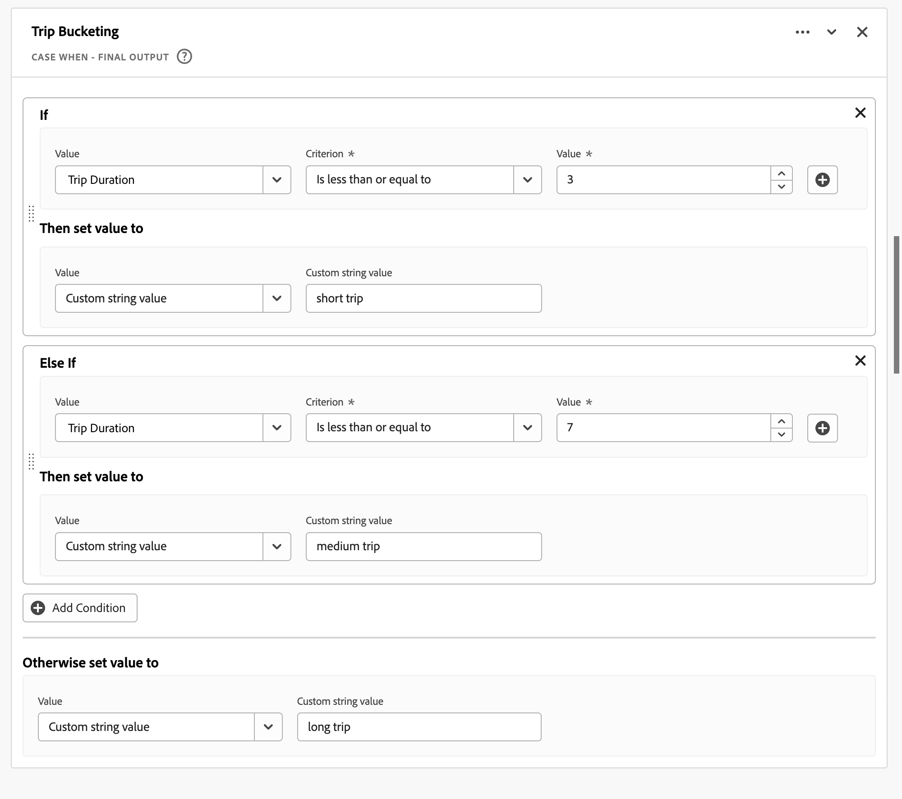
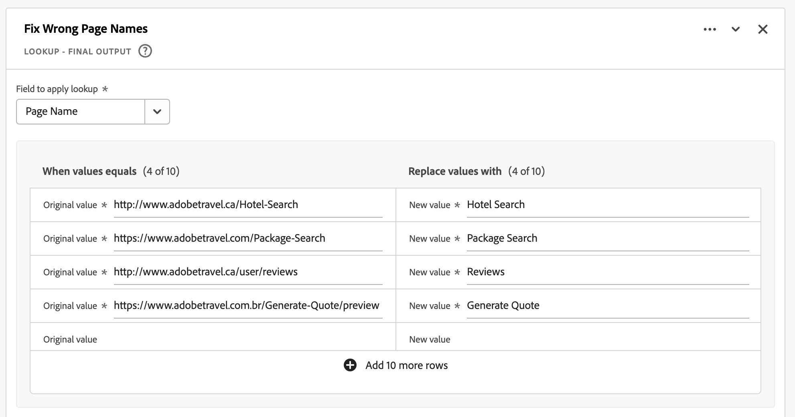

# Champs dérivés

Les champs dérivés sont un aspect important de la fonctionnalité de création de rapports en temps réel dans Adobe Customer Journey Analytics. Un champ dérivé vous permet de définir à la volée des manipulations de données (souvent complexes) par le biais d’un créateur de règles personnalisable. Vous pouvez ensuite utiliser ce champ dérivé comme composant (mesure ou dimension) dans [Workspace](../../analysis-workspace/home.md) ou même définir plus précisément le champ dérivé en tant que composant dans [Vue des données](../data-views.md).

Les champs dérivés permettent de gagner beaucoup de temps et d’efforts, par rapport à la transformation ou à la manipulation de vos données à d’autres endroits en dehors de Customer Journey Analytics. Par exemple : [Préparation de données](https://experienceleague.adobe.com/docs/experience-platform/data-prep/home.html?lang=fr), [Distiller de données](https://experienceleague.adobe.com/docs/experience-platform/query/data-distiller/overview.html?lang=en)ou dans vos propres processus Extract Transform Load (ETL)/Extract Load Transform (ELT).

Les champs dérivés sont définis dans [Vues des données](../data-views.md), sont basées sur un ensemble de fonctions définies en tant que règles et appliquées aux champs standard et/ou de schéma disponibles.

Voici des exemples de cas d’utilisation :

- Définissez un champ Nom de page dérivé qui corrige les valeurs de nom de page collectées incorrectes afin de corriger les valeurs de nom de page.

- Définissez un champ Canal marketing dérivé qui détermine le canal marketing approprié en fonction d’une ou de plusieurs conditions (par exemple, un paramètre d’URL, une URL de page, un nom de page).

## Interface de champ dérivée

Lorsque vous créez ou modifiez un champ dérivé, vous utilisez l’interface de champ dérivé.

|  | Nom | Description |
|---------|----------|--------|
| 1 | **Sélecteur** | Utilisez la zone de sélecteur pour sélectionner et faire glisser votre fonction, modèle de fonction, champ de schéma ou champ standard vers le créateur de règles.  Utilisez la liste déroulante pour effectuer une sélection parmi :   [!UICONTROL Fonctions] - listes disponibles [fonctions](#function-reference),   [!UICONTROL Modèles de fonction] - listes disponibles [modèle de fonction](#function-templates),    [!UICONTROL Champs de schéma] - répertorie les champs disponibles des catégories de jeux de données (événement, profil, recherche) et des champs dérivés précédemment définis ; et   [!UICONTROL Champs standard] : champs disponibles standard (comme l’identifiant du jeu de données Platform). Seuls les champs standard de type chaîne et numérique s’affichent dans le sélecteur. Si la fonction prend en charge d’autres types de données, il est possible de sélectionner des champs standard avec ces autres types de données pour les valeurs ou les champs dans l’interface des règles. Vous pouvez rechercher des champs de fonction, de modèle de fonction, de schéma et standard à l’aide de la variable  Zone de recherche.  Vous pouvez filtrer la liste d’objets sélectionnée en sélectionnant  Filtrez et spécifiez des filtres dans la variable [!UICONTROL Filtrage des champs par] boîte de dialogue. Vous pouvez facilement supprimer des filtres à l’aide de  pour chaque filtre. |
| 2 | **Créateur de règles** | Vous créez votre champ dérivé de manière séquentielle à l’aide d’une ou de plusieurs règles. Une règle est une implémentation spécifique d’une fonction et est donc toujours associée à une seule fonction. Pour créer une règle, faites-la glisser et déposez-la dans le créateur de règles. Le type de fonction détermine l’interface de la règle. Voir [Interface des règles](#rule-interface) pour plus d’informations.  Vous pouvez insérer une fonction au début, à la fin ou entre les règles déjà disponibles dans le créateur de règles. La dernière règle du créateur de règles détermine la sortie finale du champ dérivé. |
| 3 | **[!UICONTROL ** Paramètres des champs **]** | Vous pouvez nommer et décrire votre champ dérivé et inspecter son type de champ. |
| 4 | **[!UICONTROL ** Sortie finale **]** | Cette zone affiche un aperçu mis à jour à la volée des valeurs de sortie, en fonction des données des 30 derniers jours et des modifications apportées au champ dérivé dans le créateur de règles. |

{style="table-layout:auto"}

## Assistant de modèle de champ

Lorsque vous accédez pour la première fois à l’interface de champ dérivé, la variable [!UICONTROL Commencer avec un modèle de champ] s’affiche.

1. Sélectionnez le modèle qui décrit le mieux le type de champ que vous essayez de créer.
2. Sélectionnez la **[!UICONTROL ** Sélectionner **]** pour continuer.

La boîte de dialogue de champ dérivé est remplie avec des règles (et fonctions) requises ou utiles pour le type de champ que vous avez sélectionné. Voir [Modèles de fonction](#function-templates) pour plus d’informations sur les modèles disponibles.

## Interface des règles

Lorsque vous définissez une règle dans le créateur de règles, vous utilisez l’interface des règles.

|  | Nom | Description |
|---------|----------|--------|
| A   | **Nom de la règle** | Par défaut, le nom de la règle est **Règle X** (X faisant référence à un numéro de séquence). Pour modifier le nom d’une règle, sélectionnez son nom et saisissez-le dans le nouveau nom, par exemple `Query Parameter`. |
| B | **Nom de la fonction** | Nom de fonction sélectionné pour la règle, par exemple [!UICONTROL URL PARSE]. Lorsque la fonction est la dernière de la séquence de fonctions et qu’elle détermine les valeurs de sortie finales, le nom de la fonction est suivi de [!UICONTROL - SORTIE FINALE], par exemple [!UICONTROL URL PARSE - SORTIE FINALE].  Pour afficher une fenêtre contextuelle contenant plus d’informations sur la fonction, sélectionnez . |
| C   | **Description de la règle** | Vous pouvez éventuellement ajouter une description à une règle. Sélectionner , puis sélectionnez **[!UICONTROL ** Ajouter une description **]** pour ajouter une description ou **[!UICONTROL ** Modifier la description **]** pour modifier une description existante. Utilisez l’éditeur pour saisir une description. Vous pouvez utiliser la barre d’outils pour mettre en forme le texte (à l’aide du sélecteur de style, du gras, de l’italique, du souligné, de la droite, de la gauche, du centré, de la couleur, de la liste à puces) et ajouter des liens vers des informations externes.  Pour terminer la modification de la description, cliquez en dehors de l’éditeur. |
| D | **Zone de fonction** | Définit la logique de la fonction. L’interface dépend du type de fonction. Liste déroulante pour [!UICONTROL Champ] ou [!UICONTROL Valeur] affiche toutes les catégories de champs (règles, champs standard, champs) disponibles, en fonction du type d’entrée attendu par la fonction. Voir [Référence de fonction](#function-reference) sur des informations détaillées sur chacune des fonctions prises en charge. |

{style="table-layout:auto"}

## Création d’un champ dérivé

1. Sélectionnez une vue de données existante ou créez une vue de données. Voir [Vues des données](../data-views.md) pour plus d’informations.

2. Sélectionnez la **[!UICONTROL ** Composants **]** de la vue Données.

3. Sélectionner **[!UICONTROL ** Créer un champ dérivé&#x200B;**]** dans le rail de gauche.

4. Pour définir votre champ dérivé, utilisez la méthode [!UICONTROL Créer un champ dérivé] . Voir [Interface de champ dérivée](#derived-field-interface).

   Pour enregistrer votre nouveau champ dérivé, sélectionnez **[!UICONTROL ** Enregistrer **]**.

5. Votre nouveau champ dérivé est ajouté à la variable [!UICONTROL Champs dérivés >] conteneur, dans le cadre d’ **[!UICONTROL ** Champs de schéma **]** dans le rail gauche de votre vue de données.

## Modification d’un champ dérivé

1. Sélectionnez une vue de données existante. Voir [Vues des données](../data-views.md) pour plus d’informations.

2. Sélectionnez la **[!UICONTROL ** Composants **]** de la vue Données.

3. Sélectionner **[!UICONTROL ** Champs de schéma **]** dans le [!UICONTROL Connexion] sur la gauche.

4. Sélectionner **[!UICONTROL ** Champs dérivés >**]** conteneur.

5. Pointez sur le champ dérivé à modifier, puis sélectionnez .

6. Pour modifier votre champ dérivé, utilisez la méthode [!UICONTROL Modifier le champ dérivé] . Voir [Interface de champ dérivée](#derived-field-interface).

   - Sélectionner **[!UICONTROL ** Enregistrer **]** pour enregistrer votre champ dérivé mis à jour.

   - Sélectionner **[!UICONTROL ** Annuler **]** pour annuler les modifications que vous avez apportées au champ dérivé.

   - Sélectionner **[!UICONTROL ** Enregistrer sous **]** pour enregistrer le champ dérivé en tant que nouveau champ dérivé. Le nouveau champ dérivé porte le même nom que le champ dérivé modifié d’origine avec `(copy)` ajoutée à .

## Suppression d’un champ dérivé

1. Sélectionnez une vue de données existante. Voir [Vues des données](../data-views.md) pour plus d’informations.

2. Sélectionnez la **[!UICONTROL ** Composants **]** de la vue Données.

3. Sélectionner **[!UICONTROL ** Champs de schéma **]** dans [!UICONTROL Connexion] volet.

4. Sélectionner **[!UICONTROL ** Champs dérivés >**]** conteneur.

5. Pointez sur le champ dérivé à supprimer, puis sélectionnez .

6. Dans l’utilisation **[!UICONTROL ** Modifier le champ dérivé&#x200B;**]** , sélectionnez Supprimer.

   A [!UICONTROL Supprimer le composant] vous demande de confirmer la suppression. Tenez compte des références externes qui peuvent exister au champ dérivé en dehors de la vue de données.

   - Sélectionner **[!UICONTROL ** Continuer **]** pour supprimer le champ dérivé.

>[!NOTE]
>
>Les champs dérivés sont gérés au niveau de la connexion dans Customer Journey Analytics. Toute modification apportée à un champ dérivé dans l’une des vues de données associées à cette connexion s’applique à toutes ces vues de données associées.

## Modèles de fonction

Pour créer rapidement un champ dérivé en fonction de cas d’utilisation spécifiques, des modèles de fonction sont disponibles. Ces modèles de fonction sont accessibles à partir de la zone de sélecteur de l’interface de champ dérivé ou sont présentés lors de la première utilisation dans la section [!UICONTROL Commencer avec un modèle de champ] assistant.

### Canaux marketing

Ce modèle est configuré pour utiliser la variable [Analyse de l’URL](#dnl-url-parse) et [Cas lorsque](#dnl-case-when) fonctionne plusieurs fois pour obtenir les valeurs appropriées à partir d’une URL. La logique est ensuite appliquée à ces valeurs pour associer l’URL à un canal marketing spécifique.

+++ Détails

Pour utiliser le modèle, vous devez spécifier les paramètres corrects pour chaque fonction répertoriée comme faisant partie des règles du modèle. Voir [Référence de fonction](#function-reference) pour plus d’informations.

+++

<!--

+++ Data clean up template

>[!WARNING]
>
>Could not find any information on this template.
+++

-->

## Référence de fonction

Pour chaque fonction prise en charge, recherchez les détails ci-dessous sur :

- spécifications :
   - type de données d’entrée : type de données prises en charge,
   - input : les valeurs possibles de saisie,
   - opérateurs inclus : opérateurs pris en charge pour cette fonction (le cas échéant),
   - limitations : les limitations qui s&#39;appliquent à cette fonction spécifique,
   - sortie.

- cas d’utilisation, notamment :
   - données avant de définir le champ dérivé,
   - comment définir le champ dérivé,
   - données après avoir défini le champ dérivé.

- contraintes (le cas échéant).

<!-- Concatenate -->

### Concaténer

Combine les valeurs de champ dans un nouveau champ dérivé unique avec des délimiteurs définis.

+++ Détails

## Spécifications {#concatenate-io}

| Input Data Type | Entrée | Opérateurs inclus | Limites | Sortie |
|---|---|---|---|---|
| <ul><li>Chaîne</li></ul> | <ul><li>[!UICONTROL Valeur]:<ul><li>Règles</li><li>Champs standard</li><li>Champs</li><li>Chaîne</li></ul></li><li>[!UICONTROL Délimiteur]:<ul><li>Chaîne</li></ul></li> </ul> | 
S.O.
 | 
2 fonctions par champ dérivé
 | 
Nouveau champ dérivé
 |

{style="table-layout:auto"}

## Cas d’utilisation {#concatenate-uc}

Vous collectez actuellement les codes d’origine et d’aéroport de destination comme des champs distincts. Vous souhaitez regrouper les deux champs dans une seule dimension séparée par un trait d’union (-). Vous pouvez donc analyser la combinaison de l’origine et de la destination pour identifier les itinéraires les plus réservés.

Hypothèses :

- Les valeurs d’origine et de destination sont collectées dans des champs distincts dans le même tableau.
- L’utilisateur détermine d’utiliser le délimiteur &quot;-&quot; entre les valeurs.

Imaginez que les réservations suivantes se produisent :

- ABC123 livre un vol entre Salt Lake City (SLC) et Orlando (MCO)
- Le client ABC456 livre un vol entre Salt Lake City (SLC) et Los Angeles (LAX)
- Le client ABC789 livre un vol entre Salt Lake City (SLC) et Seattle (SEA)
- ABC987 livre un vol entre Salt Lake City (SLC) et San Jose (SJO)
- ABC654 livre un vol entre Salt Lake City (SLC) et Orlando (MCO)

Le rapport souhaité doit se présenter comme suit :

| Origine/destination | Réservations |
|----|---:|
| SLC-MCO | 2 |
| SLC-LAX | 1 |
| SLC-SEA | 1 |
| SLC-SJO | 1 |

{style="table-layout:auto"}

### Données avant {#concatenate-uc-databefore}

| Origine | Destination |
|----|---:|
| SLC | MCO |
| SLC | LAX |
| SLC | SEA |
| SLC | SJO |
| SLC | MCO |

{style="table-layout:auto"}

### Champ dérivé {#concatenate-derivedfield}

Vous définissez une nouvelle [!UICONTROL Origine - Destination] champ dérivé. Vous utilisez le [!UICONTROL CONCATENATE] pour définir une règle afin de concaténer la variable [!UICONTROL Original] et [!UICONTROL Destination] à l’aide des champs `-` [!UICONTROL Délimiteur].

### Données après {#concatenate-dataafter}

| Origine - Destination (champ dérivé) |
|---|
| SLC-MCO |
| SLC-LAX |
| SLC-SEA |
| SLC-SJO |
| SLC-MCO |

{style="table-layout:auto"}

+++

<!-- CASE WHEN -->

### Cas si

Applique des conditions, selon des critères définis à partir d’un ou de plusieurs champs. Ces critères sont ensuite utilisés pour définir les valeurs d’un nouveau champ dérivé, selon l’ordre des conditions.

+++ Détails

## Spécifications {#casewhen-io}

| Input Data Type | Entrée | Opérateurs inclus | Limites | Sortie |
|---|---|---|---|---|
| <ul><li>Chaîne</li><li>Numérique</li><li>Date</li></ul> | <ul><li>[!UICONTROL If], [!UICONTROL Sinon si] container :
<ul><li>[!UICONTROL Valeur]</li><ul><li>Règles</li><li>Champs standard</li><li>Champs</li></ul><li>[!UICONTROL Critère] (voir opérateurs inclus, selon le type de valeur sélectionné)</li></ul></li><li>[!UICONTROL Ensuite, définissez la valeur sur], [!UICONTROL Sinon, définissez la valeur sur]:
<ul><li>[!UICONTROL Valeur]</li><ul><li>Règles</li><li>Champs standard</li><li>Champs</li></ul></ul></li></ul> | 
Chaînes
<ul><li>Est égal à</li><li>Est égal à l’un des termes</li><li>Contient l’expression</li><li>Contient n’importe quel terme</li><li>Contient tous les termes</li><li>Commence par</li><li>Commence par n’importe quel terme</li><li>Se termine par</li><li>Se termine par n’importe quel terme</li><li>N’est pas égal à</li><li>N’est égal à aucun terme</li><li>Ne contient pas l’expression</li><li>Ne contient aucun terme</li><li>Ne contient pas tous les termes</li><li>Ne commence pas par</li><li>Ne commence par aucun terme</li><li>Ne se termine pas par</li><li>Ne se termine par aucun terme</li><li>Est défini</li><li>N’est pas défini</li></ul>
Numérique
<ul><li>Est égal à</li><li>N’est pas égal à</li><li>Est supérieur à</li><li>Est supérieur ou égal à</li><li>Est inférieur à</li><li>Est inférieur ou égal à</li><li>Est défini</li><li>N’est pas défini</li></ul>
Dates
<ul><li>Est égal à</li><li>N’est pas égal à</li><li>Est postérieur à</li><li>Est ultérieur ou égal à</li><li>Est avant</li><li>Est antérieur ou égal à</li><li>Est défini</li><li>N’est pas défini</li></ul> | <ul><li>5 fonctions par champ dérivé</li><li>200 opérateurs par champ dérivé. Un exemple d’opérateur unique est &quot;Domaine référent contient google&quot;. </li></ul> | 
Nouveau champ dérivé
 |

{style="table-layout:auto"}

## Cas d’utilisation 1 {#casewhen-uc1}

Vous souhaitez définir des règles pour identifier différents canaux marketing, en appliquant une logique en cascade pour définir un champ de canal marketing sur la valeur appropriée :

- Si le référent provient d’un moteur de recherche et que la page comporte une valeur de chaîne de requête où `cid` contains `ps_`, le canal marketing doit être identifié comme [!DNL *Recherche payante*].
- Si le référent provient d’un moteur de recherche et que la page ne comporte pas de chaîne de requête `cid`, le canal marketing doit être identifié comme [!DNL *Recherche naturelle*].
- Si une page a une valeur de chaîne de requête où `cid` contains `em_`, le canal marketing doit être identifié en tant que [!DNL *Email*].
- Si une page a une valeur de chaîne de requête où `cid` contains `ds_`, le canal marketing doit être identifié comme [!DNL *Afficher la publicité*].
- Si une page a une valeur de chaîne de requête où `cid` contains `so_`, le canal marketing doit être identifié comme [!DNL *Social payant*].
- Si le référent provient d’un domaine référent de [!DNL twitter.com], [!DNL facebook.com], [!DNL linkedin.com]ou [!DNL tiktok.com], le canal marketing doit être identifié comme [!DNL *Social naturel*].
- Si aucune des règles ci-dessus ne correspond, le canal marketing doit être identifié comme [!DNL *Autre référent*].

Si votre site reçoit les exemples d’événements suivants, contenant [!UICONTROL Référent] et [!UICONTROL URL de la page], ces événements doivent être identifiés comme suit :

| [!DNL Event] | [!DNL Referrer] | [!DNL Page URL] | [!DNL Marketing Channel] |
|:--:|----|----|----|
| 1 | `https://facebook.com` | `https://site.com/home` | [!DNL Natural Social] |
| 2 | `https://abc.com` | `https://site.com/?cid=ds_12345678` | [!DNL Display] |
| 3 | | `https://site.com/?cid=em_12345678` | [!DNL Email] |
| 4 | `https://google.com` | `https://site.com/?cid=ps_abc098765` | [!DNL Paid Search] |
| 5 | `https://google.com` | `https://site.com/?cid=em_765544332` | [!DNL Email] |
| 6 | `https://google.com` |  | [!DNL Natural Search] |

{style="table-layout:auto"}

### Données avant {#casewhen-uc1-databefore}

| [!DNL Referrer] | [!DNL Page URL] |
|----|----|
| `https://facebook.com` | `https://site.com/home` |
| `https://abc.com` | `https://site.com/?cid=ds_12345678` |
|  | `https://site.com/?cid=em_12345678` |
| `https://google.com` | `https://site.com/?cid=ps_abc098765` |
| `https://google.com` | `https://site.com/?cid=em_765544332` |
| `https://google.com` |

{style="table-layout:auto"}

### Champ dérivé {#casewhen-uc1-derivedfield}

Vous définissez une nouvelle `Marketing Channel` champ dérivé. Vous utilisez le [!UICONTROL CAS LORSQUE] fonctions permettant de définir des règles qui créent des valeurs pour en fonction des valeurs existantes pour les deux fonctions `Page URL` et `Referring URL` champ .

Notez l’utilisation de la fonction [!UICONTROL URL PARSE] pour définir des règles pour récupérer les valeurs de `Page Url` et `Referring Url` avant l’événement [!UICONTROL CAS LORSQUE] sont appliquées.

### Données après {#casewhen-uc1-dataafter}

| [!DNL Marketing Channel] |
|----|
| [!DNL Natural Social] |
| [!DNL Display] |
| [!DNL Email] |
| [!DNL Paid Search] |
| [!DNL Email] |
| [!DNL Natural Search] |

{style="table-layout:auto"}

## Cas d’utilisation 2 {#casewhen-uc2}

Vous avez collecté plusieurs variantes de recherche dans votre [!DNL Product Finding Methods] dimension. Pour comprendre les performances globales de la recherche par rapport à la navigation, vous devez passer beaucoup de temps à combiner les résultats manuellement.

Votre site collecte les valeurs suivantes pour votre [!DNL Product Finding Methods] dimension. À la fin, toutes ces valeurs indiquent une recherche.

| Valeur collectée | Valeur réelle |
|---|---|
| [!DNL search p13n_no] | [!DNL search] |
| [!DNL search p13n_yes] | [!DNL search] |
| [!DNL search refine p13n_no] | [!DNL search] |
| [!DNL search refine p13n_yes] | [!DNL search] |
| [!DNL search redirect p13n_yes] | [!DNL search] |
| [!DNL search-redirect] | [!DNL search] |

{style="table-layout:auto"}

### Données avant {#casewhen-uc2-databefore}

| [!DNL Product Finding Methods] |
|----|
| [!DNL search p13_no] |
| [!DNL search p13_yes] |
| [!DNL browse] |
| [!DNL search refine p13_no] |
| [!DNL search refine p13_yes] |
| [!DNL browse] |
| [!DNL search redirect p13_yes] |
| [!DNL search-redirect] |
| [!DNL browse] |

{style="table-layout:auto"}

### Champ dérivé {#casewhen-uc2-derivedfield}

Vous définissez une `Product Finding Methods (new)` champ dérivé. Vous créez les éléments suivants : [!UICONTROL CAS LORSQUE] règles dans le créateur de règles. Ces règles appliquent la logique à toutes les variantes possibles de l’ancienne [!UICONTROL Méthodes de recherche de produits] valeurs de champ pour `search` et `browse` en utilisant la variable [!UICONTROL Contient l’expression] critère.

### Données après {#casewhen-uc2-dataafter}

| [!DNL Product Finding Methods (new)] |
|----|
| [!DNL search] |
| [!DNL search] |
| [!DNL browse] |
| [!DNL search] |
| [!DNL search] |
| [!DNL browse] |
| [!DNL search] |
| [!DNL search] |
| [!DNL browse] |

{style="table-layout:auto"}

## Cas d’utilisation 3 {#casewhen-uc3}

En tant qu’agence de voyages, vous souhaitez regrouper la durée des voyages réservés afin que vous puissiez établir des rapports sur la durée des voyages regroupés.

Hypothèses :

- L’organisation collecte la durée du voyage dans un champ numérique.
- Ils souhaitent regrouper des durées de 1 à 3 jours dans un compartiment appelé &quot;&quot;[!DNL short trip]&#39;
- Ils souhaitent regrouper des durées de 4 à 7 jours dans un compartiment appelé &quot;&quot;[!DNL medium trip]&#39;
- Ils souhaitent regrouper 8 durées de plus de 8 jours dans un compartiment appelé &quot;&quot;[!DNL long trip]&#39;
- 132 trajets ont été réservés pour une durée d&#39;une journée
- 110 trajets ont été réservés pour une durée de 2 jours
- 105 trajets ont été réservés pour une durée de 3 jours
- 99 trajets ont été réservés pour une durée de 4 jours
- 92 trajets ont été réservés pour une durée de 5 jours
- 85 trajets ont été réservés pour une durée de 6 jours
- 82 trajets ont été réservés pour une durée de 7 jours
- 78 trajets ont été réservés pour une durée de 8 jours
- 50 trajets ont été réservés pour une durée de 9 jours
- 44 trajets ont été réservés pour une durée de 10 jours
- 38 trajets ont été réservés pour une durée de 11 jours
- 31 trajets ont été réservés pour une durée de 12 jours

Le rapport souhaité doit se présenter comme suit :

| [!DNL Trip Duration Type] | [!DNL Bookings] |
|----|---:|
| [!DNL medium trip] | 358 |
| [!DNL short trip] | 347 |
| [!DNL long trip] | 241 |

{style="table-layout:auto"}

### Données avant {#casewhen-uc3-databefore}

| [!DNL Trip Duration] |
|---:|
| 1 |
| 12 |
| 3 |
| 6 |
| 4 |
| 8 |
| 6 |
| 2 |
| 1 |
| 2 |
| 21 |
| 8 |

### Champ dérivé {#casewhen-uc3-derivedfield}

Vous définissez une `Trip Duration (bucketed)` champ dérivé. Vous créez les éléments suivants : [!UICONTROL CAS LORSQUE] dans le créateur de règles. Cette règle applique la logique pour regrouper l’ancienne [!UICONTROL Durée du voyage] valeurs de champ en trois valeurs : `short trip`, `medium  trip`, et `long trip`.

### Données après {#casewhen-uc3-dataafter}

| [!DNL Trip Duration (bucketed)] |
|---|
| [!DNL short trip] |
| [!DNL long trip] |
| [!DNL short trip] |
| [!DNL medium trip] |
| [!DNL medium trip] |
| [!DNL long trip] |
| [!DNL medium trip] |
| [!DNL short trip] |
| [!DNL short trip] |
| [!DNL short trip] |
| [!DNL long trip] |
| [!DNL long trip] |

## Informations supplémentaires

Customer Journey Analytics utilise une structure de conteneur imbriquée, modelée sur Adobe Experience Platform [XDM](https://experienceleague.adobe.com/docs/experience-platform/xdm/home.html?lang=fr) (Modèle de données d’expérience). Voir [Conteneurs](../create-dataview.md#containers) et [Filtrage des conteneurs](../../components/filters/filters-overview.md#filter-containers) pour plus d’informations. Ce modèle de conteneur, bien que flexible par nature, impose certaines contraintes lors de l’utilisation du créateur de règles.

Customer Journey Analytics utilise le modèle de conteneur par défaut suivant :

Les contraintes suivantes s’appliquent et sont appliquées lorsque *Sélection* et *paramètre* valeurs.

|  | Contraintes |
|:---:|----|
| **A** | Valeurs *select* dans le même [!UICONTROL If], [!UICONTROL Sinon si] concept (à l’aide de [!UICONTROL Et] ou [!UICONTROL Ou]) d’une règle doit provenir du même conteneur et peut être de n’importe quel type (chaîne , numérique , etc.).   |
| **B** | Toutes les valeurs que vous *set* dans une règle doit provenir du même conteneur et avoir le même type ou une valeur dérivée du même type.    |
| **C** | Les valeurs que vous *select* cross [!UICONTROL If], [!UICONTROL Sinon si] éléments dans la règle do *not* doivent provenir du même conteneur et doivent *not* doivent être du même type.    |

{style="table-layout:auto"}

+++

<!-- FIND AND REPLACE -->

### Rechercher et remplacer

Recherche toutes les valeurs d’un champ sélectionné et remplace ces valeurs par une valeur différente dans un nouveau champ dérivé.

+++ Détails

## Spécifications {#findreplace-io}

| Input Data Type | Entrée | Opérateurs inclus | Limites | Sortie |
|---|---|---|---|---|
| <ul><li>Chaîne</li></ul> | <ul><li>[!UICONTROL Valeur]<ul><li>Règles</li><li>Champs standard</li><li>Champs</li></ul></li><li>[!UICONTROL Tout rechercher], [!UICONTROL et tout remplacer par]:<ul><li>Chaîne</li></ul></li></ul></ul> | 
Chaînes
<ul><li>[!UICONTROL Tout rechercher], [!UICONTROL et tout remplacer par]</li></ul> | 
5 fonctions par champ dérivé
 | 
Nouveau champ dérivé
 |

{style="table-layout:auto"}

## Cas d’utilisation {#findreplace-uc}

Vous avez reçu des valeurs incorrectes pour votre rapport de canaux marketing externes, par exemple `email%20 marketing` au lieu de `email marketing`. Ces valeurs incorrectes divisent vos rapports et rendent plus difficile l’affichage des performances des emails. Vous souhaitez remplacer `email%20marketing` avec `email marketing`.

**Rapport d’origine**

| [!DNL External Marketing Channels] | [!DNL Sessions] |
|---|--:|
| [!DNL email marketing] | 500 |
| [!DNL email %20marketing] | 24 |

{style="table-layout:auto"}

**Rapport Préféré**

| [!DNL External Marketing Channels] | [!DNL Sessions] |
|---|--:|
| [!DNL email marketing] | 524 |

### Données avant {#findreplace-uc-databefore}

| [!DNL External Marketing] |
|----|
| [!DNL email marketing] |
| [!DNL email%20marketing] |
| [!DNL email marketing] |
| [!DNL email marketing] |
| [!DNL email%20marketing] |

{style="table-layout:auto"}

### Champ dérivé {#findreplace-uc-derivedfield}

Vous pouvez définir une `Email Marketing (updated)` champ dérivé. Vous utilisez le [!UICONTROL RECHERCHER ET REMPLACER] pour définir une règle permettant de rechercher et remplacer toutes les occurrences de `email%20marketing` avec `email marketing`.

### Données après {#findreplace-uc-dataafter}

| [!DNL External Marketing (updated)] |
|----|
| [!DNL email marketing] |
| [!DNL email marketing] |
| [!DNL email marketing] |
| [!DNL email marketing] |
| [!DNL email marketing] |

{style="table-layout:auto"}

+++

<!-- LOOKUP -->

### Recherche

Définit un ensemble de valeurs de recherche qui sont remplacées par les valeurs correspondantes dans un nouveau champ dérivé.

+++ Détails

## Spécifications {#lookup-io}

| Input Data Type | Entrée | Opérateurs inclus | Limites | Sortie |
|---|---|---|---|---|
| <ul><li>Chaîne</li><li>Numérique</li><li>Date</li></ul> | <ul><li>[!UICONTROL Champ pour appliquer la recherche]:<ul><li>Règles</li><li>Champs standard</li><li>Champs</li></ul></li><li>[!UICONTROL Lorsque la valeur est égale à] et [!UICONTROL Remplacer les valeurs par]:
<ul><li>Chaîne</li></ul></li></ul> | 
S.O.
 | 
5 fonctions par champ dérivé
 | 
Nouveau champ dérivé
 |

{style="table-layout:auto"}

## Cas d’utilisation 1 {#lookup-uc1}

Vous disposez d’un fichier CSV contenant une colonne clé pour `hotelID` et une ou plusieurs colonnes supplémentaires associées à la variable `hotelID`: `city`, `rooms`, `hotel name`.
Vous collectez des [!DNL Hotel ID] dans une dimension, mais que souhaitez-vous créer [!DNL Hotel Name] dimension dérivée de `hotelID` dans le fichier CSV.

**Structure et contenu du fichier CSV**

| [!DNL hotelID] | [!DNL city] | [!DNL rooms] | [!DNL hotel name] |
|---|---|---:|---|
| [!DNL SLC123] | [!DNL Salt Lake City] | 40 | [!DNL SLC Downtown] |
| [!DNL LAX342] | [!DNL Los Angeles] | 60 | [!DNL LA Airport] |
| [!DNL SFO456] | [!DNL San Francisco] | 75 | [!DNL Market Street] |

{style="table-layout:auto"}

**Rapport actuel**

| [!DNL Hotel ID] | Consultations de produit |
|---|---:|
| [!DNL SLC123] | 200 |
| [!DNL LX342] | 198 |
| [!DNL SFO456] | 190 |

{style="table-layout:auto"}

**Rapport souhaité**

| [!DNL Hotel Name] | Consultations de produit |
|----|----:|
| [!DNL SLC Downtown] | 200 |
| [!DNL LA Airport] | 198 |
| [!DNL Market Street] | 190 |

{style="table-layout:auto"}

### Données avant {#lookup-uc1-databefore}

| [!DNL Hotel ID] |
|----|
| [!DNL SLC123] |
| [!DNL LAX342] |
| [!DNL SFO456] |

{style="table-layout:auto"}

### Champ dérivé {#lookup-uc1-derivedfield}

Vous définissez une `Hotel Name` champ dérivé. Vous utilisez le [!UICONTROL RECHERCHE] pour définir une règle dans laquelle vous pouvez rechercher les valeurs de la fonction [!UICONTROL ID de l&#39;hôtel] et remplacez par de nouvelles valeurs.

### Données après {#lookup-uc1-dataafter}

| [!DNL Hotel Name] |
|----|
| [!DNL SLC Downtown] |
| [!DNL LA Airport] |
| [!DNL Market Street] |

{style="table-layout:auto"}

## Cas d’utilisation 2 {#lookup-uc2}

Vous avez collecté des URL au lieu du nom de page convivial pour plusieurs pages. Cette collection mixte de valeurs rompt la création de rapports.

### Données avant {#lookup-uc2-databefore}

| [!DNL Page Name] |
|---|
| [!DNL Home Page] |
| [!DNL Flight Search] |
| `http://www.adobetravel.ca/Hotel-Search` |
| `https://www.adobetravel.com/Package-Search` |
| [!DNL Deals & Offers] |
| `http://www.adobetravel.ca/user/reviews` |
| `https://www.adobetravel.com.br/Generate-Quote/preview` |

{style="table-layout:auto"}

### Champ dérivé {#lookup-uc2-derivedfield}

Vous définissez une `Page Name (updated)` champ dérivé. Vous utilisez le [!UICONTROL RECHERCHE] pour définir une règle dans laquelle vous pouvez rechercher les valeurs de votre [!UICONTROL Nom de la page] et remplacez par les valeurs correctes mises à jour.

### Données après {#lookup-uc2-dataafter}

| [!DNL Page Name (updated)] |
|---|
| [!DNL Home Page] |
| [!DNL Flight Search] |
| [!DNL Hotel Search] |
| [!DNL Package Search] |
| [!DNL Deals & Offers] |
| [!DNL Reviews] |
| [!DNL Generate Quote] |

+++

<!-- MERGE FIELDS -->

### Fusionner les champs

Fusionne les valeurs de deux champs différents en un nouveau champ dérivé.

+++ Détails

## Spécification {#merge-fields-io}

| Input Data Type | Entrée | Opérateurs inclus | Limite | Sortie |
|---|---|---|---|---|
| <ul><li>Chaîne</li><li>Numérique</li><li>Date</li></ul> | <ul><li>[!UICONTROL Champ]:</li><ul><li>Règles</li><li>Champs standard</li><li>Champs</li></ul> | 
S.O.
 | 
5 fonctions par champ dérivé
 | 
Nouveau champ dérivé
 |

{style="table-layout:auto"}

## Cas d’utilisation {#merge-fields-uc}

Vous souhaitez créer une nouvelle dimension composée du champ nom de page et du champ raison de l’appel dans le but d’analyser le parcours entre les canaux.

### Données avant {#merge-fields-uc-databefore}

| Nom de la page | Session | Visiteurs |
|---|--:|--:|
| page d’aide | 250 | 200 |
| page d’accueil | 500 | 250 |
| page des détails du produit | 300 | 200 |

{style="table-layout:auto"}

| Raison de l’appel | Session | Visiteurs |
|---|--:|--:|
| questions relatives à ma commande | 275 | 250 |
| apporter une modification à ma commande ; | 150 | 145 |
| problème lié à l’ordonnancement | 100 | 95 |

{style="table-layout:auto"}

### Champ dérivé {#merge-fields-uc-derivedfield}

Vous définissez une `Cross Channel Interactions` champ dérivé. Vous utilisez le [!UICONTROL FUSION DE CHAMPS] pour définir une règle pour fusionner les valeurs de la fonction [!UICONTROL Nom de la page] champ et [!UICONTROL Raison de l’appel] et stockez-les dans le nouveau champ dérivé.

### Données après {#merge-fields-uc-dataafter}

| Interactions cross-canal | Sessions | Visiteurs |
|---|--:|--:|
| page d’accueil | 500 | 250 |
| page des détails du produit | 300 | 200 |
| questions relatives à ma commande | 275 | 250 |
| page d’aide | 250 | 200 |
| apporter une modification à ma commande ; | 150 | 145 |
| problème lié à l’ordonnancement | 100 | 95 |

{style="table-layout:auto"}

## Informations supplémentaires {#merge-fields-moreinfo}

Vous devez sélectionner le même type de champ dans une règle Fusionner les champs . Par exemple, si vous sélectionnez un champ Date , tous les autres champs que vous souhaitez fusionner doivent être des champs Date .

+++

<!-- REGEX REPLACE -->

### Remplacement d’expression régulière

Remplace une valeur d’un champ à l’aide d’une expression régulière par un nouveau champ dérivé.

+++ Détails

## Spécification {#regex-replace-io}

| Input Data Type | Entrée | Opérateurs inclus | Limite | Sortie |
|---|---|---|---|---|
| <ul><li>Chaîne</li><li>Numérique</li></ul> | <ul><li>[!UICONTROL Champ]:</li><ul><li>Règles</li><li>Champs standard</li><li>Champs</li></ul></ul><ul><li>[!UICONTROL Regex]:</li><ul><li>Chaîne</li></ul></li><li>[!UICONTROL Format de sortie]:<ul><li>Chaîne</li></ul></ul><ul><li>Respect de la casse</li><ul><li>Booléen</li></ul></li></ul></li> | 
S.O.
 | 
1 fonction par champ dérivé
 | 
Nouveau champ dérivé
 |

{style="table-layout:auto"}

## Cas d’utilisation {#regex-replace-uc}

Vous souhaitez saisir une option d’URL et l’utiliser comme identifiant de page unique pour analyser le trafic. Vous utiliserez `[^/]+(?=/$|$)` pour que l’expression régulière capture la fin de l’URL et `$1` comme modèle de sortie.

### Données avant {#regex-replace-uc-databefore}

| URL de la page |
|---|
| `https://business.adobe.com/products/analytics/adobe-analytics-benefits.html` |
| `https://business.adobe.com/products/analytics/adobe-analytics.html` |
| `https://business.adobe.com/products/experience-platform/customer-journey-analytics.html` |
| `https://business.adobe.com/products/experience-platform/adobe-experience-platform.html` |

{style="table-layout:auto"}

### Champ dérivé {#regex-replace-uc-derivedfield}

Vous créez une `Page Identifier` champ dérivé. Vous utilisez le [!UICONTROL REGEX REPLACE] pour définir une règle afin de remplacer la valeur de la fonction [!UICONTROL URL de référence] à l’aide d’un champ [!UICONTROL Regex] de `[^/]+(?=/$|$)` et [!UICONTROL Format de sortie] de `$1`.

### Données après {#regex-replace-uc-dataafter}

| Identifiant de page |
|---|
| adobe-analytics-benefits.html |
| adobe-analytics.html |
| customer-journey-analytics.html |
| adobe-experience-platform.html |

## Informations supplémentaires

Customer Journey Analytics utilise un sous-ensemble de la syntaxe de l’expression régulière Perl. Les expressions ci-dessous sont prises en charge :

| Expression | Description |
| --- | --- |
| `a` | Un seul caractère `a`. |
| `a\|b` | Un seul caractère `a` ou `b`. |
| `[abc]` | Un seul caractère `a`, `b` ou `c`. |
| `[^abc]` | N’importe quel caractère sauf `a`, `b` ou `c`. |
| `[a-z]` | N’importe quel caractère entre `a`-`z`. |
| `[a-zA-Z0-9]` | N’importe quel caractère entre `a`-`z`, `A`-`Z`, ou entre `0`-`9`. |
| `^` | Correspond au début de la ligne. |
| `$` | Correspond à la fin de la ligne. |
| `\A` | Début de chaîne. |
| `\z` | Fin de chaîne. |
| `.` | Correspond à n’importe quel caractère. |
| `\s` | N’importe quel espace. |
| `\S` | N’importe quel caractère sauf espace. |
| `\d` | N’importe quel chiffre. |
| `\D` | N’importe quel caractère non numérique. |
| `\w` | N’importe quel caractère de soulignement, lettre ou chiffre. |
| `\W` | N’importe quel caractère n’appartenant pas à un mot. |
| `\b` | N’importe quelle limite de mot. |
| `\B` | N’importe quel caractère qui n’est pas une limite de mot. |
| `\<` | Début de mot. |
| `\>` | Fin de mot. |
| `(...)` | Acquérir tout ce qui est compris. |
| `(?:...)` | Capture sans marquage. Empêche la référence de la correspondance dans la chaîne de sortie. |
| `a?` | Zéro ou un de : `a`. |
| `a*` | Zéro ou plus de : `a`. |
| `a+` | Un ou plus de : `a`. |
| `a{3}` | Exactement 3 de : `a`. |
| `a{3,}` | 3 ou plus de : `a`. |
| `a{3,6}` | Entre 3 et 6 de : `a`. |

Vous pouvez utiliser ces séquences au [!UICONTROL Format de sortie] le nombre de fois désiré et dans n’importe quel ordre pour obtenir la sortie de chaîne souhaitée.

| Séquence d’espace réservé de sortie | Description |
| --- | --- |
| `$&` | Génère ce qui correspondait à l’expression entière. |
| `$n` | Génère ce qui correspondait à la énième sous-expression. Par exemple : `$1` génère la première sous-expression. |
| ``$` `` | Génère le texte entre la fin de la dernière correspondance trouvée (ou le début du texte si aucune correspondance précédente n’a été trouvée) et le début de la correspondance actuelle. |
| `$+` | Génère ce qui correspond à la dernière sous-expression marquée dans l’expression régulière. |
| `$$` | Génère le caractère de chaîne `"$"`. |

{style="table-layout:auto"}

+++

<!-- SPLIT -->

### Split

Divise une valeur d’un champ en un nouveau champ dérivé.

+++ Détails

## Spécification {#split-io}

| Input Data Type | Entrée | Opérateurs inclus | Limite | Sortie |
|---|---|---|---|---|
| <ul><li>Chaîne</li><li>Numérique</li></ul> | <ul><li>[!UICONTROL Champ]:</li><ul><li>Règles</li><li>Champs standard</li><li>Champs</li></ul></ul><ul><li>[!UICONTROL Méthode]:</li><ul><li>De la gauche</li><li>De la droite</li><li>Convertir en tableau</li></ul></li><li>Pour le délimiteur :<ul><li>Chaîne</li></ul><li>Pour l’index :<ul><li>Numérique</li></ul></li> | 
S.O.
 | 
5 fonctions par champ dérivé
 | 
Nouveau champ dérivé
 |

{style="table-layout:auto"}

## Cas d’utilisation 1 {#split-uc1}

Vous collectez les réponses des applications vocales dans une liste délimitée dans une seule dimension. Vous souhaitez que chaque valeur de la liste soit une valeur unique dans le rapport de réponses.

### Données avant {#split-uc1-databefore}

| Réponses de l’application vocale | Événements |
|---|--:|
| C&#39;était génial, c&#39;était tout à fait logique, il recommanderait aux autres | 1 |
| C&#39;était génial, un peu confus, je recommanderai aux autres | 1 |
| ce n&#39;était pas génial, très déroutant, ne recommandera pas aux autres. | 1 |

{style="table-layout:auto"}

### Champ dérivé {#split-u1-derivedfield}

Vous créez une `Responses` champ dérivé. Vous utilisez le [!UICONTROL PARTAGE] pour définir une règle permettant d’utiliser la fonction  [!UICONTROL Convertir en tableau] pour convertir les valeurs de la méthode [!UICONTROL Réponse de l’application vocale] champ utilisant `,` comme la propriété [!UICONTROL Délimiteur].

### Données après {#split-uc1-dataafter}

| Réponses | Événements |
|---|--:|
| c&#39;était génial | 2 |
| recommandera aux autres | 2 |
| ce n&#39;était pas génial | 1 |
| parfaitement logique | 1 |
| un peu confus | 1 |
| très déroutant | 1 |
| ne recommande pas aux autres | 1 |

{style="table-layout:auto"}

## Cas d’utilisation 2 {#split-uc2}

Vous collectez les réponses des applications vocales dans une liste délimitée dans une seule dimension. Vous souhaitez que les réponses de la première valeur de la liste apparaissent dans sa propre dimension. Vous souhaitez placer la dernière valeur de la liste dans sa propre dimension.

### Données avant {#split-uc2-databefore}

| Réponses | Événements |
|---|--:|
| C&#39;était génial, logique, recommandera aux autres. | 1 |
| C&#39;était génial, un peu confus, je recommanderai aux autres | 1 |
| ce n&#39;était pas génial, très déroutant, ne recommandera pas aux autres. | 1 |

{style="table-layout:auto"}

### Champ dérivé {#split-u2-derivedfield}

Vous créez une  `First Response` champ dérivé. Vous utilisez le [!UICONTROL PARTAGE] pour définir une règle permettant de récupérer la première valeur de la fonction [!UICONTROL Réponses] champ à gauche de la réponse `,` comme délimiteur.

Vous créez une `Second Response` champ dérivé pour extraire la dernière valeur de la propriété [!UICONTROL Réponses] en sélectionnant À partir de la droite, 1 comme Délimiteur et 1 comme Index.

### Données après {#split-uc2-dataafter}

| Première réponse | Événements |
|---|--:|
| c&#39;était génial | 2 |
| ce n&#39;était pas génial | 1 |

{style="table-layout:auto"}

| Deuxième réponse | Événements |
|---|--:|
| recommandera aux autres | 2 |
| ne recommande pas aux autres | 1 |

{style="table-layout:auto"}

+++

<!-- URL PARSE -->

### Analyse de l’URL

Analyse différentes parties d’une URL, y compris le protocole, l’hôte, le chemin ou les paramètres de requête.

+++ Détails

## Spécifications {#urlparse-io}

| Input Data Type | Entrée | Opérateurs inclus | Limite | Sortie |
|---|---|---|---|---|
| <ul><li>Chaîne</li></ul> | <ul><li>[!UICONTROL Champ]:</li><ul><li>Règles</li><li>Champs standard</li><li>Champs</li></ul><li>[!UICONTROL Option]:<ul><li>[!UICONTROL Obtenir le protocole]</li><li>[!UICONTROL Obtenir lʼhôte]</li><li>[!UICONTROL Obtenir le chemin d’accès]</li><li>[!UICONTROL Obtenir la valeur de la chaîne de requête]<ul><li>[!UICONTROL Paramètre de requête]:<ul><li>Chaîne</li></ul></li></ul></li><li>[!UICONTROL Obtenir la valeur de hachage]</li></ul></li></ul></li></ul> | 
S.O.
 | 
5 fonctions par champ dérivé
 | 
Nouveau champ dérivé
 |

{style="table-layout:auto"}

## Cas d’utilisation 1 {#urlparse-uc1}

Vous souhaitez uniquement utiliser le domaine référent de l’URL de référence dans le cadre de l’ensemble de règles d’un canal marketing.

### Données avant {#urlparse-uc1-databefore}

| [!DNL Referring URL] |
|----|
| `https://www.google.com/` |
| `https://duckduckgo.com/` |
| `https://t.co/` |
| `https://l.facebook.com/` |

{style="table-layout:auto"}

### Champ dérivé {#urlparse-uc1-derivedfield}

Vous définissez une  `Referring Domain` champ dérivé. Vous utilisez le [!UICONTROL URL PARSE] pour définir une règle permettant de récupérer l’hôte à partir de la fonction [!UICONTROL URL de référence] et stockez-les dans le nouveau champ dérivé.

### Données après {#urlparse-uc1-dataafter}

| [!DNL Referrer Domain] |
|----|
| [!DNL www.google.com] |
| [!DNL duckduckgo.com] |
| [!DNL t.co] |
| [!DNL l.facebook.com] |

{style="table-layout:auto"}

## Cas d’utilisation 2 {#urlparse-uc2}

Vous souhaitez utiliser la valeur de la variable `cid` paramètre d’une chaîne de requête dans une [!DNL Page URL] dans le cadre de la sortie d’un rapport de code de suivi dérivé.

### Données avant {#urlparse-uc2-databefore}

| [!DNL Page URL] |
|----|
| `https://www.adobe.com/?cid=abc123` |
| `https://www.adobe.com/?em=email1234&cid=def123` |
| `https://www.adobe.com/landingpage?querystring1=test&test2=1234&cid=xyz123` |

{style="table-layout:auto"}

### Champ dérivé {#urlparse-uc2-derivedfield}

Vous définissez une `Query String CID` champ dérivé. Vous utilisez le [!UICONTROL URL PARSE] pour définir une règle permettant de récupérer la valeur du paramètre de chaîne de requête dans la variable [!UICONTROL URL de la page] champ, spécification `cid` comme paramètre de requête. La valeur de sortie est stockée dans le nouveau champ dérivé.

### Données après {#urlparse-uc2-dataafter}

| [!DNL Query String CID] |
|----|
| [!DNL abc123] |
| [!DNL def123] |
| [!DNL xyz123] |

{style="table-layout:auto"}

+++

## Limites

Les restrictions suivantes s’appliquent à la fonctionnalité Champ dérivé en général :

- Vous pouvez utiliser un maximum de dix champs de schéma différents (ne comprenant pas les champs standard) lors de la définition de règles pour un champ dérivé.
   - Sur dix champs de schéma différents au maximum, seuls trois champs de schéma de recherche ou de schéma de profil sont autorisés.
- Vous pouvez avoir un maximum de 100 champs dérivés par connexion de Customer Journey Analytics.

## Informations supplémentaires

- [Tirer le meilleur parti de vos données : Une structure pour l’utilisation de champs dérivés dans Customer Journey Analytics](https://experienceleaguecommunities.adobe.com/t5/adobe-analytics-blogs/making-the-most-of-your-data-a-framework-for-using-derived/ba-p/601670)

- [Cas d’utilisation des champs dérivés pour Customer Journey Analytics](https://experienceleaguecommunities.adobe.com/t5/adobe-analytics-blogs/derived-fields-use-cases-for-customer-journey-analytics/ba-p/601679)

