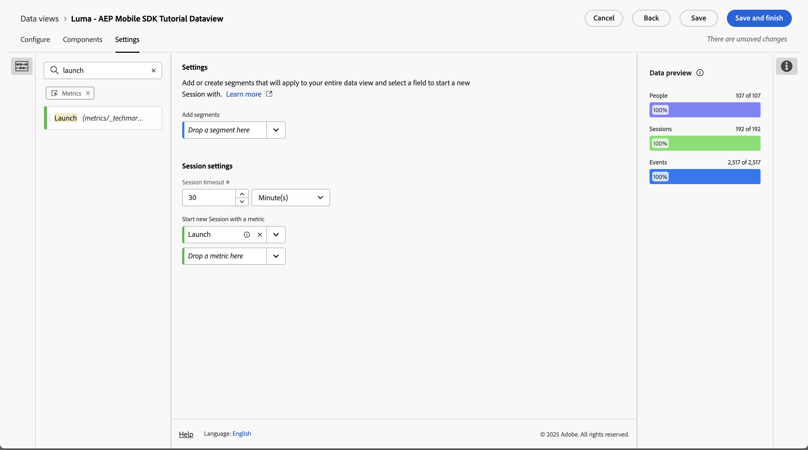

# Paramètres de session {#session-settings}

<!-- markdownlint-disable MD034 -->

>[!CONTEXTUALHELP]
>id="dataview_settings_datapreview"
>title="Prévisualisation des données"
>abstract="Compare les données de cette vue de données aux données de la connexion. Le pourcentage de prévisualisation est basé sur le nombre total dans la connexion des **90 derniers jours**.  Si la prévisualisation ne se charge pas, il se peut que votre connexion soit encore en train de remplir les données."

<!-- markdownlint-enable MD034 -->

<!-- markdownlint-enable MD034 -->

Dans Customer Journey Analytics, vous pouvez définir une session de n’importe quelle façon pour faire correspondre la manière dont les personnes interagissent avec vos expériences numériques. Vous configurez les paramètres de session dans une vue de données.

Les paramètres de session sont non destructeurs et ne modifient pas les données sous-jacentes. Vous pouvez configurer plusieurs vues de données (chacune avec des paramètres de session spécifiques) comme base pour vos projets Workspace.

Pour définir le contexte d’une session dans une vue de données, procédez comme suit :

1. Sélectionnez **[!UICONTROL Vues de données]**, éventuellement dans **[!UICONTROL Gestion des données]**, dans la navigation principale de l’interface d’utilisation de Customer Journey Analytics.

2. Créez une nouvelle vue de données ou modifiez en une existante. Consultez [Créer ou modifier une vue de données](create-dataview.md) pour plus d’informations.

3. Sélectionnez l’onglet **[!UICONTROL Paramètres]**. Sous [!UICONTROL Paramètres de session] :

   1. Saisissez une valeur pour **[!UICONTROL Délai d’expiration de session]** en [!UICONTROL minutes], [!UICONTROL heures], [!UICONTROL jours] ou [!UICONTROL semaines]. Le délai d’expiration de la session détermine la durée pendant laquelle une session peut être inactive (aucun événement ne se produit) avant de démarrer une nouvelle session.

      Appliquez un délai d’expiration de session court (30 minutes, par exemple) si vous souhaitez analyser principalement les interactions en ligne. Vous pouvez, par exemple, analyser si les profils qui visitent les pages produits de votre boutique en ligne ajoutent des articles à leur panier ou s’ils effectuent des achats en ligne.

      Appliquez un long délai d’expiration de session (3 mois, par exemple) si vous combinez des données en ligne et hors ligne et souhaitez analyser si les clientes et les clients qui ont acheté un ou plusieurs produits ont appelé votre service clientèle dans les trois premiers mois suivant leur achat.

   2. Sélectionnez une mesure dans la liste **[!UICONTROL Déposer une mesure ici]** liste sous **[!UICONTROL Démarrer une nouvelle session avec une mesure]**. Vous pouvez également faire glisser et déposer une mesure à partir du volet de gauche sur le **[!UICONTROL champ Déposer une mesure]**. La mesure sélectionnée définit le début d’une nouvelle session. Vous pouvez définir plusieurs mesures.

      Vous pouvez utiliser n’importe quel type de mesure pour définir une nouvelle session. Par exemple, imaginez que vous souhaitiez définir une nouvelle session chaque fois qu’un profil lance votre application mobile. Dans **[!UICONTROL Vue de données]** > **[!UICONTROL Composants]**, définissez un composant de type mesure, nommé **[!UICONTROL Launch]**, en fonction d’un champ de schéma **[!UICONTROL appInteraction]** **[!UICONTROL Name]**. Vous spécifiez en outre le composant de mesure **[!UICONTROL Launch]** pour ne comptabiliser la valeur que lorsque la valeur correspond à `launch`.

      

      Ensuite, effectuez un glisser-déposer ou sélectionnez la mesure **[!UICONTROL Lancement]** pour définir une nouvelle session.

      

4. Sélectionnez **[!UICONTROL Enregistrer]** ou **[!UICONTROL Enregistrer et terminer]** pour enregistrer les paramètres de session.
