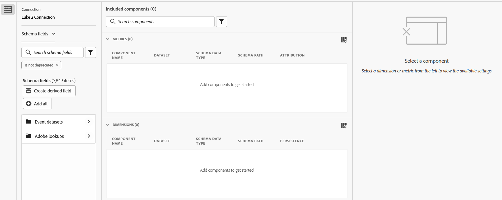

# Éditeur de composant partagé

L’éditeur de composant partagé vous permet de créer ou de modifier des dimensions et des mesures partagées. Il partage de nombreux éléments d’interface utilisateur lors de la [création ou modification d’une vue de données](/help/data-views/create-dataview.md), mais ces interfaces ont des objectifs distincts :

* L’éditeur de composant de vue de données vous permet de créer et de modifier des composants spécifiques à cette vue de données. Vous ne pouvez pas modifier les dimensions ou mesures partagées dans l’éditeur de composant de vue de données. Dans cette interface, les dimensions et mesures partagées peuvent être identifiées par une icône  en regard du nom du composant.
* L’éditeur de composant partagé vous permet de créer et de modifier des dimensions et des mesures partagées. Vous ne pouvez pas modifier les composants qui appartiennent à une seule vue de données dans l’éditeur de composants partagés.

Le coin supérieur droit comprend trois boutons :

* **[!UICONTROL Fermer]** ou **[!UICONTROL Annuler]** : si toutes les modifications sont enregistrées, le bouton **[!UICONTROL Fermer]** ferme l’éditeur. Si des modifications ne sont pas enregistrées, le bouton **[!UICONTROL Annuler]** ferme l’éditeur sans enregistrer ces modifications.
* **[!UICONTROL Enregistrer]** : enregistre tous les composants et conserve l’éditeur ouvert.
* **[!UICONTROL Enregistrer et terminer]** : enregistre tous les composants et ferme l’éditeur.

L’interface comprend trois colonnes/sections principales :

* **Sélecteur de champ de schéma** : recherchez le ou les champs de schéma souhaités et faites-les glisser vers la zone des composants inclus.
   * **Connexion** : connexion active. Modifiez la connexion active dans le [gestionnaire des mesures et dimensions partagées](smd-overview.md).
   * **Liste des composants** : vous pouvez choisir entre sélectionner [!UICONTROL Champs de schéma] (nouvelles dimensions et mesures partagées) ou [!UICONTROL Mesures et dimensions] (composants partagés existants) dans le menu déroulant.
   * **Rechercher** : utilisez l’icône  pour rechercher du texte dans le champ de schéma souhaité ou le composant partagé par nom. Vous pouvez également utiliser des filtres  pour réduire la liste des composants. Le filtre `Is not deprecated` est actif par défaut.
   * **Créer un champ dérivé** : permet de [créer un champ dérivé](/help/data-views/derived-fields/derived-fields.md).
* **Composants inclus** : composants que vous configurez pour être partagés. Lors de la création de composants partagés, vous pouvez faire glisser plusieurs champs de schéma vers cette zone pour créer plusieurs composants simultanément. Lors de la modification des composants partagés, vous pouvez sélectionner plusieurs composants à modifier, ce qui répertorie tous les composants sélectionnés dans cette zone.
* **Paramètres des composants** : lors de la sélection d’un composant dans la zone des composants inclus, tous les paramètres disponibles peuvent être configurés dans cette colonne. Voir [Paramètres des composants](/help/data-views/component-settings/overview.md) pour connaître toutes les options disponibles pour les dimensions et les mesures. Maj + clic sur plusieurs éléments dans la zone des composants inclus vous permet de modifier simultanément n’importe quel champ commun.
