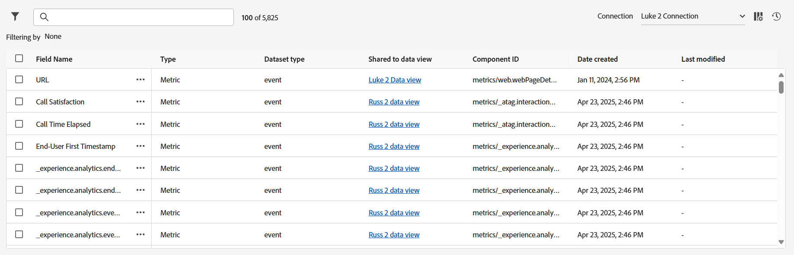

# Mesures et dimensions partagées - Aperçu

Les mesures et dimensions partagées fournissent un emplacement central pour gérer les dimensions et mesures qui peuvent être utilisées dans un certain nombre de vues de données. Ces composants sont particulièrement utiles aux organisations qui utilisent plusieurs vues de données, en particulier si ces vues de données partagent des paramètres de composant communs. Les modifications apportées aux mesures et dimensions partagées s’appliquent instantanément à toutes les vues de données avec lesquelles elles sont partagées. Lors de la modification d’une vue de données individuelle, les dimensions et mesures partagées peuvent être identifiées par une icône  en regard du nom du composant.

Bien que les dimensions et mesures partagées permettent d’utiliser des composants communs dans de nombreuses vues de données, elles ne peuvent pas être partagées entre connexions.

## Processus

La plupart des entreprises utilisent le workflow global suivant pour dédupliquer et gérer les dimensions et les mesures au fil du temps :

1. Importez les composants de chaque vue de données qui peuvent être partagés dans plusieurs vues de données. Si la même dimension ou mesure existe dans plusieurs vues de données, Adobe recommande d’importer toutes les instances de ce composant. Bien que cette bonne pratique consiste à importer les doublons, ils sont importés afin qu’ils puissent être dédupliqués et conserver leurs références respectives aux projets Workspace.
1. Passez en revue tous les composants qui utilisent le même ID de composant mais des paramètres de composant différents. Pour chaque groupe de composants en double, sélectionnez les paramètres de composant souhaités à appliquer à tous les autres composants qui partagent cet identifiant de composant.
1. Passez en revue tous les composants qui utilisent le même ID de composant et qui ont également les mêmes paramètres de composant. Ces dimensions ou mesures peuvent être fusionnées facilement et en toute sécurité.

## Gestionnaire [!UICONTROL Mesures et dimensions partagées]

**[!UICONTROL Customer Journey Analytics]** > **[!UICONTROL Vues de données]** > **[!UICONTROL Mesures et dimensions partagées]**

Accéder à cette interface utilisateur affiche toutes les dimensions et mesures actuelles qui peuvent être partagées dans plusieurs vues de données. Le coin supérieur droit contient deux boutons permettant d’ajouter des composants à cette interface :

* **[!UICONTROL Importer]** : ouvre une fenêtre modale permettant de sélectionner une vue de données, puis de sélectionner les composants à partager.
* **[!UICONTROL Créer]** : ouvre l’[éditeur de composant partagé](shared-component-editor.md).

Directement au-dessous de ces deux boutons, quatre cartes de présentation sont visibles :

* **Mesures** : nombre total de mesures disponibles à partager dans les vues de données pour cette connexion. Chaque connexion peut contenir jusqu’à 10 000 mesures partagées.
* **Dimensions** : nombre total de dimensions disponibles pour être partagées entre les vues de données pour cette connexion. Chaque connexion peut contenir jusqu’à 10 000 dimensions partagées.
* **Dupliquer les composants à vérifier** : lors de l’importation de composants dans plusieurs vues de données, certaines dimensions ou mesures peuvent partager le même identifiant de composant. Le nombre de cette carte d’aperçu indique le nombre total de composants qui ont le même ID de composant, mais des paramètres de composant différents. Sélectionner **[!UICONTROL Réviser]** permet d’activer un filtre qui sélectionne le composant souhaité afin qu’il agisse comme une source de vérité pour tous les autres composants portant le même identifiant.
* **Composants disponibles à fusionner** : si une dimension ou une mesure partage le même ID de composant et les mêmes paramètres de composant, ils sont identiques et sont prêts à être dédupliqués. Sélectionner **[!UICONTROL Réviser]** permet d’obtenir un filtre qui vous permet de fusionner tous les composants portant le même ID de composant en une dimension ou mesure partagée unique.

Toutes les dimensions et mesures partagées sont affichées sous les quatre cartes d’aperçu.

* **Filtrer** : sélectionnez l’icône  pour afficher ou masquer les filtres disponibles. Les filtres suivants sont disponibles :
   * **[!UICONTROL Type de composant]** : affichez uniquement les dimensions ou uniquement les mesures.
   * **[!UICONTROL Jeu de données]** : affichez uniquement les composants où le jeu de données est inclus dans les vues de données avec lesquelles un composant est partagé.
   * **[!UICONTROL Vue de données]** : affichez uniquement les composants partagés avec cette vue de données.
   * **[!UICONTROL Créé par]** : affiche uniquement les composants créés par un utilisateur donné.
   * **[!UICONTROL Doublons]** : affichez uniquement les composants ayant le même ID de composant qu’un autre composant. Ces filtres sont identiques à la révision des composants à l’aide des cartes de présentation.
* **Rechercher** : utilisez l’icône  pour rechercher un composant par nom.
* **[!UICONTROL Connexion]** : menu déroulant qui modifie la [connexion](/help/connections/overview.md). Les dimensions et mesures partagées sont toujours spécifiques à une seule connexion.
* **[!UICONTROL Personnaliser le tableau]** : sélectionnez l’icône  pour afficher ou masquer les colonnes du tableau. Les options disponibles sont les suivantes :
   * **[!UICONTROL Nom du champ]** : le nom de la dimension ou de la mesure partagée. Ce champ est toujours visible.
   * **[!UICONTROL Type]** : indique si le composant est une dimension ou une mesure. Ce champ est toujours visible.
   * **[!UICONTROL Type de jeu de données]** : le type de jeu de données. La plupart des jeux de données sont des jeux de données d’événement.
   * **[!UICONTROL Partagé dans la vue de données]** : toutes les vues de données avec lesquelles ce composant est partagé. Ce champ est toujours visible. Sélectionnez le lien pour ouvrir une boîte de dialogue modale qui répertorie toutes les vues de données dans lesquelles ce composant est disponible.
   * **[!UICONTROL Jeux de données]** : tous les jeux de données inclus dans chaque vue de données avec laquelle ce composant est partagé. Sélectionnez le lien pour ouvrir une boîte de dialogue modale qui répertorie tous les jeux de données pour le composant.
   * **[!UICONTROL Créé par]** : nom de la personne qui a créé ou importé le composant dans l’interface des mesures et dimensions partagées.
   * **[!UICONTROL Type de schéma]** : format dans lequel les données sont stockées. Par exemple, `string`, `double` ou `boolean`.
   * **[!UICONTROL ID du composant]** : ID du composant de la dimension ou de la mesure. Tous les composants qui partagent le même ID de composant dans cette interface doivent être examinés et dédupliqués.
   * **[!UICONTROL Schéma]** : chemin d’accès au schéma pour la dimension ou la mesure. Par exemple : `web.webPageDetails.URL`.
   * **[!UICONTROL Description]** : [description](/help/data-views/component-settings/overview.md) du composant.
   * **[!UICONTROL Libellés de contexte]** : les [libellés de contexte](/help/data-views/component-settings/overview.md) du composant.
   * **[!UICONTROL Inclure/exclure des valeurs]** : répertorie le nombre de règles tel que spécifié sous [Inclure/exclure des valeurs](/help/data-views/component-settings/include-exclude-values.md).
   * **[!UICONTROL Libellés d’utilisation des données]** : [libellés d’utilisation des données](https://experienceleague.adobe.com/fr/docs/experience-platform/data-governance/labels/overview) pour le champ de schéma.
   * **[!UICONTROL Obsolète]** : indique si l’indicateur obsolète est défini.
   * **[!UICONTROL Format]** : format dans lequel les valeurs apparaissent. Les booléens apparaissent généralement sous la forme `True | False`, les mesures apparaissent généralement sous la forme `Decimal`, etc.
   * **[!UICONTROL Déduplication des mesures]** : paramètres [Déduplication des mesures](/help/data-views/component-settings/metric-deduplication.md) du composant.
   * **[!UICONTROL Comportement]** : paramètres [Comportement](/help/data-views/component-settings/behavior.md) du composant.
   * **[!UICONTROL Attribution]** : paramètres [Attribution](/help/data-views/component-settings/attribution.md) du composant.
   * **[!UICONTROL Option Aucune valeur]** : le du composant [Aucune option de valeur](/help/data-views/component-settings/no-value-options.md).
   * **[!UICONTROL Regroupement de valeurs]** : paramètres [Regroupement de valeurs](/help/data-views/component-settings/value-bucketing.md) du composant.
   * **[!UICONTROL Persistance]** : paramètres [Persistance](/help/data-views/component-settings/persistence.md) du composant.
   * **[!UICONTROL Minuscules]** : indique si les minuscules du composant sont activées en fonction des paramètres [Comportement](/help/data-views/component-settings/behavior.md) du composant.
   * **[!UICONTROL Substring]** : paramètres [Substring](/help/data-views/component-settings/substring.md) du composant.
   * **[!UICONTROL Groupe de données de résumé]** : paramètres du [groupe de données de résumé](/help/data-views/component-settings/summary-data-group.md) du composant.
   * **[!UICONTROL Date de création]** : date à laquelle le composant a été créé ou importé.
   * **[!UICONTROL Dernière modification]** : si le composant a été modifié après sa création, date de sa dernière modification.
* **[!UICONTROL Historique des tâches]** : sélectionnez l’icône  pour ouvrir une fenêtre modale qui affiche toutes les instances d’importation de dimensions et de mesures à partir de vues de données individuelles.

## Modifier des composants ou partager des composants avec des vues de données

Utilisez la case à cocher en regard d’un composant pour afficher toutes les actions disponibles que vous pouvez effectuer. Plusieurs sélections sont prises en charge.

*  **[!UICONTROL Modifier]** : ouvrez les dimensions et mesures sélectionnées dans l’[éditeur de composants partagé](shared-component-editor.md) qui vous permet d’ajuster leurs [paramètres des composants](/help/data-views/component-settings/overview.md). Lorsque vous sélectionnez plusieurs composants à modifier, ils sont tous ouverts dans l’éditeur de composants. Vous pouvez déplacer les composants tout en cliquant dessus dans l’éditeur de composants afin de modifier le même champ pour plusieurs composants.
*  **[!UICONTROL Partager sur la ou les vues de données)]** : ouvre une fenêtre qui affiche toutes les vues de données disponibles dans la connexion sélectionnée. Cochez la case de chaque vue de données dans laquelle vous souhaitez rendre ce composant disponible, puis sélectionnez **[!UICONTROL Partager]**.
*  **[!UICONTROL Ne pas partager de la/des vue(s) de données]** : ouvre une fenêtre qui affiche toutes les vues de données avec lesquelles ce composant est actuellement partagé. Cochez la case de chaque vue de données à partir de laquelle vous souhaitez supprimer la disponibilité de ce composant, puis sélectionnez **[!UICONTROL Ne pas partager]**.
*  **[!UICONTROL Dupliquer]** : crée une copie du ou des composants sélectionnés. Un nouvel identifiant de composant est généré pour les composants dupliqués.
*  **[!UICONTROL Supprimer]** : supprime les composants sélectionnés de l’interface. Si les composants sélectionnés sont partagés avec n’importe quelle vue de données, ils ne sont pas partagés.
