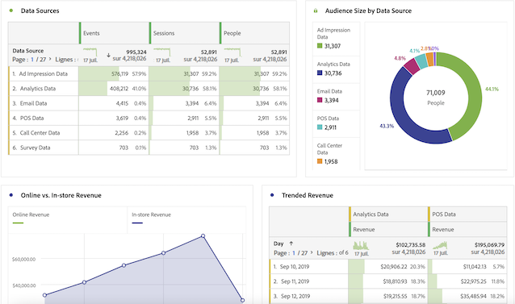
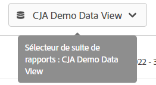

# Guide de l’utilisateur CJA pour les utilisateurs d’Adobe Analytics

Si votre entreprise commence à utiliser Customer Journey Analytics (CJA), vous remarquerez peut-être des similitudes et des différences entre Analytics traditionnel et CJA. Cette page vise à expliquer ces différences afin d’aider votre entreprise à s’adapter au nouveau processus de mise en oeuvre et de création de rapports. Cette page fournit également des ressources supplémentaires sur les nouveaux concepts et d’autres étapes pour faciliter et améliorer votre parcours d’analyste.

Plusieurs fonctionnalités de CJA ont été renommées et reconçues afin de s’aligner sur les normes de l’industrie. La terminologie mise à jour inclut les segments, les suites de rapports virtuelles, les classifications, les attributs du client et les noms des conteneurs. Les limites des eVars et des props n’existent plus, au profit des dimensions et mesures personnalisées flexibles.

## Ce qui n’a pas changé

La plupart de ce que vous connaissez du côté du reporting n&#39;a pas changé.

* Vous pouvez toujours utiliser la puissance de [Analysis Workspace](/help/analysis-workspace/home.md) pour analyser vos données. Workspace fonctionne de la même manière que dans Adobe Analytics traditionnel.
* La même version de [Tableaux de bord Adobe Analytics](/help/mobile-app/home.md) est disponible et fonctionne de la même manière entre CJA et Analytics traditionnel.
* [Report Builder](/help/report-builder/report-buider-overview.md) dispose d’une nouvelle interface et s’exécute sous MS Windows, iOS et la version web d’Excel. (Avant cette version de Report Builder, vous ne pouviez pas l’utiliser dans Mac si vous ne l’utilisiez pas sur VMware.) Cette version ne prend pas encore en charge la demande de données AA traditionnelle.

## Modifications des rapports

Vous avez accès à beaucoup plus de données cross-canal à analyser. Par exemple, vous pouvez créer un projet Workspace qui analyse les performances de plusieurs canaux, à condition que ces jeux de données soient ingérés par votre organisation et inclus dans les vues de données utilisées par CJA (voir &quot;Modifications de l’architecture de données&quot; ci-dessous).

## Modifications de l’architecture des données {#architecture}

CJA récupère ses données de Adobe Experience Platform. Experience Platform vous permet de centraliser et de normaliser les données et le contenu des clients à partir de n’importe quel système ou canal, et d’appliquer la science des données et l’apprentissage automatique afin d’améliorer la conception et la diffusion d’expériences personnalisées.

Les données client de l’Experience Platform sont stockées sous la forme de jeux de données, qui se composent d’un schéma et de lots de données. Pour plus d’informations sur la plate-forme, voir [Présentation de l’architecture de la plate-forme Adobe Experience Platform](https://experienceleague.adobe.com/docs/platform-learn/tutorials/intro-to-platform/basic-architecture.html?lang=en).

Votre administrateur CJA établit [connexions](/help/connections/create-connection.md) aux jeux de données dans Experience Platform. Ils construisent ensuite [vues de données](/help/data-views/data-views.md) en utilisant ces connexions. Les vues de données sont conceptuellement similaires aux suites de rapports virtuelles et constituent la base des rapports dans CJA. Comme les sources Experience Platform contiennent toutes les données pour la création de rapports, les suites de rapports n’existent plus en tant que conteneur pour les données.

Une connexion permet à votre administrateur Analytics d’intégrer des jeux de données de Adobe Experience Platform dans CJA, inclus dans la vidéo suivante :

>[!VIDEO](https://video.tv.adobe.com/v/35111/?quality=12)

Adobe propose plusieurs méthodes pour importer des données dans Adobe Experience Platform, notamment des données de suite de rapports par le biais du connecteur source Adobe Analytics ou du SDK Web. Les implémentations existantes de plusieurs suites de rapports peuvent être combinées dans Experience Platform. Les connexions et les vues de données basées sur ces jeux de données peuvent combiner des données qui existaient auparavant dans des suites de rapports distinctes.

## Modifications du concept des suites de rapports virtuelles {#data-views}

[!UICONTROL Vues des données] prenez le concept de suites de rapports virtuelles telles qu’elles existent aujourd’hui et développez-le en pour [activer des contrôles supplémentaires sur les données ;](/help/data-views/create-dataview.md) rendu disponible par les connexions. Ces modifications rendent les paramètres généraux tels que le fuseau horaire et les intervalles de délai d’expiration de session configurables et rétroactifs. Les paramètres de variable individuels tels que l’attribution et l’expiration peuvent également être personnalisés au niveau d’un rapport ou d’une vue de données. Ces paramètres sont non destructifs et rétroactifs.

Le sélecteur de suite de rapports situé en haut à droite vous permet désormais de choisir parmi les vues de données disponibles :

Voir [Cas pratiques des vues de données](/help/data-views/data-views-usecases.md) pour plus d’informations sur ce concept.

## Modifications du concept des eVars et des props

Les concepts de [!UICONTROL eVars], [!UICONTROL props], et [!UICONTROL events] dans l’Adobe Analytics classique n’existe plus dans [!UICONTROL Customer Journey Analytics]. Un nombre illimité d’éléments de schéma sont disponibles, y compris les dimensions, les mesures et les champs de liste. Ils sont mappés à un nombre illimité d’éléments de schéma, y compris des dimensions, des mesures et des champs de liste dans Experience Platform. Tous les paramètres de visite et d’attribution appliqués après les règles de traitement dans Adobe Analytics s’appliquent désormais au moment de la requête dans Customer Journey Analytics.

## Modifications du concept de segments

Adobe a renommé le composant &quot;segments&quot; en &quot;filtres&quot; afin de mieux s’aligner sur les normes du secteur et d’offrir une meilleure distinction avec les segments dans Adobe Experience Platform.

[!UICONTROL Customer Journey Analytics] n’utilise plus d’eVars, de props ou d’événements et utilise à la place le nom du champ de schéma Experience Platform auquel ils ont été mappés. Cette modification signifie qu’aucun des segments existants dans Adobe Analytics n’est compatible avec [!UICONTROL Customer Journey Analytics]. Si vous souhaitez déplacer des segments Adobe Analytics existants vers Customer Journey Analytics, regardez la vidéo suivante :

>[!VIDEO](https://video.tv.adobe.com/v/31982/?quality=12)

Bien que vous ne puissiez pas encore partager ou publier [!UICONTROL filtres] ([!UICONTROL segments]) de [!DNL Customer Journey Analytics] pour Experience Platform Unified Profile, cette fonctionnalité est en cours de développement.

Outre le concept de modification de segments, les conteneurs de segments sont également mis à jour.

* **Les conteneurs d’accès sont désormais des conteneurs &quot;Événement&quot;.**. Le conteneur [!UICONTROL Personne] inclut chaque session et événement pour les visiteurs au cours dʼune période indiquée.
* **Les conteneurs Visite sont désormais des conteneurs &quot;Session&quot;.**. Le conteneur [!UICONTROL Session] permet dʼidentifier les interactions de pages, les campagnes ou les conversions pour une session spécifique.
* **Les conteneurs Visiteur sont désormais [!UICONTROL Personne] conteneurs**. Le conteneur [!UICONTROL Personne] inclut chaque session et événement pour les visiteurs au cours dʼune période indiquée.

## Modifications du concept des mesures calculées

Les mesures calculées portent un nom similaire entre Analytics traditionnel et CJA. Cependant, [!UICONTROL Customer Journey Analytics] n’utilise plus d’eVars, de props ou d’événements et utilise à la place n’importe quel élément de schéma Experience Platform. Cette modification fondamentale signifie qu’aucune des mesures calculées existantes n’est compatible avec [!UICONTROL Customer Journey Analytics]. Si vous souhaitez déplacer des mesures calculées Adobe Analytics vers Customer Journey Analytics, regardez la vidéo suivante :

>[!VIDEO](https://video.tv.adobe.com/v/31788/?quality=12)

## Modifications des paramètres d’attribution et d’expiration des variables

[!UICONTROL Customer Journey Analytics] applique tous les paramètres de variable, y compris l’attribution et l’expiration, au moment du rapport. Ces paramètres résident désormais dans [vues de données](/help/data-views/component-settings/persistence.md)et certains paramètres de variable (comme l’attribution) peuvent être modifiés dans les projets Workspace.

Vous pouvez avoir plusieurs versions de la même variable dans la même vue de données. Par exemple, vous pouvez avoir une dimension Code de suivi qui expire au bout de 30 jours, et une autre qui expire à la fin d’une session. Ces deux dimensions du code de suivi utilisent les mêmes données source, mais des paramètres d’attribution différents.

Vous pouvez également avoir plusieurs vues de données basées sur la même connexion. Par exemple, vous pouvez avoir une vue de données avec un délai d’expiration de session de 30 minutes et une autre avec un délai d’expiration de session de 15 minutes. Les deux vues de données s’affichent dans le sélecteur supérieur droit afin que vous puissiez facilement passer d’une vue à l’autre.

## Modifications du concept de classifications

Les &quot;classifications&quot; sont désormais appelées &quot;jeux de données de recherche&quot;. Les jeux de données de recherche sont utilisés pour rechercher des valeurs ou des clés trouvées dans vos données d’événement ou de profil. Vous pouvez, par exemple, transférer des données de recherche qui font correspondre les identifiants numériques de vos données d’événement aux noms de produits. Voir [Ajout de données au niveau du compte en tant que jeu de données de recherche](/help/use-cases/b2b.md) pour un exemple de cas d’utilisation.

## Modifications du concept des attributs du client

Les &quot;attributs du client&quot; sont désormais appelés &quot;jeux de données de profil&quot;. Les jeux de données de profil contiennent des données appliquées à vos visiteurs, utilisateurs ou clients dans la variable [!UICONTROL Événement] data. Il vous permet, par exemple, de transférer des données CRM sur vos clients. Vous pouvez sélectionner l’ID de personne à inclure. Chaque jeu de données défini dans [!DNL Experience Platform] a son propre jeu d’un ou de plusieurs ID de personne définis.

## Modifications apportées à la manière dont Adobe identifie les visiteurs

CJA développe les concepts d’identités au-delà des ECID afin d’inclure n’importe quel ID que vous souhaitez utiliser, y compris l’ID de client, l’ID de cookie, l’ID regroupé, l’ID utilisateur, le code de suivi, etc. Utilisation d’un identifiant d’espace de noms commun à tous les jeux de données ou utilisation [Analyse cross-canal](/help/connections/cca/overview.md) permet de lier des personnes à différents jeux de données. Tout utilisateur configurant un projet Workspace dans CJA doit comprendre les identifiants utilisés dans les jeux de données. Consultez la vidéo suivante qui présente l’utilisation des identités en Customer Journey Analytics :

>[!VIDEO](https://video.tv.adobe.com/v/30750/?quality=12)

## Modifications du concept d’élément de dimension à faible trafic

Dans Adobe Analytics traditionnel, une variable qui reçoit trop de valeurs uniques commence à regrouper les éléments de dimension sous [!UICONTROL Faible trafic]. CJA présente de nombreuses limites aux champs de cardinalité élevée. Les modifications apportées à l’architecture des rapports permettent à Analysis Workspace de créer des rapports sur de nombreux autres éléments de dimension uniques. Voir [Long Tail](../analysis-workspace/workspace-faq/long-tail.md) pour plus d’informations sur la manière dont CJA optimise les rapports pour les dimensions comportant de nombreuses valeurs uniques.
