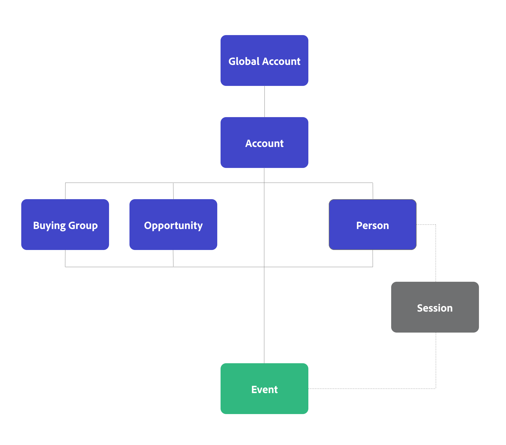

# Concepts et fonctions de B2B edition

Cet article explique des concepts tels que les connexions, les identifiants, les conteneurs et les jeux de données, généralement utilisés dans Customer Journey Analytics. et comment le B2B edition Customer Journey Analytics ajoute des fonctions supplémentaires à ces concepts.

## Connexions et identifiants

Dans Customer Journey Analytics, vous sélectionnez un identifiant commun, appelé ID de personne, pour connecter vos données d’événement à d’autres jeux de données tels que le jeu de données de profil et les jeux de données de recherche. Ce type de connexion est connu sous le nom de connexion basée sur la personne, qui facilite la création de rapports et l’analyse basés sur la personne.

Dans Customer Journey Analytics B2B edition, vous pouvez choisir entre une connexion basée sur une personne ou une connexion basée sur un compte. Une connexion basée sur un compte facilite la création de rapports et l’analyse basée sur un compte.

* Pour une connexion basée sur une personne, sélectionnez Personne comme identifiant principal. Vous pouvez ensuite configurer vos projets de connexion, de vue de données et d’espace de travail pour les rapports basés sur les personnes.
* Pour une connexion basée sur un compte, sélectionnez Compte comme identifiant principal. Vous pouvez ensuite éventuellement ajouter des conteneurs supplémentaires pour le compte global, le groupe d’achats et l’opportunité. Que vous ajoutiez ou non un compte global, votre identifiant principal est un identifiant de compte ou un identifiant de compte global.

## Conteneurs

Dans Customer Journey Analytics, les conteneurs sont générés dans le cadre de la configuration d’une connexion et d’une vue de données et fournissent la structure et la portée des données. Les conteneurs stockent des groupes d’identifiants pour séquencer tous les horodatages d’événement par des identifiants uniques. Ce stockage facilite l’exécution rapide et performante des fonctionnalités telles que la segmentation, l’attribution et les visualisations.

### Conteneurs standard

Customer Journey Analytics repose sur le concept de trois conteneurs : Personne, Session et Événement. Lors d’une configuration, ces conteneurs sont générés implicitement.

Vous pouvez redéfinir la manière dont ces conteneurs sont nommés lorsque vous configurez une vue de données, mais la hiérarchie et les relations entre les conteneurs sont prédéterminées. Le conteneur Session est généré en fonction de la manière dont vous définissez une session dans le [Paramètres de session](/help/data-views/session-settings.md) dans votre vue de données.

{zoomable="yes"}

### Conteneurs B2B

Dans Customer Journey Analytics B2B edition, un conteneur Compte est ajouté à la liste des conteneurs générés. Vous avez également la possibilité de configurer la génération de conteneurs supplémentaires, tels que Compte global, Groupe d’achats et Opportunité.

La hiérarchie et les relations entre les conteneurs sont prédéterminées. L’opportunité, le groupe d’achats et la personne sont tous des conteneurs frères du conteneur Compte . Dans cette hiérarchie, le conteneur de sessions entre le conteneur de personnes et le conteneur d’événements est généré en fonction de la manière dont vous définissez une session dans les [Paramètres de session](/help/data-views/session-settings.md) dans votre vue de données. D’autres conteneurs de sessions, par exemple entre le conteneur Compte et le conteneur Événement , ne sont actuellement pas générés et pris en charge. Consultez le tableau ci-dessous pour une description et une utilisation de base des conteneurs B2B.

{zoomable="yes"}

| Conteneur B2B | Description Cas d’utilisation de base |
|---|---|
| Compte | Une entreprise qui est un client ou un client potentiel de votre entreprise. L&#39;entreprise peut être une filiale ou une division d&#39;une organisation plus grande. Le compte représente l&#39;organisation à laquelle vous vendez et que vous souhaitez suivre au niveau de cette organisation. |
| Compte global (facultatif) | Société mère principale d&#39;un groupe de sociétés liées. Un compte global n&#39;a pas de société mère, mais peut avoir des filiales ou des divisions appartenant au compte global. Lorsque le conteneur Compte global est configuré dans votre connexion, un compte qui n’a pas de parent ou de filiale doit être répertorié dans les champs Compte et Compte global . |
| Opportunité (facultatif) | Ensemble de produits et de services qui sont vendus ensemble. Une opportunité impliquait souvent différentes étapes du cycle de vente jusqu&#39;à la clôture de la vente. Vous utiliseriez les données pour mesurer la progression de l’opportunité via le funnel de ventes. Par exemple, un rapport qui fournit des détails sur les principales opportunités qui sont passées de l’étape 3 à l’étape 4. |
| Groupe d&#39;achat (facultatif) | Ensemble de personnes au sein d’une organisation qui participent au processus de prise de décision pour l’achat d’un produit ou d’un service.  Vous pouvez utiliser les données des groupes d&#39;achats pour effectuer le suivi des groupes d&#39;achats via la gestion de campagnes. Par exemple, créez un segment d’audience de groupes d’achats clés.  Vous souhaitez très probablement effectuer une recherche à partir du groupe d&#39;achat dans les données de profil, afin de pouvoir créer des rapports sur les personnes d&#39;un groupe d&#39;achat. |
| Personne | Personne, souvent identifiée par une adresse e-mail unique, qui a interagi avec l’entreprise.  Vous pouvez utiliser les données de profil pour identifier les personnes qui travaillent pour un compte. Par exemple : ciblez toutes les personnes d’un compte qui se sont inscrites à une conférence. |

>[!IMPORTANT]
>
>* Si vous avez **activé** le conteneur Compte global dans une connexion basée sur un compte, chaque enregistrement de vos jeux de données d’événement doit contenir un identifiant de compte et un identifiant de compte global. Dans le cas contraire, l’enregistrement est ignoré.
>* Si vous n’avez **pas activé** le conteneur Compte global dans une connexion basée sur un compte, chaque enregistrement de vos jeux de données d’événement doit contenir un identifiant de compte. Dans le cas contraire, l’enregistrement est ignoré.

Vous pouvez utiliser les conteneurs B2B pour des fonctionnalités B2B spécifiques dans Analysis Workspace :

* **Segmentation** : les conteneurs de segments [B2B](/help/components/segments/seg-overview.md#b2b-containers) vous permettent de créer des segments avec une portée de conteneur allant au-delà des personnes, des sessions ou des événements. Par exemple : un segment Comptes avec enregistrement d’événement ou un segment Comptes américains avec groupes d’achats et opportunités d’étape 5 .

  >[!NOTE]
  >
  >Les données d’événement B2B dans une configuration basée sur un compte dans Customer Journey Analytics B2B edition peuvent contenir des lignes de données sans personne ni session. Par exemple : une ligne qui détaille la progression de l’étape d’opportunité. Lorsque vous évaluez votre segment, gardez à l’esprit que les personnes et les sessions peuvent ne plus être les bons critères.
  >

* **Attribution** : vous pouvez utiliser les nouveaux conteneurs B2B dans [panneau d’attribution](/help/analysis-workspace/c-panels/attribution.md), dans [paramètres des composants d’attribution](/help/data-views/component-settings/attribution.md), dans [mesures calculées](/help/components/calc-metrics/cm-workflow/m-metric-type-alloc.md) ou dans [colonnes d’un tableau à structure libre](/help/analysis-workspace/visualizations/freeform-table/column-row-settings/column-settings.md). Les recherches en amont de comptes sont étendues à 13 mois.

* **Visualisations** : les visualisations [Abandon](/help/analysis-workspace/visualizations/fallout/fallout-flow.md), [Flux](/help/analysis-workspace/visualizations/c-flow/flow.md), [Zone de travail de Parcours ](/help/analysis-workspace/visualizations/journey-canvas/journey-canvas.md) et [Tableau de cohorte](/help/analysis-workspace/visualizations/cohort-table/cohort-analysis.md) prennent en charge les nouveaux conteneurs B2B. Par exemple : vous pouvez utiliser les nouveaux conteneurs pour comprendre comment les groupes d’achats consomment du contenu ou comment les cohortes d’opportunités se rapprochent de la conclusion d’une vente.
Vous pouvez également définir le conteneur par défaut pour ces visualisations dans les [préférences utilisateur](/help/analysis-workspace/user-preferences.md#visualizations-preferences).

Les segments, l’attribution et les visualisations ainsi que les conteneurs B2B vous aident à obtenir des analyses et des informations B2B approfondies.

## Jeux de données

Le B2B de Customer Journey Analytics fait la distinction entre les types de données et les jeux de données suivants.

| Type de données | Série temporelle | Enregistrements de conteneur | Enregistrements de champ |
|---|---|---|---|
| **Jeux de données** | **Jeux de données d’événements**  Par exemple :<ul><li>Analyse numérique</li><li>Événements CRM</li><li>Événements en personne</li><li>Données du centre d’appels</li></ul> | **Jeux de données de profil**  Par exemple :<ul><li>Enregistrements CRM</li><li>Enregistrements B2B AJO</li><li>Enregistrements CDP</li><ul> | **Classifications**  Par exemple :<ul><li>Enregistrements de campagne</li><li>Enregistrements de listes marketing</li><li>Métadonnées de contenu</li><li>Enregistrements de produit</li></ul> |
| Exigences | **Horodatage**  Chaque enregistrement nécessite :<ul><li>ID de compte</li><li>Identifiant de compte global (facultatif)</li></ul> | **Identifiant de compte**  Les enregistrements ont besoin d&#39;un identifiant de conteneur, comme :<ul><li>Compte</li><li>Personne</li><li>Opportunité</li><li>Groupe d’achat</li></ul> | **Clé correspondante**  Les enregistrements ont besoin d&#39;un identifiant contenu dans un conteneur ou un jeu de données d&#39;événement, comme :<ul><li>ID de campagne</li><li>Identifiant de contenu</li><li>ID de produit</li></ul> |

{style="table-layout:fixed"}

Exemple de connexion basée sur un compte dans Customer Journey Analytics B2B edition :

Customer Journey Analytics B2B edition propose l’interface [Carte des connexions](/help/connections/create-connection.md#connection-map) pour vous donner un aperçu des relations entre les jeux de données dans votre connexion.

Tout comme Customer Journey Analytics, les données de série temporelle basées sur un événement sont au cœur de Customer Journey Analytics B2B edition. La principale différence pour une connexion basée sur un compte est que vous avez besoin d’un identifiant de compte sur chaque enregistrement de votre jeu de données d’événement au lieu d’un identifiant de personne.

Lorsque vous configurez les [paramètres des jeux de données](/help/connections/create-connection.md#dataset-settings) pour la connexion basée sur le compte dans Customer Journey Analytics B2B edition, les options disponibles pour certains des paramètres dépendent du [type de jeu de données](/help/connections/create-connection.md#dataset-types). Par exemple, vous devez :

* Spécifiez des identifiants pour chacun des conteneurs que vous avez configurés pour vos jeux de données d’événement.
* Définissez un champ de compte ou un champ de compte global pour vos jeux de données de profil.
* Définissez des clés et comment faire correspondre ces clés (par conteneur de champs) pour les jeux de données de recherche.

## Correspondance par conteneur ou champ

Vous pouvez définir pour chaque jeu de données de recherche, si vous appariez au jeu de données par champ ou par conteneur.

### Correspondance par conteneur

Si un jeu de données d’enregistrement utilise une correspondance par conteneur, le jeu de données d’enregistrement est traité comme un type de jeu de données de profil et comme un jeu de données de profil dans l’interface utilisateur. Utilisez la correspondance par conteneur sur les jeux de données qui contiennent des enregistrements de conteneur et qui prennent en charge vos conteneurs configurés. Par exemple, un jeu de données Groupe d’achats.

### Correspondance par champ

Si un jeu de données d’enregistrement utilise une correspondance par champ, le jeu de données d’enregistrement est traité comme un type de jeu de données de recherche et comme un jeu de données de recherche dans l’interface utilisateur. Utilisez le champ Correspondance par sur les jeux de données qui contiennent des détails de classification supplémentaires par le biais de la recherche. Par exemple, un jeu de données Membre de la liste marketing ou Détails du produit .

## Rapport sur les données basées sur les personnes et les comptes

Si vous souhaitez créer des rapports sur des conteneurs basés sur des personnes (et des identités de personne) et des conteneurs basés sur des comptes (et des identités de compte), vous devez configurer deux connexions distinctes dans Customer Journey Analytics. Une connexion pour laquelle vous sélectionnez Personne comme ID de Principal et une connexion pour laquelle vous sélectionnez Compte comme ID de Principal. Customer Journey Analytics ne prend pas en charge les rapports basés sur les personnes et les comptes rendus de performances à partir d’une seule hiérarchie de conteneurs.

