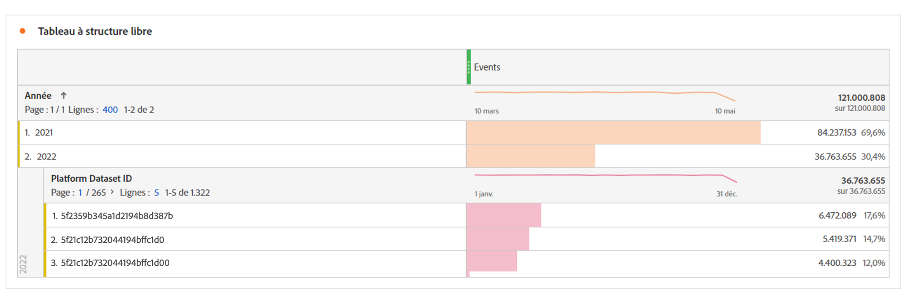

# Questions fréquentes

[!UICONTROL Customer Journey Analytics] est notre produit d’analyse de nouvelle génération. Vous trouverez ci-dessous les réponses aux questions les plus fréquentes sur CJA. Pour plus d’informations, consultez [Support pour les fonctionnalités Customer Journey Analytics](/help/getting-started/cja-aa.md).

## 1. Prérequis {#prerequisites}

| Question | Réponse |
| --- | --- |
| Ai-je besoin d’un [!UICONTROL graphique d’appareil privé] ou d’un [!UICONTROL graphique d’appareil Coop] pour [!UICONTROL Customer Journey Analytics] ? | Non, un [!UICONTROL graphique d’appareil privé] ou d’[!UICONTROL appareil Coop] n’est pas nécessaire pour [!UICONTROL Customer Journey Analytics]. D’ailleurs, ils ne sont pas encore pris en charge. |
| Ai-je besoin d’un [!UICONTROL Experience Cloud ID] (ECID) pour [!UICONTROL Customer Journey Analytics] ? | Non, [!UICONTROL Customer Journey Analytics] prend en charge n’importe quel identifiant dans un jeu de données, qu’il s’agisse d’un [!UICONTROL ECID] ou de tout autre identifiant de votre choix. |
| Que se passe-t-il si jʼai besoin d’utiliser un processus ETL (extraction, transformation, chargement) sur mes données avant de recourir à [!UICONTROL Customer Journey Analytics] ? | Customer Journey Analytics comprend des fonctions de [Préparation de données](https://experienceleague.adobe.com/docs/experience-platform/data-prep/api/overview.html?lang=fr) pour aider à transformer vos données avant de les placer dans le lac de données Adobe Experience Platform. Si vous avez besoin d’ETL après l’ingestion des données, [Adobe Experience Platform Query Service](https://experienceleague.adobe.com/docs/platform-learn/tutorials/queries/understanding-query-service.html?lang=fr#queries) offre certaines options limitées, bien que cela puisse engendrer des frais supplémentaires. |

{style=&quot;table-layout:auto&quot;}

## 2. Assemblage des données (Analyse cross-canal) {#stitching}

| Question | Réponse |
| --- | --- |
| [!UICONTROL Customer Journey Analytics] peut-il « assembler » d’un périphérique ou d’un jeu de données à l’autre ? | Oui. [!UICONTROL Customer Journey Analytics] présente une solution d’assemblage appelée [Analye cross-canal](https://experienceleague.adobe.com/docs/analytics-platform/using/cja-connections/cca/overview.html?lang=fr) (ACC). Elle vous permet de recréer l’identifiant personnel d’un jeu de données, ce qui permet de combiner plusieurs jeux de données de manière transparente. |
| Est-ce que l’assemblage d’un comportement anonyme avec un comportement authentifié est pris en charge ? | Oui. L’[analyse cross-canal](https://experienceleague.adobe.com/docs/analytics-platform/using/cja-connections/cca/overview.html) examine les données utilisateur des sessions authentifiées et non authentifiées afin de générer un identifiant assemblé. |
| Comment fonctionne la « relecture » dans l’ACC ? | L’ACC « relit » les données en fonction des identifiants uniques qu’elle a appris. La relecture entraîne l’assemblage des nouveaux périphériques de la connexion. [En savoir plus](https://experienceleague.adobe.com/docs/analytics-platform/using/cja-connections/cca/replay.html?lang=fr#%C3%A9tape-1-%3A-assemblage-en-direct) |
| Comment l’assemblage de données historiques (renvoi) fonctionne-t-il dans l’ACC ? | Lors de la première utilisation, Adobe fournit un renvoi de données assemblées qui remonte jusquʼau début du mois précédent (jusquʼà 60 jours). Pour effectuer ce renvoi, lʼidentifiant transitoire doit exister dans les données désassemblées à ce moment-là. [En savoir plus](https://experienceleague.adobe.com/docs/analytics-platform/using/cja-connections/cca/overview.html?lang=fr#enable-cross-channel-analytics) |

{style=&quot;table-layout:auto&quot;}

## 3. Transfert de données dans [!UICONTROL Customer Journey Analytics] {#ingest}

| Question | Réponse |
| --- | --- |
| Puis-je combiner des données provenant de différents sandbox [!UICONTROL Adobe Experience Platform] dans une seule connexion [!UICONTROL Customer Journey Analytics] ? | Non, vous ne pouvez pas accéder aux données d’un environnement de test à un autre. Vous pouvez combiner uniquement des jeux de données situés dans le même environnement de test. [En savoir plus](https://experienceleague.adobe.com/docs/analytics-platform/using/cja-connections/create-connection.html?lang=fr#select-sandbox-and-datasets) |
| Comment est-ce que je connecte les données en ligne aux données hors ligne dans [!UICONTROL Customer Journey Analytics] ? | Tant que lʼID de personne correspond dʼun jeu de données à un autre, [!UICONTROL Customer Journey Analytics] peut connecter les filtres, lʼaffectation, le flux, les abandons, etc. d’un jeu de données à un autre. |
| Comment puis-je importer mes données hors ligne dans [!UICONTROL Customer Journey Analytics] ? | Votre droit d’utilisation de Customer Journey Analytics vous permet d’ingérer des données dans Experience Platform. Vous pouvez ensuite créer des connexions à ces données et vues de données dans [!UICONTROL Customer Journey Analytics], pour les rapports dans Analysis Workspace. Si besoin, l’équipe d’intégration des données Experience Platform peut formuler des recommandations ou des conseils à votre endroit. |
| Comment puis-je intégrer des données [!UICONTROL Adobe Analytics] dans [!UICONTROL Customer Journey Analytics] ? | Les données [!UICONTROL Adobe Analytics] peuvent être connectées à Experience Platform par le biais du [Connecteur source Adobe Analytics](https://experienceleague.adobe.com/docs/experience-platform/sources/connectors/adobe-applications/analytics.html?lang=fr). La plupart des champs [!UICONTROL Adobe Analytics] sont transférés au format XDM. Cependant, d’autres champs ne sont pas encore disponibles. |
| Combien de temps faut-il pour assembler des éléments de jeu de données dans une vue de données ? | Quelques heures pour commencer, puis quelques jours pour renvoyer les 13 derniers mois de données. |
| Est-il nécessaire d’apporter des données personnelles identifiables pour établir des connexions entre les données ? | Non, vous pouvez utiliser n’importe quel ID, y compris le hachage d’un ID client, qui n’est pas une donnée personnelle identifiable. |
| Quelles sont les limites en matière dʼingestion de dates/horodatages passés ou futurs dans les jeux de données dʼévénement CJA ? | <ul><li>Concernant les dates/horodatages passés : les données dʼévénement datant de 10 ans maximum.</li><li>Concernant les dates/horodatages futurs : les données dʼévénement (prédictives) jusquʼà 1 mois dans le futur.</li></ul> |

{style=&quot;table-layout:auto&quot;}

## 4. Considérations relatives à la latence {#latency}

>[!NOTE]
>Il nʼexiste pas de taille de données fixe dans CJA, par conséquent Adobe ne peut pas proposer de temps dʼingestion standard. Nous nous efforçons de réduire ces latences grâce à de nouvelles mises à jour et à lʼoptimisation de lʼingestion.

| Question | Réponse |
| --- | --- |
| Quelle est la latence attendue pour [!UICONTROL Customer Journey Analytics] sur [!UICONTROL Adobe Experience Platform] ? | <ul><li>Données ou événements dynamiques : traitement et ingestion en 90 minutes, une fois les données disponibles dans AEP. (Taille du lot > 50 millions de lignes : plus de 90 minutes).</li><li>Petits renvoi : par exemple, un jeu de données de recherche de 10 millions de lignes : dans les 7 jours<li>Grands renvois (par exemple, 500 milliards de lignes) : 30 jours.</li></ul> |

## 5. Définir la fenêtre variable pour [!UICONTROL Connexion] rétention des données {#data-retention}

>[!IMPORTANT]
>Contactez lʼassistance clientèle ou votre gestionnaire de compte Adobe pour que ce paramètre soit implémenté. Il nʼest pas encore disponible via lʼinterface utilisateur de CJA.

Ce paramètre vous permet de définir la rétention des données CJA sous la forme dʼun créneau variable en mois (3 mois, 6 mois, etc.), au niveau de la [!UICONTROL connexion] (et non au niveau du [!UICONTROL jeu de données]). La rétention des données est basée sur les horodatages des jeux de données dʼévénement et sʼapplique uniquement aux jeux de données dʼévénement. Aucun paramètre de rétention des données nʼexiste pour les jeux de données de profil ou de recherche, car il nʼexiste aucun horodatage applicable.

Lʼavantage principal est que vous ne stockez ou ne créez des rapports que sur les données applicables et utiles, et supprimez les données plus anciennes qui ne sont plus utiles. Elle vous aide à rester dans les limites de votre contrat et réduit le risque de surcoût.

## 6. Implications de la suppression de composants de données {#deletion}

En ce qui concerne la suppression de données, nous nous préoccupons de 6 éléments : sandbox, schéma, jeu de données, connexion, vue de données et projets Espace de travail. Voici quelques scénarios possibles de suppression de l’un de ces composants :

| Si vous... | Ceci se produit : |
| --- | --- |
| Supprime un sandbox dans [!UICONTROL Adobe Experience Platform] | La suppression dʼun sandbox interrompt le flux de données vers toute connexion [!UICONTROL Customer Journey Analytics] aux jeux de données de ce sandbox. Actuellement, les [!UICONTROL connexions] dans CJA liées à cette sandbox supprimée ne seront pas automatiquement supprimées. |
| Supprimer un schéma dans [!UICONTROL Adobe Experience Platform], mais pas le ou les jeux de données associés à ce schéma | [!UICONTROL Adobe Experience Platform] n’autorise pas la suppression des [!UICONTROL schémas] associés à un ou plusieurs [!UICONTROL jeux de données]. Cependant, un administrateur disposant des droits appropriés peut d’abord supprimer les jeux de données, puis supprimer le schéma. |
| Supprime un jeu de données dans le lac de données [!UICONTROL Adobe Experience Platform] | La suppression d’un jeu de données dans le lac de données AEP interrompt le flux de données entre ce jeu et les connexions qui l’incluent. Toutes les données de ce jeu de données sont automatiquement supprimées des connexions CJA associées. |
| Supprime un jeu de données dans [!UICONTROL Customer Journey Analytics] | Contactez votre gestionnaire de compte d’Adobe pour déclencher le processus de suppression d’un jeu de données au sein d’une connexion qui a été enregistrée. |
| Supprime un lot dʼun jeu de données (dans [!UICONTROL Adobe Experience Platform]) | Si un lot est supprimé dʼun jeu de données [!UICONTROL Adobe Experience Platform], le même lot est supprimé de toutes les connexions CJA qui contiennent ce lot spécifique.  CJA est informé des suppressions de lots dans [!UICONTROL Adobe Experience Platform]. |
| Supprime un lot **lorsqu’il est ingéré** dans [!UICONTROL Customer Journey Analytics] | Sʼil n’y a qu’un seul lot dans le jeu de données, aucune donnée ou donnée partielle de ce lot nʼapparaîtra dans [!UICONTROL Customer Journey Analytics]. L’ingestion est restaurée. Si, par exemple, le jeu de données contient 5 lots et que 3 dʼentre eux ont déjà été ingérés lors de la suppression du jeu de données, les données de ces 3 lots apparaissent dans [!UICONTROL Customer Journey Analytics]. |
| Supprime une connexion dans [!UICONTROL Customer Journey Analytics] | Un message d’erreur indique que :<ul><li>Les vues de données créées pour la connexion supprimée ne fonctionneront plus.</li><li> De même, les projets Espace de travail qui dépendent des vues de données dans la connexion supprimée cesseront de fonctionner.</li></ul> |
| Supprime une vue de données dans [!UICONTROL Customer Journey Analytics] | Un message dʼerreur indique que tous les projets Espace de travail qui dépendent de cette vue de données supprimée cesseront de fonctionner. |

## 7. Remarques concernant la fusion de suites de rapports dans CJA {#merge-reportsuite}

Si vous prévoyez d’ingérer des données Adobe Analytics par l’intermédiaire du [connecteur source Adobe Analytics](https://experienceleague.adobe.com/docs/experience-platform/sources/connectors/adobe-applications/analytics.html?lang=fr), tenez compte de ces ramifications lors de la fusion de 2 suites de rapports Adobe Analytics ou plus.

| Problème | Considération |
| --- | --- |
| Variables | Les variables telles que [!UICONTROL eVars] peuvent ne pas s’afficher dans toutes les suites de rapports. Par exemple, l’eVar1 de la suite de rapports 1 peut pointer vers **[!UICONTROL Page]**. Dans la suite de rapports 2, l’eVar1 peut pointer vers **[!UICONTROL Campagne interne]**, ce qui entraîne des rapports variés et inexacts. |
| Comptes de [!UICONTROL Sessions] et de [!UICONTROL Personnes] | Elles sont dédupliquées dans les suites de rapports. Par conséquent, les comptes peuvent ne pas correspondre. |
| Déduplication des mesures | Déduplique les instances d’une mesure (par exemple, [!UICONTROL Commandes]) si plusieurs lignes possèdent le même ID de transaction (par exemple, [!UICONTROL ID d’achat]). Cela permet d’éviter le surcomptage des mesures clés. Par conséquent, les mesures telles que [!UICONTROL Commandes] peuvent ne pas s’additionner dans les suites de rapports. |
| Devise | La conversion de devise n’est pas encore prise en charge dans CJA. Si les suites de rapports que vous tentez de fusionner utilisent des devises de base différentes, des problèmes peuvent survenir. |
| [!UICONTROL Persistance] | [La persistance](../data-views/component-settings/persistence.md) s’étend sur toutes les suites de rapport, ce qui se répercute sur les [!UICONTROL filtres], l’[!UICONTROL attribution], etc. Les nombres peuvent ne pas s’additionner correctement. |
| [!UICONTROL Classifications] | [!UICONTROL Les classifications] ne sont pas automatiquement dédupliquées lors de la fusion de suites de rapports. Lorsque vous combinez plusieurs fichiers de classification en un seul jeu de données de [!UICONTROL recherche], vous pouvez rencontrer des problèmes. |

## 8. Composants traditionnels [!UICONTROL Adobe Analytics]

| Question | Réponse |
| --- | --- |
| Puis-je partager/publier des [!UICONTROL filtres] ([!UICONTROL segments]) de [!DNL Customer Journey Analytics] vers le profil unifié Experience Platform ou vers d’autres applications Experience Cloud ? | Pas encore, mais nous travaillons activement à fournir cette fonctionnalité. |
| Qu’est-il advenu de mon ancien paramètre [!UICONTROL eVar] ? | Les [!UICONTROL eVars], les [!UICONTROL props] et les [!UICONTROL événements] comme l’entend habituellement Adobe Analytics n’existent plus dans [!UICONTROL Customer Journey Analytics]. Vous disposez d’un nombre illimité d’éléments de schéma (dimensions, mesures, champs de liste). Ainsi, tous les paramètres d’attribution que vous appliquiez au cours du processus de collecte de données sont maintenant appliqués au moment de la requête. |
| Où sont désormais tous mes paramètres de persistance des sessions et des variables ? | [!UICONTROL Customer Journey Analytics] applique tous ces paramètres au moment du rapport. Ils se trouvent désormais dans les vues de données. Les modifications apportées à ces paramètres sont désormais rétroactives. Vous pouvez disposer de plusieurs versions en utilisant plusieurs vues de données ! |
| Qu’advient-il de nos segments/mesures calculées existants ? | [!UICONTROL Customer Journey Analytics] n’utilise plus d’eVars, de props ou d’événements et utilise à la place n’importe quel schéma AEP. Cela signifie qu’aucun des segments ou des mesures calculées existants n’est compatible avec [!UICONTROL Customer Journey Analytics]. |
| Comment [!UICONTROL Customer Journey Analytics] gère-t-il les limitations `Uniques Exceeded` ? | [!UICONTROL Customer Journey Analytics] n’a aucune limite de valeur unique, donc pas besoin de vous en soucier ! |
| Si je suis un client existant [!DNL Data Workbench], puis-je passer à [!UICONTROL Customer Journey Analytics] dès maintenant ? | Cela dépend de votre cas d’utilisation. Veuillez collaborer avec votre équipe de compte Adobe. Vos cas d’utilisation actuels sont peut-être déjà adaptés à Customer Journey Analytics ! |

{style=&quot;table-layout:auto&quot;}

## 9. Estimation de la taille de connexion {#estimate-size}

Vous devrez peut-être connaître le nombre de lignes de données actuellement présentes dans [!UICONTROL Customer Journey Analytics]. Pour obtenir un compte précis de l’utilisation des enregistrements de données d’événement (lignes de données) de votre entreprise, procédez comme suit : **pour chacune des connexions créées par votre organisation**.

1. Dans [!UICONTROL Customer Journey Analytics], sélectionnez l’onglet **[!UICONTROL Connexions]**.

   Vous pouvez maintenant voir la liste de toutes vos connexions actuelles.

1. Cliquez sur chaque nom de connexion pour accéder au Gestionnaire de connexions.

1. Ajoutez la variable **[!UICONTROL Enregistrements de données d’événement disponibles]** pour toutes les connexions créées. (Selon la taille de la connexion, l’affichage du nombre peut prendre un certain temps.)

   

1. Une fois que vous disposez d’une somme de toutes les lignes de données d’événement, recherchez le droit &quot;Lignes de données&quot; dans le contrat de Customer Journey Analytics que votre société a signé avec votre Adobe.

   Vous obtenez ainsi le nombre maximal de lignes de données autorisées dans la commande de ventes. Si le nombre de lignes de données résultant de l’étape 3 est supérieur à ce nombre, vous rencontrez une surcharge.

1. Pour remédier à cette situation, vous disposez de plusieurs options :

   * Modifiez votre [paramètres de conservation des données](https://experienceleague.adobe.com/docs/analytics-platform/using/cja-connections/manage-connections.html?lang=fr#set-rolling-window-for-connection-data-retention).
   * [Supprimer toutes les connexions inutilisées](https://experienceleague.adobe.com/docs/analytics-platform/using/cja-overview/cja-faq.html?lang=fr#implications-of-deleting-data-components).
   * [Suppression d’un jeu de données dans AEP](https://experienceleague.adobe.com/docs/analytics-platform/using/cja-overview/cja-faq.html?lang=en#implications-of-deleting-data-components).
   * Contactez votre gestionnaire de compte d’Adobe pour obtenir des licences de capacité supplémentaire.

## 10. À propos des dépassements d’utilisation {#overage}

Les limites d’utilisation sont régulièrement surveillées et appliquées par Adobe. &quot;Lignes de données&quot; désigne les lignes de données quotidiennes moyennes disponibles pour l’analyse dans Customer Journey Analytics.

Par exemple, supposons que votre contrat vous autorise à accéder à un million de lignes de données. Supposons que le premier jour de l’utilisation de Customer Journey Analytics, vous téléchargiez deux millions de lignes de données. Le jour 2, vous supprimez 1 million de lignes et maintenez votre utilisation à ce maximum (c’est-à-dire un million de lignes de données) pour le reste de votre terme de licence. En fonction des termes de votre contrat, vous pouvez toujours encourir des frais de surutilisation proportionnés pour le jour 1, puisque vous avez dépassé vos droits de licence &quot;lignes de données&quot;.

## 11. Diagnostic des incohérences entre les données {#discrepancies}

Dans certains cas, vous remarquerez peut-être que le nombre total dʼévénements ingérés par votre connexion est différent du nombre de lignes du jeu de données dans [!UICONTROL Adobe Experience Platform]. Dans cet exemple, le jeu de données « Impression B2B » contient 7 650 lignes, mais le jeu de données contient 3 830 lignes dans [!UICONTROL Adobe Experience Platform]. Il existe plusieurs raisons pour lesquelles des écarts peuvent survenir et les mesures suivantes peuvent être prises pour effectuer un diagnostic :

1. Ventilez cette dimension par **[!UICONTROL identifiant de jeu de données Platform]** et vous remarquerez deux jeux de données de même taille mais différents **[!UICONTROL identifiants de jeu de données Platform]**. Chaque jeu de données contient 3 825 enregistrements. Cela signifie que [!UICONTROL Customer Journey Analytics] a ignoré 5 enregistrements en raison d’identifiants de personne manquants ou d’horodatages manquants :

   

1. En outre, si nous archivons [!UICONTROL Adobe Experience Platform], il nʼexiste aucun jeu de données avec lʼidentifiant &quot;5f21c12b732044194bffc1d0&quot;, dʼoù la suppression de ce jeu de données particulier dʼ[!UICONTROL Adobe Experience Platform] lors de la création de la connexion initiale. Par la suite, il a été ajouté à Customer Journey Analytics, mais un autre [!UICONTROL identifiant de jeu de données Platform] a été généré par [!UICONTROL Adobe Experience Platform].

Découvrez-en plus sur les [implications de la suppression du jeu de données et de la connexion](https://experienceleague.adobe.com/docs/analytics-platform/using/cja-overview/cja-faq.html?lang=en#implications-of-deleting-data-components) dans [!UICONTROL Customer Journey Analytics] et [!UICONTROL Adobe Experience Platform].
