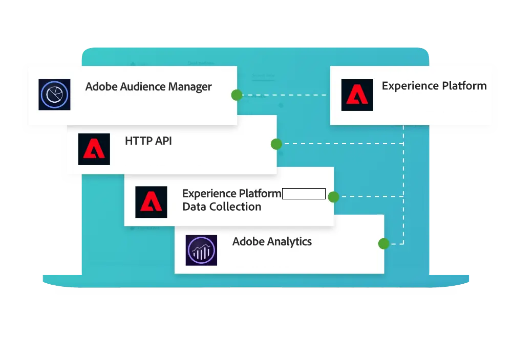

# Guide de Customer Journey Analytics

## Nouveautés

Découvrez les dernières améliorations apportées au produit et à la documentation du Customer Journey Analytics. Pour obtenir une liste complète des fonctionnalités, des améliorations et des correctifs, consultez les [Notes de mise à jour](../release-notes/latest.md). Tenez-vous au courant des dernières modifications apportées à notre documentation en consultant la [page des mises à jour de la documentation](../release-notes/doc-changes.md).

>[!BEGINTABS]

>[!TAB Workspace : prévisions de séries temporelles]

La prévision est une nouvelle fonction d’Analysis Workspace qui permet de prévoir une mesure standard ou calculée avec toute granularité temporelle prise en charge (horaire, quotidien, hebdomadaire, mensuel et annuel). Les prévisions sont disponibles uniquement pour les données liées aux séries temporelles.

>[!TAB Connexions : enregistrements ignorés]

Vous pouvez désormais examiner les raisons pour lesquelles les enregistrements des jeux de données d’événement sont ignorés lors de la définition d’une connexion. Vous pouvez obtenir des détails sur les raisons pour lesquelles les enregistrements sont ignorés, comme les identifiants visiteur vides, les rétention de données, etc.

>[!TAB Product Analytics : Trendlines]

Les superpositions de tendances sont désormais disponibles dans la vue Utilisation de l’analyse guidée, qui permet de représenter plus clairement un modèle dans les données.

>[!ENDTABS]

## Commencer avec les principes de base

Commencez par lire le contenu des liens ci-dessous pour vous familiariser avec les capacités et les fonctionnalités des Customer Journey Analytics.

<table style="table-layout:fixed">
  <tr style="border: 0;">
    <td>
    
    
<strong>Plus de données en ligne</strong> Découvrez comment Customer Journey Analytics compare à Adobe Analytics, quelles fonctionnalités partagent-ils et comment utiliser vos données Analytics.

    </td>
    <td>
    
    
<strong>Ingestion et utilisation des données</strong> Découvrez les options dont vous avez besoin pour ingérer des données dans Experience Platform et les utiliser pour les analyses et les rapports dans Customer Journey Analytics.

    </td>
    <td>
    
    
<strong>Analyse guidée</strong> Découvrez comment utiliser des workflows pour obtenir des données et des informations sur l’expérience produit de votre client. Product Analytics grâce à l’analyse guidée...
    

    </td>
    <td>
    
    
<strong>Analysis Workspace</strong> Utilisez Analysis Workspace pour effectuer des analyses de base et avancées, telles que des diagrammes d’attribution, de flux et d’abandons, des ventilations de dimensions.

    </td>
  </tr>
  <tr style="border: 0;">
    <td align="center"></td>
    <td align="center"></td>
    <td align="center"></td>
    <td align="center"></td>
    </tr>
</table>

## Explorer la documentation

Comprenez comment Customer Journey Analytics compare à Adobe Analytics et comment intégrer vos données dans la solution, puis préparez, affichez, analysez et démocratisez ces données, ainsi que l’analyse et les rapports qui en résultent.

<table style="table-layout:auto">
  <tr style="border: 0;">
    <td>
       
      <strong>Comparaison avec Adobe Analytics</strong> <a href="/help/getting-started/aa-vs-cja/overview.md">Présentation</a> - <a href="/help/getting-started/aa-to-cja.md">Evolution</a> - <a href="/help/getting-started/aa-vs-cja/aa-data-in-cja.md">Utilisation des données Adobe Analytics</a> - <a href="/help/getting-started/aa-vs-cja/cja-aa.md">Prise en charge des fonctionnalités</a> - <a href="/help/getting-started/aa-vs-cja/terminology.md">Terminologie</a> - <a href="/help/getting-started/aa-vs-cja/data-processing-comparisons.md">Traitement des données</a>
    </td>
    <td>
       
      <strong>Connexions</strong> <a href="/help/connections/overview.md">Présentation</a> - <a href="/help/connections/create-connection.md">Créer</a> - <a href="/help/connections/manage-connections.md">Gérer</a> - <a href="/help/stitching/overview.md">Assemblage</a> - <a href="/help/connections/combined-dataset.md">Jeu de données d’événement combiné</a> - <a href="/help/connections/standard-lookups.md">Recherches standard</a>
    </td>
     <td>
       
      <strong>Dataviews</strong> <a href="/help/data-views/data-views.md">Présentation</a> - <a href="/help/data-views/create-dataview.md">Créer ou modifier</a> - <a href="/help/data-views/session-settings.md">Paramètres de session</a> - <a href="/help/data-views/derived-fields/derived-fields.md">Champs dérivés</a> - <a href="/help/data-views/component-reference.md">Référence des composants</a>
    </td>

</tr>
  <tr style="border: 0;">
    <td>
       
      <strong>Projets Workspace</strong> <a href="/help/analysis-workspace/home.md">Analysis Workspace</a> - <a href="/help/analysis-workspace/perform-basic-analysis.md">De base </a> &amp; <a href="/help/analysis-workspace/perform-adv-analysis.md">Analyse avancée</a> - <a href="/help/analysis-workspace/build-workspace-project/freeform-overview.md">Projets</a> - <a href="/help/analysis-workspace/visualizations/freeform-analysis-visualizations.md">Visualisations</a> - <a href="/help/analysis-workspace/c-panels/freeform-panel.md">Panneaux</a>
    </td>
    <td>
       
      <strong>Analyse guidée</strong> <a href="/help/guided-analysis/overview.md">Présentation</a> - <a href="/help/guided-analysis/types/active.md">Croissance des utilisateurs</a> - <a href="/help/guided-analysis/types/usage.md">Trends</a> - <a href="/help/guided-analysis/types/friction.md">Entonnoir</a> - <a href="/help/guided-analysis/types/release.md">Impact</a> - <a href="/help/guided-analysis/industry-use-cases.md">Cas pratiques du secteur</a>
    </td>
    <td>
       
      <strong>Partager, exporter, intégrer</strong> <a href="/help/analysis-workspace/curate-share/share-projects.md">Projets</a> - <a href="/help/mobile-app/home.md">Tableaux de bord Analytics</a> - <a href="/help/report-builder/report-buider-overview.md">Report Builder</a>  - <a href="/help/integrations/overview.md">Intégrations</a>
    </td>
  </tr>
</table>

## Ressources supplémentaires

<table style="table-layout:fixed"><tr style="border: 0;">
<td><strong>Customer Journey Analytics</strong> 
<a href="https://experienceleague.adobe.com/docs/customer-journey-analytics-learn/tutorials/overview.html" target="_blank">Tutorials</a> - <a href="https://helpx.adobe.com/legal/product-descriptions/customer-journey-analytics.html" target="_blank">Description du produit Customer Journey Analytics</a> - <a href="https://helpx.adobe.com/legal/product-descriptions/adobe-analytics-addon-customer-journey-analytics.html" target="_blank">Description du produit Adobe Analytics (module complémentaire Customer Journey Analytics)</a> - <a href="https://developer.adobe.com/cja-apis/docs/" target="_blank">API de Customer Journey Analytics</a>
</td>
<td><strong>Ingestion des données</strong> <a href="/help/data-ingestion/data-ingestion.md">Présentation</a> - <a href="/help/data-ingestion/analytics.md">Analytics</a> - <a href="/help/data-ingestion/aepwebsdk.md">SDK Web</a> - <a href="/help/data-ingestion/aepmobilesdk.md">SDK Mobile</a> - <a href="/help/data-ingestion/aepmobilesdk.md">Lot</a> - <a href="/help/data-ingestion/streaming.md">Diffusion en continu</a> - <a href="/help/data-ingestion/sources.md">Sources</a> - <a href="/help/data-ingestion/serverapi.md">API du serveur</a>
</td>
</tr></table>

<table style="table-layout:auto" class="tablelayout-is-fixed"><tbody><tr style="border: 0;"><td></td><td>
<b>Restez informé, contribuez à la communauté et validez votre expérience Customer Journey Analytics !</b> Consultez la communauté Adobe Analytics pour discuter des fonctionnalités avec d’autres utilisateurs. <a href="https://experienceleaguecommunities.adobe.com/t5/adobe-analytics/ct-p/adobe-analytics-community?profile.language=fr">Rejoignez la communauté aujourd'hui !</a></td></tr></tbody></table>
