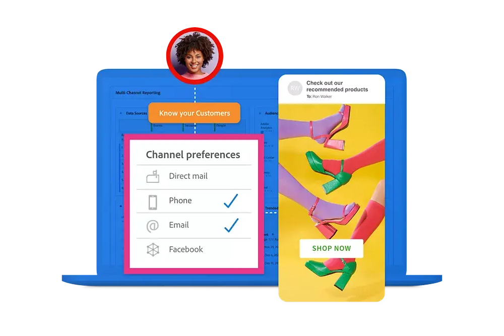

# Guide de Customer Journey Analytics

Ce guide de documentation technique fournit une aide à l’auto-assistance pour Customer Journey Analytics. Customer Journey Analytics vous permet d’importer les données de vos clients de n’importe quel canal de votre choix (en ligne et hors ligne) dans Adobe Experience Platform. Ensuite, analysez ces données comme vous le feriez pour vos données numériques existantes en utilisant Analysis Workspace aujourd&#39;hui.

Customer Journey Analytics vous permet de contrôler la manière dont vous connectez vos données en ligne et hors ligne dans Analysis Workspace sur n’importe quel ID de client commun, ce qui vous permet d’effectuer une attribution, des filtres, un flux, des abandons, etc. sur l’ensemble de vos données client.

## Nouveautés

Découvrez les améliorations les plus récentes apportées au produit et à la documentation de Customer Journey Analytics. Pour obtenir une liste complète des fonctionnalités, des améliorations et des correctifs, consultez les [Notes de mise à jour](../release-notes/latest.md). Visitez le [page mises à jour de la documentation](../release-notes/doc-changes.md) pour rester à jour avec les dernières modifications.

>[!BEGINTABS]

>[!TAB Extension BI*]

L’extension BI permet l’accès SQL aux vues de données que vous avez définies dans Customer Journey Analytics. Vous pouvez désormais utiliser votre outil de BI préféré pour créer des rapports et des tableaux de bord basés sur les mêmes vues de données que celles utilisées par les utilisateurs Customer Journey Analytics avec leurs projets Analysis Workspace.

*_Vous devez disposer du package Select ou d’une version ultérieure pour utiliser l’extension BI._

<!--
>[!TAB Improved Audience Publising] 

Audiences that are published from Customer Journey Analytics are now available in the new **Audiences** section in Adobe Experience Platform. Audiences are now available in Experience Platform seconds after they are published from Customer Journey Analytics. Improved sorting and filter options in Experience Platform for Customer Journey Analytics audiences. 

-->

>[!TAB Nouvelle documentation]

Une nouvelle documentation est désormais disponible sur :<ul><li>Comment mettre à niveau Adobe Analytics vers Customer Journey Analytics.</li><li>Cas d’utilisation de l’exportation de données et fonctionnalités d’Experience Platform et de Parcours client requises. </li></ul>Sélectionner **[!UICONTROL En savoir plus]** pour cette version et d’autres mises à jour de la documentation.

>[!TAB Prévisions]

La prévision est une nouvelle fonction d’Analysis Workspace qui permet de prévoir une mesure standard ou calculée avec toute les granularités temporelles prises en charge (horaire, quotidienne, hebdomadaire, mensuelle et annuelle). Les prévisions sont disponibles uniquement pour les données liées aux séries temporelles.

>[!TAB Analyse guidée* - Taux de rétention]

Un nouveau type d’affichage indiquant le pourcentage d’utilisateurs et utilisatrices revenant après leur engagement initial au cours de la période souhaitée. L’axe horizontal représente le nombre de jours depuis l’engagement initial d’un utilisateur ou d’une utilisatrice. L’axe vertical représente le pourcentage d’utilisateurs et utilisatrices qui reprennent le contact.

*_L’analyse guidée est une fonctionnalité d’Adobe Product Analytics, un module complémentaire payant de Customer Journey Analytics._

>[!TAB Analyse guidée* - Tendances]

Les superpositions de tendance sont désormais disponibles dans la vue Utilisation, qui permet de représenter plus clairement un modèle dans les données. Les types de tendance disponibles sont Linéaire, Logarithmique et Moyenne glissante.

*_L’analyse guidée est une fonctionnalité d’Adobe Product Analytics, un module complémentaire payant de Customer Journey Analytics._

>[!ENDTABS]

## Commencer avec les principes de base

Commencez par lire le contenu des liens ci-dessous pour vous familiariser avec les capacités et les fonctionnalités de Customer Journey Analytics.

<table style="table-layout:fixed">
  <tr style="border: 0;">
    <td>
    
    
<strong>Au-delà des données en ligne</strong> Découvrez comment Customer Journey Analytics se compare à Adobe Analytics, quelles fonctionnalités sont partagées et comment utiliser vos données Analytics.

    </td>
    <td>
    
    
<strong>Ingestion et utilisation des données</strong> Découvrez les options que vous devez utiliser pour ingérer des données dans Experience Platform et les utiliser pour les analyses et les rapports dans Customer Journey Analytics.

    </td>
    <td>
    
    
<strong>Analyse guidée</strong> Découvrez comment utiliser des workflows pour obtenir des données et des informations sur l’expérience produit de votre clientèle. Product Analytics via l’analyse guidée...
    

    </td>
    <td>
    
    
<strong>Analysis Workspace</strong> Utilisez Analysis Workspace pour effectuer des analyses de base et avancées, telles que des diagrammes d’attribution, de flux et d’abandons, ainsi que des ventilations de dimensions.

    </td>
  </tr>
  <tr style="border: 0;">
    <td align="center"></td>
    <td align="center"></td>
    <td align="center"></td>
    <td align="center"></td>
    </tr>
</table>

## Explorer la documentation

Comparez Customer Journey Analytics à Adobe Analytics. Et comment intégrer vos données dans la solution, puis préparer, visualiser, analyser et démocratiser ces données, ainsi que l’analyse et les rapports qui en résultent.

<table style="table-layout:auto">
  <tr style="border: 0;">
    <td>
       
      <strong>Comparaison avec Adobe Analytics</strong> <a href="/help/getting-started/aa-vs-cja/overview.md">Vue d’ensemble</a> - <a href="/help/getting-started/aa-to-cja.md">Évolution</a> - <a href="/help/getting-started/aa-vs-cja/aa-data-in-cja.md">Utilisation des données Adobe Analytics</a> - <a href="/help/getting-started/aa-vs-cja/cja-aa.md">Prise en charge des fonctionnalités</a> - <a href="/help/getting-started/aa-vs-cja/terminology.md">Terminologie</a> - <a href="/help/getting-started/aa-vs-cja/data-processing-comparisons.md">Traitement des données</a>
    </td>
    <td>
       
      <strong>Connexions</strong> <a href="/help/connections/overview.md">Vue d’ensemble</a> - <a href="/help/connections/create-connection.md">Créer</a> - <a href="/help/connections/manage-connections.md">Gérer</a> - <a href="/help/stitching/overview.md">Assembler</a> - <a href="/help/connections/combined-dataset.md">Jeu de données d’événement combiné</a> - <a href="/help/connections/standard-lookups.md">Recherches standard</a>
    </td>
     <td>
       
      <strong>Vues des données</strong> <a href="/help/data-views/data-views.md">Présentation</a> - <a href="/help/data-views/create-dataview.md">Créer ou modifier</a> - <a href="/help/data-views/session-settings.md">Paramètres de session</a> - <a href="/help/data-views/derived-fields/derived-fields.md">Champs dérivés</a> - <a href="/help/data-views/component-reference.md">Référence des composants</a>
    </td>

</tr>
  <tr style="border: 0;">
    <td>
       
      <strong>Projets Workspace</strong> <a href="/help/analysis-workspace/home.md">Analysis Workspace</a> - <a href="/help/analysis-workspace/perform-basic-analysis.md">De base</a> &amp; <a href="/help/analysis-workspace/perform-adv-analysis.md">Analyse avancée</a> - <a href="/help/analysis-workspace/build-workspace-project/freeform-overview.md">Projets</a> - <a href="/help/analysis-workspace/visualizations/freeform-analysis-visualizations.md">Visualisations</a> - <a href="/help/analysis-workspace/c-panels/freeform-panel.md">Panneaux</a>
    </td>
    <td>
       
      <strong>Analyse guidée</strong> <a href="/help/guided-analysis/overview.md">Vue d’ensemble</a> - <a href="/help/guided-analysis/types/active.md">Croissance des utilisateurs et utilisatrices</a> - <a href="/help/guided-analysis/types/usage.md">Tendances</a> - <a href="/help/guided-analysis/types/friction.md">Entonnoir</a> - <a href="/help/guided-analysis/types/release.md">Impact</a> - <a href="/help/guided-analysis/industry-use-cases.md">Cas d’utilisation du secteur</a>
    </td>
    <td>
       
      <strong>Partager, exporter, intégrer</strong> <a href="/help/analysis-workspace/curate-share/share-projects.md">Projets</a> - <a href="/help/mobile-app/home.md">Tableaux de bord Analytics</a> - <a href="/help/report-builder/report-buider-overview.md">Report Builder</a>  - <a href="/help/integrations/overview.md">Intégrations</a>
    </td>
  </tr>
</table>

## Ressources supplémentaires

<table style="table-layout:fixed"><tr style="border: 0;">
<td><strong>Customer Journey Analytics</strong> 
<a href="https://experienceleague.adobe.com/en/docs/customer-journey-analytics-learn/tutorials/overview" target="_blank">Tutoriels</a> - <a href="https://helpx.adobe.com/legal/product-descriptions/customer-journey-analytics.html?lang=fr" target="_blank">Description du produit Customer Journey Analytics</a> - <a href="https://helpx.adobe.com/legal/product-descriptions/adobe-analytics-addon-customer-journey-analytics.html?lang=fr" target="_blank">Description du produit Adobe Analytics (module complémentaire Customer Journey Analytics)</a> - <a href="https://developer.adobe.com/cja-apis/docs/" target="_blank">API de Customer Journey Analytics</a>
</td>
<td><strong>Ingestion des données</strong> <a href="/help/data-ingestion/data-ingestion.md">Vue d’ensemble</a> - <a href="/help/data-ingestion/analytics.md">Analytics</a> - <a href="/help/data-ingestion/aepwebsdk.md">SDK Web</a> - <a href="/help/data-ingestion/aepmobilesdk.md">SDK Mobile</a> - <a href="/help/data-ingestion/batch.md">Lot</a> - <a href="/help/data-ingestion/streaming.md">Streaming</a> - <a href="/help/data-ingestion/sources.md">Sources</a> - <a href="/help/data-ingestion/serverapi.md">API du serveur</a>
</td>
</tr></table>

<table style="table-layout:auto" class="tablelayout-is-fixed"><tbody><tr style="border: 0;"><td></td><td>
<b>Ne manquez aucune information, contribuez à la communauté et validez votre expérience Customer Journey Analytics !</b> Consultez la communauté Adobe Analytics pour en discuter avec d’autres utilisateurs. <a href="https://experienceleaguecommunities.adobe.com/t5/adobe-analytics/ct-p/adobe-analytics-community?profile.language=fr">Rejoignez la communauté aujourd’hui !</a></td></tr></tbody></table>
