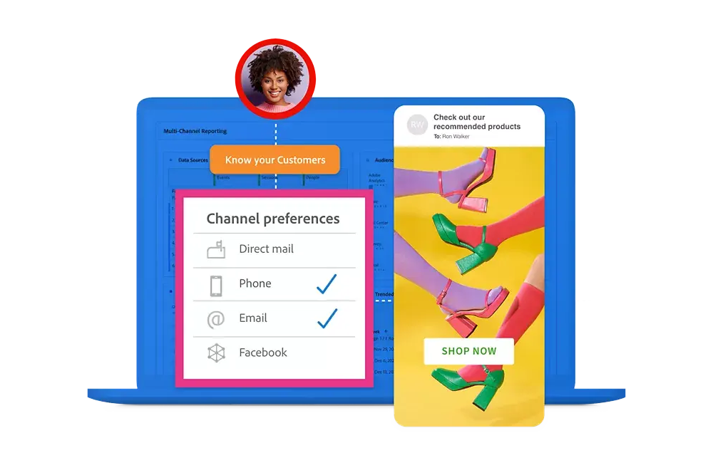
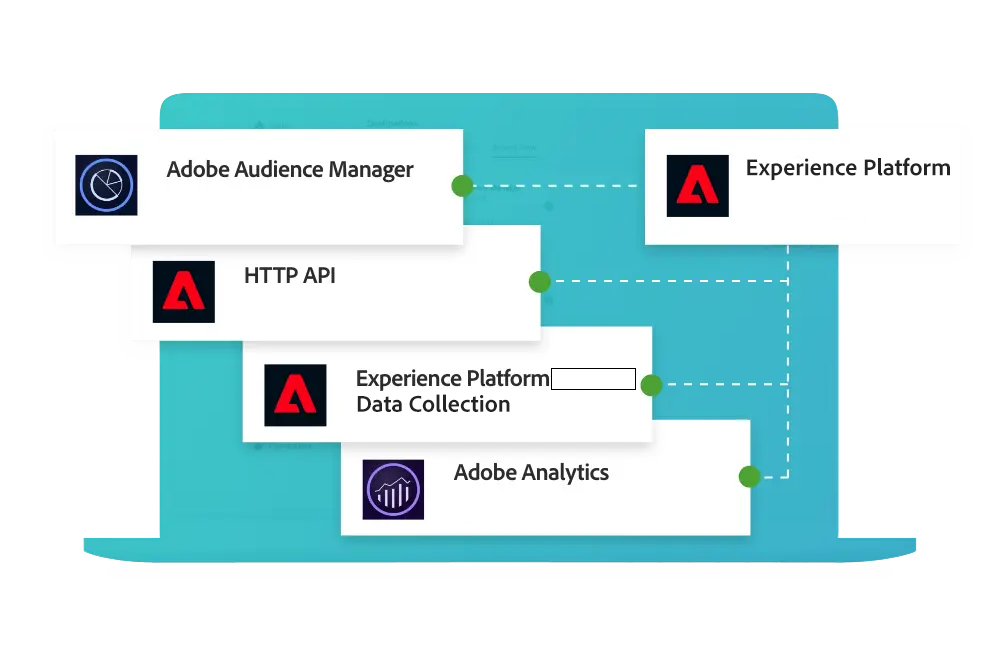
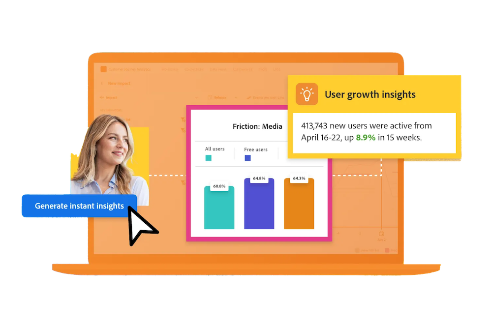
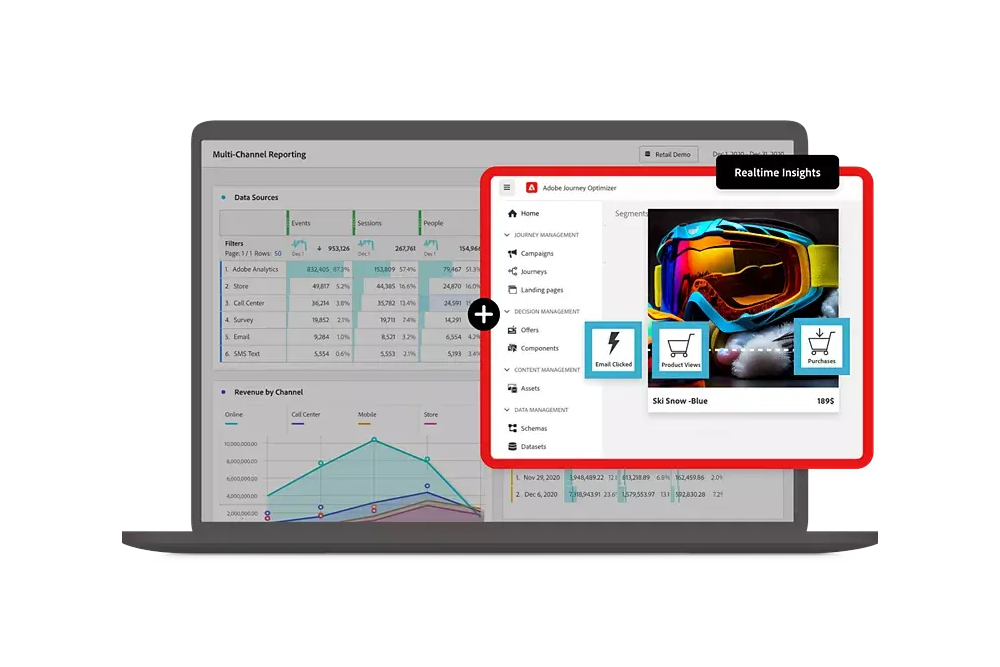
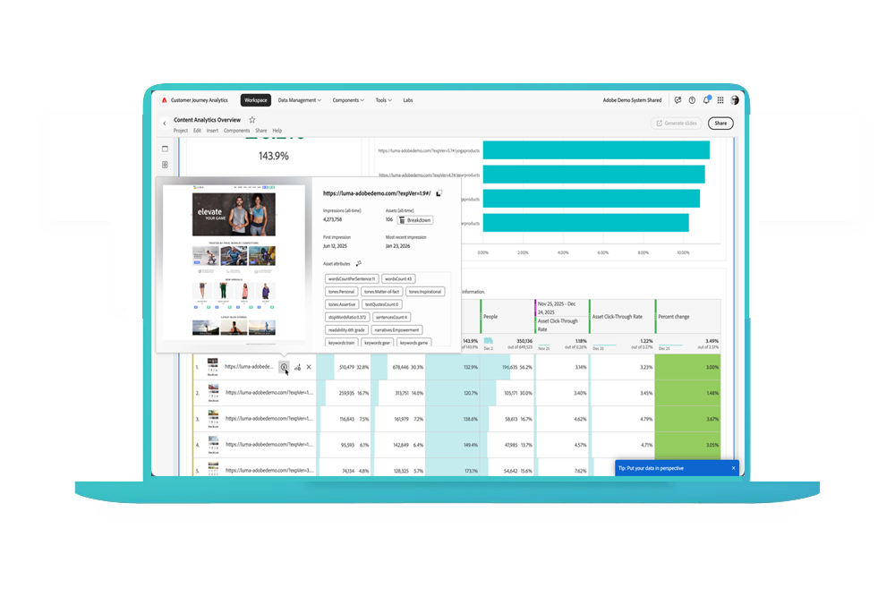

# Guide de Customer Journey Analytics

Ce guide de documentation technique fournit une aide à l’auto-assistance pour Customer Journey Analytics. Customer Journey Analytics vous permet d’importer les données de vos clientes et clients à partir de n’importe quel canal de votre choix (en ligne et hors ligne) dans Adobe Experience Platform. Analysez ensuite ces données comme vous le feriez pour vos données numériques existantes en utilisant l’Analysis Workspace actuel.

Customer Journey Analytics vous permet de contrôler la manière dont vous connectez vos données en ligne et hors ligne dans Analysis Workspace sur n’importe quel ID de client commun, ce qui vous permet d’effectuer une attribution, des segments, un flux, un abandon, etc. sur vos données client.

## Nouveautés

Découvrez les améliorations les plus récentes apportées au produit et à la documentation de Customer Journey Analytics. Pour obtenir une liste complète des fonctionnalités, des améliorations et des correctifs, consultez les [notes de mise à jour](../release-notes/latest.md) détaillées. Accédez à la [page des mises à jour de la documentation](../release-notes/doc-changes.md) pour connaître les dernières modifications.

>[!BEGINTABS]

>[!TAB Répartition des panneaux]

Vous pouvez désormais répartir un panneau dans Analysis Workspace. Il existe des scénarios dans lesquels une répartition des données et des visualisations dans un panneau est préférable au-dessus de l’application de segments à un panneau.

>[!TAB Plusieurs colonnes de dimension]

Vous pouvez inclure jusqu’à 5 colonnes de dimension dans un tableau à structure libre, ce qui vous permet d’afficher plusieurs éléments de dimension côte à côte. Chaque ligne d’éléments de dimension se comporte comme un seul élément de dimension concaténé.

>[!TAB Assemblage dans les connexions]

Vous pouvez désormais configurer et activer le groupement sur les jeux de données d’événement directement dans l’interface utilisateur de Customer Journey Analytics Connections.

*Vous devez disposer au moins du package Select pour activer le groupement.*

>[!TAB Analyse de l’audience]

L’analyse de l’audience vous permet d’ingérer des données d’appartenance à une audience à partir de jeux de données Profil Experience Platform dans une connexion Customer Journey Analytics.

>[!TAB Rapports en temps réel]

Les rapports en temps réel dans Customer Journey Analytics affichent et mettent à jour en temps réel les données et les visualisations au sein d’un ou de plusieurs panneaux dans Analysis Workspace.

*Vous devez disposer du package Ultimate pour la création de rapports en temps réel.*

>[!TAB B2B Edition]

Customer Journey Analytics B2B Edition permet aux sociétés B2B d’aligner leurs équipes marketing, ventes et produits en fournissant des informations de compte exploitables qui stimulent l’augmentation des revenus. Le compte étant placé au centre du modèle de données, toutes les analyses se concentrent sur le parcours de compte.

>[!TAB Content Analytics]

Content Analytics vous permet d’examiner rapidement et facilement de grands volumes de données de contenu pour repérer des tendances, détecter des anomalies, identifier la lassitude liée au contenu et obtenir des informations issues de l’exposition du contenu.

>[!ENDTABS]

## Commencer avec les principes de base

Commencez par lire le contenu des liens ci-dessous pour vous familiariser avec les capacités et les fonctionnalités de Customer Journey Analytics.

<table style="table-layout:fixed">
  <tr style="border: 0;">
    <td>
    
    
<strong>Au-delà des données en ligne</strong> Découvrez comment Customer Journey Analytics se compare à Adobe Analytics, quelles fonctionnalités sont partagées et comment utiliser vos données Analytics.

    </td>
    <td>
    
    
<strong>Ingérer et utiliser des données</strong> Découvrez les options dont vous disposez pour ingérer des données dans Experience Platform et les utiliser pour les analyses et les rapports.

    </td>
    <td>
    
    
<strong>Analyse guidée</strong> Découvrez comment utiliser des workflows pour obtenir des données et des informations sur l’expérience produit de votre clientèle. Product Analytics via l’analyse guidée.
    

    </td>
    <td>
    
    
<strong>Analysis Workspace</strong> Utilisez Analysis Workspace pour effectuer des analyses de base et avancées, telles que des diagrammes d’attribution, de flux et d’abandons, ainsi que des répartitions de dimensions.

    </td>
    <td>
    
    
<strong></strong> Comprenez comment le contenu, en regard du comportement, affecte les indicateurs de performances clés. Obtenez des informations plus précises sur les données de parcours des clients.

    </td>
  </tr>
  <tr style="border: 0;">
    <td align="center"></td>
    <td align="center"></td>
    <td align="center"></td>
    <td align="center"></td>
    <td align="center"></td>
    </tr>
</table>

## Explorer la documentation

Comprenez les différences entre Customer Journey Analytics et Adobe Analytics. et comment intégrer vos données dans la solution. Préparez, affichez, analysez et démocratisez ces données, ainsi que l’analyse et les rapports qui en résultent.

<table style="table-layout:fixed">
  <tr style="border: 0;">
    <td>
       
      <strong>Comparer à Adobe Analytics</strong> <a href="/help/getting-started/aa-vs-cja/overview.md">Aperçu</a> - <a href="/help/getting-started/aa-to-cja.md">Évolution</a> - <a href="/help/getting-started/cja-upgrade/cja-upgrade-recommendations.md">Mise à niveau</a> - <a href="/help/getting-started/aa-vs-cja/aa-data-in-cja.md">Utilisation des données Adobe Analytics</a> - <a href="/help/getting-started/aa-vs-cja/cja-aa.md">Prise en charge des fonctionnalités</a> - <a href="/help/getting-started/aa-vs-cja/terminology.md">Terminologie</a> - <a href="/help/getting-started/aa-vs-cja/data-processing-comparisons.md">Traitement des données</a>
    </td>
    <td>
       
<strong>Connexions</strong> <a href="/help/connections/overview.md">Vue d’ensemble</a> - <a href="/help/connections/create-connection.md">Créer</a> - <a href="/help/connections/manage-connections.md">Gérer</a> - <a href="/help/stitching/overview.md">Assembler</a> - <a href="/help/connections/combined-dataset.md">Jeux de données d’événements combinés</a> - <a href="/help/connections/standard-lookups.md">Recherches standard</a>
    </td>
     <td>
       
<strong>Vues de données</strong> <a href="/help/data-views/data-views.md">Vue d’ensemble</a> - <a href="/help/data-views/create-dataview.md">Créer ou modifier</a> - <a href="/help/data-views/session-settings.md">Paramètres de session</a> - <a href="/help/data-views/derived-fields/derived-fields.md">Champs dérivés</a> - <a href="/help/data-views/summary-data.md">Données de résumé</a> - <a href="/help/data-views/component-reference.md">Référence des composants</a>
    </td>

</tr>
  <tr style="border: 0;">
    <td>
       
      <strong>Projets Workspace</strong> <a href="/help/analysis-workspace/home.md">Analysis Workspace</a> - <a href="/help/analysis-workspace/perform-basic-analysis.md">Analyse de base</a> &amp; <a href="/help/analysis-workspace/perform-adv-analysis.md">avancée</a> - <a href="/help/analysis-workspace/build-workspace-project/freeform-overview.md">Projets</a> - <a href="/help/analysis-workspace/visualizations/freeform-analysis-visualizations.md">Visualisations</a> - <a href="/help/analysis-workspace/c-panels/freeform-panel.md">Panneaux</a>
    </td>
        <td>
       
<strong>Partager, exporter, intégrer</strong> <a href="/help/analysis-workspace/curate-share/share-projects.md">Projets</a> - <a href="/help/mobile-app/home.md">Tableaux de bord Analytics</a> - <a href="/help/report-builder/rb-overview.md">Report Builder</a> - <a href="/help/components/exports/manage-exports.md">Export vers le cloud</a> - <a href="/help/integrations/overview.md">Intégrations</a>
    </td>
    <td>
       
      <strong>Et plus encore...</strong> <a href="/help/guided-analysis/overview.md">Analyse guidée</a> - <a href="/help/content-analytics/content-analytics.md">Content Analytics</a> - <a href="/help/getting-started/cja-b2b-edition.md">B2B edition</a> 
    </td>
  </tr>
</table>

## Ressources supplémentaires

<table style="table-layout:fixed"><tr style="border: 0;">
<td><strong>Customer Journey Analytics</strong> 
<a href="https://experienceleague.adobe.com/fr/docs/customer-journey-analytics-learn/tutorials/overview" target="_blank">Tutoriels</a> - <a href="https://helpx.adobe.com/fr/legal/product-descriptions/customer-journey-analytics.html?lang=fr" target="_blank">Description du produit Customer Journey Analytics</a> - <a href="https://helpx.adobe.com/fr/legal/product-descriptions/adobe-analytics-addon-customer-journey-analytics.html?lang=fr" target="_blank">Description du produit Adobe Analytics (module complémentaire Customer Journey Analytics)</a> - <a href="https://helpx.adobe.com/fr/legal/product-descriptions/customer-journey-analytics-b2b.html?lang=fr" target="_blank">Description du produit Customer Journey Analytics B2B edition</a> - <a href="https://developer.adobe.com/cja-apis/docs/" target="_blank">API Customer Journey Analytics</a> - <a href="/help/ai-assistant.md">Assistant IA</a>
</td>
<td><strong>Ingestion des données</strong> <a href="/help/data-ingestion/data-ingestion.md">Vue d’ensemble</a> - <a href="/help/data-ingestion/analytics.md">Analytics</a> - <a href="/help/data-ingestion/aepwebsdk.md">SDK Web</a> - <a href="/help/data-ingestion/aepmobilesdk.md">SDK Mobile</a> - <a href="/help/data-ingestion/batch.md">Lot</a> - <a href="/help/data-ingestion/streaming.md">Streaming</a> - <a href="/help/data-ingestion/sources.md">Sources</a> - <a href="/help/data-ingestion/serverapi.md">API du serveur</a>
</td>
</tr>
</table>

<table style="table-layout:auto" class="tablelayout-is-fixed"><tbody><tr style="border: 0;"><td></td><td>
<b>Restez informé, contribuez à la communauté et améliorez votre expérience Customer Journey Analytics !</b> Consultez la communauté Adobe Analytics pour discuter des fonctionnalités avec d’autres utilisateurs et utilisatrices. <a href="https://experienceleaguecommunities.adobe.com/t5/adobe-analytics/ct-p/adobe-analytics-community?profile.language=fr">Rejoignez la communauté aujourd’hui !</a></td></tr></tbody></table>
