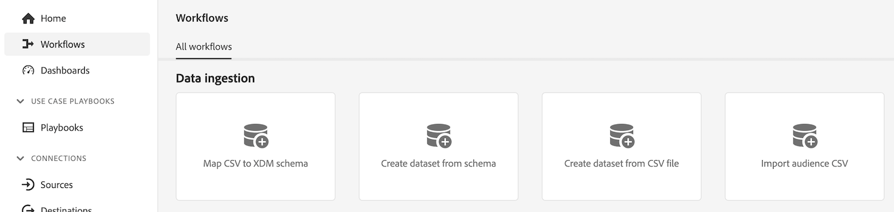

# Créer des jeux de données de recherche pour classer les données dans Customer Journey Analytics {#upgrade-lookup-dataset}

<!-- markdownlint-disable MD034 -->

>[!CONTEXTUALHELP]
>id="cja-upgrade-lookup-dataset-create"
>title="Créer un jeu de données de recherche pour chaque dimension contenant des données de classification"
>abstract="Tout comme les données de classification dans Adobe Analytics, les jeux de données de recherche sont la méthode de classification des données dans Customer Journey Analytics."

<!-- markdownlint-enable MD034 -->

{{upgrade-note-step}}

Tout comme les données de classification dans Adobe Analytics, les jeux de données de recherche sont la méthode de classification des données dans Customer Journey Analytics.

Lors de l’utilisation du connecteur source Analytics, certains jeux de données de recherche standard sont automatiquement appliqués au moment du rapport. Pour plus d’informations, consultez [Ajouter des recherches standard à vos jeux de données](/help/connections/standard-lookups.md).

Pour classer les données dans Customer Journey Analytics lors de l’utilisation du SDK web Experience Platform, vous devez créer un schéma personnalisé et un jeu de données de recherche pour chaque dimension contenant les données à classer.

## Créer un schéma personnalisé à utiliser avec le jeu de données de recherche

Créez un schéma personnalisé pour chaque dimension contenant les données à classer dans Customer Journey Analytics. Lorsque vous créerez le jeu de données de recherche à une étape ultérieure, il fera référence à ce schéma.

Répétez ce processus pour chaque dimension contenant les données à classer.

Pour créer un schéma à utiliser avec un jeu de données de recherche dans Customer Journey Analytics, procédez comme suit :

1. Dans Adobe Experience Platform, sélectionnez **[!UICONTROL Schémas]** dans la section **[!UICONTROL Gestion des données]** du rail de gauche.

1. Sélectionnez **[!UICONTROL Créer un schéma]**.

   

1. Sélectionnez **[!UICONTROL Manuel]**. Vous pouvez ainsi ajouter manuellement des champs et des groupes de champs à votre schéma. Choisissez **[!UICONTROL Sélectionner]** pour passer à la page suivante de l’assistant de création.

1. Sur la page **[!UICONTROL Détails du schéma]**, sélectionnez **[!UICONTROL Autre]**, puis **[!UICONTROL Personnalisé]**.

   

1. Sélectionnez **[!UICONTROL Créer une classe]**.

   <!-- add screenshot -->

1. Dans la boîte de dialogue **[!UICONTROL Créer une classe]**, spécifiez un nom et une description pour le schéma, sélectionnez **[!UICONTROL Enregistrement]**, puis sélectionnez **[!UICONTROL Créer]**.

1. Continuez avec [Créer un jeu de données de recherche](#create-a-lookup-dataset).

## Créer un jeu de données de recherche

Après avoir [créé un schéma personnalisé](#create-a-custom-schema-to-use-with-the-lookup-dataset) à utiliser pour un jeu de données de recherche, vous devez créer le jeu de données de recherche et le mapper à votre schéma.

Répétez ce processus pour chaque dimension contenant les données à classer.

Pour créer un jeu de données de recherche à utiliser avec un schéma dans Customer Journey Analytics, procédez comme suit :

>[!NOTE]
>
>Le processus suivant utilise un fichier CSV pour créer le jeu de données. Vous pouvez également utiliser toute autre méthode disponible pour importer des données dans Experience Platform, telle que la configuration d’un train de données.

1. Dans Adobe Experience Platform, sélectionnez **[!UICONTROL Workflows]** dans le rail de gauche.

   

1. Sélectionnez **[!UICONTROL Mapper un fichier CSV à un schéma XDM]**, puis sélectionnez **[!UICONTROL Lancer]**.

1. Dans la section **[!UICONTROL Détails du jeu de données]**, sélectionnez **[!UICONTROL Nouveau jeu de données]**.

1. Indiquez un nom et une description pour votre jeu de données.

1. Dans le champ **[!UICONTROL Schéma]**, sélectionnez le schéma que vous avez créé pour les jeux de données de recherche, comme décrit dans la section [Créer un schéma pour les jeux de données de recherche](#create-a-schema-for-lookup-datasets).

1. Sélectionnez **[!UICONTROL Suivant]**.

1. Sur la **[!UICONTROL page Mapper un fichier CSV à un schéma XDM]**, dans la section **[!UICONTROL Charger des fichiers]**, sélectionnez **[!UICONTROL Choisir des fichiers]**, puis recherchez dans votre système de fichiers le fichier contenant les informations de classification de la dimension pour laquelle vous souhaitez appliquer les données de classification. Par exemple, il peut s’agir d’une feuille de calcul qui répertorie les identifiants de champ et les noms de champ correspondants. <!-- correct? How can I better explain what this file is?-->

   

1. Sélectionnez **[!UICONTROL Suivant]**.

1. Une fois le fichier chargé, passez en revue les mappages pour vous assurer qu’ils sont exacts. Les colonnes du fichier CSV sont répertoriées sous **[!UICONTROL Données source]**, et les champs de schéma XDM correspondants sont répertoriés sous **[!UICONTROL Champ cible]**.

   Platform fournit automatiquement des recommandations intelligentes pour les champs mappés automatiquement en fonction du schéma ou du jeu de données cible que vous avez sélectionné. Vous pouvez ajuster manuellement les règles de mappage en fonction de vos cas d’utilisation.

   Pour plus d’informations sur le processus de mappage, consultez [Mappage d’un fichier CSV à un schéma XDM existant](https://experienceleague.adobe.com/fr/docs/experience-platform/ingestion/tutorials/map-csv/existing-schema) dans la documentation d’Experience Platform.

1. Sélectionnez **[!UICONTROL Terminer]**.

1. Continuez avec [Ajouter le jeu de données de recherche à votre connexion dans Customer Journey Analytics](#add-the-lookup-dataset-to-your-connection-in-customer-journey-analytics).

## Ajouter le jeu de données de recherche à votre connexion dans Customer Journey Analytics

Après avoir [créé un schéma personnalisé](#create-a-custom-schema-to-use-with-the-lookup-dataset) et [créé un jeu de données de recherche](#create-a-lookup-dataset), vous devez ajouter le jeu de données de recherche à votre connexion dans Customer Journey Analytics.

Répétez ce processus pour chaque dimension contenant les données à classer.

Pour ajouter le jeu de données de recherche à votre connexion dans Customer Journey Analytics, procédez comme suit :

1. Dans Customer Journey Analytics, sélectionnez **[!UICONTROL Connexions]**, éventuellement à partir de **[!UICONTROL Gestion des données]**, dans le menu supérieur.

1. Sélectionnez  en regard de la connexion à laquelle vous souhaitez ajouter le jeu de données de recherche, puis sélectionnez **[!UICONTROL Modifier]**.

   <!-- add screenshot -->

1. Sélectionnez **[!UICONTROL Ajouter des jeux de données]**.

1. Dans la boîte de dialogue **[!UICONTROL Ajouter des jeux de données]**, sélectionnez le jeu de données de recherche que vous avez créé, puis sélectionnez **[!UICONTROL Suivant]**.

1. Dans le champ **[!UICONTROL ID de personne]**, sélectionnez un ID de personne parmi les identités disponibles définies dans le schéma de votre jeu de données que vous avez configuré dans Experience Platform. <!-- fill out other fields? -->

1. Sélectionnez **[!UICONTROL Ajouter des jeux de données]**, puis sélectionnez **[!UICONTROL Enregistrer]**.

   <!-- is there a step right in between here where you select the dataset -->

1. À l’aide du champ **[!UICONTROL Clé]** et du champ **[!UICONTROL Clé correspondante]**, créez une corrélation entre le champ de votre jeu de données de recherche et celui de votre jeu de données d’événement ou de résumé.

1. Répétez ce processus jusqu’à ce que tous les jeux de données de recherche soient ajoutés à votre connexion dans Customer Journey Analytics.

{{upgrade-final-step}}

