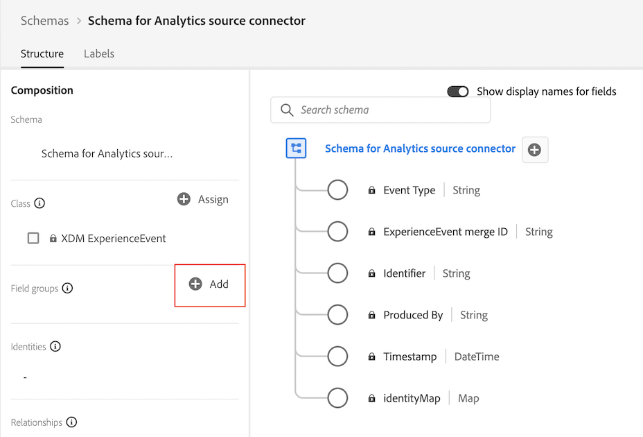

# Créer un schéma personnalisé pour le connecteur source Analytics {#create-custom-schema}

<!-- markdownlint-disable MD034 -->

>[!CONTEXTUALHELP]
>id="cja-upgrade-source-connector-create-schema"
>title="Créer un schéma pour le connecteur source Analytics"
>abstract="Ce schéma est une combinaison du groupe de champs d’ExperienceEvent Adobe Analytics avec tous les groupes de champs qui constituent le schéma personnalisé de votre organisation. Il vous permet de mapper les champs utilisés par le connecteur source Analytics au schéma de votre organisation et n’est utilisé que pour les données historiques.  Bien que technique par nature, la création de ce schéma peut se faire en quelques heures, peut-être plus rapidement si vous savez exactement quels groupes de champs constituent le schéma personnalisé de votre organisation."

<!-- markdownlint-enable MD034 -->

{{upgrade-note-step}}

## Comprendre comment le connecteur source Analytics peut importer des données historiques dans Customer Journey Analytics

Vous pouvez utiliser le connecteur source Analytics pour importer les données des suites de rapports Adobe Analytics dans Adobe Experience Platform. Ces données peuvent ensuite être utilisées comme données historiques dans Customer Journey Analytics.

Ce processus suppose que vous souhaitez [créer un schéma personnalisé à utiliser avec votre implémentation de Customer Journey Analytics Web SDK](/help/getting-started/cja-upgrade/cja-upgrade-schema-create.md), car vous souhaitez un schéma rationalisé et adapté aux besoins de votre organisation et aux applications Platform spécifiques que vous utilisez.

Pour utiliser le connecteur source Analytics afin d’importer des données historiques dans Customer Journey Analytics, vous devez :

1. Créez un schéma personnalisé pour le connecteur source Analytics, comme décrit ci-dessous.

1. Si vous ne disposez pas déjà d’un connecteur source Analytics, [créez le connecteur source Analytics et mappez les champs à votre schéma personnalisé](/help/getting-started/cja-upgrade/cja-upgrade-source-connector.md).

   Ou

   Si vous disposez déjà d’un connecteur source Analytics, [mappez les champs du connecteur source à votre schéma XDM](/help/getting-started/cja-upgrade/cja-upgrade-from-source-connector.md).

1. [Ajouter le jeu de données du connecteur source Analytics à la connexion](/help/getting-started/cja-upgrade/cja-upgrade-source-connector-dataset.md)

## Créer un schéma personnalisé pour le connecteur source Analytics

Vous devez avoir déjà [créé un schéma personnalisé](/help/getting-started/cja-upgrade/cja-upgrade-schema-create.md) pour que votre implémentation d’Experience Platform Web SDK l’utilise avec Customer Journey Analytics. Ce schéma doit contenir tous les groupes de champs pour les champs sur lesquels vous prévoyez de collecter des données.

Vous devez maintenant utiliser ces mêmes groupes de champs de votre schéma Web SDK et les ajouter à un nouveau schéma que vous pouvez utiliser avec le connecteur source Analytics.

Ce schéma pour le connecteur source Analytics doit contenir :

* Tous les groupes de champs (y compris les groupes de champs personnalisés que vous avez créés) inclus dans le schéma personnalisé que vous avez créé pour votre implémentation de Web SDK. (Tous les champs personnalisés qui ne font pas partie d’un groupe de champs par défaut doivent avoir été ajoutés à votre schéma Web SDK dans le cadre d’un groupe de champs personnalisés.)

* Le groupe de champs Modèle Adobe Analytics ExperienceEvent .

Pour créer le schéma personnalisé à utiliser avec le connecteur source Analytics :

1. Dans Adobe Experience Platform, commencez à créer un schéma personnalisé, comme décrit dans la section [Créer un schéma personnalisé à utiliser avec votre implémentation de Customer Journey Analytics Web SDK](/help/getting-started/cja-upgrade/cja-upgrade-schema-create.md).

1. Ajoutez tous les groupes de champs (y compris les groupes de champs personnalisés) inclus dans le schéma que vous avez créé pour votre implémentation de Web SDK.

1. Une fois que vous avez terminé d’ajouter ces groupes de champs, ajoutez le groupe de champs Adobe Analytics ExperienceEvent :

   Dans la section **[!UICONTROL Groupes de champs]**, sélectionnez **[!UICONTROL Ajouter]** pour ajouter un groupe de champs supplémentaire.

   

1. Recherchez et sélectionnez le groupe de champs **[!UICONTROL Modèle Adobe Analytics ExperienceEvent]**.

   

1. Sélectionnez **[!UICONTROL Ajouter des groupes de champs]**.

1. Sélectionnez **[!UICONTROL Enregistrer]** pour enregistrer le schéma.

1. Continuez à suivre les [étapes de mise à niveau recommandées](/help/getting-started/cja-upgrade/cja-upgrade-recommendations.md#recommended-upgrade-steps-for-most-organizations) ou les [étapes de mise à niveau générées dynamiquement](https://gigazelle.github.io/cja-ttv/).
