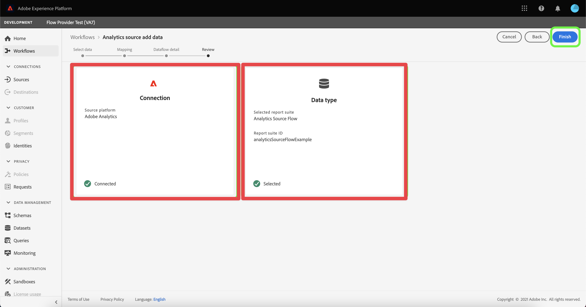

# Créer des champs de mappage et du connecteur source Analytics {#create-source-connector}

<!-- markdownlint-disable MD034 -->

>[!CONTEXTUALHELP]
>id="cja-upgrade-source-connector-create"
>title="Créer le connecteur source Analytics"
>abstract="Utilisez le connecteur source Analytics pour ingérer les données de suite de rapports à utiliser dans Customer Journey Analytics.  La création du connecteur source Analytics ne prend que quelques minutes avec les paramètres par défaut."

<!-- markdownlint-enable MD034 -->

<!-- markdownlint-disable MD034 -->

>[!CONTEXTUALHELP]
>id="cja-upgrade-source-connector-map-fields"
>title="Créer le connecteur source Analytics et mapper les champs de schéma"
>abstract="Le connecteur source doit savoir comment mapper les champs Adobe Analytics au schéma de votre organisation. Utilisez cette interface pour fournir ce mappage au connecteur source. Cette étape fait partie de l’ajout de données historiques à Customer Journey Analytics.  Le temps nécessaire à cette étape dépend fortement du nombre de dimensions et de mesures que vous devez mapper. Cette étape n&#39;est pas aussi difficile qu&#39;elle est fastidieuse et répétitive. Le mappage du flux de données devrait prendre environ une semaine."

<!-- markdownlint-enable MD034 -->

>[!NOTE]
> 
>Suivez les étapes de cette page uniquement après avoir effectué toutes les étapes de mise à niveau précédentes. Vous pouvez suivre les [étapes de mise à niveau recommandées](/help/getting-started/cja-upgrade/cja-upgrade-recommendations.md#recommended-upgrade-steps-for-most-organizations) ou suivre les étapes de mise à niveau qui ont été générées dynamiquement pour votre organisation à l’aide du questionnaire de mise à niveau d’[Adobe Analytics vers Customer Journey Analytics](https://gigazelle.github.io/cja-ttv/).
>
>Une fois les étapes de cette page terminées, continuez à suivre les étapes de mise à niveau recommandées ou les étapes de mise à niveau générées dynamiquement.

## Comprendre comment le connecteur source Analytics peut importer des données historiques dans Customer Journey Analytics

Vous pouvez utiliser le connecteur source Analytics pour importer les données des suites de rapports Adobe Analytics dans Adobe Experience Platform. Ces données peuvent ensuite être utilisées comme données historiques dans Customer Journey Analytics.

Ce processus suppose que vous souhaitez [créer un schéma personnalisé à utiliser avec l’implémentation de SDK Web de votre Customer Journey Analytics ](/help/getting-started/cja-upgrade/cja-upgrade-schema-create.md), car vous souhaitez un schéma rationalisé et adapté aux besoins de votre organisation et aux applications Platform spécifiques que vous utilisez.

Pour utiliser le connecteur source Analytics afin d’importer des données historiques dans Customer Journey Analytics, vous devez :

1. [Création d’un schéma personnalisé pour le connecteur source Analytics](/help/getting-started/cja-upgrade/cja-upgrade-source-connector-schema.md)

1. Si vous ne disposez pas déjà d’un connecteur source Analytics, créez le connecteur source Analytics et mappez les champs à votre schéma Web SDK personnalisé, comme décrit ci-dessous.

   Ou

   Si vous disposez déjà d’un connecteur source Analytics, [mappez les champs du connecteur source à votre schéma Web SDK personnalisé](/help/getting-started/cja-upgrade/cja-upgrade-from-source-connector.md).

1. [Ajouter le jeu de données du connecteur source Analytics à la connexion](/help/getting-started/cja-upgrade/cja-upgrade-source-connector-dataset.md)

## Créer des champs de mappage et du connecteur source Analytics

Une fois votre schéma personnalisé créé, vous devez créer le connecteur source Adobe Analytics à utiliser pour les données historiques. (Pour obtenir des instructions générales plus complètes sur la création d’un connecteur source, voir [Création d’une connexion source Adobe Analytics dans l’interface utilisateur](https://experienceleague.adobe.com/docs/experience-platform/sources/ui-tutorials/create/adobe-applications/analytics.html).)

Pour créer un connecteur source Adobe Analytics à utiliser pour les données historiques :

1. Dans l’interface utilisateur de Platform, dans la section **[!UICONTROL Connexions]** du rail de gauche, sélectionnez **[!UICONTROL Sources]**.

1. Sélectionnez **[!UICONTROL Applications Adobe]** dans la liste des [!UICONTROL CATÉGORIES].

1. Sélectionnez **[!UICONTROL Ajouter des données]** dans la mosaïque Adobe Analytics.

   Fenêtre 

1. Sélectionnez **[!UICONTROL Suite de rapports]** puis, dans la liste des suites de rapports, sélectionnez la suite de rapports contenant les données historiques que vous souhaitez utiliser dans Customer Journey Analytics.

   Fenêtre 

1. Sélectionnez **[!UICONTROL Suivant]** dans le coin supérieur droit de l’écran.

1. Sélectionnez **[!UICONTROL Schéma personnalisé]**, puis sélectionnez le schéma que vous avez créé dans [Création d’un schéma personnalisé qui inclut le groupe de champs Adobe Analytics](/help/getting-started/cja-upgrade/cja-upgrade-source-connector-schema.md). <!-- Deleted this, because I changed this from choosing the default schemawe're pointing them now at the schema they just created: "Adobe Experience Platform  automatically creates the schema and the corresponding dataset to map all standard fields from the selected Adobe Analytics report suite." -->

   <!-- add screenshot -->

1. Mappez chaque dimension Adobe Analytics à une dimension de schéma personnalisée.

   1. Dans la section **[!UICONTROL Mapper les champs standard]**, sélectionnez l’onglet **[!UICONTROL Personnalisé]**.

   1. Sélectionnez **[!UICONTROL Ajouter un nouveau mappage]**.

   

   1. Dans le champ **[!UICONTROL Source]** sélectionnez un champ Adobe Analytics dans le groupe de champs Modèle Adobe Analytics ExperienceEvent . Ensuite, dans le **[!UICONTROL Champ cible]**, sélectionnez le champ personnalisé du schéma XDM vers lequel vous souhaitez le mapper.

      Tous les champs Adobe Analytics n’ont pas de champ correspondant dans XDM en raison des différences d’architecture inhérentes entre AppMeasurement et XDM.

   1. Répétez cette procédure pour chaque champ du groupe de champs Modèle ExperienceEvent Adobe Analytics que vous utilisez pour collecter des données dans Adobe Analytics.

1. Sélectionnez **[!UICONTROL Suivant]** dans le coin supérieur droit de l’écran.

1. Nommez le flux de données et (facultatif) fournissez une description.

   Fenêtre 

1. Sélectionnez **[!UICONTROL Suivant]** dans le coin supérieur droit de l’écran.

1. Vérifiez la connexion, puis sélectionnez **[!UICONTROL Terminer]**.

   Fenêtre 

   Une fois la connexion créée, le flux de données est automatiquement créé pour renseigner un jeu de données avec les données Adobe Analytics de votre suite de rapports. Le flux de données ingère jusqu’à 13 mois de données historiques pour les sandbox de production. Le renvoi dans les sandbox hors production est limité à trois mois.

   Si vous utilisez le connecteur source Analytics pour importer des données historiques dans l’implémentation de Web SDK de votre Customer Journey Analytics, vous devez ajouter ce jeu de données créé automatiquement à la connexion que vous avez créée pour votre implémentation de Web SDK.

1. Continuez à suivre les [étapes de mise à niveau recommandées](/help/getting-started/cja-upgrade/cja-upgrade-recommendations.md#recommended-upgrade-steps-for-most-organizations) ou les [étapes de mise à niveau générées dynamiquement](https://gigazelle.github.io/cja-ttv/).
