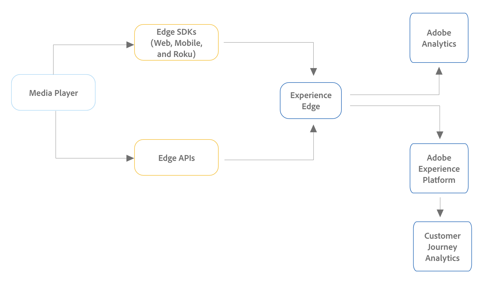

# Configuration de Streaming Media Collection pour Customer Journey Analytics {#streaming-media-setup}

<!-- markdownlint-disable MD034 -->

>[!CONTEXTUALHELP]
>id="cja-upgrade-media-edge"
>title="Configuration et implémentation de Media Edge"
>abstract="Vous pouvez configurer la collecte de médias en flux continu Adobe pour utiliser Experience Platform Edge afin de rendre les données disponibles dans Customer Journey Analytics."

<!-- markdownlint-enable MD034 -->

{{upgrade-note-step}}

Les étapes d’implémentation de Streaming Media Collection dans Customer Journey Analytics varient en fonction de votre implémentation actuelle de Streaming Media Collection dans Adobe Analytics.

La collecte de médias en flux continu peut être implémentée dans Adobe Analytics de l’une des manières suivantes :

* [Implémentations Edge Network pour la collection de médias en flux continu](#edge-network-implementations)

+++ Afficher l&#39;infographie

  

+++

* [Implémentations Adobe Analytics uniquement pour la collection Streaming Media](#adobe-analytics-only-implementations)

+++ Afficher l&#39;infographie

  

+++

Pour plus d’informations sur les différences entre ces méthodes d’implémentation, consultez [ Implémentation de la collection de médias en flux continu ](https://experienceleague.adobe.com/en/docs/media-analytics/using/implementation/overview) dans le Guide de la collection de médias en flux continu.

## Implémentations Edge Network pour la collection de médias en flux continu

Si la collection de médias en flux continu est [implémentée à l’aide d’Edge Network dans votre implémentation Adobe Analytics](https://experienceleague.adobe.com/en/docs/media-analytics/using/implementation/overview#edge-implementation-methods), cela signifie que certaines étapes requises pour mettre à niveau la collection de médias en flux continu vers Customer Journey Analytics ont déjà été effectuées dans le cadre de votre implémentation Adobe Analytics. Voici les étapes terminées :

* [Configurer le schéma dans Adobe Experience Platform](https://experienceleague.adobe.com/en/docs/media-analytics/using/implementation/edge-recommended/media-edge-sdk/implementation-edge#set-up-the-schema-in-adobe-experience-platform)

* [Créer un jeu de données dans Adobe Experience Platform](https://experienceleague.adobe.com/en/docs/media-analytics/using/implementation/edge-recommended/media-edge-sdk/implementation-edge#create-a-dataset-in-adobe-experience-platform)

* [Configurer un flux de données dans Adobe Experience Platform](https://experienceleague.adobe.com/en/docs/media-analytics/using/implementation/edge-recommended/media-edge-sdk/implementation-edge#configure-a-datastream-in-adobe-experience-platform)

Les étapes supplémentaires suivantes doivent être effectuées dans le cadre de la mise à niveau vers Customer Journey Analytics :

>[!NOTE]
>
>Lorsque vous effectuez les étapes de mise à niveau de Customer Journey Analytics, veillez à utiliser le schéma, le jeu de données et le flux de données de votre implémentation de Streaming Media Collection dans Adobe Analytics.

* [Créer une connexion dans Customer Journey Analytics](/help/getting-started/cja-upgrade/cja-upgrade-connection.md)

* [Créer une vue de données dans Customer Journey Analytics](/help/getting-started/cja-upgrade/cja-upgrade-dataview.md)

## Implémentations Adobe Analytics uniquement pour la collection Streaming Media

Si la collecte de médias en flux continu est [implémentée à l’aide d’une implémentation Adobe Analytics uniquement dans votre environnement Adobe Analytics](https://experienceleague.adobe.com/en/docs/media-analytics/using/implementation/overview#adobe-analytics-only-implementation-methods), cela signifie que les données de médias en flux continu ne sont pas encore transmises à Edge Network.

Lorsque vous créez le schéma, le jeu de données, le flux de données, la connexion et la vue de données dans le cadre de votre mise à niveau d’Adobe Analytics vers Customer Journey Analytics, effectuez les sélections suivantes pour tenir compte des données de la collecte de médias en flux continu :

* Lors de la création du schéma pour Customer Journey Analytics, incluez le groupe de champs `MediaAnalytics Interaction Details`.

  Pour plus d’informations sur l’ajout de ce groupe de champs, voir [Configurer le schéma dans Adobe Experience Platform](https://experienceleague.adobe.com/en/docs/media-analytics/using/implementation/edge-recommended/media-edge-sdk/implementation-edge#set-up-the-schema-in-adobe-experience-platform) dans le Guide de collecte de médias en flux continu.

  Pour plus d’informations sur la création du schéma, voir [Création d’un schéma personnalisé à utiliser avec Customer Journey Analytics](/help/getting-started/cja-upgrade/cja-upgrade-schema-create.md).

* Lors de la configuration du flux de données pour Customer Journey Analytics, activez Media Analytics.

  Pour plus d’informations sur l’activation de cette option, voir [Configurer un flux de données dans Adobe Experience Platform](https://experienceleague.adobe.com/en/docs/media-analytics/using/implementation/edge-recommended/media-edge-sdk/implementation-edge#configure-a-datastream-in-adobe-experience-platform) dans le Guide de collecte de médias en flux continu.

  Pour plus d’informations sur la création du flux de données, voir [Créer un flux de données à utiliser avec Customer Journey Analytics](/help/getting-started/cja-upgrade/cja-upgrade-datastream.md).

* Lors de la création d’une vue de données pour Customer Journey Analytics, incluez les champs de schéma requis pour la collection de médias en flux continu.

  Veillez à mapper ces champs de schéma aux valeurs correctes dans l’objet XDM.

  Pour plus d’informations sur les champs obligatoires, voir [Création d’une vue de données dans Customer Journey Analytics](/help/getting-started/cja-upgrade/cja-upgrade-dataview.md) dans le Guide de collecte de médias en flux continu.

  Pour plus d’informations sur la création de la vue de données, voir [Création d’une vue de données dans Customer Journey Analytics](/help/getting-started/cja-upgrade/cja-upgrade-dataview.md).

