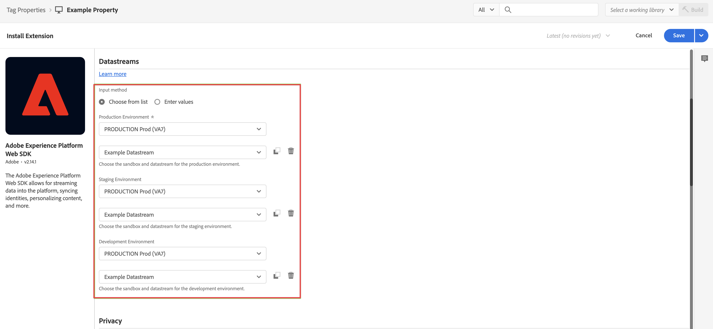

# Ajouter l’extension SDK web à votre balise {#upgrade-tag-extension}

<!-- markdownlint-disable MD034 -->

>[!CONTEXTUALHELP]
>id="cja-upgrade-tag-extension"
>title="Ajouter l’extension SDK web Adobe Experience Platform à votre propriété de balise"
>abstract="Ajoutez l’extension SDK web Adobe Experience Platform à votre propriété de balise. L’ajout de l’extension SDK web à votre propriété de balise est simplifié et ne prend que quelques minutes."

<!-- markdownlint-enable MD034 -->

{{upgrade-note-step}}

Utilisez la fonction Balises d’Adobe Experience Platform pour implémenter du code sur le site afin de collecter des données. Cette solution de gestion des balises vous permet de déployer le code parallèlement à d’autres exigences de balisage. Les balises offrent une intégration transparente avec Adobe Experience Platform à l’aide de l’extension du SDK Web Adobe Experience Platform.

Les informations suivantes décrivent comment ajouter l’extension SDK web à votre balise. Pour plus d’informations, consultez [Configuration de l’extension de balise SDK web](https://experienceleague.adobe.com/fr/docs/experience-platform/tags/extensions/client/web-sdk/web-sdk-extension-configuration) de la documentation d’Experience Platform. Le SDK web inclut le [!UICONTROL service Adobe Experience Cloud ID] de manière native, de sorte que vous n’avez pas besoin d’ajouter l’extension du service d’ID à votre balise.

Après avoir [créé une balise](/help/getting-started/cja-upgrade/cja-upgrade-tag-property.md), vous devez la configurer avec l’extension SDK web Adobe Experience Platform. Vous pouvez ainsi envoyer des données à Adobe Experience Platform (par le biais de votre train de données).

Pour ajouter l’extension SDK web à votre balise, procédez comme suit :

1. Connectez-vous à experiencecloud.adobe.com à l’aide de vos identifiants Adobe ID.

1. Dans Adobe Experience Platform, accédez à **[!UICONTROL Collecte de données]** > **[!UICONTROL Balises]**.

1. Sélectionnez la balise que vous venez de créer dans la liste de [!UICONTROL Propriétés de balise] pour l’ouvrir.

1. Sélectionnez **[!UICONTROL Extensions]** dans le rail de gauche.

1. Sélectionnez **[!UICONTROL Catalogue]** dans la barre supérieure.

1. Recherchez ou accédez à l’**[!UICONTROL extension SDK web Adobe Experience Platform]**, puis sélectionnez **[!UICONTROL Installer]** pour l’installer.

   

1. Sélectionnez la sandbox et le flux de données créé précédemment pour l’[!UICONTROL Environnement de production], (facultatif) l’[!UICONTROL Environnement d’évaluation] et l’[!UICONTROL Environnement de développement].

   

1. Sélectionnez **[!UICONTROL Enregistrer]**.

{{upgrade-final-step}}
