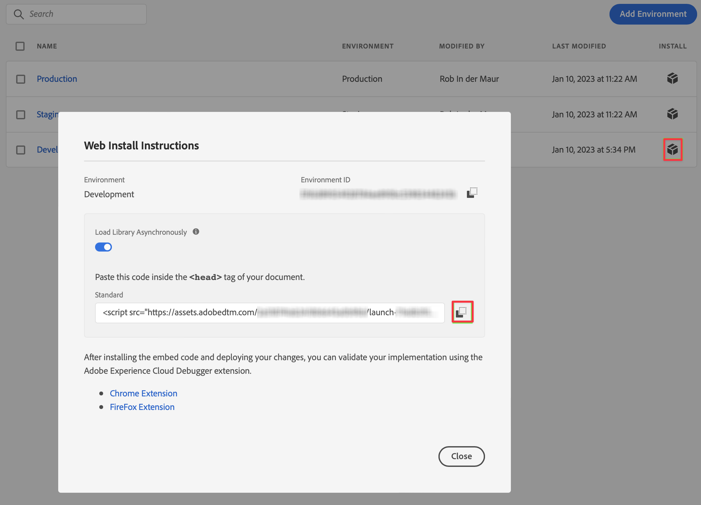

# Mettre en œuvre la balise de chargement pour l’extension SDK web {#upgrade-tag-loader}

<!-- markdownlint-disable MD034 -->

>[!CONTEXTUALHELP]
>id="cja-upgrade-tag-loader"
>title="Mettre en œuvre la balise loader sur votre site"
>abstract="Collaborez avec l’équipe de développement de votre site web pour installer la balise de chargement sur chaque page de votre site.<br><br>Le temps d’achèvement de cette tâche dépend largement du temps de réponse de l’équipe d’ingénierie avec laquelle vous travaillez pour déployer le code. Certaines organisations disposant d’équipes d’ingénierie hautement adaptatives peuvent effectuer cette étape en quelques jours, tandis que les équipes d’ingénierie ayant un important backlog de tâches peuvent avoir besoin d’un mois ou plus."

<!-- markdownlint-enable MD034 -->

{{upgrade-note-step}}

Vous devez installer la balise sur le site web dont vous souhaitez effectuer le suivi, ce qui implique de placer le code dans la balise d’en-tête du modèle du site web.

Le processus suivant décrit comment obtenir le code qui fait référence à votre balise. Pour plus d’informations, consultez les [Guides d’implémentation pour les balises et le transfert d’événement](https://experienceleague.adobe.com/fr/docs/experience-platform/tags/get-started/implementation-guides) de la documentation d’Experience Platform.

Pour obtenir le code qui fait référence à votre balise :

1. Connectez-vous à experience.adobe.com à l’aide de vos informations d’identification Adobe ID.

1. Dans Adobe Experience Platform, accédez à **[!UICONTROL Collecte de données]** > **[!UICONTROL Balises]**.

1. Sur la page **[!UICONTROL Propriétés de la balise]**, sélectionnez la balise que vous venez de créer dans la liste de propriétés pour l’ouvrir.

1. Sélectionnez **[!UICONTROL Environnements]** dans le rail de gauche.

1. Dans la liste des environnements, sélectionnez le bouton d’installation (boîte) approprié.

   Dans la boîte de dialogue [!UICONTROL Instructions d’installation Web], sélectionnez le bouton Copier en regard du code de script qui doit se présenter comme suit :

   ```
   <script src="https://assets.adobedtm.com/2a518741ab24/.../launch-...-development.min.js" async></script>>
   ```

   

1. Sélectionnez **[!UICONTROL Fermer]**.

   Au lieu du code de l’environnement de développement, vous auriez pu sélectionner un autre environnement (évaluation, production) en fonction de l’étape à laquelle vous vous trouvez dans le processus de déploiement du SDK Web Adobe Experience Platform.

   Consultez [Environnements](https://experienceleague.adobe.com/docs/experience-platform/tags/publish/environments/environments.html?lang=fr) pour plus d’informations.

{{upgrade-final-step}}
