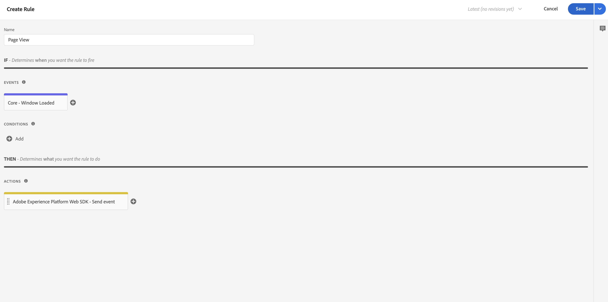

# Ajouter une logique de collecte de données XDM à votre balise {#upgrade-tag-xdm}

<!-- markdownlint-disable MD034 -->

>[!CONTEXTUALHELP]
>id="cja-upgrade-tag-xdm"
>title="Ajouter une logique de collecte de données XDM à votre balise"
>abstract="Une fois la balise de chargement installée sur votre site, vous pouvez ajouter des règles et des éléments de données pour renseigner un objet XDM à envoyer à Adobe. Adobe recommande de conserver un document de conception de solution pour suivre la configuration de vos balises.  Cette étape est une tâche ardue, car elle implique de configurer toute la logique Analytics pour votre propriété. Attendez-vous à consacrer un mois ou plus pour établir les règles de balise correctes, les tester et les déployer sur votre site."

<!-- markdownlint-enable MD034 -->

{{upgrade-note-step}}

Après avoir [créé la balise et ajouté l’extension SDK web](/help/getting-started/cja-upgrade/cja-upgrade-tag-property.md), vous devez la configurer avec les éléments de données et les règles en fonction de la manière dont vous souhaitez effectuer le suivi de votre site et envoyer des données à Adobe Experience Platform. Après avoir configuré les éléments de données et les règles de votre balise, vous pouvez la créer et la publier.

## Configurer les éléments de données

Les éléments de données sont les blocs de construction de votre dictionnaire de données (ou mappage de données). Utilisez des éléments de données pour recueillir, organiser et diffuser des données dans les technologies marketing et publicitaires. Vous configurez des éléments de données dans la balise qui peuvent être lus à partir de la couche de données et être utilisés pour diffuser des données dans Adobe Experience Platform. (Pour plus d’informations sur les éléments de données, consultez [Éléments de données](https://experienceleague.adobe.com/fr/docs/experience-platform/tags/ui/data-elements) dans la documentation sur les balises.)

Les sections suivantes décrivent les éléments de données suggérés et d’autres éléments de données courants que vous pouvez configurer.

Il existe différents types d’éléments de données. Vous pouvez configurer deux éléments de données courants : l’un qui capture le nom de la page que les personnes consultent sur votre site et l’autre qui capture l’Experience Cloud ID de chaque personne qui visite votre site.

Après avoir configuré ces deux éléments de données, vous pouvez configurer des éléments de données supplémentaires pour les données spécifiques que vous souhaitez capturer.

Enfin, après avoir défini tous les éléments de données de votre choix, vous devez les affecter au [schéma que vous avez créé](/help/getting-started/cja-upgrade/cja-upgrade-schema-create.md) précédemment. Pour ce faire, définissez un autre élément de données XDM qui fournit une représentation du schéma XDM.

<!-- Assigning data elements to an XDM object. All of the available XDM objects are based on the schema -->

### Créer des éléments de données suggérés

Les sections suivantes décrivent comment créer des éléments de données communs qui s’appliquent à la plupart des organisations.

#### Élément de données Nom de page

Un élément de données courant qui s’applique à la plupart des organisations est un élément de données qui capture le nom de la page que les personnes consultent.

Pour créer un élément de données de nom de page, procédez comme suit :

1. Connectez-vous à experiencecloud.adobe.com à l’aide de vos identifiants Adobe ID.

1. Dans Adobe Experience Platform, accédez à **[!UICONTROL Collecte de données]** > **[!UICONTROL Balises]**.

1. Sur la page **[!UICONTROL Propriétés de la balise]**, sélectionnez la balise que vous venez de créer dans la liste de propriétés pour l’ouvrir.

1. Sélectionnez **[!UICONTROL Éléments de données]** dans le rail de gauche.

1. Sélectionnez **[!UICONTROL Ajouter un élément de données]**.

1. Dans la boîte de dialogue **[!UICONTROL Créer un élément de données]**, spécifiez les informations suivantes :

   * **[!UICONTROL Nom]** : nom de votre élément de données. Par exemple `Page Name`.

   * **[!UICONTROL Extension]** : sélectionnez **[!UICONTROL Core]** dans la liste.

   * **[!UICONTROL Type d’élément de données]** : sélectionnez **[!UICONTROL Informations sur la page]** dans la liste.

   * **[!UICONTROL Attribut]** : sélectionnez **[!UICONTROL Titre]** dans la liste.

     

     Vous auriez également pu utiliser la valeur d’une variable de la couche de données, par exemple `pageName` et le type d’élément de données [!UICONTROL Variable JavaScript] pour définir l’élément de données.

     

1. Sélectionnez **[!UICONTROL Enregistrer]**.

   Vous devez maintenant configurer un élément de données faisant référence à Experience Cloud ID qui est automatiquement fourni par le SDK Web Adobe Experience Platform et disponible via l’extension du service Experience Cloud ID.

1. Continuez avec [élément de données ECID](#ecid-data-element).

#### Élément de données ECID

Un élément de données courant qui s’applique à la plupart des organisations est un élément de données qui capture l’Experience Cloud ID de chaque personne qui visite votre site.

Pour créer un élément de données ECID, procédez comme suit :

1. Connectez-vous à experiencecloud.adobe.com à l’aide de vos identifiants Adobe ID.

1. Dans Adobe Experience Platform, accédez à **[!UICONTROL Collecte de données]** > **[!UICONTROL Balises]**.

1. Sélectionnez la balise que vous venez de créer dans la liste de [!UICONTROL Propriétés de balise] pour l’ouvrir.

1. (Le cas échéant) Installez l’extension du service Experience Cloud ID si elle n’est pas déjà installée :

   1. Sélectionnez **[!UICONTROL Extensions]** dans le rail de gauche.

   1. L’onglet **[!UICONTROL Installé]** est sélectionné par défaut. Si la tuile **[!UICONTROL Service Experience Cloud ID]** est répertoriée, passez à l’étape 5.

   1. Si la tuile **[!UICONTROL Service Experience Cloud ID]** n’est pas répertoriée, sélectionnez l’onglet **[!UICONTROL Catalogue]**.

   1. Dans le champ de recherche, recherchez **[!UICONTROL Service Experience Cloud ID]**, puis sélectionnez la tuile lorsqu’elle apparaît

   1. Sélectionnez **[!UICONTROL Installer]** > **[!UICONTROL Enregistrer]**.

1. Sélectionnez **[!UICONTROL Éléments de données]** dans le rail de gauche.

1. Sélectionnez **[!UICONTROL Ajouter un élément de données]**.

1. Dans la boîte de dialogue **[!UICONTROL Créer un élément de données]**, spécifiez les informations suivantes :

   * **[!UICONTROL Nom]** : nom de votre élément de données. Par exemple `ECID`.

   * **[!UICONTROL Extension]** : sélectionnez **[!UICONTROL Service Experience Cloud ID]** dans la liste.

   * **[!UICONTROL Type d’élément de données]** : sélectionnez **[!UICONTROL ECID]** dans la liste.

     

1. Sélectionnez **[!UICONTROL Enregistrer]**.

1. Continuez avec [Création d’éléments de données supplémentaires](#create-additional-data-elements).

### Créer des éléments de données supplémentaires

Créez un élément de données pour chaque type de données que vous souhaitez collecter. Utilisez le même processus décrit dans [Élément de données Nom de page](#page-name-data-element) et [Élément de données ECID](#ecid-data-element) pour créer chaque élément de données supplémentaire.

Les éléments de données que vous créez doivent avoir un champ de corrélation dans votre schéma.

Les éléments de données courants varient selon les besoins du secteur et de l’entreprise. Tenez compte des éléments de données communs suivants, organisés par secteur :

**Éléments de données de vente au détail**

* Produits

* Ajouts au panier

* Achats

**Éléments de données financiers**

* ID de transaction

* Date de transaction

* Type de service

**Éléments de données de santé**

* Identifiant du fournisseur

* Date de la visite

* Type de traitement

Après avoir créé tous les éléments de données requis par votre organisation pour votre implémentation, continuez avec [élément de données d’objet XDM](#xdm-object-data-element).

### Élément de données d’objet XDM

Enfin, vous devez maintenant mapper l’un des éléments de données que vous avez créé pour le [schéma que vous avez créé](/help/getting-started/cja-upgrade/cja-upgrade-schema-create.md) précédemment. Pour ce faire, définissez un élément de données d’objet XDM qui fournit une représentation de votre schéma XDM.

Définir un élément de données d’objet XDM :

1. Connectez-vous à experiencecloud.adobe.com à l’aide de vos identifiants Adobe ID.

1. Dans Adobe Experience Platform, accédez à **[!UICONTROL Collecte de données]** > **[!UICONTROL Balises]**.

1. Sélectionnez la balise que vous venez de créer dans la liste de [!UICONTROL Propriétés de balise] pour l’ouvrir.

1. Sélectionnez **[!UICONTROL Éléments de données]** dans le rail de gauche.

1. Sélectionnez **[!UICONTROL Ajouter un élément de données]**.

1. Dans la boîte de dialogue **[!UICONTROL Créer un élément de données]**, spécifiez les informations suivantes :

   * **[!UICONTROL Nom]** : nom de votre élément de données. Par exemple `XDM - Page View`.

   * **[!UICONTROL Extension]** : sélectionnez **[!UICONTROL SDK web Adobe Experience Platform]** dans la liste.

   * **[!UICONTROL Type d’élément de données]** : sélectionnez **[!UICONTROL Objet XDM]** dans la liste.

   * **[!UICONTROL Sandbox]** : sélectionnez le sandbox dans la liste.

   * **[!UICONTROL Schéma]** : sélectionnez le schéma dans la liste.

1. Mappez l’attribut `identification > core > ecid`, défini dans le schéma sur l’élément de données ECID. Sélectionnez l’icône de cylindre pour choisir facilement l’élément de données ECID dans la liste d’éléments de données.

   

   

1. Mappez l’attribut `web > webPageDetails > name`, défini dans le schéma sur l’élément de données Nom de page.

   

1. Sélectionnez **[!UICONTROL Enregistrer]**.

1. Continuez avec [Configurer les règles](#configure-rules).

## **Configurer les règles**

Dans Adobe Experience Platform, les balises suivent un système basé sur des règles. Elles recherchent les interactions utilisateur et les données associées. Lorsque les critères définis dans votre règle sont satisfaits, la règle déclenche l’extension, le script ou le code côté client que vous avez identifié. Vous pouvez utiliser des règles pour envoyer des données (comme un objet XDM) dans Adobe Experience Platform à l’aide de l’extension du SDK Web Adobe Experience Platform.

Définir une règle :

>[!NOTE]
>
>Les étapes suivantes constituent un exemple de définition d’une règle qui envoie des données XDM, contenant des valeurs d’autres éléments de données, à Adobe Experience Platform.
>
>Vous pouvez utiliser des règles de différentes manières dans la balise pour manipuler des variables (à l’aide des éléments de données).
>
>Consultez les [Règles](https://experienceleague.adobe.com/docs/experience-platform/tags/ui/rules.html?lang=fr) pour plus d’informations.

1. Connectez-vous à experiencecloud.adobe.com à l’aide de vos identifiants Adobe ID.

1. Dans Adobe Experience Platform, accédez à **[!UICONTROL Collecte de données]** > **[!UICONTROL Balises]**.

1. Sélectionnez la balise que vous venez de créer dans la liste de [!UICONTROL Propriétés de balise] pour l’ouvrir.

1. Sélectionnez **[!UICONTROL Règles]** dans le rail de gauche.

1. Sélectionnez **[!UICONTROL Ajouter une règle]**.

1. Dans la boîte de dialogue **[!UICONTROL Créer une règle]**, spécifiez les informations suivante :

   * **[!UICONTROL Nom :]** nom de la règle. Par exemple `Page View`.

   * **[!UICONTROL Événements]** : sélectionnez **[!UICONTROL + Ajouter]**. Ensuite, dans la boîte de dialogue **[!UICONTROL Configuration d’événement]**, spécifiez les informations suivantes. Lorsque vous avez terminé, sélectionnez **[!UICONTROL Conserver les modifications]**.

      * **[!UICONTROL Extension]** : sélectionnez **[!UICONTROL Core]** dans la liste.

      * **[!UICONTROL Type d’événement]** : sélectionnez **[!UICONTROL Fenêtre chargée]** dans la liste.

        

   * **[!UICONTROL Actions]** : sélectionnez **[!UICONTROL + Ajouter]**. Ensuite, dans la boîte de dialogue [!UICONTROL Configuration d’action], spécifiez les informations suivantes. Lorsque vous avez terminé, sélectionnez **[!UICONTROL Conserver les modifications]**.

      * **[!UICONTROL Extension]** : sélectionnez **[!UICONTROL SDK web Adobe Experience Platform]** dans la liste.

      * **[!UICONTROL Type d’action]** : sélectionnez **[!UICONTROL Envoyer l’événement]** dans la liste.

      * **[!UICONTROL Type]** : sélectionnez **[!UICONTROL Pages vues web Webpagedetails]** dans la liste.

      * **[!UICONTROL Données XDM]** : sélectionnez l’icône de cylindre, puis sélectionnez **[!UICONTROL XDM - Page vue]** dans la liste des éléments de données.

        

        La règle doit se présenter comme suit :

        

1. Sélectionnez **[!UICONTROL Enregistrer]**.

1. Répétez ce processus pour chaque règle que vous souhaitez ajouter à votre site.

   Pour plus d’informations sur les règles, consultez [Règles](https://experienceleague.adobe.com/fr/docs/experience-platform/tags/ui/rules) dans la documentation des balises.

1. Continuez avec [Créer et publier votre balise](#build-and-publish-your-tag).

## Créer et publier votre balise

Après avoir défini des éléments de données et des règles, vous devez créer et publier votre balise. Lorsque vous créez une version de bibliothèque, vous devez l’affecter à un environnement. Les extensions, règles et éléments de données de la version sont ensuite compilés et placés dans l’environnement attribué. Chaque environnement fournit un code intégré unique qui vous permet d’intégrer la version qui lui est assignée dans votre site.

Les balises Adobe Experience Platform prennent en charge les processus de publication simples à complexes qui doivent s’adapter au déploiement du SDK web Adobe Experience Platform. Consultez [Présentation de la publication](https://experienceleague.adobe.com/docs/experience-platform/tags/publish/overview.html?lang=fr) pour plus d’informations.

Créer et publier la balise :

1. Connectez-vous à experiencecloud.adobe.com à l’aide de vos identifiants Adobe ID.

1. Dans Adobe Experience Platform, accédez à **[!UICONTROL Collecte de données]** > **[!UICONTROL Balises]**.

1. Sélectionnez la balise que vous venez de créer dans la liste de [!UICONTROL Propriétés de balise] pour l’ouvrir.

1. Sélectionnez **[!UICONTROL Flux de publication]** dans le rail de gauche.

1. Sélectionnez **[!UICONTROL Ajouter une bibliothèque]**.

1. Dans la boîte de dialogue **[!UICONTROL Créer une bibliothèque]**, spécifiez les informations suivantes :

   * **[!UICONTROL Nom :]** nom de la bibliothèque.

   * **[!UICONTROL Environnement]** : sélectionnez **[!UICONTROL Développement (développement)]** dans la liste.

1. Sélectionnez **[!UICONTROL + Ajouter toutes les ressources modifiées]**.

   

1. Sélectionnez **[!UICONTROL Enregistrer et créer pour le développement]**.

   La balise est enregistrée et créée pour votre environnement de développement. Un point vert indique que la balise a été créée avec succès dans l’environnement de développement.

1. Vous pouvez sélectionner **[!UICONTROL …]** pour recréer la bibliothèque ou la déplacer vers un environnement d’évaluation ou de production.

   

{{upgrade-final-step}}

