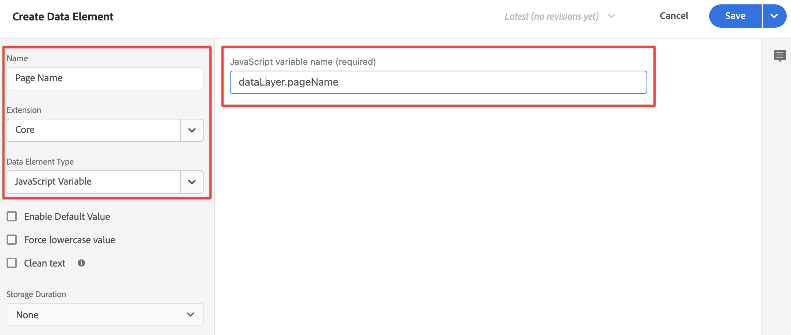

# Ajout d’une logique de collecte de données XDM à votre balise

>[!NOTE]
> 
>Suivez les étapes de cette page uniquement une fois toutes les étapes de mise à niveau précédentes effectuées. Vous pouvez suivre les [étapes de mise à niveau recommandées](/help/getting-started/cja-upgrade/cja-upgrade-recommendations.md#recommended-upgrade-steps-for-most-organizations) ou les étapes de mise à niveau générées dynamiquement pour votre organisation avec le [questionnaire de mise à niveau Adobe Analytics vers Customer Journey Analytics](https://gigazelle.github.io/cja-ttv/).
>
>Une fois que vous avez terminé les étapes de cette page, continuez à suivre les étapes de mise à niveau recommandées ou les étapes de mise à niveau générées dynamiquement.

Après avoir [créé la balise et ajouté l’extension SDK Web](/help/getting-started/cja-upgrade/cja-upgrade-tag-property.md), vous devez la configurer avec des éléments de données et des règles, selon la manière dont vous souhaitez effectuer le suivi de votre site et envoyer des données à Adobe Experience Platform. Après avoir configuré les éléments de données et les règles pour votre balise, vous pouvez la créer et la publier.

## Configuration des éléments de données

Les éléments de données sont les blocs de construction de votre dictionnaire de données (ou mappage de données). Utilisez des éléments de données pour recueillir, organiser et diffuser des données dans les technologies marketing et publicitaires. Vous configurez des éléments de données dans la balise qui peuvent être lus à partir de la couche de données et être utilisés pour diffuser des données dans Adobe Experience Platform.

Il existe différents types d’éléments de données. Tout d’abord, configurez un élément de données pour capturer le nom de page que les personnes consultent sur votre site. Configurez ensuite un élément de données référençant l’ID Experience Cloud. Enfin, définissez un élément de données d’objet XDM.

### Élément de données de nom de page

Définir un élément de données de nom de page :

1. Connectez-vous à experience.adobe.com à l’aide de vos informations d’identification Adobe ID.

1. Dans Adobe Experience Platform, accédez à **[!UICONTROL Collecte de données]** > **[!UICONTROL Balises]**.

1. Sélectionnez la balise que vous venez de créer dans la liste de [!UICONTROL Propriétés de balise] pour l’ouvrir.

1. Sélectionnez **[!UICONTROL Éléments de données]** dans le rail de gauche.

1. Sélectionnez **[!UICONTROL Ajouter un élément de données]**.

1. Dans la boîte de dialogue [!UICONTROL Créer un élément de données], spécifiez les informations suivantes :

   * **[!UICONTROL Nom]** : nom de votre élément de données. Par exemple `Page Name`.

   * **[!UICONTROL Extension]** : sélectionnez **[!UICONTROL Core]** dans la liste.

   * **[!UICONTROL Type d’élément de données]** : sélectionnez **[!UICONTROL Informations sur la page]** dans la liste.

   * **[!UICONTROL Attribut]** : sélectionnez **[!UICONTROL Titre]** dans la liste.

     

     Vous auriez également pu utiliser la valeur d’une variable de la couche de données, par exemple `pageName` et le type d’élément de données [!UICONTROL Variable JavaScript] pour définir l’élément de données.

     

1. Sélectionnez **[!UICONTROL Enregistrer]**.

   Vous devez maintenant configurer un élément de données faisant référence à Experience Cloud ID qui est automatiquement fourni par le SDK Web Adobe Experience Platform et disponible via l’extension du service Experience Cloud ID.

1. Passez à l’élément de données [ECID](#ecid-data-element).

### Élément de données ECID

Définir un élément de données ECID :

1. Connectez-vous à experience.adobe.com à l’aide de vos informations d’identification Adobe ID.

1. Dans Adobe Experience Platform, accédez à **[!UICONTROL Collecte de données]** > **[!UICONTROL Balises]**.

1. Sélectionnez la balise que vous venez de créer dans la liste de [!UICONTROL Propriétés de balise] pour l’ouvrir.

1. Sélectionnez **[!UICONTROL Éléments de données]** dans le rail de gauche.

1. Sélectionnez **[!UICONTROL Ajouter un élément de données]**.

1. Dans la boîte de dialogue [!UICONTROL Créer un élément de données], spécifiez les informations suivantes :

   * **[!UICONTROL Nom]** : nom de votre élément de données. Par exemple `ECID`.

   * **[!UICONTROL Extension]** : sélectionnez **[!UICONTROL Experience Cloud ID Service]** dans la liste.

   * **[!UICONTROL Type d’élément de données]** : sélectionnez **[!UICONTROL ECID]** dans la liste.

     

1. Sélectionnez **[!UICONTROL Enregistrer]**.

1. Passez à l’ [élément de données d’objet XDM](#xdm-object-data-element).

### Elément de données d’objet XDM

Enfin, vous devez maintenant mapper l’un des éléments de données spécifiques au schéma que vous avez défini précédemment. Vous définissez un autre élément de données qui fournit une représentation du schéma XDM.

Définir un élément de données d’objet XDM :

1. Connectez-vous à experience.adobe.com à l’aide de vos informations d’identification Adobe ID.

1. Dans Adobe Experience Platform, accédez à **[!UICONTROL Collecte de données]** > **[!UICONTROL Balises]**.

1. Sélectionnez la balise que vous venez de créer dans la liste de [!UICONTROL Propriétés de balise] pour l’ouvrir.

1. Sélectionnez **[!UICONTROL Éléments de données]** dans le rail de gauche.

1. Sélectionnez **[!UICONTROL Ajouter un élément de données]**.

1. Dans la boîte de dialogue [!UICONTROL Créer un élément de données], spécifiez les informations suivantes :

   * **[!UICONTROL Nom]** : nom de votre élément de données. Par exemple `XDM - Page View`.

   * **[!UICONTROL Extension]** : sélectionnez **[!UICONTROL Adobe Experience Platform Web SDK]** dans la liste.

   * **[!UICONTROL Type d’élément de données]** : sélectionnez **[!UICONTROL Objet XDM]** dans la liste.

   * **[!UICONTROL Sandbox]** : sélectionnez votre environnement de test dans la liste.

   * **[!UICONTROL Schéma]** : sélectionnez votre schéma dans la liste.

1. Mappez l’attribut `identification > core > ecid`, défini dans le schéma sur l’élément de données ECID. Sélectionnez l’icône de cylindre pour choisir facilement l’élément de données ECID dans la liste d’éléments de données.

   

   

1. Mappez l’attribut `web > webPageDetails > name`, défini dans le schéma sur l’élément de données Nom de page.

   

1. Sélectionnez **[!UICONTROL Enregistrer]**.

1. Passez à [Configurer des règles](#configure-rules).

## **Configurer des règles**

Dans Adobe Experience Platform, les balises suivent un système basé sur des règles. Elles recherchent les interactions utilisateur et les données associées. Lorsque les critères définis dans votre règle sont satisfaits, la règle déclenche l’extension, le script ou le code côté client que vous avez identifié. Vous pouvez utiliser des règles pour envoyer des données (comme un objet XDM) dans Adobe Experience Platform à l’aide de l’extension du SDK Web Adobe Experience Platform.

Définir une règle :

>[!NOTE]
>
>Les étapes suivantes constituent un exemple de définition d’une règle qui envoie des données XDM, contenant des valeurs d’autres éléments de données, à Adobe Experience Platform.
>
>Vous pouvez utiliser des règles de différentes manières dans la balise pour manipuler des variables (à l’aide des éléments de données).
>
>Consultez les [Règles](https://experienceleague.adobe.com/docs/experience-platform/tags/ui/rules.html?lang=fr) pour plus d’informations.

1. Connectez-vous à experience.adobe.com à l’aide de vos informations d’identification Adobe ID.

1. Dans Adobe Experience Platform, accédez à **[!UICONTROL Collecte de données]** > **[!UICONTROL Balises]**.

1. Sélectionnez la balise que vous venez de créer dans la liste de [!UICONTROL Propriétés de balise] pour l’ouvrir.

1. Sélectionnez **[!UICONTROL Règles]** dans le rail de gauche.

1. Sélectionnez **[!UICONTROL Créer une règle]**.

1. Dans la boîte de dialogue [!UICONTROL Créer une règle], spécifiez les informations suivantes :

   * **[!UICONTROL Nom]** : nom de la règle. Par exemple `Page View`.

   * **[!UICONTROL Events]** : sélectionnez **[!UICONTROL + Add]**. Ensuite, dans la boîte de dialogue [!UICONTROL Event Configuration], spécifiez les informations suivantes. Lorsque vous avez terminé, sélectionnez **[!UICONTROL Conserver les modifications]**.

      * **[!UICONTROL Extension]** : sélectionnez **[!UICONTROL Core]** dans la liste.

      * **[!UICONTROL Type d’événement]** : sélectionnez **[!UICONTROL Window Loaded]** (Fenêtre chargée) dans la liste.

        

   * **[!UICONTROL Actions]** : sélectionnez **[!UICONTROL + Ajouter]**. Ensuite, dans la boîte de dialogue [!UICONTROL Configuration de l’action], spécifiez les informations suivantes. Lorsque vous avez terminé, sélectionnez **[!UICONTROL Conserver les modifications]**.

      * **[!UICONTROL Extension]** : sélectionnez **[!UICONTROL Adobe Experience Platform Web SDK]** dans la liste.

      * **[!UICONTROL Type d’action]** : sélectionnez **[!UICONTROL Envoyer l’événement]** dans la liste.

      * **[!UICONTROL Type]** : sélectionnez **[!UICONTROL web.webpagedetails.pageViews]** dans la liste.

      * **[!UICONTROL Données XDM]** : sélectionnez l’icône de cylindre, puis **[!UICONTROL XDM - Page vue]** dans la liste des éléments de données.

        

        La règle doit se présenter comme suit :

        

1. Sélectionnez **[!UICONTROL Enregistrer]**.

## Créer et publier votre balise

Après avoir défini des éléments de données et des règles, vous devez créer et publier votre balise. Lorsque vous créez une version de bibliothèque, vous devez l’affecter à un environnement. Les extensions, règles et éléments de données de la version sont ensuite compilés et placés dans l’environnement attribué. Chaque environnement fournit un code incorporé unique qui vous permet d’intégrer la version qui lui est assignée dans votre site.

Les balises Adobe Experience Platform prennent en charge les processus de publication simples à complexes qui doivent s’adapter à votre déploiement du SDK Web de Adobe Experience Platform. Consultez [Présentation de la publication](https://experienceleague.adobe.com/docs/experience-platform/tags/publish/overview.html?lang=fr) pour plus d’informations.

Créer et publier la balise :

1. Connectez-vous à experience.adobe.com à l’aide de vos informations d’identification Adobe ID.

1. Dans Adobe Experience Platform, accédez à **[!UICONTROL Collecte de données]** > **[!UICONTROL Balises]**.

1. Sélectionnez la balise que vous venez de créer dans la liste de [!UICONTROL Propriétés de balise] pour l’ouvrir.

1. Sélectionnez **[!UICONTROL Flux de publication]** dans le rail de gauche.

1. Sélectionnez **[!UICONTROL Sélectionner une bibliothèque de travail]**, puis **[!UICONTROL Ajouter une bibliothèque…]**.

1. Dans la boîte de dialogue [!UICONTROL Créer une bibliothèque], spécifiez les informations suivantes :

   * **[!UICONTROL Nom]** : nom de la bibliothèque.

   * **[!UICONTROL Environnement]** : sélectionnez **[!UICONTROL Développement (développement)]** dans la liste.

1. Sélectionnez **[!UICONTROL + Ajouter toutes les ressources modifiées]**.

   

1. Sélectionnez **[!UICONTROL Enregistrer et créer pour le développement]**.

   Votre balise est enregistrée et créée pour votre environnement de développement. Un point vert indique que la balise a été créée avec succès dans l’environnement de développement.

1. Vous pouvez sélectionner **[!UICONTROL …]** pour recréer la bibliothèque ou la déplacer vers un environnement d’évaluation ou de production.

   

