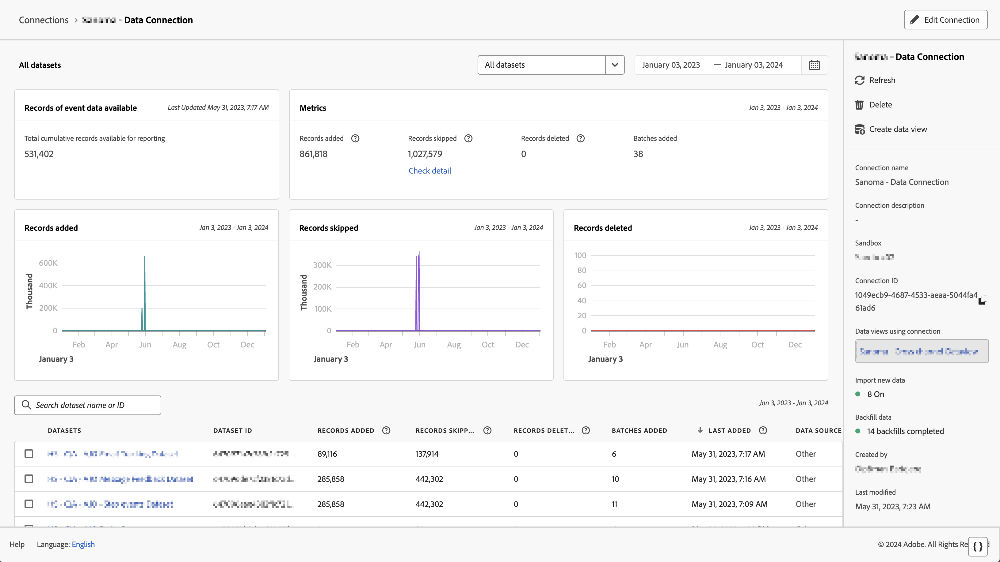

# Vérifier la circulation des données vers Customer Journey Analytics {#validate-data}

<!-- markdownlint-disable MD034 -->

>[!CONTEXTUALHELP]
>id="cja-upgrade-data-validate"
>title="Vérifier la circulation des données"
>abstract="Utilisez les détails de connexion pour vérifier si les données circulent vers Customer Journey Analytics.  Si tout a été fait correctement et parfaitement, cette étape peut être réalisée en moins d’une journée. S’il existe plusieurs problèmes de collecte de données, leur résolution peut prendre beaucoup plus de temps."

<!-- markdownlint-enable MD034 -->

{{upgrade-note-step}}

Vous pouvez vérifier que la connexion est active et que les données circulent vers les vues de données dans Customer Journey Analytics.

1. Dans Customer Journey Analytics, sélectionnez l’onglet Connexions.

   

1. Sélectionnez la [connexion que vous avez configurée](/help/getting-started/cja-upgrade/cja-upgrade-connection.md).

   

1. Consultez [Détails de la connexion](/help/connections/manage-connections.md#manage-connections) dans [Gérer les connexions](/help/connections/manage-connections.md) pour plus d’informations sur les détails disponibles sur chaque connexion.

{{upgrade-final-step}}

<!-- Should we duplicate the content here or single source it with /help/connections/manage-connections.md -->
