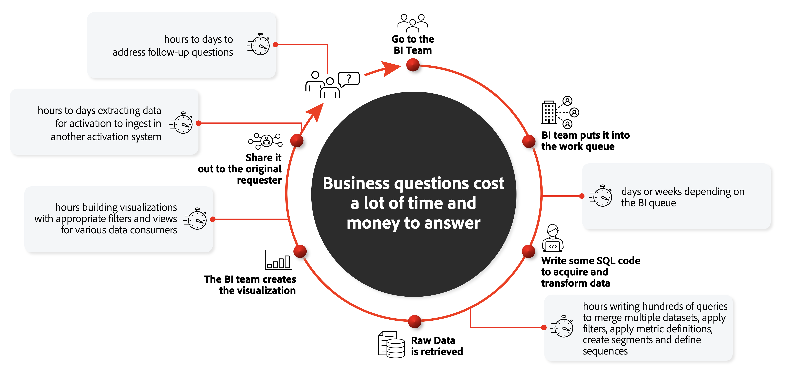

# Comparaison de CJA aux solutions BI

Avec l’accent mis actuellement sur l’expérience client, les marques nécessitent des solutions avancées pour mieux comprendre le parcours client global. La compréhension de ce parcours client complet vous permet d’analyser et d’obtenir des informations précieuses sur la manière dont les canaux en ligne et hors ligne interagissent avec les clients et mènent à une augmentation de la conversion, de la rétention et de la fidélité. Dans ce contexte, un parcours client peut être la commande en ligne directe d&#39;un repas dans une chaîne alimentaire de sushis. Ou l’achat d’une nouvelle voiture, où le client combine la recherche en ligne avec des visites dans la salle d’exposition du concessionnaire, et un achat final en personne.

De nombreuses entreprises ont consolidé leurs données omnicanal dans un lac de données ou un entrepôt de données. Les outils de Business Intelligence (BI) sont utilisés au-dessus de ces entrepôts de données pour fournir les rapports, visualisations et informations dont l’entreprise a besoin pour comprendre le parcours client. Souvent, cette combinaison de solutions et d’outils est un objectif général par nature et par conception, et ne se concentre pas explicitement sur le client. Customer Journey Analytics (CJA) se concentre sur l’autonomisation des responsables de l’expérience client, tels que les spécialistes du marketing, les analystes de données et les spécialistes des données. L’outil leur permet de visualiser le parcours client en contexte complet sur tous les canaux en temps réel sans limites que de nombreux autres outils de BI possèdent.

Cette section de la documentation explique les différences fondamentales entre CJA et les outils de BI couramment utilisés, tout d’abord en examinant le processus général utilisé pour atteindre l’objectif mentionné ci-dessus : comprendre le parcours client. Il fournit ensuite plus de détails sur la manière dont les données sont stockées, collectées et interrogées différemment entre les outils CJA et BI. Enfin, il explique les différences de fonctionnalités de visualisation.

## Workflow de BI traditionnel

L’analyse des parcours clients n’est pas centrée sur les clients constitue un obstacle fréquent. Chaque équipe collecte des données en sites, analyse et optimisation des expériences en fonction des données auxquelles elle a accès.

Si vous souhaitez comprendre l’impact d’une campagne numérique spécifique sur une action hors ligne stockée dans un autre silo de données, vous envoyez une requête à la file d’attente de l’équipe de BI. L’équipe de BI écrit la requête requise pour acquérir et transformer les données. Une fois les données brutes récupérées, l’équipe de BI crée la visualisation. Les données sont partagées avec vous et vous passez du temps à parcourir les informations et à extraire des données pour activation dans d’autres systèmes.

Chacune de ces étapes peut prendre des heures, des jours ou même des semaines. S’il existe des questions ou des problèmes liés aux données interrogées, il peut s’écouler encore plus de temps avant que ces questions ne soient traitées et que le cycle se poursuive. Pour l’analyse, l’exploration et la compréhension continues du parcours client, ce processus est inefficace et non évolutif. En outre, les équipes de BI ne se contentent généralement pas de répondre aux questions liées au parcours client.

## CJA : Processus démocratisé pour les données en ligne et hors ligne

CJA fournit un environnement permettant de connecter des données cross-canal en ligne et hors ligne au niveau global du client dans le seul but de comprendre le parcours client. Il nécessite une configuration initiale pour [connect](/help/connections/overview.md) et [définir des vues ;](/help/data-views/data-views.md) aux données que vous qualifiez comme pertinentes. Une fois ces données terminées, elles peuvent être analysées et explorées en permanence. Vous pouvez progressivement obtenir des informations sur les parcours client et les comprendre. En démocratisant les données combinées en ligne et hors ligne, vous pouvez répondre en quelques secondes aux questions liées au parcours client.

Vous pouvez utiliser CJA pour poser des questions à l’aide de l’environnement visuel Analysis Workspace et obtenir des informations presque instantanément. Les données et rapports cross-canal sont immédiatement disponibles, sans code SQL requis. D’autres requêtes et analyses peuvent être effectuées à l’aide d’un simple glisser-déposer dans l’interface utilisateur, avec des données entièrement corrélées. Vous pouvez continuer à poser des questions, en explorant progressivement plus de détails selon vos besoins. Vous pouvez ensuite agir immédiatement sur les informations que vous découvrez, comme partager des audiences pour l’activation et l’orchestration.

## Le puissant moteur de reporting de CJA

CJA utilise une architecture propriétaire puissante qui distribue l’analyse sur des centaines voire des milliers de serveurs afin d’afficher les données dans Analysis Workspace en quelques secondes. Voici quelques propriétés remarquables de cette architecture de traitement :

* **Optimisé pour les requêtes individuelles liées aux clients**: D’un point de vue technique, CJA stocke les données dans un moteur de création de rapports distribué qui utilise largement la mise en cache. Ce moteur est adapté aux requêtes réactives sur les données d’événement de niveau individuel et, de ce fait, parfaitement optimisé pour les requêtes liées aux clients. Le moteur de rapport stocke les données dans des index bitmap orientés colonne qui permettent un calcul rapide à la volée des mesures agrégées. Il dispose d’un moteur de filtrage étendu qui permet une segmentation/analyse d’audience puissante. Et il dispose d’une compréhension essentielle de la séquence parmi les points de données qui est utile pour analyser le comportement entre ces points de données (l’ordre dans lequel les choses se sont produites) et pour affecter l’attribution à l’aide de différents modèles complexes.

* **Application rapide de chemins et de filtres complexes**: Le moteur de création de rapports fonctionne sur des jeux de données hiérarchiques et partiellement ordonnés (par exemple, person -> sessions -> events). Toutes les données d’un objet de niveau supérieur (profils individuels) résident sur un seul noeud de traitement pour des résultats précis. Ce partitionnement permet une application rapide de filtres et de chemins complexes. Les opérations complexes telles que la sessionisation, l’attribution, la persistance avec état des attributs de données et les options de manipulation de données complexes sont exécutées à grande échelle avec un temps de création de rapports rapide. Dans le monde de la BI, ces types d’opérations nécessitent généralement la création de cubes OLAP pour chaque cas d’utilisation. Le moteur de création de rapports de CJA permet un accès illimité à l’ensemble du jeu de données sur chaque requête, ce qui se traduit par des données entièrement corrélées sans nécessiter d’avance.

* **Requête efficace de flux de données complexes**: L’une des plus grandes différences du moteur de reporting par rapport aux bases de données SQL traditionnelles et NoSQL est sa capacité à déterminer des prédicats basés sur des relations orientées séquence à un niveau fondamental. Ces opérations d’interrogation fondamentales peuvent examiner le flux d’enregistrement, qui est composé de nombreuses séquences entrelacées (et même imbriquées). Ils exécutent une requête sur tous ces flux de données entrelacés avec l’efficacité d’une seule opération de séquence contiguë.

* **Conçu pour répondre rapidement à des requêtes volumineuses**: Le moteur de reporting n&#39;a pas un objectif aussi général que les systèmes de big data traditionnels. Cependant, il est spécialement conçu pour répondre aux requêtes qui s’étendent sur des millions, voire des milliards d’enregistrements (données d’événement/événements d’expérience), généralement en moins d’une seconde. Contrairement à d&#39;autres systèmes de big data, il ne fait pas cela en échantillonnant les données ou en pré-calculant les réponses à toutes les questions qu&#39;il pense pouvoir poser. Au lieu de cela, il est capable de calculer les réponses assez rapidement pour prendre en charge les cas d’utilisation de l’interrogation interactive. Cette conception spécifique du moteur de création de rapports de CJA facilite la disponibilité et la rapidité des données pour une analyse et une exploration continues, ce qui vous permet d’obtenir progressivement des informations et une compréhension des parcours clients.

* **Agit comme une solution BI sans interface**: Vous définissez vos dimensions, mesures et filtres à un seul endroit, puis tout client CJA (y compris notre API publique CJA) peut accéder à ces composants. Cela extrait les requêtes complexes des utilisateurs finaux et garantit que les résultats sont les mêmes, quel que soit le client de création de rapports ou de visualisation que vous utilisez.

## Fonctionnalités de visualisation uniques de CJA

Le moteur de création de rapports est essentiel pour CJA afin que vous puissiez interagir progressivement avec toutes les données de parcours client dans ce moteur de création de rapports et agir sur ces données. CJA est fourni avec un vaste ensemble de composants qui vous permettent de le faire visuellement et par glisser-déposer. Les outils de visualisation de BI vous permettent d’explorer à l’intérieur des limites des données préparées par SQL (telles que définies par le service informatique). CJA vous permet de ventiler et de découper autant que vous le souhaitez, sans avoir à revenir au service informatique pour créer une autre vue SQL.

&quot;Progressivement&quot; est un concept clé ici : contrairement à la plupart des visualisations dans les outils de BI, l’interface utilisateur visuelle par glisser-déposer de CJA vous permet de ventiler en continu vos données en fonction de vos besoins spécifiques : vous pouvez créer des requêtes visuelles de manière interactive à l’aide de mesures, dimensions, filtres (segments), calculs, lignes temporelles, annotations et autres valeurs d’analyse pertinentes.

Les fonctionnalités intelligentes telles que :

* **Fonctionnalités d’analyse virtuelle** par exemple [Détection des anomalies](/help/analysis-workspace/virtual-analyst/c-anomaly-detection/anomaly-detection.md) qui utilisent des algorithmes prédictifs et l’apprentissage automatique pour fournir des informations sur les comportements inhabituels de vos données.

* **Fonctionnalités d’analyse avancées** qui sont spécifiquement axés sur les informations sur le parcours client, comme [diagrammes de flux](/help/analysis-workspace/visualizations/c-flow/flow.md), [attribution IQ](/help/analysis-workspace/attribution/overview.md), [diagrammes d’abandons](/help/analysis-workspace/visualizations/fallout/fallout-flow.md), et [ventilations de dimensions](/help/components/dimensions/t-breakdown-fa.md). Voici quelques exemples de visualisations prêtes à l’emploi :

   * [Analyse de la rétention client via des tables de cohortes/latence](/help/analysis-workspace/visualizations/cohort-table/cohort-use-cases.md), où vous faites simplement glisser des mesures/dimensions dans un créateur et où vous avez terminé en moins de 30 secondes,

   * [Abandon](/help/analysis-workspace/visualizations/fallout/configuring-fallout.md) / [flow](/help/analysis-workspace/visualizations/c-flow/create-flow.md) visualisations. Installez-vous en moins d’une minute.

   * [Modèles d’attribution](/help/analysis-workspace/attribution/algorithmic.md) comme Première touche, Dernière touche, participation, atténuation du temps, même personnalisées, qui nécessitent quelques clics pour être configurées.

* **Fonction de segmentation à chaque étape de votre exploration progressive**: chaque fois que vous pensez que cela a du sens, vous pouvez republier votre audience dans Experience Platform et de là vers l’une des destinations prises en charge.

* **Sessionization** qui est entièrement [personnalisable](/help/data-views/component-settings/persistence.md): vous déterminez quand une session, dans le cadre d’un canal d’un parcours client, commence et se termine.

* **Traitement et démocratisation**: Les tableaux de bord créés dans CJA peuvent être :

   * [Traités](/help/analysis-workspace/curate-share/curate.md) à d&#39;autres personnes de l&#39;organisation pour l&#39;exploration continue,
   * Exporté vers Excel à l’aide de [Report Builder](/help/report-builder/report-buider-overview.md) (un module externe dédié),
   * [Partagé](/help/analysis-workspace/curate-share/share-projects.md) dans divers formats, notamment [PDF](/help/analysis-workspace/curate-share/download-send.md), [CSV](/help/analysis-workspace/curate-share/download-send.md) et par le biais d’une [application mobile dédiée](/help/mobile-app/home.md), aux personnes intéressées par les rapports finaux et/ou les visualisations.

Il est difficile de comparer les fonctionnalités de visualisation de CJA à celles des outils de BI en raison de la variété des visualisations disponibles. Certains outils de BI disposent de visualisations plus avancées, mais CJA se concentre sur des visualisations interactives et interopérables du parcours client qui vous permettent de ventiler les données en quelques secondes sans vous &quot;charger&quot; pour chaque requête supplémentaire.

## Résumé

CJA diffère des outils de BI dans la manière dont il intègre de manière transparente un moteur de reporting axé sur le parcours client hautement optimisé avec des outils et des composants conviviaux pour exécuter des analyses et créer des rapports et des visualisations avancées. Le tout depuis une seule interface utilisateur, sans avoir à passer d’un moteur de requête à un environnement de visualisation à l’autre.

