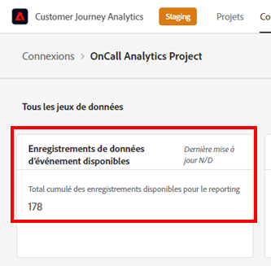

# Estimation et gestion de votre utilisation CJA

Pour comprendre votre utilisation de CJA, vous pouvez utiliser 2 méthodes :

* Ajoutez les données d’événement pour chaque connexion (voir **Estimation de la taille de connexion** below)
* Utilisez Analysis Workspace pour...

Pour gérer votre utilisation de CJA :

* Utilisation de l’API CJA

## Estimation de la taille de connexion {#estimate-size}

Vous devrez peut-être connaître le nombre de lignes de données d’événement actuellement présentes dans [!UICONTROL Customer Journey Analytics]. Pour un compte rendu détaillé de l’utilisation des enregistrements de données d’événement (lignes de données) de votre organisation, procédez comme suit **pour chacune des connexions créées par votre organisation**.

>[!NOTE]
>
>Effectuez cette opération le premier vendredi de chaque mois, car Adobe exécute votre dernier rapport d’utilisation ce jour-là.

1. Dans [!UICONTROL Customer Journey Analytics], sélectionnez l’onglet **[!UICONTROL Connexions]**.

   Vous pouvez voir la liste de toutes les connexions actuelles.

1. Cliquez sur chaque nom de connexion pour accéder au gestionnaire de connexions.

1. Additionnez les **[!UICONTROL enregistrements de données d’événement disponibles]** pour toutes les connexions créées. (Selon la taille de votre connexion, le numéro peut mettre un certain temps à apparaître.)

   

1. Une fois que vous disposez du nombre de lignes de données d’événement, recherchez le droit de licence « Lignes de données » du contrat Customer Journey Analytics que votre entreprise a signé avec Adobe.

   Vous aurez alors le nombre maximum de lignes de données autorisées dans le bon de commande. Si le nombre de lignes de données de l’étape 3 est supérieur à ce nombre, un dépassement peut vous être reproché.

1. Plusieurs options s’offrent à vous pour remédier à ce problème :

   * Modifiez vos [paramètres de conservation des données](https://experienceleague.adobe.com/docs/analytics-platform/using/cja-connections/manage-connections.html?lang=fr#set-rolling-window-for-connection-data-retention).
   * [Supprimez toutes les connexions inutilisées](https://experienceleague.adobe.com/docs/analytics-platform/using/cja-overview/cja-faq.html?lang=fr#implications-of-deleting-data-components).
   * [Supprimez un jeu de données dans AEP](https://experienceleague.adobe.com/docs/analytics-platform/using/cja-overview/cja-faq.html?lang=fr#implications-of-deleting-data-components).
   * Contactez votre gestionnaire de compte Adobe pour obtenir une licence supplémentaire.
