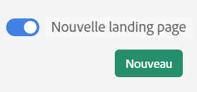

# Landing page de Customer Journey Analytics

La page d’entrée pour le Customer Journey Analytics comporte une page d’accueil du chef de projet et une section d’apprentissage pour vous aider à démarrer plus efficacement.

>[!VIDEO](https://video.tv.adobe.com/v/334278/?quality=12)

## Accès à la page de destination {#access-landing}

Une fois connecté à Adobe Experience Cloud et à Customer Journey Analytics, activez l’option [!UICONTROL Nouvelle page d’entrée - Version bêta] bouton bascule dans le coin inférieur gauche. L’accès au bouton d’activation/désactivation est spécifique à l’utilisateur et non à l’entreprise.

Vous pouvez

* Développez l’objet [!UICONTROL Projets] du tableau en plein écran. Pour agrandir le tableau, il vous suffit de cliquer sur l’icône de menu du hamburger. Cette action réduit les onglets du rail gauche.
* Personnalisez la largeur des colonnes en faisant glisser le séparateur de colonnes.
* Réorganiser les éléments épinglés. Pour déplacer les éléments épinglés vers le haut et vers le bas, cliquez sur les points de suspension en regard de l’élément épinglé et sélectionnez **[!UICONTROL Déplacer vers le haut]** ou **[!UICONTROL Déplacer vers le bas]**.

## Accédez à lʼonglet [!UICONTROL Projets] {#navigate-projects}

Les [!UICONTROL projets] font office de page dʼaccueil de [!UICONTROL Espace de travail]. Tous les projets Espace de travail sʼaffichent ici, y compris les Fiches dʼévaluation mobiles. Les **[!UICONTROL projets]** constituent des éléments que vous avez créés ou que quelquʼun dʼautre a créés et partagés avec vous. Les [!UICONTROL projets] font également référence aux projets vierges et aux fiches dʼévaluation mobiles vierges.

>[!NOTE]
>
>Plusieurs des paramètres suivants persistent (sont mémorisés) tout au long de la session et entre les sessions. Exemples : lʼonglet actuellement affiché, les filtres et les colonnes sélectionnés, ainsi que le sens de tri des colonnes. Toutefois, les résultats de recherche ne sont pas conservés.

| Élément de lʼinterface utilisateur | Définition |
| --- | --- |
| … Plus | Permet dʼ[!UICONTROL afficher les tutoriels] et de [Modifier les préférences utilisateur](/help/analysis-workspace/user-preferences.md). |
| **[!UICONTROL Créer]** modal est de retour | Lorsque vous cliquez sur **[!UICONTROL Créer]** dans Workspace, vous avez à nouveau le choix entre une [!UICONTROL Projet vierge] et un [!UICONTROL Fiche d’évaluation mobile vierge]. Vous pouvez également choisir parmi les modèles créés par votre société. |
| [!UICONTROL Afficher moins/plus] | Active/désactive lʼaffichage de la bannière :  |
| [!UICONTROL Projet vierge] | Permet de créer un [projet Espace de travail](https://experienceleague.adobe.com/docs/analytics/analyze/analysis-workspace/home.html?lang=fr) vierge à compléter. |
| [!UICONTROL Carte de performance mobile vide] | Permet de créer une [carte de performance mobile](https://experienceleague.adobe.com/docs/analytics/analyze/mobapp/curator.html?lang=fr) vierge à compléter. |
| [!UICONTROL Ouvrir le tutoriel de formation] | Affiche le tutoriel de formation Espace de travail, qui guide les nouveaux utilisateurs tout au long de la création dʼun projet, étape par étape. |
| [!UICONTROL Ouvrir les notes de mise à jour] | Ouvre les dernières notes de mise à jour de Adobe Experience Cloud. |
| Icône Filtrer | Vous pouvez filtrer par balises, suites de rapports, propriétaires, types et autres filtres (À moi, Partagés avec moi, Favoris et Approuvés). |
| Barre de recherche | La recherche inclut désormais toutes les colonnes du tableau. |
| Zone de sélection | Cliquez sur cette case en regard dʼun ou plusieurs projets afin dʼafficher les actions de gestion de projet que vous pouvez effectuer : supprimer, marquer, épingler, approuver, partager, renommer, copier et exporter au format CSV. Vous ne disposez peut-être pas des autorisations nécessaires pour effectuer toutes ces actions. |
| [!UICONTROL Favoris] | Mettre un projet en favori permet de le marquer dʼune étoile et de le rechercher comme favori. |
| [!UICONTROL Nom] | Nom du projet. |
| Icône Infos (i) | Cliquer sur lʼicône dʼinformations permet dʼafficher les informations relatives au projet : Type, Rôle de projet, Propriétaire, Description et avec qui il est partagé. Cette icône indique également qui peut [modifier ou dupliquer](/help/analysis-workspace/curate-share/share-projects.md) ce projet. |
| Points de suspension (…) | Cliquer sur les points de suspension en regard dʼun projet permet dʼafficher les actions de gestion de projet que vous pouvez effectuer : supprimer, marquer, épingler, approuver, partager, renommer, copier et exporter au format CSV. Remarquez que vous ne disposez peut-être pas des autorisations nécessaires pour effectuer toutes ces actions. |
| [!UICONTROL Type] | Indique sʼil sʼagit dʼun projet Espace de travail ou dʼune carte de performance mobile. |
| [!UICONTROL Balises] | Vous pouvez marquer les rapports pour les organiser en groupes. |
| [!UICONTROL Rôle de projet] | Les rôles de projet indiquent si vous êtes le propriétaire du projet et si vous disposez des autorisations pour modifier ou dupliquer le projet. |
| [!UICONTROL Vue de données] | Les tableaux et les visualisations au sein d’un panneau obtiennent des données de la vue de données sélectionnée en haut à droite du panneau. La vue de données détermine également les composants disponibles dans le rail de gauche. Dans un projet, vous pouvez utiliser une ou plusieurs vues de données, selon les cas d’utilisation de votre analyse. La liste des vues de données est triée selon la pertinence. Adobe définit la pertinence en fonction du nombre de fois où l’utilisateur actuel a récemment utilisé la vue de données et de la fréquence à laquelle elle est utilisée au sein de l’organisation. |
| [!UICONTROL Propriétaire] | Personne qui a créé le projet. |
| [!UICONTROL Partagé avec] | Avec qui ce projet a été partagé. |
| [!UICONTROL Dernière modification] | Date de la dernière modification de ce projet. |
| [!UICONTROL Dernière ouverture] | Date à laquelle vous avez ouvert ce projet pour la dernière fois. |
| [!UICONTROL Planifié] | Définissez sur . [!UICONTROL Activé] lorsqu’un projet est planifié ou **[!UICONTROL Off]** dans le cas contraire. Cliquez sur le bouton **[!UICONTROL Activé]** lien vous permet d’afficher des informations sur le projet planifié. Vous pouvez également [modifier le planning du projet ;](/help/analysis-workspace/curate-share/t-schedule-report.md) si vous êtes le propriétaire du projet. |
| [!UICONTROL Identifiant de projet] | L’ID de projet peut être utilisé pour le débogage des projets. |
| [!UICONTROL Période la plus longue] | Des périodes plus longues augmentent la complexité du projet et peuvent augmenter les temps de traitement et de chargement. |
| [!UICONTROL Nombre de requêtes] | Nombre total de requêtes effectuées à Analytics au chargement du projet. Un nombre plus élevé de requêtes de projet augmente la complexité du projet et peut augmenter les temps de traitement et de chargement. Ces données sont disponibles uniquement après le chargement d’un projet ou l’envoi d’un projet planifié. |
| Icône Personnaliser le tableau | (En haut à droite) Si vous souhaitez ajouter ou supprimer des colonnes de la liste des projets, vous pouvez le faire en les sélectionnant ou en les désélectionnant. |
| &lt; (bouton Précédent) | Ce bouton d’un projet Workspace vous ramène à la configuration de la page d’entrée la plus récente. La configuration de page que vous aviez lorsque vous avez quitté la page de destination persiste à votre retour. |

## Navigation dans l’onglet Formation {#navigate-learning}

La page Formation contient des visites guidées vidéo et des tutoriels pratiques, ainsi que des liens vers la documentation.

* La visite guidée des [!UICONTROL Notions fondamentales de Espace de travail] vous emmène directement dans Espace de travail. Vous pouvez ainsi découvrir pas à pas la disposition de Espace de travail et où trouver/exécuter les actions les plus courantes. Cette visite peut également être relancée à tout moment, et ce, directement dans Espace de travail, via la fenêtre pop-over de l’infobulle qui se trouve dans l’en-tête du panneau.
* Cliquer sur une vidéo/visite ajoute une balise **[!UICONTROL Consulté]**. Cette balise vous permet de suivre votre progression au fil du contenu de formation. Vous pouvez cliquer sur la balise pour la faire disparaître si vous n’avez pas encore terminé le contenu.
* Le bouton **[!UICONTROL En savoir plus]** de la fenêtre modale de la vidéo permet dʼaccéder à une page de documentation Adobe Experience League présentant du contenu dʼaide supplémentaire en rapport avec la vidéo que vous venez de regarder.  **[!UICONTROL Voir plus de vidéos]** permet dʼaccéder à la liste de lecture complète dʼAnalysis Workspace sur YouTube.

## FAQ sur la page de destination {#landing-faq}

| Question | Réponse |
| --- | --- |
| Existe-t-il un nombre maximal de projets que je peux épingler ? | Non, il nʼy a pas de limite au nombre de projets que vous pouvez épingler. |
| Les administrateurs peuvent-ils désigner cette page d’entrée pour leurs utilisateurs ? | Non, les administrateurs ne peuvent pas désigner la landing page au nom des utilisateurs. Les utilisateurs individuels doivent activer eux-mêmes le bouton bascule. |
