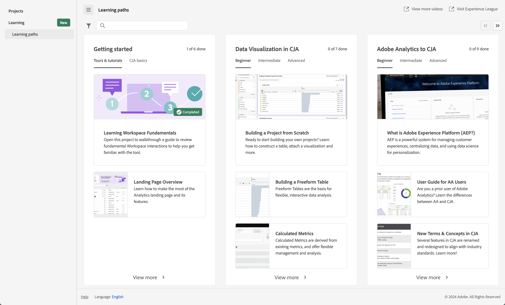

# Page de destination de Customer Journey Analytics

La page de destination de Customer Journey Analytics met [!DNL Analysis Workspace] en surbrillance et comprend une page d’accueil destinée à la gestion des projets, ainsi qu’une section d’apprentissage pour vous aider à gérer plus efficacement les données relatives au parcours client.

>[!BEGINSHADEBOX]

Voir  [Page de destination dans Analysis Workspace](https://video.tv.adobe.com/v/346463/?captions=fre_fr&quality=12&learn=on){target="_blank"} pour une vidéo de démonstration.

{{videoaa}}

>[!ENDSHADEBOX]

La page de destination de Customer Journey Analytics se compose des sous-onglets suivants : Projets et Formation.

Les **[!UICONTROL projets]** sont des conceptions personnalisées qui combinent les composants de données, les tableaux et les visualisations que vous avez créés ou que quelqu’un d’autre a créés et partagés avec vous. Les [!UICONTROL projets] font également référence aux projets vierges et aux fiches dʼévaluation mobiles vierges.

L’onglet **[!UICONTROL Formation]** contient des visites guidées vidéo et des tutoriels pratiques, ainsi que des liens vers la documentation.

>[!BEGINTABS]

>[!TAB Projets]

>[!TAB Formation]

>[!ENDTABS]

## Projets

Les [!UICONTROL projets] font office de page dʼaccueil de l’[!UICONTROL espace de travail]. L’onglet **[!UICONTROL Projets]** affiche le dossier Entreprise, les dossiers personnels que vous avez créés, vos projets Workspace et vos cartes de performance mobiles. Utilisez cette page pour afficher, créer et modifier des dossiers, des projets et des cartes de performance mobiles. Consultez [Projets](/help/analysis-workspace/build-workspace-project/freeform-overview.md) pour plus d’informations.

Les **[!UICONTROL projets]** sont des conceptions personnalisées qui combinent les composants de données, les tableaux et les visualisations que vous avez créés ou que quelqu’un d’autre a créés et partagés avec vous. Les [!UICONTROL projets] font également référence aux projets vierges et aux cartes de performance mobiles vierges.

>[!NOTE]
>
>Plusieurs des paramètres suivants sont conservés pendant la session et entre les sessions. Par exemple, l’onglet que vous avez sélectionné, les segments sélectionnés, les colonnes sélectionnées et l’ordre de tri des colonnes. Les résultats de recherche ne sont pas persistants.

Consultez [Projets](/help/analysis-workspace/build-workspace-project/freeform-overview.md) pour plus d’informations.

<!--

### Customize table columns

To customize column widths, drag the vertical bar that separates each column. 

To add or remove columns from the list of projects, click the column icon ( ) in the top-right, then select or deselect column titles. 

The available columns are:

| Column name | Description | 
|---------|----------|
| [!UICONTROL **Name**] | Identifies the name of the project. |
| [!UICONTROL **Type**] | Indicates whether this type is a Workspace project, a Mobile scorecard, or a folder. |
| [!UICONTROL **Tags**] | Tags projects to organize them into groups. | 
| [!UICONTROL **Scheduled**] | Set to [!UICONTROL On] when a project is scheduled or [!UICONTROL Off] when it is not. Clicking the [!UICONTROL On] link lets you see information about the scheduled project. You can also [edit the project schedule](/help/analysis-workspace/export/t-schedule-report.md) if you are the project owner. |
| [!UICONTROL **Project role**] | Identifies the project roles: whether you are the project Owner and whether you have permissions to Edit or Duplicate the project. |
| [!UICONTROL **Report suite**] | Identifies the Report Suites that are associated with the project. Tables and visualizations within a panel derive data from the report suite selected in the top right of the panel. The report suite also determines what components are available in the left rail. Within a project, you can use one or many report suites depending on your analysis use cases. The list of report suites is sorted on relevance. Adobe defines relevance based on how recently and frequently the suite has been used by the current user, and how frequently the suite is used within the organization. |
| [!UICONTROL **Owner**] | Identifies the person who created the project. |
| [!UICONTROL **Shared With**] | Shows who the project is currently shared with. |
| [!UICONTROL **Last Modified**] | The date and time when the project was last modified. |
| [!UICONTROL **Last Opened**] | Identifies the date that a project was last opened by the user who is currently viewing the Projects page. |
| [!UICONTROL **Last Used**] | Helps determine whether a project is valuable to users in your organization by showing the date and time when the project was last opened by any user within the organization.
Consider the following when viewing this column:
<ul><li>Usage information is available starting in September 2023.</li><li>This column is available only to system administrators.</li></ul> |
| [!UICONTROL **Project ID**] | Can be used for debugging projects. |
| [!UICONTROL **Longest Date Range**] | Longer date ranges increase project complexity and may increase processing and load times. |
| [!UICONTROL **Number of queries**] | The total number of requests made to Analytics when the project loads. A higher number of project queries increases project complexity and may increase processing and load times. This data is available only after a project has loaded or a scheduled project was sent. |
| [!UICONTROL **Location**] | Shows the folder where the project is located. |

### Other UI elements on the Projects page

| UI element | Definition |
| --- | --- |
| Edit preferences | Lets you [!UICONTROL View Tutorials], and [Edit user preferences](/help/analysis-workspace/user-preferences.md). |
| [!UICONTROL Create new] | Opens the project modal where you can create a Workspace project or a Mobile scorecard or open a company template.  |
| [!UICONTROL Show less  Show more] | Toggles between not showing and showing the banner:  |
| [!UICONTROL Workspace project] | Creates a blank [Workspace project](/help/analysis-workspace/home.md) for you to  design and build. |
| [!UICONTROL Mobile scorecard] | Creates a blank [mobile scorecard](https://experienceleague.adobe.com/docs/analytics/analyze/mobapp/curator.html?lang=fr) for you to design and build. |
| [!UICONTROL Open Training Tutorial] | Opens the Workspace training tutorial that guides you through the process of building a new starter project in a step-by-step tutorial.|
| [!UICONTROL Open release notes] | Opens the Adobe Analytics section of the latest Adobe Experience Cloud release notes. |
| Filter icon | Filters by tags, report suites, owners, types, and other filters (Mine, Shared with me, Favorites, and Approved)  |
| Search bar | Searches all columns in the table. |
| Selection box | Selects one or more projects to display the project management actions you can perform: **Delete**, **Share**, **Rename**, **Copy**, **Unpin**, **Move Up**, **Move Down**, **Tag**, **Approve**, **Export CSV**, and **Move to**. You may not have permissions to perform all listed actions. |
| [!UICONTROL Favorites] | Adds a star next to a favorite project or folder that can be used as a filter. |
| [!UICONTROL Name] | Identifies the name of the project. |
| Pin icon | Pins items so they always appear at the top of your list but you can re-adjust the order by moving them up or down in the order. Use the ellipsis option menu and select **Move Up** or **Move down** in the list. |
| Info (i) icon | Displays the following information about a project: Type, Project Role, Owner, Description, and who it is shared with. It also indicates who can [edit or duplicate](/help/analysis-workspace/curate-share/share-projects.md) this project. |
| Ellipsis (...) | Displays the project management actions you can perform: **Delete**, **Share**, **Rename**, **Copy**, **Unpin**, **Move Up**, **Move Down**, **Tag**, **Approve**, **Export CSV**, and **Move to**. You may not have permissions to perform all listed actions. |
| SHOW: Folders & Projects or All Projects | Changes the view setting on the table to show folders and projects according to your folder organization **or** show all of your projects in an unorganized list. |
| < (Back button) | Returns you to your most recent landing page configuration in a Workspace project or a report. The page configuration you had when you left the landing page will persist when you return. |

-->

## Formation

La page Formation contient des visites guidées vidéo et des tutoriels pratiques, ainsi que des liens vers la documentation.

Rendez-vous sur la page Formation de Customer Journey Analytics pour en savoir plus sur les éléments suivants :

* Fonctionnalités et cas d’utilisation Débutant, Intermédiaire ou Avancé dans Customer Journey Analytics
* Migration fluide d’Adobe Analytics vers Customer Journey Analytics

Pour accéder au contenu de formation :

* Dans Customer Journey Analytics, sélectionnez [!UICONTROL **Workspace**] dans le menu supérieur et [!UICONTROL **Formation**] dans le panneau de gauche.

### Fonctionnalités

Le page Formation offre les fonctionnalités suivantes

* **Filtrer le contenu :** Utilisez  pour filtrer le contenu de formation par **[!UICONTROL Type]** (**[!UICONTROL Document]**, **[!UICONTROL Vidéo]**, et **[!UICONTROL Visites et tutoriels]**) et **[!UICONTROL Niveau d’expérience]** (**[!UICONTROL Débutant]**, **[!UICONTROL Intermédiaire]**, ou **[!UICONTROL Avancé]**).
* **Suivre la progression :** après avoir sélectionné un élément de contenu, une étiquette  **[!UICONTROL Vu]** s’affiche. Cette balise vous permet de suivre votre progression au fil du contenu de formation. Vous pouvez sélectionner l’étiquette  **[!UICONTROL Vu]** pour la supprimer d’un élément de contenu.
* **Afficher du contenu supplémentaire :** lorsque vous regardez une vidéo, sélectionnez **[!UICONTROL En savoir plus]** pour afficher le contenu de la documentation associée sur Experience League. Ou, sur la page Formation, sélectionnez l’une des options suivantes pour afficher du contenu supplémentaire :
   * **[!UICONTROL Visite YouTube] :** affichez la liste de lecture complète d’Analysis Workspace sur YouTube.
   * [!UICONTROL **Consulter Experience League**] : consultez la suite complète de la documentation Customer Journey Analytics sur Experience League.
* **Principes fondamentaux pour les nouveaux utilisateurs et les nouvelles utilisatrices :** la visite guidée [!UICONTROL Apprendre les services fondamentaux de Workspace] est recommandée pour les nouveaux utilisateurs et les nouvelles utilisatrices. Cette visite guidée vous emmène directement dans Workspace et vous guide tout au long des actions les plus courantes. Cette visite guidée peut être réalisée à nouveau à tout moment dans Workspace via l’infobulle qui se trouve dans l’en-tête du [panneau à structure libre](/help/analysis-workspace/c-panels/freeform-panel.md) ou du [panneau vierge](/help/analysis-workspace/c-panels/blank-panel.md).

## Page de destination préférée

Vous pouvez définir votre page de destination préférée. Pour plus d’informations, consultez [Préférences utilisateur](/help/analysis-workspace/user-preferences.md#general-preferences).

<!--
## Landing page FAQ {#landing-faq}

| Question | Answer |
| --- | --- |
| Does the work I do in the beta program UI carry over to the production [!UICONTROL Workspace] experience? | Yes, any work done in the beta carries over to the old/current [!UICONTROL Workspace] experience. |
| Is there a maximum number of projects I can pin? | No, there is no limit on the number of projects you can pin. |
| Can admins designate this landing page for their users? | No, admins cannot designate the landing page on behalf of users. Individual users must turn on the toggle themselves. |
| Are all reports that currently exist in [!DNL Reports & Analytics] still available? | No, the following reports were phased out, based on overall usage data: <ul><li>Any custom eVars/props/events/classifications<li>My Recommended Reports</li><li>Hourly/Daily/Weekly/Monthly/Quarterly/Yearly unique visitors</li><li>DailyWeekly/Monthly/Quarterly/Yearly unique customers</li><li>Action name depth</li><li>Action name summary</li><li>Add dashboard</li><li>Age</li><li>Audio support</li><li>Billing information</li><li>Clicks to page</li><li>Color depth</li><li>Cookie support</li><li>Cookies</li><li>Connection types</li><li>Creative elements</li><li>Credit card type</li><li>Cross sell</li><li>Custom event funnels</li><li>Custom links</li><li>Customer ID</li><li>Day of week</li><li>Entry action name</li><li>Exit action name</li><li>Exit links</li><li>Fallout</li><li>File downloads</li><li>Find in store</li><li>Full paths</li><li>Gender</li><li>Hit ype VISTA rule</li><li>Image support</li><li>Java</li><li>JavaScript</li><li>JavaScript version</li><li>Manage bookmarks</li><li>Manage dashboards</li><li>Monitor color depth</li><li>Monitor resolutions</li><li>Newsletter signups</li><li>Next action name</li><li>Next action name flow</li><li>Null searches</li><li>Operating system</li><li>Order review</li><li>Page of day</li><li>Pages not found</li><li>Pathfinder</li><li>Path length</li><li>Previous action name</li><li>Previous action name flow</li><li>Product activity</li><li>Product cost</li><li>Product department</li><li>Product inventory category</li><li>Product name</li><li>Product reviews</li><li>Product season</li><li>Product shares</li><li>Product zooms</li><li>Reload</li><li>Searches</li><li>Servers</li><li>Single page visits</li><li>Shipping information</li><li>Site hierarchy</li><li>Social mentions</li><li>Time of day</li><li>Time spent on action name</li><li>Video support</li><li>Visitor state</li></ul> | 
-->
