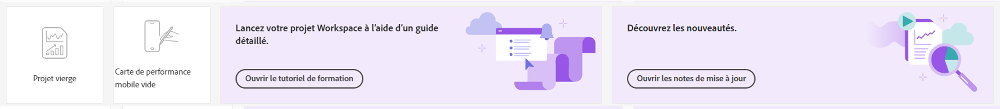

# Page de destination de Customer Journey Analytics

Page d’entrée pour les mises en évidence de Customer Journey Analytics [!DNL Analysis Workspace] et comprend une page d’accueil du chef de projet et une section d’apprentissage pour vous aider à gérer plus efficacement les données du parcours client.

>[!VIDEO](https://video.tv.adobe.com/v/334278/?quality=12)

## Fonctionnalités de la nouvelle page de destination {#new-features}

| Fonctionnalité | Description | Copie dʼécran |
| --- | --- | --- |
| Agrandir le tableau [!UICONTROL Projets] en plein écran | Pour agrandir le tableau, il vous suffit de cliquer sur l’icône de menu général. Cette action réduit les onglets situés sur le rail de gauche. |  |
| Personnaliser la largeur des colonnes | Dans les versions précédentes, la largeur des colonnes était fixe. Vous pouvez désormais la personnaliser en faisant glisser le séparateur de colonnes. |  |
| Réorganiser les éléments épinglés | Pour déplacer les éléments épinglés vers le haut et vers le bas, cliquez sur les points de suspension en regard de l’élément épinglé et sélectionnez **[!UICONTROL Déplacer vers le haut]** ou **[!UICONTROL Déplacer vers le bas]**. |  |
| Nouvelles colonnes de tableau | Cliquez sur l’icône [!UICONTROL Personnaliser le tableau] en haut à droite du tableau. Les nouvelles colonnes de tableau sont les suivantes : <ul><li>**[!UICONTROL Planifié]** : activez la case [!UICONTROL On] lorsqu’un projet est planifié ou [!UICONTROL Off] dans le cas contraire. Pour afficher des informations sur le projet planifié, cliquez sur le lien [!UICONTROL On]. Vous pouvez également [modifier le planning du projet](../analysis-workspace/curate-share/t-schedule-report.md) si vous êtes son propriétaire.</li><li>**[!UICONTROL ID de projet]** : utile à des fins de débogage.</li><li>**[!UICONTROL Période la plus longue]** : des périodes plus longues augmentent la complexité du projet ainsi que les temps de traitement et de chargement. </li><li>**[!UICONTROL Nombre de requêtes]** : nombre total de requêtes envoyées à Analytics lors du chargement du projet. Un nombre plus élevé de requêtes de projet augmente la complexité de celui-ci ainsi que ses temps de traitement et de chargement. Ces données ne sont disponibles qu’une fois qu’un projet a été chargé ou qu’un projet planifié a été envoyé. </li></ul> |  |
| **[!UICONTROL Créer un projet]** modal est de retour | Lorsque vous cliquez sur **[!UICONTROL Créer un projet]** dans Workspace, vous avez à nouveau le choix entre une [!UICONTROL Projet vierge] et un [!UICONTROL Fiche d’évaluation mobile vierge]. Vous pouvez également choisir un modèle créé par votre société. |  |

{style=&quot;table-layout:auto&quot;}

## Accédez à lʼonglet [!UICONTROL Projets] {#navigate-projects}

Les [!UICONTROL projets] font office de page dʼaccueil de l’[!UICONTROL espace de travail]. L’onglet Projets affiche le dossier Société, les dossiers personnels que vous avez créés, vos projets et vos fiches d’évaluation mobiles. Utilisez cette page pour afficher, créer et modifier des dossiers, des projets et des fiches d’évaluation mobiles. Pour plus d’informations, voir [À propos des dossiers dans Analytics](/help/analysis-workspace/build-workspace-project/workspace-folders/about-folders.md).

**[!UICONTROL Projets]** sont des conceptions personnalisées qui combinent des composants de données, des tableaux et des visualisations que vous avez créés ou que quelqu’un d’autre a créés et partagés avec vous. Les [!UICONTROL projets] font également référence aux projets vierges et aux fiches dʼévaluation mobiles vierges.

>[!NOTE]
>
>Plusieurs des paramètres suivants persistent pendant la session et entre les sessions. Par exemple, l’onglet que vous avez sélectionné, les filtres sélectionnés, les colonnes sélectionnées et le sens du tri des colonnes. Les résultats de la recherche ne sont pas persistants.

| Élément de lʼinterface utilisateur | Définition |
| --- | --- |
| Modifier les préférences | Permet dʼ[!UICONTROL afficher les tutoriels] et de [Modifier les préférences utilisateur](/help/analysis-workspace/user-preferences.md). |
| [!UICONTROL Créer] | Ouvre le modal de projet dans lequel vous pouvez créer un projet Workspace ou une fiche d’évaluation mobile ou ouvrir un modèle d’entreprise. |
| [!UICONTROL Afficher moins  Afficher plus] | Active/désactive lʼaffichage de la bannière :  |
| [!UICONTROL Projet Espace de travail] | Crée un champ vierge [Projet Workspace](https://experienceleague.adobe.com/docs/analytics/analyze/analysis-workspace/home.html?lang=fr) pour que vous conceviez et construisiez. |
| [!UICONTROL Fiche d’évaluation mobile] | Crée un champ vierge [fiche d’évaluation mobile](https://experienceleague.adobe.com/docs/analytics/analyze/mobapp/curator.html?lang=fr) pour que vous conceviez et construisiez. |
| [!UICONTROL Ouvrir le tutoriel de formation] | Ouvre le tutoriel de formation à Workspace qui vous guide tout au long du processus de création d’un nouveau projet de démarrage dans un tutoriel détaillé. |
| [!UICONTROL Ouvrir les notes de mise à jour] | Affiche la section Adobe Analytics des dernières notes de mise à jour dʼAdobe Experience Cloud. |
| Icône Filtrer | Filtres par balises, suites de rapports, propriétaires, types et autres filtres (À moi, Partagés avec moi, Favoris et Approuvés) |
| Barre de recherche | Recherche toutes les colonnes du tableau. |
| Zone de sélection | Sélectionnez un ou plusieurs projets pour afficher les actions de gestion de projet que vous pouvez effectuer : **Supprimer**, **Partager**, **Renommer**, **Copier**, **Déplacer**, **Déplacer vers le haut**, **Déplacer vers le bas**, **Balise**, **Approuver**, **Exportation CSV**, et **Déplacer vers**. Vous ne pouvez pas être autorisé à effectuer toutes les actions répertoriées. |
| [!UICONTROL Favoris] | Ajoute une étoile en regard d’un projet ou d’un dossier favori pouvant être utilisé comme filtre. |
| [!UICONTROL Nom] | Identifie le nom du projet. |
| Icône Épingler | Epingle les éléments afin qu’ils apparaissent toujours en haut de votre liste, mais vous pouvez réajuster l’ordre en les faisant monter ou descendre dans l’ordre. Utilisez le menu d’option représentant des points de suspension et sélectionnez **Déplacer vers le haut** ou **Déplacer vers le bas** dans la liste. |
| Icône Infos (i) | Affiche les informations suivantes sur un projet : Type, rôle du projet, propriétaire, description et avec qui il est partagé. Cette icône indique également qui peut [modifier ou dupliquer](https://experienceleague.adobe.com/docs/analytics/analyze/analysis-workspace/curate-share/share-projects.html?lang=fr) ce projet. |
| Points de suspension (…) | Affiche les actions de gestion de projet que vous pouvez effectuer : **Supprimer**, **Partager**, **Renommer**, **Copier**, **Déplacer**, **Déplacer vers le haut**, **Déplacer vers le bas**, **Balise**, **Approuver**, **Exportation CSV**, et **Déplacer vers**. Vous ne pouvez pas être autorisé à effectuer toutes les actions répertoriées. |
| [!UICONTROL Type] | Indique si ce type est un projet Workspace, une fiche d’évaluation mobile ou un dossier. |
| [!UICONTROL Balises] | Balisez les projets pour les organiser en groupes. |
| [!UICONTROL Rôle de projet] | Identifie les rôles du projet : si vous êtes le propriétaire du projet et si vous êtes autorisé à modifier ou dupliquer le projet. |
| [!UICONTROL Suite de rapports] | Identifie les suites de rapports associées au projet. Les tableaux et les visualisations au sein d’un panneau obtiennent des données de la suite de rapports sélectionnée en haut à droite du panneau. La suite de rapports détermine également les composants disponibles dans le rail de gauche. Dans un projet, vous pouvez utiliser une ou plusieurs suites de rapports selon les cas pratiques de votre analyse. La liste des suites de rapports est triée selon la pertinence. Adobe définit la pertinence en fonction de la fréquence dʼutilisation récente de la suite par lʼutilisateur actuel et de la fréquence dʼutilisation de la suite au sein de lʼentreprise. |
| [!UICONTROL Propriétaire] | Identifie la personne qui a créé le projet. |
| [!UICONTROL Dernière ouverture] | Identifie la date à laquelle vous avez ouvert le projet pour la dernière fois. |
| Icône Personnaliser le tableau | Sélectionne les colonnes à afficher dans le tableau. Pour ajouter ou supprimer des colonnes de la liste des projets, cliquez sur l’icône de colonne ( ) en haut à droite, puis sélectionnez ou désélectionnez les titres des colonnes. |
| AFFICHER : Dossiers et projets ou tous les projets | Modifie le paramètre d’affichage du tableau pour afficher les dossiers et les projets en fonction de l’organisation de vos dossiers. **ou** afficher tous vos projets dans une liste non organisée ; |
| &lt; (bouton Précédent) | Vous renvoie à la configuration de page d’entrée la plus récente dans un projet Workspace. La configuration de page que vous aviez lorsque vous quittiez la landing page persiste à votre retour. |

## Navigation dans l’onglet Formation {#navigate-learning}

La page Formation contient des visites guidées vidéo et des tutoriels pratiques, ainsi que des liens vers la documentation.

* La visite guidée des [!UICONTROL Notions fondamentales de l’espace de travail] vous emmène directement dans l’espace de travail. Vous pouvez ainsi découvrir pas à pas la disposition de l’espace de travail et où trouver/exécuter les actions les plus courantes. Cette visite peut également être relancée à tout moment, et ce, directement dans l’espace de travail, via la fenêtre pop-over de l’infobulle qui se trouve dans l’en-tête du panneau.
* Cliquer sur une vidéo/visite ajoute une balise **[!UICONTROL Consulté]**. Cette balise vous permet de suivre votre progression au fil du contenu de formation. Vous pouvez cliquer sur la balise pour la faire disparaître si vous n’avez pas encore terminé le contenu.
* Le bouton **[!UICONTROL En savoir plus]** de la fenêtre modale de la vidéo permet dʼaccéder à une page de documentation Adobe Experience League présentant du contenu dʼaide supplémentaire en rapport avec la vidéo que vous venez de regarder.  **[!UICONTROL Voir plus de vidéos]** permet dʼaccéder à la liste de lecture complète dʼAnalysis Workspace sur YouTube.

## Définir votre landing page {#set-landing}

Les utilisateurs peuvent définir la page de destination de leur choix.

1. Accédez à Analytics > [!UICONTROL Composants] > [!UICONTROL Préférences] > [!UICONTROL Général].
1. Sélectionnez la page de destination souhaitée :

   

## FAQ sur la page de destination {#landing-faq}

| Question | Réponse |
| --- | --- |
| Le travail effectué dans lʼinterface utilisateur du programme bêta est-il transposé dans lʼexpérience de production de l’[!UICONTROL espace de travail] ? | Oui, tout travail effectué dans le programme bêta est transposé dans lʼancienne/actuelle expérience de l’[!UICONTROL espace de travail]. |
| Existe-t-il un nombre maximal de projets que je peux épingler ? | Non, il nʼy a pas de limite au nombre de projets que vous pouvez épingler. |
| Les administrateurs peuvent-ils désigner cette page de destination pour leurs utilisateurs ? | Non, les administrateurs ne peuvent pas désigner la page de destination au nom des utilisateurs. Les utilisateurs individuels doivent activer eux-mêmes le bouton bascule. |
<!-- | Are all reports that currently exist in [!DNL Reports & Analytics] still available? | No, the following reports were phased out, based on overall usage data: <ul><li>Any custom eVars/props/events/classifications<li>My Recommended Reports</li><li>Hourly/Daily/Weekly/Monthly/Quarterly/Yearly unique visitors</li><li>DailyWeekly/Monthly/Quarterly/Yearly unique customers</li><li>Action name depth</li><li>Action name summary</li><li>Add dashboard</li><li>Age</li><li>Audio support</li><li>Billing information</li><li>Clicks to page</li><li>Color depth</li><li>Cookie support</li><li>Cookies</li><li>Connection types</li><li>Creative elements</li><li>Credit card type</li><li>Cross sell</li><li>Custom event funnels</li><li>Custom links</li><li>Customer ID</li><li>Day of week</li><li>Entry action name</li><li>Exit action name</li><li>Exit links</li><li>Fallout</li><li>File downloads</li><li>Find in store</li><li>Full paths</li><li>Gender</li><li>Hit ype VISTA rule</li><li>Image support</li><li>Java</li><li>JavaScript</li><li>JavaScript version</li><li>Manage bookmarks</li><li>Manage dashboards</li><li>Monitor color depth</li><li>Monitor resolutions</li><li>Newsletter signups</li><li>Next action name</li><li>Next action name flow</li><li>Null searches</li><li>Operating system</li><li>Order review</li><li>Page of day</li><li>Pages not found</li><li>Pathfinder</li><li>Path length</li><li>Previous action name</li><li>Previous action name flow</li><li>Product activity</li><li>Product cost</li><li>Product department</li><li>Product inventory category</li><li>Product name</li><li>Product reviews</li><li>Product season</li><li>Product shares</li><li>Product zooms</li><li>Reload</li><li>Searches</li><li>Servers</li><li>Single page visits</li><li>Shipping information</li><li>Site hierarchy</li><li>Social mentions</li><li>Time of day</li><li>Time spent on action name</li><li>Video support</li><li>Visitor state</li></ul> | -->
