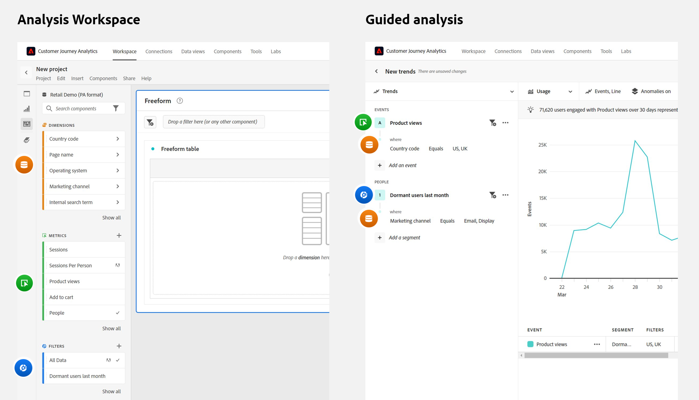

# FAQ sur les analyses guidées

{{release-limited-testing}}

Questions fréquentes sur l’analyse guidée.

+++**Comment mon entreprise peut-elle être configurée pour une analyse guidée ?**

L’analyse guidée est un module complémentaire payant pour Customer Journey Analytics. Si vous souhaitez commencer à utiliser ce module complémentaire, contactez votre équipe de compte d’Adobe.

+++

+++**Quelles modifications de mise en oeuvre sont requises pour utiliser l’analyse guidée ?**

Si vous utilisez déjà Customer Journey Analytics aujourd’hui, aucune modification supplémentaire de mise en oeuvre n’est nécessaire. L’analyse guidée utilise le même [Vues des données](../data-views/data-views.md) et [Connexions](../connections/overview.md) comme d’autres interfaces CJA, comme [Analysis Workspace](../analysis-workspace/home.md).

Pour que les utilisateurs finaux puissent tirer le meilleur parti de l’analyse guidée, il est recommandé d’avoir une stratégie de gestion et de schéma d’événement efficace dans Adobe Experience Platform. [Vues des données](../data-views/data-views.md).

+++

+++**Quand devez-vous utiliser l’analyse guidée ou Analysis Workspace ?**

**Analyse guidée** peuvent aider les utilisateurs à obtenir rapidement des informations de qualité. Elle s’avère utile pour les équipes produit, les utilisateurs qui souhaitent travailler plus en toute confiance avec les données, et même pour les analystes qui vous permettent de commencer à approfondir l’analyse.

**[Analysis Workspace](../analysis-workspace/home.md)** est un espace à structure libre qui vous permet d’approfondir l’analyse des données pour découvrir d’autres informations. Il est utile aux analystes et aux utilisateurs expérimentés qui comprennent bien les données et qui souhaitent y plonger plus profondément.

+++

+++**Comment la terminologie se compare-t-elle entre l’analyse guidée et Analysis Workspace ?**

Les analyses guidées utilisent des termes plus fréquemment utilisés par les équipes de produits. Vous pouvez référencer ce tableau lorsque vous passez d’une analyse guidée à une autre [Analysis Workspace](../analysis-workspace/home.md).

| Terme d’analyse guidée | Terme Analysis Workspace |
| --- | --- |
| Événement | Mesure |
| Utilisateurs | Personnes |
| Propriété | Dimension |
| Valeur | Élément de dimension |
| Segment | Filtrer |

{style="table-layout:auto"}

+++

+++**Quelles sont les différences concernant la manière dont les analyses guidées et les rapports d’approche Analysis Workspace sont présentées ?**

while [Analysis Workspace](../analysis-workspace/home.md) et l’analyse guidée utilisent les mêmes données sous-jacentes, de la même manière que chaque outil vous permet de former des requêtes de ces données est différent.

* **Analysis Workspace est une expérience centrée sur les dimensions.** Les tableaux se composent généralement de lignes dimensionnelles, tandis que les colonnes sont généralement des mesures. Les filtres peuvent être appliqués à la fois aux lignes et aux colonnes pour obtenir les données souhaitées.

* **L’analyse guidée est une expérience centrée sur un événement.** Chaque analyse commence par sélectionner des événements, puis des dimensions et des filtres peuvent être ajoutés pour affiner ces données d’événement.

Examinez l’exemple suivant où vous vous focalisez sur les données de la page d’accueil de votre site web. Les équipes posent des questions similaires, mais l’approche de l’analyse peut être différente.

* Une approche Analysis Workspace généralement centrée sur les dimensions serait : &quot;Regardons la page d’accueil et voyons combien de pages ont été consultées&quot;.

  

* Une approche d’analyse guidée généralement centrée sur les événements serait : &quot;Combien d’utilisateurs ont consulté la page d’accueil ?&quot;

  

+++
