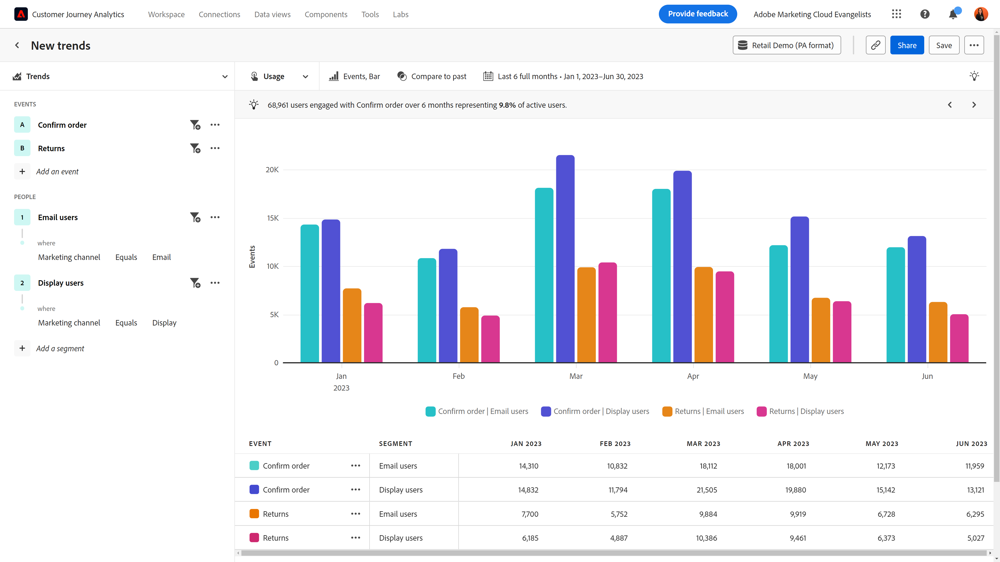
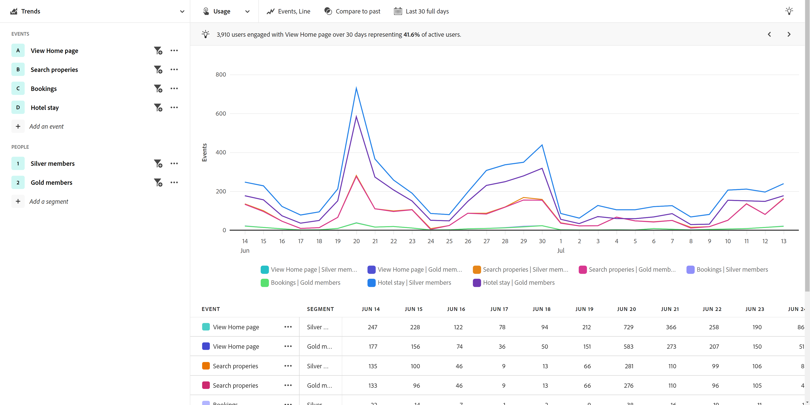
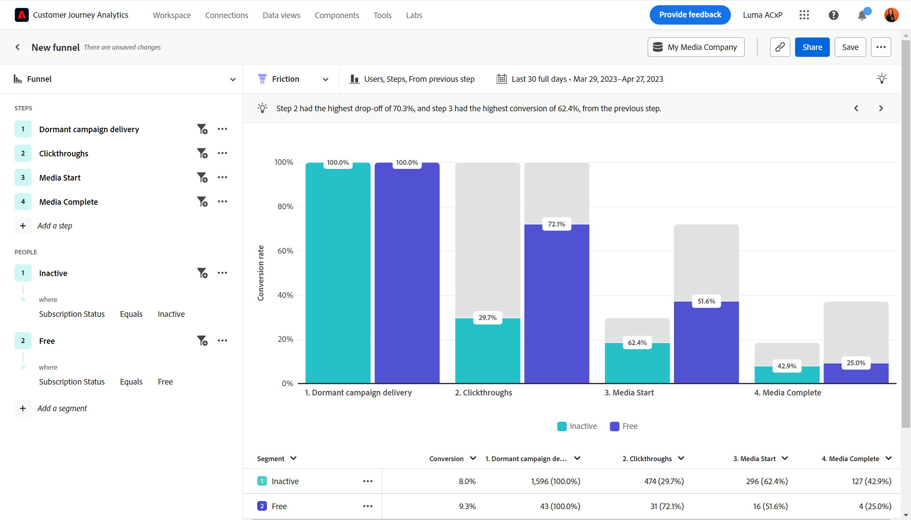
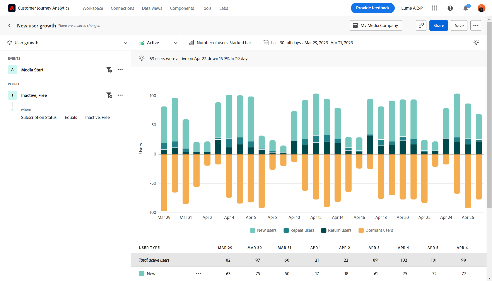
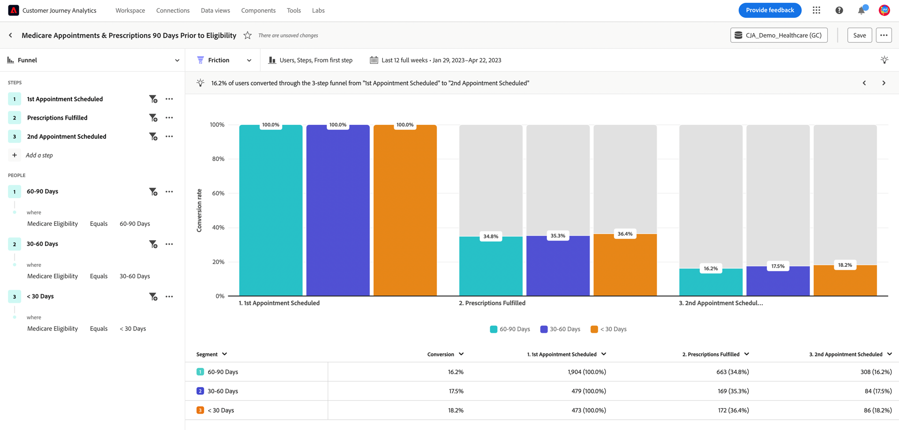

# Cas dʼutilisation du secteur

Cette page fournit des exemples représentatifs du secteur de ce que les équipes d’expérience client, des personnes chargées de l’analyse aux équipes chargée des produits, en passant par les équipes marketing, peuvent accomplir avec l’analyse guidée.

+++**Vente au détail**

| Cas d’utilisation | Exemple | Impact | Analyse |
| --- | --- | --- | --- |
| **Optimiser l’application d’achat mobile** | De nombreux clientes et clients ont téléchargé l’application mobile d’une entreprise, mais ne sont jamais revenus. La société constate que les clientes et clients l’utilisent uniquement pour l’offre initiale. Elle a réengagé ces clientes et clients inactifs. | **Augmenter le LTV des utilisateurs mobiles.** Mesurez et augmentez l’utilisation de l’application pour développer une expérience utilisateur plus « heureuse ». | [Analyse de la croissance active](types/active-growth.md) [Analyse de la croissance nette](types/net-growth.md) |
| **Quantifier l’impact des nouvelles fonctionnalités de passage en caisse** | Une épicerie teste les modes d’achat en ligne qu’elle propose. Elle mesure rapidement l’impact des nouvelles fonctionnalités de passage en caisse, telles que les recommandations de produits ou le retrait en magasin. | **Augmentation des taux de conversion.** Mesurez l’impact commercial plutôt que simplement l’utilisation des fonctionnalités. | [Analyse de l’impact des versions](types/release-impact.md) [Analyse de l’impact de la première utilisation](types/first-use-impact.md) |
| **Réduire la perte d’abonnement** | Une organisation détecte les points de friction dans les parcours client qui provoquent la perte de clientèle. Cela lui permet de passer en revue les programmes d’abonnement et d’analyser les comportements des personnes membres à risque. | **Réduire la perte de clientèle.** Trouver des façons de favoriser et d&#39;entretenir les relations avec les clients pour prévenir l&#39;attrition et réduire le taux de perte de clientèle. | [Analyse de la croissance active](types/active-growth.md) [Analyse de l’entonnoir](types/funnel.md) |
| **Rechercher les parcours de vente inefficaces** | Une organisation détecte les inefficacités dans le parcours des vendeurs et vendeuses en magasin qui sont éloignés des clientes et clients. Elle adapte son processus, ce qui donne aux clientes et clients une expérience d’achat plus agréable en magasin. | **Améliorez la réponse des ventes.** Réduire les processus inefficaces, qui se traduisent par une amélioration des parcours internes et une expérience client positive. | [Analyse de l’entonnoir](types/funnel.md) |

{style="table-layout:auto"}

{style="border:1px solid gray"}

{style="border:1px solid gray"}

+++

+++**Services financiers**

| Cas d’utilisation | Exemple | Impact | Analyse |
| --- | --- | --- | --- |
| **Quantifier l’impact des nouvelles fonctionnalités** | Une institution financière déploie les transferts bancaires avec Zelle et veut comprendre l’impact de la nouvelle fonctionnalité sur la réalisation des transferts. L’analyse guidée lui permet de voir comment les clientes et clients réagissent afin que l’équipe marketing puisse la déployer. | **Augmentation des taux de conversion.** Mesurez l’impact des nouvelles fonctionnalités sur les conversions de transfert. | [Analyse de l’impact des versions](types/release-impact.md) [Analyse de l’impact de la première utilisation](types/first-use-impact.md) |
| **Dévier les appels au centre d’appel** | Une analyse guidée révèle que le processus de demande mobile en cinq étapes d’une entreprise génère des appels à son centre d’appel. Elle crée une audience et envoie un e-mail à ces clientes et clients afin de mieux comprendre leur expérience. | **Ignorer les frictions dans l’expérience.** Améliorez les parcours « chemin heureux » et réduisez les appels. | [Analyse de l’entonnoir](types/funnel.md) [Analyse des tendances de conversion](types/conversion-trends.md) |
| **Réduire l’attrition client** | Une entreprise apprend que les clientes et clients qui se connectent à l’application mobile bancaire chaque mois restent plus longtemps. L’analyse guidée lui permet d’identifier les personnes susceptibles de partir et de créer une stratégie de retour. | **Réduire la perte de clientèle.** Maintenir le niveau de clients tout en dépensant pour acquérir de nouveaux clients réels. | [Analyse de la croissance active](types/active-growth.md) [Analyse de la croissance nette](types/net-growth.md) |
| **Recommander de nouvelles fonctionnalités** | Une entreprise remarque que les désengagements numériques ont diminué au cours des derniers mois. Le nombre d’appels à une personne spécialisée dans le conseil financier a augmenté. L’analyse guidée permet à l’entreprise de hiérarchiser les optimisations des processus numériques avec un comité de pilotage. | **Créer une feuille de route axée sur les données.** Utilisez les données pour planifier et implémenter les optimisations. | [Analyse des tendances](types/trends.md) |

{style="table-layout:auto"}

{style="border:1px solid gray"}

{style="border:1px solid gray"}

{style="border:1px solid gray"}

+++

+++**Voyages et hébergement**

| Cas d’utilisation | Exemple | Impact | Analyse |
| --- | --- | --- | --- |
| **Quantifier l’impact des nouvelles fonctionnalités de flux de réservation** | Une entreprise utilise l’analyse guidée pour afficher rapidement l’impact d’une nouvelle fonctionnalité d’étape de réservation sur les taux de conversion. Elle identifie la partie de l’expérience offrant les meilleurs gains. | **Augmenter les taux de réservation.** Mesurez l’impact commercial plutôt que simplement l’utilisation des fonctionnalités. | [Analyse de l’impact des versions](types/release-impact.md) [Analyse de l’entonnoir](types/funnel.md) |
| **Optimiser l’expérience de l’application mobile** | Une entreprise connaît rapidement et facilement les utilisateurs et les utilisatrices actifs de l’application chaque mois au fil du temps et identifie l’impact positif par version. | **Augmenter les MAU.** Mesurez et augmentez l’utilisation des applications, en corrélation avec le bonheur des clients. | [Analyse de la croissance active](types/active-growth.md) [Analyse de la croissance nette](types/net-growth.md) |
| **Trouver des frictions dans le flux d’enregistrement mobile** | En voyant où les personnes réussissent ou abandonnent le processus d’enregistrement mobile attendu, une entreprise peut facilement identifier les zones d’optimisation de l’expérience. | **Augmentez le CSAT et réduisez les IROP.** L’élimination des frictions offre une expérience de « journée de voyage » plus transparente. | [Analyse de l’entonnoir](types/funnel.md) [Analyse des tendances de conversion](types/conversion-trends.md) |
| **Dévier les appels au centre d’appel** | L’affichage de l’expérience client dans une analyse de l’entonnoir permet à un utilisateur ou une utilisatrice de voir où les visiteurs et visiteuses rencontrent des frictions, ce qui entraîne un volume coûteux pour le centre d’appel. Les étapes suivantes sur lesquelles se concentrer sont claires. | **Réduire l’utilisation des centres d’appels.** Bénéficiez d’expériences utilisateur plus « heureuses » et réduisez les appels coûteux. | [Analyse de l’entonnoir](types/funnel.md) [Analyse des tendances de conversion](types/conversion-trends.md) |

{style="table-layout:auto"}

{style="border:1px solid gray"}

{style="border:1px solid gray"}

{style="border:1px solid gray"}

+++

+++**Médias et divertissement**

| Cas d’utilisation | Exemple | Impact | Analyse |
| --- | --- | --- | --- |
| **Quantifier l’impact des nouveaux programmes ou séries** | Un service de streaming peut analyser l’effet sur l’audience après que les utilisateurs et les utilisatrices ont regardé un nouveau programme ou une nouvelle série et mieux comprendre le contenu qui suscite l’intérêt. | **Augmenter l’audience.** Recherchez le contenu qui a le plus d’impact sur l’audience. | [Analyse de l’impact de la première utilisation](types/first-use-impact.md) |
| **Identifier le risque d’attrition** | Une entreprise enregistre un taux de rotation élevé de clientes et clients qui s’inscrivent à sa plateforme pour regarder un événement occasionnel et se désinscrivent immédiatement une fois l’événement passé. L’identification rapide de ces utilisateurs et utilisatrices lui permet d’afficher des recommandations qui incitent les clientes et clients à rester sur la plateforme. | **Conserver les abonnés satisfaits.** Recherchez le contenu qui implique un segment de croissance pour intervenir avec des recommandations. | [Analyse de la croissance active](types/active-growth.md) [Analyse de la croissance nette](types/net-growth.md) |
| **Trouver des opportunités de montée en gamme** | Pour accroître le chiffre d’affaires d’une entreprise, il est essentiel de comprendre les offres in-app les plus attrayantes pour les personnes fans lorsqu’elles sont au stade. L’analyse guidée leur permet de déterminer exactement les offres les plus intéressantes. | **Augmentation des recettes accessoires.** Découvrez l’impact des offres in-app sur les comportements d’achat. | [Analyse de l’impact de la première utilisation](types/first-use-impact.md) [Analyse de l’entonnoir](types/funnel.md) |
| **Optimiser l’expérience sur plusieurs appareils** | Une entreprise souhaite analyser la manière dont les personnes abonnées interagissent avec plusieurs appareils et applications. Ces connaissances lui permet de comprendre les modèles de consommation de contenu et de déterminer là où il pourrait être optimal de les recibler. | **Personnaliser l’expérience.** Identifiez le contenu qui résonne le mieux avec les abonnés sur chaque appareil. | [Analyse des tendances](types/trends.md) |
| **Dévier les appels au centre d’appel** | Une entreprise utilise une analyse guidée pour identifier un problème de dysfonctionnement du paiement automatique, qui a amené des clientes et clients frustrés à appeler leur centre d’assistance pour annuler leur forfait. | **Réduction des appels d’assistance.** Créez une meilleure expérience client et réduisez les appels au service client. | [Analyse de l’entonnoir](types/funnel.md) [Analyse des tendances de conversion](types/conversion-trends.md) |

{style="table-layout:auto"}

{style="border:1px solid gray"}

{style="border:1px solid gray"}

{style="border:1px solid gray"}

+++

+++**Soins de santé**

| Cas d’utilisation | Exemple | Impact | Analyse |
| --- | --- | --- | --- |
| **Améliorer les résultats pour la santé des patients et patientes** | Une entreprise dispose des données pour concentrer ses efforts sur la croissance. Avant d’utiliser une analyse guidée, elle ne savait pas clairement combien de personnes membres du plan de bien-être par semaine cessaient simplement de l’utiliser. | **Réduire les visites chez le médecin.** Identification rapide des utilisateurs inactifs en vue d’un réengagement. | [Analyse de la croissance active](types/active-growth.md) |
| **Améliorer l’expérience de la patientèle** | La visibilité sur le nombre de patientes et patients ayant contacté les centres d’appel pour une simple réinitialisation du mot de passe a permis de raviver la flamme d’une personne membre de l’équipe d’analyse pour se concentrer sur le renforcement de l’expérience de sa patientèle. | **Réduisez le coût global du service.** Améliorez l&#39;expérience des patients et réduisez les appels vers les services aux patients. | [Analyse des tendances](types/trends.md) [Analyse de l’entonnoir](types/funnel.md) |
| **Identifier les actions cross-canal répétées par segment** | Une entreprise veut comprendre l’activité des personnes membres éligibles à Medicare quant à l’utilisation de leur plan pour leur fournir des messages spécifiques dans leurs produits numériques. Les connaissances acquises grâce à l’analyse guidée permettent de rendre le marketing plus efficace. | **Personnaliser les choix d’inscription à Medicare.** Comparer les actions séquentielles courantes des membres les plus actifs de mon plan. | [Analyse de l’entonnoir](types/funnel.md) [Analyse de la croissance active](types/active-growth.md) |
| **Conserver les meilleurs talents du secteur** | Les ressources d’analyse d’une entreprise sont limitées dans le temps. L’analyse guidée permet à l’entreprise d’obtenir rapidement les données d’utilisation des produits nécessaires aux appels de mise à jour de gestion. | **Réduction de la charge de travail des analystes.** Obtenez des réponses plus rapidement. Création de rapports accessibles lorsque vous en avez le plus besoin. | [Analyse guidée](overview.md) |

{style="table-layout:auto"}

{style="border:1px solid gray"}

+++

+++**Haute technologie et B2B**

| Cas d’utilisation | Exemple | Impact | Analyse |
| --- | --- | --- | --- |
| **Quantifier l’impact des nouvelles fonctionnalités** | Une entreprise peut analyser la hausse de l’utilisation d’une nouvelle fonctionnalité de produit et déterminer les segments qui fonctionnent le mieux. Cette analyse l’aide à hiérarchiser les ressources à allouer afin d’optimiser l’engagement client et de renforcer son partenariat avec le marketing. | **Hiérarchisation basée sur les données.** Prenez des décisions éclairées concernant l’allocation des ressources. | [Analyse de l’impact des versions](types/release-impact.md) [Analyse de l’impact de la première utilisation](types/first-use-impact.md) |
| **Identifier les rôles qui sous-utilisent le produit** | Une entreprise crée un produit à utiliser par des ingénieures et ingénieurs et des personnes responsables de produits et du marketing. L’analyse guidée a montré que, bien que les personnes responsables de produits et celles spécialisées dans le marketing l’utilisaient presque quotidiennement, les personnes spécialisées dans l’ingénierie ne l’adoptaient pas dans la plupart des cas. | **Favoriser l’adoption des produits.** Identifiez rapidement le comportement des utilisateurs de différentes manières. | [Analyse de la croissance active](types/active-growth.md) [Analyse de la croissance nette](types/net-growth.md) |
| **Supprimer les points de friction dans le processus de conversion** | L’exigence d’un numéro de bon de commande dans le flux d’achat freine les utilisateurs et les utilisatrices qui préfèrent les cartes de crédit pour passer leurs commandes. Les conversions ont augmenté lorsque ce champ est devenu facultatif. | **Améliorez l’expérience client.** Réduisez l’attrition potentielle. | [Analyse de l’entonnoir](types/funnel.md) [Analyse des tendances de conversion](types/conversion-trends.md) |
| **Exploiter l’analyse en libre-service** | L’accès aux connaissances est un défi, et certains utilisateurs et certaines utilisatrices d’une entreprise ne sont pas formés à l’analyse. L’analyse guidée leur permet d’obtenir des réponses et d’exploiter les mêmes données que le reste de l’entreprise, ce qui entraîne des partenariats plus solides et permet de prendre des décisions fondées sur les données. | **Des partenariats plus étroits dans toute l’organisation.** Donnez aux chefs de produit un accès aux données précédemment compartimentées. | [Analyse guidée](overview.md) |

{style="table-layout:auto"}

{style="border:1px solid gray"}

+++
