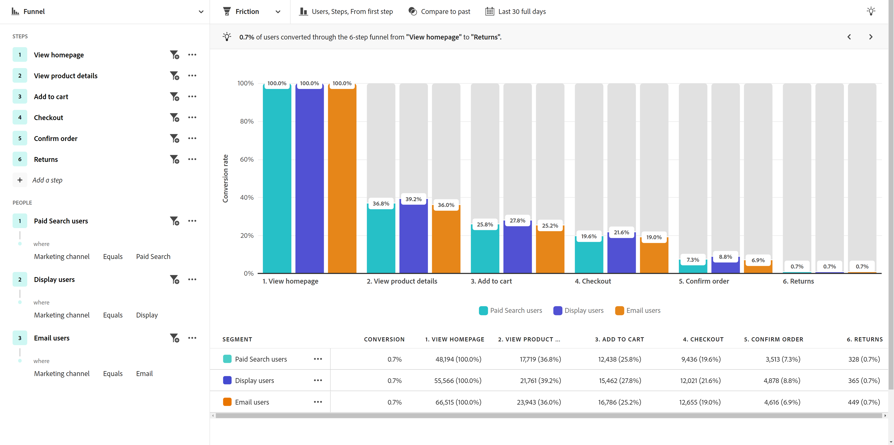

# Cas dʼutilisation du secteur

Cette page fournit des exemples représentatifs du secteur de ce que les équipes d’expérience client, des personnes chargées de l’analyse aux équipes chargée des produits, en passant par les équipes marketing, peuvent accomplir avec l’analyse guidée.

+++**Vente au détail**

| Cas d’utilisation | Exemple | Impact | Analyse |
| --- | --- | --- | --- |
| **Optimiser l’application d’achat mobile** | De nombreux clientes et clients ont téléchargé l’application mobile d’une entreprise, mais ne sont jamais revenus. La société constate que les clientes et clients l’utilisent uniquement pour l’offre initiale. Elle a réengagé ces clientes et clients inactifs. | **Augmentation de la valeur de durée de vie des utilisateurs et utilisatrices mobiles.** Mesurez et augmentez l’utilisation de l’application afin de développer une expérience client plus conviviale. | [Analyse de la croissance active](types/active-growth.md) [Analyse de la croissance nette](types/net-growth.md) |
| **Quantifier l’impact des nouvelles fonctionnalités de passage en caisse** | Une épicerie teste les modes d’achat en ligne qu’elle propose. Elle mesure rapidement l’impact des nouvelles fonctionnalités de passage en caisse, telles que les recommandations de produits ou le retrait en magasin. | **Augmentation des taux de conversion des clientes et clients.** Mesurez l’impact sur l’entreprise plutôt que l’utilisation des fonctionnalités. | [Analyse de l’impact des versions](types/release-impact.md) [Analyse de l’impact de la première utilisation](types/first-use-impact.md) |
| **Réduire la perte d’abonnement** | Une organisation détecte les points de friction dans les parcours client qui provoquent la perte de clientèle. Cela lui permet de passer en revue les programmes d’abonnement et d’analyser les comportements des personnes membres à risque. | **Réduction de la perte de clientèle.** Identifiez les moyens de favoriser et d’entretenir les relations avec les clientes et clients afin d’éviter l’attrition et de réduire la perte de clientèle. | [Analyse de la croissance active](types/active-growth.md) [Analyse de l’entonnoir](types/funnel.md) |
| **Rechercher les parcours de vente inefficaces** | Une organisation détecte les inefficacités dans le parcours des vendeurs et vendeuses en magasin qui sont éloignés des clientes et clients. Elle adapte son processus, ce qui donne aux clientes et clients une expérience d’achat plus agréable en magasin. | **Amélioration de la réponse des ventes.** Réduisez les processus inefficaces, ce qui amène de meilleurs parcours internes et une expérience client positive. | [Analyse de l’entonnoir](types/funnel.md) |

{style="table-layout:auto"}

{style="border:1px solid gray"}

{style="border:1px solid gray"}

+++

+++**Services financiers**

| Cas d’utilisation | Exemple | Impact | Analyse |
| --- | --- | --- | --- |
| **Quantifier l’impact des nouvelles fonctionnalités** | Une institution financière déploie les transferts bancaires avec Zelle et veut comprendre l’impact de la nouvelle fonctionnalité sur la réalisation des transferts. L’analyse guidée lui permet de voir comment les clientes et clients réagissent afin que l’équipe marketing puisse la déployer. | **Augmentation des taux de conversion.** Mesurez l’impact des nouvelles fonctionnalités sur les conversions de transfert. | [Analyse de l’impact des versions](types/release-impact.md) [Analyse de l’impact de la première utilisation](types/first-use-impact.md) |
| **Dévier les appels au centre d’appel** | Une analyse guidée révèle que le processus de demande mobile en cinq étapes d’une entreprise génère des appels à son centre d’appel. Elle crée une audience et envoie un e-mail à ces clientes et clients afin de mieux comprendre leur expérience. | **Isolez la friction dans l’expérience.** Améliorez les parcours « heureux » et réduisez le nombre d’appels. | [Analyse de l’entonnoir](types/funnel.md) [Analyse des tendances de conversion](types/conversion-trends.md) |
| **Réduire l’attrition client** | Une entreprise apprend que les clientes et clients qui se connectent à l’application mobile bancaire chaque mois restent plus longtemps. L’analyse guidée lui permet d’identifier les personnes susceptibles de partir et de créer une stratégie de retour. | **Réduction de la perte de clientèle.** Fidélisez les clientes et les clients tout en investissant dans l’acquisition réelle d’une nouvelle clientèle. | [Analyse de la croissance active](types/active-growth.md) [Analyse de la croissance nette](types/net-growth.md) |
| **Recommander de nouvelles fonctionnalités** | Une entreprise remarque que les désengagements numériques ont diminué au cours des derniers mois. Le nombre d’appels à une personne spécialisée dans le conseil financier a augmenté. L’analyse guidée permet à l’entreprise de hiérarchiser les optimisations des processus numériques avec un comité de pilotage. | **Création d’une feuille de route axée sur les données.** Utilisez les données pour planifier et mettre en œuvre des optimisations. | [Analyse des tendances](types/trends.md) |

{style="table-layout:auto"}

{style="border:1px solid gray"}

{style="border:1px solid gray"}

{style="border:1px solid gray"}

+++

+++**Voyages et hébergement**

| Cas d’utilisation | Exemple | Impact | Analyse |
| --- | --- | --- | --- |
| **Quantifier l’impact des nouvelles fonctionnalités de flux de réservation** | Une entreprise utilise l’analyse guidée pour afficher rapidement l’impact d’une nouvelle fonctionnalité d’étape de réservation sur les taux de conversion. Elle identifie la partie de l’expérience offrant les meilleurs gains. | **Augmentation des taux de réservation.** Mesurez l’impact sur l’entreprise plutôt que la simple utilisation des fonctionnalités. | [Analyse de l’impact des versions](types/release-impact.md) [Analyse de l’entonnoir](types/funnel.md) |
| **Optimiser l’expérience de l’application mobile** | Une entreprise connaît rapidement et facilement les utilisateurs et les utilisatrices actifs de l’application chaque mois au fil du temps et identifie l’impact positif par version. | **Augmentation des MAU.** Mesurez et augmentez l’utilisation de l’application, qui reflète la satisfaction des clientes et clients. | [Analyse de la croissance active](types/active-growth.md) [Analyse de la croissance nette](types/net-growth.md) |
| **Trouver des frictions dans le flux d’enregistrement mobile** | En voyant où les personnes réussissent ou abandonnent le processus d’enregistrement mobile attendu, une entreprise peut facilement identifier les zones d’optimisation de l’expérience. | **Augmentation du CSAT et réduction des IROP.** La suppression de la friction entraîne une expérience de « journée de voyage » plus fluide. | [Analyse de l’entonnoir](types/funnel.md) [Analyse des tendances de conversion](types/conversion-trends.md) |
| **Dévier les appels au centre d’appel** | L’affichage de l’expérience client dans une analyse de l’entonnoir permet à un utilisateur ou une utilisatrice de voir où les visiteurs et visiteuses rencontrent des frictions, ce qui entraîne un volume coûteux pour le centre d’appel. Les étapes suivantes sur lesquelles se concentrer sont claires. | **Réduction du recours au centre d’appel.** Obtenez plus d’expériences client « heureuses » et réduisez les appels coûteux. | [Analyse de l’entonnoir](types/funnel.md) [Analyse des tendances de conversion](types/conversion-trends.md) |

{style="table-layout:auto"}

{style="border:1px solid gray"}

{style="border:1px solid gray"}

{style="border:1px solid gray"}

+++

+++**Médias et divertissement**

| Cas d’utilisation | Exemple | Impact | Analyse |
| --- | --- | --- | --- |
| **Quantifier l’impact des nouveaux programmes ou séries** | Un service de streaming peut analyser l’effet sur l’audience après que les utilisateurs et les utilisatrices ont regardé un nouveau programme ou une nouvelle série et mieux comprendre le contenu qui suscite l’intérêt. | **Augmentation de l’audience.** Trouvez le contenu qui a le plus grand impact sur l’audience. | [Analyse de l’impact de la première utilisation](types/first-use-impact.md) |
| **Identifier le risque d’attrition** | Une entreprise enregistre un taux de rotation élevé de clientes et clients qui s’inscrivent à sa plateforme pour regarder un événement occasionnel et se désinscrivent immédiatement une fois l’événement passé. L’identification rapide de ces utilisateurs et utilisatrices lui permet d’afficher des recommandations qui incitent les clientes et clients à rester sur la plateforme. | **Faites en sorte que les personnes abonnées soient heureuses.** Trouvez le contenu qui amène un segment de croissance à interagir avec des recommandations. | [Analyse de la croissance active](types/active-growth.md) [Analyse de la croissance nette](types/net-growth.md) |
| **Trouver des opportunités de montée en gamme** | Pour accroître le chiffre d’affaires d’une entreprise, il est essentiel de comprendre les offres in-app les plus attrayantes pour les personnes fans lorsqu’elles sont au stade. L’analyse guidée leur permet de déterminer exactement les offres les plus intéressantes. | **Augmentation des revenus accessoires.** Comprenez l’impact des offres in-app sur la stimulation des décisions d’achat. | [Analyse de l’impact de la première utilisation](types/first-use-impact.md) [Analyse de l’entonnoir](types/funnel.md) |
| **Optimiser l’expérience sur plusieurs appareils** | Une entreprise souhaite analyser la manière dont les personnes abonnées interagissent avec plusieurs appareils et applications. Ces connaissances lui permet de comprendre les modèles de consommation de contenu et de déterminer là où il pourrait être optimal de les recibler. | **Personnalisation de l’expérience.** Identifiez le contenu qui suscite le plus d’intérêt pour les personnes abonnées sur chaque appareil. | [Analyse des tendances](types/trends.md) |
| **Dévier les appels au centre d’appel** | Une entreprise utilise une analyse guidée pour identifier un problème de dysfonctionnement du paiement automatique, qui a amené des clientes et clients frustrés à appeler leur centre d’assistance pour annuler leur forfait. | **Réduction des appels à l’assistance.** Créez une meilleure expérience client et réduisez les appels au service clientèle. | [Analyse de l’entonnoir](types/funnel.md) [Analyse des tendances de conversion](types/conversion-trends.md) |

{style="table-layout:auto"}

{style="border:1px solid gray"}

{style="border:1px solid gray"}

{style="border:1px solid gray"}

+++

+++**Soins de santé**

| Cas d’utilisation | Exemple | Impact | Analyse |
| --- | --- | --- | --- |
| **Améliorer les résultats pour la santé des patients et patientes** | Une entreprise dispose des données pour concentrer ses efforts sur la croissance. Avant d’utiliser une analyse guidée, elle ne savait pas clairement combien de personnes membres du plan de bien-être par semaine cessaient simplement de l’utiliser. | **Réduction des consultations auprès du personnel médical.** Utilisateurs et utilisatrices latents rapidement identifiés pour le réengagement. | [Analyse de la croissance active](types/active-growth.md) |
| **Améliorer l’expérience de la patientèle** | La visibilité sur le nombre de patientes et patients ayant contacté les centres d’appel pour une simple réinitialisation du mot de passe a permis de raviver la flamme d’une personne membre de l’équipe d’analyse pour se concentrer sur le renforcement de l’expérience de sa patientèle. | **Réduction du coût global du service.** Créez une meilleure expérience de la patientèle et réduisez les appels aux services des patientes et patients. | [Analyse des tendances](types/trends.md) [Analyse de l’entonnoir](types/funnel.md) |
| **Identifier les actions cross-canal répétées par segment** | Une entreprise veut comprendre l’activité des personnes membres éligibles à Medicare quant à l’utilisation de leur plan pour leur fournir des messages spécifiques dans leurs produits numériques. Les connaissances acquises grâce à l’analyse guidée permettent de rendre le marketing plus efficace. | **Personnalisation des choix d’inscription à Medicare.** Comparez les actions séquentielles courantes des personnes membres de mon plan les plus actives. | [Analyse de l’entonnoir](types/funnel.md) [Analyse de la croissance active](types/active-growth.md) |
| **Conserver les meilleurs talents du secteur** | Les ressources d’analyse d’une entreprise sont limitées dans le temps. L’analyse guidée permet à l’entreprise d’obtenir rapidement les données d’utilisation des produits nécessaires aux appels de mise à jour de gestion. | **Réduction de la charge de travail des personnes chargées de l’analyse.** Obtenez des réponses plus rapidement. Création de rapports accessibles lorsque vous en avez le plus besoin. | [Analyse guidée](overview.md) |

{style="table-layout:auto"}

{style="border:1px solid gray"}

+++

+++**Haute technologie et B2B**

| Cas d’utilisation | Exemple | Impact | Analyse |
| --- | --- | --- | --- |
| **Quantifier l’impact des nouvelles fonctionnalités** | Une entreprise peut analyser la hausse de l’utilisation d’une nouvelle fonctionnalité de produit et déterminer les segments qui fonctionnent le mieux. Cette analyse l’aide à hiérarchiser les ressources à allouer afin d’optimiser l’interaction client et de renforcer son partenariat avec le marketing. | **Définition des priorités basée sur les données.** Prenez des décisions éclairées sur l’allocation des ressources. | [Analyse de l’impact des versions](types/release-impact.md) [Analyse de l’impact de la première utilisation](types/first-use-impact.md) |
| **Identifier les rôles qui sous-utilisent le produit** | Une entreprise crée un produit à utiliser par des ingénieures et ingénieurs et des personnes responsables de produits et du marketing. L’analyse guidée a montré que, bien que les personnes responsables de produits et celles spécialisées dans le marketing l’utilisaient presque quotidiennement, les personnes spécialisées dans l’ingénierie ne l’adoptaient pas dans la plupart des cas. | **Développement de l’adoption des produits.** Identifiez rapidement le comportement des utilisateurs et utilisatrices de différentes manières. | [Analyse de la croissance active](types/active-growth.md) [Analyse de la croissance nette](types/net-growth.md) |
| **Supprimer les points de friction dans le processus de conversion** | L’exigence d’un numéro de bon de commande dans le flux d’achat freine les utilisateurs et les utilisatrices qui préfèrent les cartes de crédit pour passer leurs commandes. Les conversions ont augmenté lorsque ce champ est devenu facultatif. | **Amélioration de l’expérience client.** Réduisez le risque de perte de clientèle. | [Analyse de l’entonnoir](types/funnel.md) [Analyse des tendances de conversion](types/conversion-trends.md) |
| **Exploiter l’analyse en libre-service** | L’accès aux connaissances est un défi, et certains utilisateurs et certaines utilisatrices d’une entreprise ne sont pas formés à l’analyse. L’analyse guidée leur permet d’obtenir des réponses et d’exploiter les mêmes données que le reste de l’entreprise, ce qui entraîne des partenariats plus solides et permet de prendre des décisions fondées sur les données. | **Partenariats plus étroits à l’échelle de l’entreprise.** Permettez aux personnes responsables de produits d’accéder à des données précédemment cloisonnées. | [Analyse guidée](overview.md) |

{style="table-layout:auto"}

{style="border:1px solid gray"}

+++
