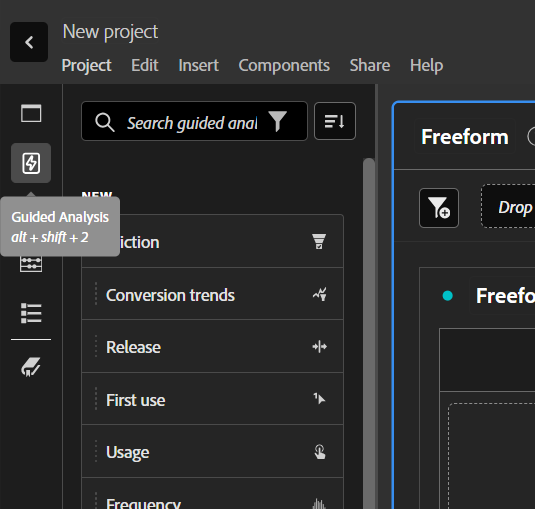

# Vue d’ensemble des analyses guidées

L’analyse guidée permet aux utilisateurs, du marketing au produit en passant par les analystes, d’obtenir des informations et des données de haute qualité sur le parcours client grâce à des workflows guidés, reposant sur les données cross-canal de Customer Journey Analytics. Comme pour les fiches d’évaluation Analysis Workspace et Mobile, l’analyse guidée utilise les données d’une [vue de données](/help/data-views/data-views.md), qui référence les données dans Adobe Experience Platform par le biais d’une [connexion](../connections/overview.md). De nombreux rapports créés dans les analyses guidées peuvent facilement être transférés vers Analysis Workspace pour effectuer des recherches supplémentaires.

>[!NOTE]
>
>Pour connaître les différences terminologiques (segments, filtres, etc.) entre l’analyse guidée et Analysis Workspace, consultez la [FAQ](faq.md) .

Les analyses guidées suivantes sont disponibles :

| Icône | Analyse | Description |
| :----:|--- | --- |
|  | [Croissance active](types/active-growth.md) | Identifiez les nouvelles personnes, celles qui ont été conservées, celles qui reviennent ou celles qui sont inactives. |
|  | [Tendances de conversion](types/conversion-trends.md) | Suivez l’évolution des taux de conversion au fil du temps. |
|  | [Engagement](types/engagement.md) | Comprendre l’étendue et la profondeur de l’engagement des fonctionnalités. |
|  | [Premier impact d’utilisation](types/first-use-impact.md) | Mesurez l’impact de la première utilisation des fonctionnalités sur les indicateurs clés. |
|  | [Fréquence](types/frequency.md) | Mesurez l’engagement par la fréquence d’utilisation. |
|  | [Entonnoir](types/funnel.md) | Comparez les taux de conversion entre les étapes. |
|  | [Croissance nette](types/net-growth.md) | Êtes-vous en train de gagner ou de perdre des utilisateurs et utilisatrices ? |
|  | [Impact sur les versions](types/release-impact.md) | Comparez les performances sur des périodes égales avant et après le lancement. |
|  | [Rétention](types/retention.md) | Mesurez les habitudes de retour de vos utilisateurs et de vos utilisatrices. |
|  | [Journal](types/timeline.md) | Explorez les modèles de l’activité de la session. |
|  | [Tendances](types/trends.md) | Mesurez l’interaction client au fil du temps. |

## Accéder à

Vous pouvez accéder à l’analyse guidée à partir de la page d’accueil du Customer Journey Analytics.

1. Sélectionnez **[!UICONTROL Analyse guidée]** sur la page d’accueil, ce qui vous permet d’accéder directement à l’ [analyse des tendances](types/trends.md).

   {style="border:1px solid gray"}

1. Sélectionnez **[!UICONTROL Créer]** pour afficher les différentes options de vue et choisir un point de départ différent pour votre analyse.

   {style="border:1px solid gray"}

Vous pouvez également accéder à l’analyse guidée à partir d’un projet Analysis Workspace.

1. Sélectionnez **[!UICONTROL Projet vierge]** sur la page d’accueil pour créer un projet Workspace vide.

   {style="border:1px solid gray"}

1. Sélectionnez  **** dans le rail de gauche.

   {style="border:1px solid gray"}

1. Faites glisser une nouvelle analyse sur le canevas Workspace, puis sélectionnez **[!UICONTROL Créer]** pour générer l’analyse souhaitée (par exemple : **[!UICONTROL Créer des tendances]**). Vous pouvez également faire glisser une analyse existante sur le canevas Workspace depuis la section **[!UICONTROL Enregistré]** .

   

## Interface

L’interface d’analyse guidée suit un format de question et de réponse. Formulez votre question dans le rail de requête, puis obtenez une réponse avec des informations écrites, un graphique et un tableau. Vous pouvez ensuite poser la question suivante avec les paramètres d’analyse et de visualisation.

L’analyse guidée utilise les éléments suivants de l’interface utilisateur :

| Aperçu de l’interface | Élément de lʼinterface utilisateur | Description |
| --- | --- | --- |
| {style="border:1px solid gray"} | **[!UICONTROL Rail de requête]** | Configurez votre *question* en sélectionnant les composants (événements, propriétés et segments) qui constituent une analyse. Les options suivantes sont disponibles dans toutes les analyses, avec des paramètres supplémentaires disponibles par vue. <ul><li>**Vue** : sélectionnez l’une des options pour passer à une nouvelle analyse. Les sélections de requêtes sont conservées dans les limites autorisées pour la nouvelle analyse.</li><li>**Événements** : événements que vous souhaitez mesurer. Chaque analyse applique différentes limites au nombre d’événements que vous pouvez configurer.  Les événements sont parfois étiquetés comme **[!UICONTROL Événements de début et de retour]**, **[!UICONTROL Étapes]** ou **[!UICONTROL Indicateurs clés]**. Les événements sont identifiés dans l’analyse à l’aide des événements 1, 2, ... Sélectionnez  **[!UICONTROL Ajouter un événement]** pour ajouter de nouveaux événements.</li><li>**[!UICONTROL Facteurs]** : si disponible, vous permet de spécifier des facteurs tels que la date depuis et le premier événement.</li><li>**Compté comme** : méthode de comptage que vous souhaitez appliquer aux événements sélectionnés. Sélectionnez dans le menu déroulant.</li><li>**Segments** : segments que vous souhaitez mesurer. Chaque analyse applique différentes limites au nombre de segments que vous pouvez configurer. Les segments sont identifiés dans l’analyse à l’aide de A, B, ... Sélectionnez  **** pour ajouter de nouveaux segments.</li><li>**[!UICONTROL Ventilation]** : si disponible, la ventilation que vous souhaitez appliquer à l’analyse.</li></ul>Sur certains paramètres, une configuration supplémentaire est disponible.<ul><li>**Filtres** : utilisez  pour réduire les événements ou les segments selon des dimensions spécifiques. Lorsqu’une dimension est sélectionnée, les deux critères de filtre standard (tels que **[!UICONTROL Égal à]**, **[!UICONTROL Contient]** ou **[!UICONTROL Se termine par]**) et les 1 000 premières valeurs de dimension sont disponibles.  Sélectionnez  pour ajouter des filtres supplémentaires. Sélectionnez  pour supprimer un filtre.</li><li>**Autres actions** : utilisez  pour sélectionner des actions, telles que<ul><li> **[!UICONTROL Renommer]** : pour renommer un événement ou un segment.</li><li> **** : pour dupliquer un événement ou un segment.</li><li> **[!UICONTROL Supprimer]** : pour supprimer un événement, un segment ou une ventilation.</li><li> **[!UICONTROL Modifier le segment]** : pour modifier un segment dans le [créateur de filtres](/help/components/filters/filter-builder.md).</li><li> **[!UICONTROL Ajouter aux favoris]** : pour ajouter le segment à la liste des filtres favoris dans le [Gestionnaire de filtres](/help/components/filters/manage-filters.md).</li><li> **** : pour enregistrer le segment en tant que nouveau composant. Dans la boîte de dialogue **[!UICONTROL Enregistrer les segments dans les composants]**, vous pouvez spécifier un nom de segment et une description. Vous pouvez sélectionner  pour marquer le nouveau segment comme favori. Sélectionnez **[!UICONTROL Enregistrer]** pour enregistrer le segment en tant que nouveau filtre.</li><li> **[!UICONTROL Lier les événements de début et de retour]**.: pour lier les événements de début et de retour dans une analyse [Rétention](types/retention.md).</li><li> **[!UICONTROL Dissocier les événements de début et de retour]** : pour dissocier les événements de début et de retour dans une analyse de [rétention](types/retention.md).</li></ul></li></ul> |
| {style="border:1px solid gray"} | **[!UICONTROL Graphique]** | Visualisation des données renvoyées en fonction de vos entrées dans le rail de requête et les paramètres. La visualisation que vous voyez dépend de la vue et des paramètres au-dessus du graphique. Le graphique comprend également les éléments suivants : <ul><li>**Info-bulles** : passez la souris sur un point de données de graphique pour afficher une info-bulle contenant plus d’informations.</li><li>**Légende** : passez la souris sur la série de légendes du graphique pour afficher les définitions lorsqu’elles sont disponibles, vous concentrer sur cette série et masquer temporairement d’autres séries. Sélectionnez une série dans la légende pour la masquer.</li><li>**Annotations** : les [annotations](../components/annotations/overview.md) applicables sont visibles entre la visualisation et la légende. Elles s’affichent sous la forme d’une icône  dans la couleur configurée de l’annotation. Les analyses qui affichent les données au fil du temps placent l’icône  sous la date ou la période configurée. Les analyses qui n’affichent pas de données au fil du temps affichent l’icône  dans le coin inférieur droit du graphique.</li><li>**Sélectionner des actions** : expliquez les actions disponibles suivantes en sélectionnant n’importe quel point de données. Les options incluent **Enregistrer le segment**.</li></ul> |
| {style="border:1px solid gray"} | **[!UICONTROL Tableau]** | Représentation sous forme de tableau des données renvoyées en fonction de votre entrée dans le rail de requête et les paramètres. Lignes dans le tableau à l’aide des identifiants d’événement (1, 2, ...) et de segment (A, B, ...) à titre de référence. Les colonnes du tableau dépendent de l’analyse au-dessus du graphique. Le tableau comprend également pour chaque ligne : <ul><li>**Sélectionner des actions** : basculez l’icône  pour masquer ou exposer une série de graphiques pour une ligne. Sélectionnez  pour d’autres actions. Les options incluent **Enregistrer le segment**.</li></ul> |
| {style="border:1px solid gray"} | **[!UICONTROL Paramètres de visualisation]** | Options au-dessus du graphique vous permettant de poser la question suivante et de personnaliser la manière dont le graphique et le tableau renvoient des données. Les options suivantes sont disponibles pour toutes les analyses, avec des paramètres supplémentaires disponibles par analyse. <ul><li> **Paramètres de graphique** : affinez l’affichage de votre graphique et tableau. Les options disponibles dépendent de l’analyse sélectionnée.</li><li> **Paramètres de superposition** : ajoutez une superposition. Les options disponibles dépendent de l’analyse sélectionnée.</li><li> **[!UICONTROL Paramètres du compartiment]** : compartiment automatique ou application de paramètres de compartiment personnalisés aux données. Les options disponibles dépendent de l’analyse sélectionnée.<li> **[!UICONTROL Comparer les paramètres]** : comparez les données à une plage de données spécifique. Les options disponibles dépendent de l’analyse sélectionnée.</li><li> **[!UICONTROL Paramètres d’affichage]** : choisissez comment afficher les données. Les options disponibles dépendent de l’analyse sélectionnée.<li> **Période** : sélecteur de calendrier qui vous permet de déterminer la période de l’analyse. Vous pouvez également sélectionner un intervalle pour les analyses de tendances, par exemple, quotidiennes, hebdomadaires ou mensuelles.</li><li> **Insights** : informations contextuelles selon l’analyse que vous affichez. Ces informations fournissent des observations pour l’analyse actuelle. Si plusieurs informations sont disponibles, vous pouvez les afficher à l’aide des flèches situées à droite. Vous pouvez activer/désactiver la visibilité de cette zone à l’aide de l’icône d’ampoule située en haut à droite.</li></ul> |
| {style="border:1px solid gray"} | **[!UICONTROL Menu]** Disponible dans un projet d’analyse guidée | Commandes en haut à droite d’un projet d’analyse guidée qui fournit des actions principales pour votre analyse.<ul><li> ***nom de la vue de données*** : modifiez la vue de données utilisée par l’analyse. Lorsque vous modifiez la vue de données, les composants disponibles dans le rail de requête changent également.</li><li> **Copier le lien** : copie un lien vers l’analyse dans le presse-papiers. Vous recevez une invitation à enregistrer avant de partager.</li><li>**Partager** : ouvre la boîte de dialogue modale de partage, qui contient d’autres options de partage pour des utilisateurs et utilisatrices individuels ou des groupes. Vous pouvez partager une analyse avec d’autres personnes ou générer un lien de partage avec n’importe qui.</li><li>**Enregistrer** : enregistre l’analyse. Si vous enregistrez une nouvelle analyse, la boîte de dialogue **[!UICONTROL Enregistrer l’analyse]** s’affiche et demande un nom et une description. Une fois enregistrée, une boîte de dialogue **[!UICONTROL Analyse enregistrée]** vous permet de partager votre analyse.</li></ul>Sélectionnez  pour d’autres actions, telles que :<ul><li>**Enregistrer sous** : enregistre l’analyse séparément de l’analyse actuelle, en créant une copie. Une boîte de dialogue s’affiche et vous demande un nouveau nom et une nouvelle description.</li><li>**Exporter vers Workspace** : recrée la requête d’analyse guidée actuelle dans Analysis Workspace. Le projet Workspace est créé dans un nouvel onglet afin d’éviter toute interruption lors de l’utilisation de l’analyse guidée. Il s’agit d’une copie de l’analyse, qui ne reste pas synchronisée avec l’analyse d’origine une fois ouverte. Utilisez cette commande lorsque vous souhaitez passer à votre équipe d’analystes ou approfondir les données par rapport à ce que l’analyse permet.</li><li>**Copier le graphique dans le Presse-papiers** : copie le graphique dans le Presse-papiers pour le coller dans d’autres applications. Le rail de requête et le tableau ne sont pas inclus dans le graphique.</li><li>**Télécharger PNG** : télécharge les éléments graphiques du graphique sous forme de `.png`. Le rail de requête et le tableau ne sont pas inclus dans le graphique.</li><li>**Télécharger un CSV** : télécharge les données du tableau sous forme de `.csv`. Le rail de requête et le graphique ne sont pas inclus dans le fichier.</li></ul> |
| {style="border:1px solid gray"} | **Menu**  Disponible dans une visualisation d’analyse guidée dans Analysis Workspace. | Commandes dans une visualisation d’analyse guidée dans Analysis Workspace.<ul><li> **[!UICONTROL Chart]** : pour afficher uniquement le graphique de l’analyse.</li><li> **[!UICONTROL Table]** : pour afficher uniquement la table de l’analyse.</li><li> **[!UICONTROL All]** : pour afficher le graphique et le tableau de l’analyse.</li><li> **[!UICONTROL Modifier]** : pour modifier la configuration de l’analyse</li><li> **[!UICONTROL *Période *]**: pour configurer la plage de données pour l’analyse.</li></ul> |

## Approvisionnement

Les analyses guidées sont incluses dans les packages Customer Journey Analytics de la manière suivante :

| Package | Analyses disponibles |
| --- | --- |
| [!UICONTROL Modules complémentaires Customer Journey Analytics] | Croissance active, tendances de conversion, fréquence, entonnoir, croissance nette, rétention, tendances |
| [!UICONTROL Fondation Customer Journey Analytics] | Tendances |
| [!UICONTROL Customer Journey Analytics Select] | Vues de base + croissance active, tendances de conversion, fréquence, entonnoir, croissance nette, rétention |
| [!UICONTROL Customer Journey Analytics Prime] | Sélectionner des vues + engagement, Première utilisation de l’impact, Version de l’impact, Chronologie |
| [!UICONTROL Customer Journey Analytics Ultimate] | Vues Prime |

{style="table-layout:auto"}

Les administrateurs de profil de produit peuvent ajouter ou supprimer l’accès à l’analyse guidée dans Adobe Admin Console.

1. Connectez-vous à [Adobe Admin Console](https://adminconsole.adobe.com).
1. Sélectionnez **[!UICONTROL Customer Journey Analytics]** dans la liste des produits.
1. Sélectionnez le profil de produit souhaité pour les autorisations que vous souhaitez modifier.
1. Sélectionnez l’onglet **[!UICONTROL Autorisations]**, puis cliquez sur **[!UICONTROL Modifier]** sous [!UICONTROL Outils de création de rapports].
1. Sélectionnez  en regard de **[!UICONTROL Accès à l’analyse guidée]** dans la liste des [!UICONTROL éléments d’autorisation disponibles], ce qui l’ajoute à la liste des [!UICONTROL éléments d’autorisation inclus].
1. Sélectionnez **[!UICONTROL Enregistrer]**.

Voir [Accès au niveau de l’utilisateur](/help/technotes/access-control.md#user-level-access) pour plus d’informations.

>[!TIP]
>
>Certains administrateurs préfèrent activer l’analyse guidée et désactiver Analysis Workspace pour les nouveaux utilisateurs dans Customer Journey Analytics. Une fois que ces utilisateurs et utilisatrices se seront familiarisés avec le produit et vos données organisationnelles, vous pourrez alors activer l’accès à Analysis Workspace.
