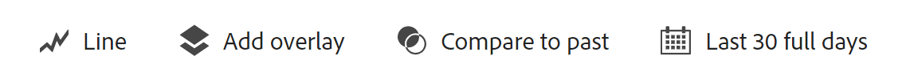

# Aperçu des analyses guidées

L’analyse guidée est un format de création de rapports qui permet aux équipes produit de répondre rapidement à leurs besoins de données de manière à obtenir rapidement des informations de haute qualité et à prendre davantage de décisions liées aux données. Les équipes interfonctionnelles peuvent se connecter en temps réel pour utiliser et comprendre ces rapports.

Tout comme pour les Fiches d’évaluation Analysis Workspace et Mobile, un rapport d’analyse guidée utilise les données d’une [Vue des données](../data-views/data-views.md), qui référence les données dans Adobe Experience Platform au moyen d’une [Connexion](../connections/overview.md). Tous les rapports créés dans les analyses guidées peuvent facilement être transférés vers Analysis Workspace pour effectuer des recherches supplémentaires.

L’analyse guidée offre plusieurs méthodes d’analyse et d’affichage des données. Les types d’affichage peuvent afficher les mêmes données de différentes manières, ce qui génère différentes insights à l’aide des mêmes événements et segments. Vous obtenez différents rails de requête et paramètres de visualisation en fonction de la vue que vous choisissez. Vous pouvez basculer librement entre les vues et tout composant de rail de requête applicable peut être transféré si la vue les prend en charge.

L’analyse guidée classe les types de vues dans **Types d’analyse**. Les types d’analyse et d’affichage suivants sont disponibles :

| Type d’analyse | Type de vue | Description |
| --- | --- | --- |
| [!UICONTROL Impact] | [Version](types/release.md) | Comparer les performances sur des périodes égales avant et après le lancement. |
| [!UICONTROL Impact] | [Première utilisation](types/first-use.md) | Mesurer l’impact de la première utilisation des fonctionnalités sur les indicateurs clés. |
| [!UICONTROL Entonnoir] | [Friction](types/friction.md) | Comparer les taux de conversion entre les étapes. |
| [!UICONTROL Entonnoir] | [Tendances de conversion](types/conversion-trends.md) | Suivre l’évolution des taux de conversion au fil du temps. |
| [!UICONTROL Croissance des utilisateurs et des utilisatrices] | [Actif](types/active.md) | Identifier les nouvelles personnes, celles qui ont été consrvées, celles qui reviennent ou celles qui sont inactives. |
| [!UICONTROL Croissance nette] | [Croissance nette](types/net-growth.md) | Êtes-vous en train de gagner ou de perdre des utilisateurs et utilisatrices ? |
| [!UICONTROL Tendances] | [Utilisation](types/usage.md) | Mesurer l’interaction client au fil du temps. |

{style="table-layout:auto"}

## Accès

Si votre entreprise est configurée pour l’analyse guidée, vous pouvez y accéder à partir de la page d’accueil du Customer Journey Analytics.

1. Cliquez sur **[!UICONTROL Analyse guidée]** à partir de la page d’accueil pour accéder directement au [Affichage des tendances d’utilisation](types/usage.md).

   

1. Cliquez sur **[!UICONTROL Créer]** pour afficher les différentes options d’affichage et choisir un point de départ différent pour votre analyse.

   

## Interface

L’interface d’analyse guidée, quel que soit le type d’analyse, comprend les éléments principaux suivants de l’interface utilisateur :

| Aperçu de l’interface | Élément de lʼinterface utilisateur | Description |
| --- | --- | --- |
|  | Rail de requêtes | Configurez les composants (événements, propriétés et segments) qui constituent une analyse. Chaque type d’analyse applique différentes limites au nombre d’événements et de segments que vous pouvez configurer. Si vous passez à un nouveau type d’analyse, vos sélections de requêtes sont conservées dans les limites autorisées pour ce type d’analyse. |
|  | Graphique | Visualisation des données renvoyées en fonction de vos entrées depuis le rail de requête et les paramètres. La visualisation que vous voyez dépend de la vue et des paramètres au-dessus du graphique. Les vues disponibles dépendent du type d’analyse situé au-dessus du rail de requête. Le graphique comprend également : <ul><li>**Infobulles**: Passez la souris sur un point de données de graphique pour afficher une info-bulle contenant davantage d’informations.</li><li>**Légende**: Passez la souris sur la légende du graphique pour afficher les définitions de série, le cas échéant.</li><li>**Actions de clic**: Exposez les actions suivantes disponibles en cliquant avec le bouton gauche de la souris sur un point de données. Les options incluent **Enregistrer le segment**.</li></ul> |
|  | Tableau | Représentation sous forme de tableau des données renvoyées en fonction de l’entrée que vous avez reçue du rail de requête et des paramètres. Les colonnes du tableau dépendent du type d’affichage situé au-dessus du graphique. Les vues disponibles dépendent du type d’analyse situé au-dessus du rail de requête. Le tableau comprend également : <ul><li>**Actions de clic**: Exposez les actions suivantes disponibles en cliquant sur le bouton **[!UICONTROL Plus]** . Les options incluent **Enregistrer le segment**.</li></ul> |
|  | Paramètres de visualisation | Plusieurs options au-dessus du graphique qui vous permettent de personnaliser la manière dont le graphique et le tableau renvoient des données.<ul><li>**Type d’affichage**: Sélecteur déroulant qui permet de présenter différemment les données d’un type d’analyse donné.</li><li>**Paramètres du graphique**: Ajustez l’affichage du graphique et du tableau. Les options disponibles dépendent de la vue sélectionnée.</li><li>**Période**: Sélecteur de calendrier qui vous permet de déterminer la période de l’analyse. Vous pouvez également sélectionner un intervalle pour les vues de tendances, par exemple, quotidiennes, hebdomadaires ou mensuelles.</li><li>**Insights**: Informations contextuelles en fonction de l’analyse que vous affichez. Vous pouvez afficher des informations supplémentaires à l’aide des flèches ou les afficher ou les masquer à l’aide de l’icône d’ampoule située en haut à droite.</li></ul> |
|  | Menu | Commandes en haut à droite de l’analyse guidée qui fournissent des actions principales pour votre analyse.<ul><li>**Sélecteur de vue de données**: Modifiez la vue de données utilisée par l’analyse. Lorsque vous modifiez la vue de données, les composants disponibles dans le rail de requête changent également.</li><li>**Enregistrer**: Enregistre l’analyse. Si vous enregistrez une nouvelle analyse, une fenêtre modale s’affiche et vous demande un nom et une description.</li><li>**Enregistrer sous**: Enregistre l’analyse séparément de l’analyse actuelle, créant ainsi une copie. Une fenêtre modale s’affiche, qui demande un nouveau nom et une nouvelle description.</li><li>**Ouvrir dans Workspace**: Recrée l’analyse guidée actuelle dans Analysis Workspace. Le projet Workspace est créé dans un nouvel onglet afin d’éviter toute interruption lors de l’utilisation de l’analyse guidée. Il s’agit d’une copie de l’analyse et elle ne reste pas synchronisée avec l’analyse guidée d’origine une fois ouverte. Utilisez cette commande lorsque vous souhaitez passer à votre équipe d’analystes ou approfondir les données par rapport à ce que l’analyse guidée permet.</li><li>**Copier dans le presse-papiers**: Copie le graphique de graphique dans le presse-papiers, à coller dans d’autres applications. Le rail de requête et le tableau ne sont pas inclus dans le graphique.</li><li>**Télécharger PNG**: Télécharge le graphique sous la forme d’un graphique `.png`. Le rail de requête et le tableau ne sont pas inclus dans le graphique.</li><li>**Téléchargement de fichier CSV**: Télécharge les données du tableau sous la forme `.csv`. Le rail de requête et le graphique ne sont pas inclus dans le fichier .</li></ul> |

{style="table-layout:auto"}

## Attribution des privilèges d’accès

L’analyse guidée fait partie de l’Adobe Product Analytics, qui est un module complémentaire payant de Customer Journey Analytics. Si votre entreprise souhaite commencer à utiliser cet ensemble de fonctionnalités, contactez votre équipe de compte d’Adobe.

Une fois que votre entreprise a été configurée pour utiliser l’analyse guidée, les administrateurs de profil de produit peuvent y ajouter ou en supprimer l’accès dans Adobe Admin Console.

1. Connectez-vous au [Adobe Admin Console](https://adminconsole.adobe.com).
1. Sélectionner **[!UICONTROL Customer Journey Analytics]** dans la liste des produits.
1. Sélectionnez le profil de produit souhaité pour les autorisations que vous souhaitez modifier.
1. Cliquez sur le bouton **[!UICONTROL Autorisations]** , puis cliquez sur **[!UICONTROL Modifier]** under [!UICONTROL Outils de création de rapports].
1. Cliquez sur l’icône Plus en regard de **[!UICONTROL Accès aux analyses guidées]** dans la liste de [!UICONTROL Éléments d’autorisation disponibles], qui l’ajoute à la liste de [!UICONTROL Éléments d’autorisation inclus].
1. Cliquez sur **[!UICONTROL Enregistrer]**.

>[!TIP]
>
>Certains administrateurs préfèrent activer l’analyse guidée et désactiver Analysis Workspace pour les nouveaux utilisateurs dans Customer Journey Analytics. Une fois que ces utilisateurs auront acquis la maturité avec le produit et vos données d’organisation, vous pourrez alors activer l’accès à Analysis Workspace.
