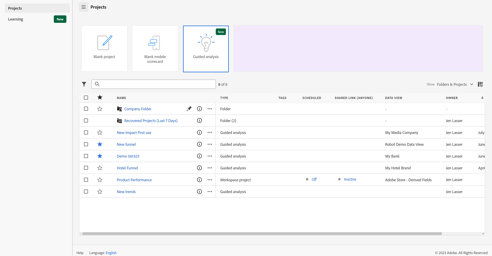

# Aperçu des analyses guidées

L’analyse guidée permet aux utilisateurs de fournir en libre-service des données de haute qualité et des informations sur le parcours client au moyen de workflows guidés, reposant sur les données cross-canal de Customer Journey Analytics. Les équipes interfonctionnelles, du marketing au produit, peuvent se connecter en temps réel pour utiliser et comprendre ces rapports.

>[!NOTE]
>
> Actuellement, l’analyse guidée n’est disponible que dans le cadre d’un Adobe Product Analytics, qui est un module complémentaire payant de Customer Journey Analytics. Si votre entreprise souhaite commencer à utiliser cet ensemble de fonctionnalités, contactez votre équipe de compte d’Adobe.

Tout comme les Fiches d’évaluation Analysis Workspace et Mobile, l’analyse guidée utilise les données d’une [Vue des données](../data-views/data-views.md), qui référence les données dans Adobe Experience Platform au moyen d’une [Connexion](../connections/overview.md). De nombreux rapports créés dans les analyses guidées peuvent facilement être transférés vers Analysis Workspace pour effectuer des recherches supplémentaires.

Les vues d’analyse guidée suivantes sont disponibles :

| Type d’analyse | Type de vue | Description |
| --- | --- | --- |
| [!UICONTROL Entonnoir] | [Friction](types/friction.md) | Comparer les taux de conversion entre les étapes. |
| [!UICONTROL Entonnoir] | [Tendances de conversion](types/conversion-trends.md) | Effectuez le suivi des modifications des taux de conversion au fil du temps. |
| [!UICONTROL Impact] | [Version](types/release.md) | Comparer les performances sur des périodes égales avant et après la publication. |
| [!UICONTROL Impact] | [Première utilisation](types/first-use.md) | Mesurez l’impact de la première utilisation de fonctionnalités sur les indicateurs clés. |
| [!UICONTROL Rétention] | [Taux de rétention](types/retention-rates.md) | Mesurez les habitudes de retour constantes de vos utilisateurs. |
| [!UICONTROL Trends] | [Utilisation](types/usage.md) | Mesurez l’engagement des utilisateurs au fil du temps. |
| [!UICONTROL Trends] | [Fréquence](types/frequency.md) | Mesurez l’engagement par fréquence d’utilisation. |
| [!UICONTROL Croissance des utilisateurs] | [Actif](types/active.md) | Identifiez les nouveaux, les fidélisés, les anciens ou les nouveaux venus. |
| [!UICONTROL Croissance des utilisateurs] | [Croissance nette](types/net-growth.md) | Êtes-vous en train de gagner ou de perdre des utilisateurs et utilisatrices ? |
| [!UICONTROL Flux d’utilisateurs] | [Journal](types/timeline.md) | Explorez les modèles dans l’activité de session. |

{style="table-layout:auto"}

## Accéder à

Si votre entreprise est configurée pour l’analyse guidée, vous pouvez y accéder à partir de la page d’accueil du Customer Journey Analytics.

1. Cliquez sur **[!UICONTROL Analyse guidée]** à partir de la page d’accueil, qui vous permet d’accéder directement au [Affichage des tendances d’utilisation](types/usage.md).

   {style="border:1px solid gray"}

1. Cliquez sur **[!UICONTROL Créer]** pour afficher les différentes options d’affichage et choisir un point de départ différent pour votre analyse.

   {style="border:1px solid gray"}

Si votre entreprise n’est pas encore configurée pour une analyse guidée, contactez votre équipe de compte d’Adobe.

## Interface

L’interface d’analyse guidée suit un format de question et de réponse. Formez votre question dans le rail de requête, puis obtenez une réponse avec un aperçu écrit, un graphique et un tableau. Vous pouvez ensuite poser la question suivante avec les types d’affichage et les paramètres de visualisation.

L’analyse guidée utilise les éléments suivants de l’interface utilisateur :

| Aperçu de l’interface | Élément de lʼinterface utilisateur | Description |
| --- | --- | --- |
| {style="border:1px solid gray"} | Rail de requêtes | Configurez votre &quot;question&quot; en sélectionnant les composants (événements, propriétés et segments) qui constituent une analyse. Les options suivantes sont disponibles pour tous les types de vue, avec des paramètres supplémentaires disponibles par vue. <ul><li>**Sélecteur d’analyse**: menu déroulant qui vous permet de passer à un nouveau type d’analyse. Les sélections de requêtes sont conservées dans les limites autorisées pour le nouveau type d’analyse.</li><li>**Sélecteur d’affichage**: une liste déroulante qui permet de basculer vers une nouvelle vue (&quot;réponse&quot;) pour la requête que vous avez formée. Vos sélections de requêtes sont conservées dans les limites autorisées pour le nouveau type de vue.</li><li>**Événements**: événements que vous souhaitez mesurer. Chaque type de vue applique différentes limites au nombre d’événements que vous pouvez configurer.</li><li>**Filtres**: utilisez la variable  dans la section Événements ou Segments afin de préciser les propriétés spécifiques. Lorsqu’une propriété est sélectionnée, les deux critères de filtre standard (tels que [!UICONTROL Est égal à], [!UICONTROL Contient], ou [!UICONTROL Se termine par]) et les 1 000 premières valeurs de propriété sont disponibles.</li><li>**Compté comme**: méthode de comptage à appliquer aux événements sélectionnés.</li><li>**Segments**: segments que vous souhaitez mesurer. Chaque type d’affichage applique différentes limites au nombre de segments que vous pouvez configurer.</li></ul> |
| {style="border:1px solid gray"} | Graphique | Visualisation des données renvoyées en fonction de vos entrées depuis le rail de requête et les paramètres. La visualisation que vous voyez dépend de la vue et des paramètres au-dessus du graphique. Le graphique comprend également : <ul><li>**Infobulles**: passez la souris sur un point de données de graphique pour afficher une info-bulle contenant plus d’informations.</li><li>**Légende**: passez la souris sur la série de légendes du graphique pour afficher les définitions lorsqu’elles sont disponibles, vous concentrer sur cette série et masquer temporairement d’autres séries. Masquez une série dans la légende en cliquant dessus.</li><li>**Annotations**: applicable [annotations](../components/annotations/overview.md) sont visibles entre la visualisation et la légende. Il s’affiche sous la forme d’une  dans la couleur configurée de l’annotation. Les types d’affichage qui affichent les données au fil du temps placent la variable  sous la date ou la période configurée. Les types d’affichage qui n’affichent pas les données au fil du temps affichent la variable  dans le coin inférieur droit du graphique.</li><li>**Actions de clic**: exposez les actions suivantes disponibles en cliquant avec le bouton gauche de la souris sur un point de données. Les options incluent **Enregistrer le segment**.</li></ul> |
| {style="border:1px solid gray"} | Tableau | Représentation sous forme de tableau des données renvoyées en fonction de l’entrée que vous avez reçue du rail de requête et des paramètres. Les colonnes du tableau dépendent du type d’affichage situé au-dessus du graphique. Le tableau comprend également : <ul><li>**Actions de clic**: masquez ou affichez une série de graphiques en faisant basculer le  dans chaque ligne. Pour accéder à d’autres actions, cliquez sur le bouton **[!UICONTROL Plus]** . Les options incluent **Enregistrer le segment**.</li></ul> |
| {style="border:1px solid gray"} | Paramètres de visualisation | Options au-dessus du graphique qui vous permettent de poser la question suivante et de personnaliser la manière dont le graphique et le tableau renvoient des données. Les options suivantes sont disponibles pour tous les types de vue, avec des paramètres supplémentaires disponibles par vue. <ul><li>**Paramètres du graphique**: affinez l’affichage de votre graphique et de votre tableau. Les options disponibles dépendent de la vue sélectionnée.</li><li>**Période**: sélecteur de calendrier qui vous permet de déterminer la période de l’analyse. Vous pouvez également sélectionner un intervalle pour les vues de tendances, par exemple, quotidiennes, hebdomadaires ou mensuelles.</li><li>**Informations**: informations contextuelles selon l’analyse que vous affichez. Vous pouvez afficher des informations supplémentaires à l’aide des flèches ou les afficher ou les masquer à l’aide de l’icône d’ampoule située en haut à droite.</li></ul> |
| {style="border:1px solid gray"} | Menu | Commandes en haut à droite de l’analyse guidée qui fournissent des actions principales pour votre analyse.<ul><li>**Sélecteur de vue de données**: modifiez la vue de données utilisée par l’analyse. Lorsque vous modifiez la vue de données, les composants disponibles dans le rail de requête changent également.</li><li>**Copier le lien**: copie un lien vers l’analyse dans le presse-papiers. Vous serez invité à enregistrer avant de partager.</li><li>**Partager**: ouvre le modal de partage, avec d’autres options de partage pour des utilisateurs ou des groupes individuels. Vous serez invité à enregistrer avant de partager.</li><li>**Enregistrer**: enregistre l’analyse. Si vous enregistrez une nouvelle analyse, une fenêtre modale s’affiche et vous demande un nom et une description.</li><li>**Enregistrer sous**: enregistre l’analyse séparément de l’analyse actuelle, en créant une copie. Une fenêtre modale s’affiche, qui demande un nouveau nom et une nouvelle description.</li><li>**Ouvrir dans Workspace**: recrée l’analyse guidée actuelle dans Analysis Workspace. Le projet Workspace est créé dans un nouvel onglet afin d’éviter toute interruption lors de l’utilisation de l’analyse guidée. Il s’agit d’une copie de l’analyse et elle ne reste pas synchronisée avec l’analyse guidée d’origine une fois ouverte. Utilisez cette commande lorsque vous souhaitez passer à votre équipe d’analystes ou approfondir les données par rapport à ce que l’analyse guidée permet.</li><li>**Copier dans le presse-papiers**: copie le graphique de graphique dans le presse-papiers, à coller dans d’autres applications. Le rail de requête et le tableau ne sont pas inclus dans le graphique.</li><li>**Télécharger PNG**: télécharge le graphique sous forme de graphique `.png`. Le rail de requête et le tableau ne sont pas inclus dans le graphique.</li><li>**Téléchargement de fichier CSV**: télécharge les données du tableau sous la forme d’une `.csv`. Le rail de requête et le graphique ne sont pas inclus dans le fichier .</li></ul> |

{style="table-layout:auto"}

## Approvisionnement

L’analyse guidée fait partie de l’Adobe Product Analytics, qui est un module complémentaire payant de Customer Journey Analytics. Si votre entreprise souhaite commencer à utiliser cet ensemble de fonctionnalités, contactez votre équipe de compte d’Adobe.

Une fois que votre entreprise a été configurée pour utiliser l’analyse guidée, les administrateurs de profil de produit peuvent y ajouter ou en supprimer l’accès dans Adobe Admin Console.

1. Connectez-vous au [Adobe Admin Console](https://adminconsole.adobe.com).
1. Sélectionner **[!UICONTROL Customer Journey Analytics]** dans la liste des produits.
1. Sélectionnez le profil de produit souhaité pour les autorisations que vous souhaitez modifier.
1. Cliquez sur le bouton **[!UICONTROL Autorisations]** , puis cliquez sur **[!UICONTROL Modifier]** under [!UICONTROL Outils de création de rapports].
1. Cliquez sur l’icône Plus en regard de **[!UICONTROL Accès aux analyses guidées]** dans la liste de [!UICONTROL Éléments d’autorisation disponibles], qui l’ajoute à la liste de [!UICONTROL Éléments d’autorisation inclus].
1. Cliquez sur **[!UICONTROL Enregistrer]**.

>[!TIP]
>
>Certains administrateurs préfèrent activer l’analyse guidée et désactiver Analysis Workspace pour les nouveaux utilisateurs dans Customer Journey Analytics. Une fois que ces utilisateurs auront acquis la maturité avec le produit et vos données d’organisation, vous pourrez alors activer l’accès à Analysis Workspace.
