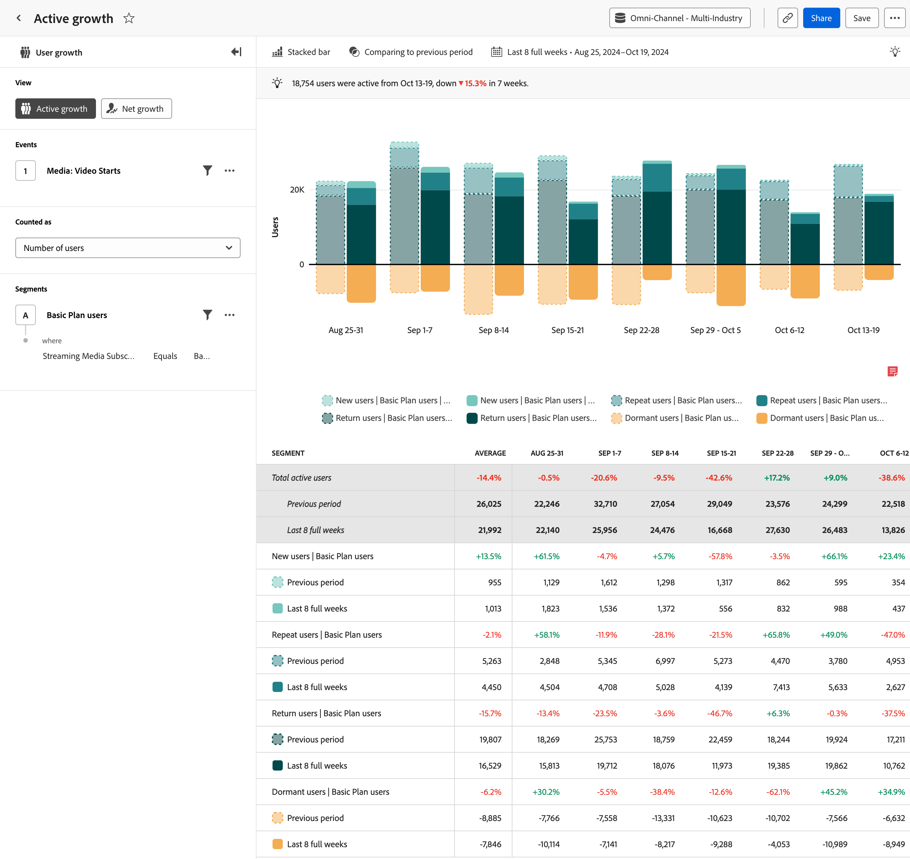

# Analyse de la [!UICONTROL croissance active] {#active-growth}

>[!CONTEXTUALHELP]
>id="workspace_guidedanalysis_activegrowth_button"
>title="Croissance active"
>abstract="Identifiez les nouvelles personnes, celles qui ont été conservées, celles qui reviennent ou celles qui sont inactives."

L’analyse  **[!UICONTROL Croissance active]** fournit des informations sur la croissance et l’acquisition d’utilisateurs et d’utilisatrices sur une période spécifique. L’axe horizontal est un intervalle de temps, tandis que l’axe vertical est une mesure des utilisateurs et utilisatrices. Les utilisateurs et utilisatrices sont répartis en quatre catégories :

* **[!UICONTROL Nouveau]** : la personne était active pendant la période en cours, mais pas avant. Observez l’étendue de l’analyse en pointant sur _[!UICONTROL Nouveaux utilisateurs et utilisatrices]_ dans la légende du graphique. La période de recherche en amont est déterminée dynamiquement en fonction de la période et de l’intervalle sélectionnés.
* **[!UICONTROL Conservé]** : la personne était active pendant la période actuelle et la période précédente.
* **[!UICONTROL Récurrent]** : la personne était active au cours de la période en cours et non au cours de la période précédente, mais elle était auparavant active à un moment donné. Observez l’étendue de l’analyse en pointant sur _[!UICONTROL Utilisateurs et utilisatrices récurrents]_ dans la légende du graphique. La période de recherche en amont est déterminée dynamiquement en fonction de la période et de l’intervalle sélectionnés.
* **[!UICONTROL Inactif]** : la personne était active au cours de la période précédente, mais ne l’est pas au cours de la période en cours. Les utilisateurs et utilisatrices inactifs ne sont pas comptabilisés dans le nombre total d’utilisateurs et utilisatrices actifs.

Tous les utilisateurs et utilisatrices actifs (nouveaux + conservés + récurrents) apparaissent en teinte turquoise au-dessus de l’axe horizontal, tandis que tous les utilisateurs et utilisatrices inactifs apparaissent en orange au-dessous de l’axe horizontal.

>[!VIDEO](https://video.tv.adobe.com/v/3423393/?quality=12&learn=on&captions=fre_fr)

## Cas d’utilisation

Les cas d’utilisation de cette analyse sont les suivants :

* **Rétention et attrition des utilisateurs et utilisatrices :** permet de visualiser clairement les périodes de rétention élevée ou faible des utilisateurs et utilisatrices. Reconnaître ces périodes de rétention élevée ou faible peut vous aider à prendre des décisions concernant le produit afin d’encourager une rétention élevée ou de minimiser le taux d’attrition de clientèle.
* **Évaluation de la campagne** : l’affichage d’une campagne spécifique peut vous aider à comprendre le volume de trafic généré et à déterminer dans quelle mesure elle a permis aux utilisateurs et utilisatrices de rester engagés.
* **Analyse du cycle de vie des utilisateurs et utilisatrices** : l’analyse de la croissance des utilisateurs et utilisatrices actifs tout au long de leur cycle de vie peut aider à identifier les étapes spécifiques où l’engagement des utilisateurs et utilisatrices diminue. Par exemple, s’il existe un taux élevé d’utilisateurs et utilisatrices inactifs pour les personnes en phase d’intégration, cela peut indiquer des problèmes d’utilisation ou un besoin de meilleurs conseils intégrés au produit.

## Interface

Consultez [Interface](../overview.md#interface) pour une vue d’ensemble de l’interface d’analyse guidée. Les paramètres suivants sont spécifiques à cette analyse :

### Rail de requête

Le rail de requête vous permet de configurer les composants suivants :

* **[!UICONTROL Vue]** : basculez entre cette analyse et [Croissance nette](net-growth.md).
* **[!UICONTROL Événements]** : événements que vous souhaitez mesurer. Cette analyse étant basée sur les personnes, une personne qui interagit avec l’événement une fois au cours de la période est comptabilisée comme étant active. Vous pouvez inclure un événement dans une requête.
* **[!UICONTROL Compté comme]** : méthode de comptage à appliquer aux événements sélectionnés. <ul><li>**[!UICONTROL Options]** inclure [!UICONTROL Nombre d’utilisateurs] et [!UICONTROL Pourcentage d’utilisateurs].</li><li>[!BADGE B2B edition]{type=Informative url="https://experienceleague.adobe.com/fr/docs/analytics-platform/using/cja-overview/cja-b2b/cja-b2b-edition" newtab=true tooltip="Customer Journey Analytics B2B edition"} Des options **[!UICONTROL B2B supplémentaires]** sont disponibles pour Customer Journey Analytics B2B edition : [!UICONTROL Comptes globaux], [!UICONTROL Comptes], [!UICONTROL Groupes d’achat], [!UICONTROL Opportunités], [!UICONTROL Pourcentage des comptes globaux], [!UICONTROL Pourcentage des comptes], [!UICONTROL Pourcentage des groupes d’achat] et [!UICONTROL Pourcentage des opportunités].</li></ul>
* **[!UICONTROL Segments]** : segment selon lequel vous souhaitez segmenter les données. Vous pouvez inclure un segment dans une requête.

### Paramètres du graphique

L’analyse [!UICONTROL Croissance active] propose les paramètres de graphique suivants, qui peuvent être ajustés dans le menu au-dessus du graphique :

* **[!UICONTROL Type de graphique]** : type de visualisation que vous souhaitez utiliser. Les options incluent [!UICONTROL Barres empilées] et [!UICONTROL Aires empilées].

### Comparaison de temps

{{apply-time-comparison}}

### Période

Période souhaitée pour votre analyse. Ce paramètre comporte deux composants :

* **[!UICONTROL Intervalle]** : granularité de la date selon laquelle vous souhaitez afficher les données de tendance. Les options valides sont Horaire, Quotidien, Hebdomadaire, Mensuel et Trimestriel. Une même période peut avoir des intervalles différents, ce qui affecte le nombre de points de données dans le graphique et le nombre de colonnes du tableau. Par exemple, l’affichage d’une analyse s’étendant sur trois jours avec une granularité quotidienne n’affiche que trois points de données, tandis qu’une analyse s’étendant sur trois jours avec une granularité horaire affiche 72 points de données.
* **[!UICONTROL Date]** : date de début et de fin. Les paramètres prédéfinis de période flottante et les périodes personnalisées enregistrées précédemment sont disponibles pour votre commodité. Vous pouvez également utiliser le sélecteur de calendrier pour choisir une période fixe.

<!--
## Example

See below for an example of the analysis.

-->
