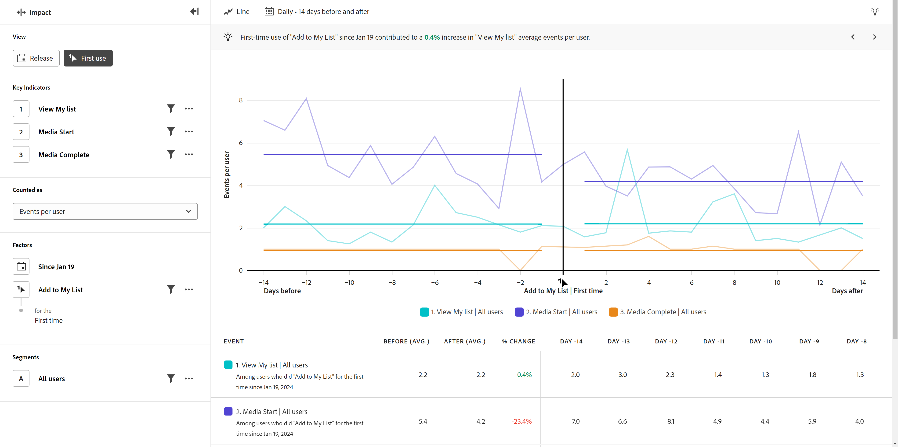

# Première utilisation

{{release-limited-testing}}

Le **Première utilisation** La vue présente une comparaison des indicateurs clés effectués avant et après qu’un utilisateur ne modifie un événement donné pour la première fois. L’axe horizontal de ce rapport est un intervalle de temps relatif avant et après l’événement, tandis que l’axe vertical mesure les indicateurs clés souhaités. Une barre verticale au milieu du graphique représente le moment où l’événement s’est produit pour un utilisateur donné.

## Cas d’utilisation

Les cas d’utilisation de ce type de vue sont les suivants :

* **Nouvelle analyse des fonctionnalités**: Si vous lancez une nouvelle fonctionnalité dans votre produit, vous pouvez comparer les performances des indicateurs clés avant et après la première exposition des utilisateurs à cette nouvelle fonctionnalité.
* **Efficacité des campagnes**: Lorsqu’un utilisateur consulte une campagne donnée, vous pouvez comparer les performances des indicateurs clés avant et après que l’utilisateur ait vu ou interagi avec cette campagne.

## Rail de requêtes

Le rail de requête vous permet de configurer les composants suivants :

* **Indicateurs clés**: Événements que vous souhaitez mesurer par utilisateur. Chaque indicateur de clé sélectionné est représenté sous la forme d’une ligne colorée. Une ligne représentant l’événement est ajoutée au tableau. Vous pouvez inclure jusqu’à trois événements.
* **Facteurs**: Ce point de vue comporte deux facteurs :
   * **Date**: Quelle distance vous souhaitez parcourir pour la première fois qu’un événement a été touché.
   * **Événement**: L’événement que vous souhaitez comparer avant et après qu’il ait été touché.
* **Personnes**: Le segment que vous souhaitez mesurer. Le segment sélectionné filtre vos données afin de se concentrer uniquement sur les individus qui correspondent à vos critères de segment.

## Paramètres du graphique

La vue Première utilisation offre les paramètres de graphique suivants, qui peuvent être ajustés dans le menu situé au-dessus du graphique :

* **Mesure**: Mesure que vous souhaitez mesurer. Les options incluent [!UICONTROL Événements par utilisateur], [!UICONTROL Événements], [!UICONTROL Sessions], et [!UICONTROL Utilisateurs].
* **Type de graphique**: Type de visualisation que vous souhaitez utiliser. Les options comprennent Ligne.

## Période

Les sélections de dates dans les rapports d’impact fonctionnent différemment des autres types d’analyse, puisque le rapport se concentre sur un événement donné qui a été modifié pour la première fois (spécifié dans le rail de requête). Les options disponibles sont les suivantes :

* **Intervalle**: Granularité de la date selon laquelle vous souhaitez afficher les données de tendance. Les options valides sont les suivantes : [!UICONTROL Quotidien], [!UICONTROL Hebdomadaire], [!UICONTROL Mensuel], et [!UICONTROL Trimestriel]. La modification de l’intervalle affecte les options disponibles pour les périodes Avant et Après.
* **Avant et après la période**: La durée d’analyse avant et après l’événement touché spécifié dans le rail de requête. Les options disponibles dépendent de la variable [!UICONTROL Intervalle] sélection.
