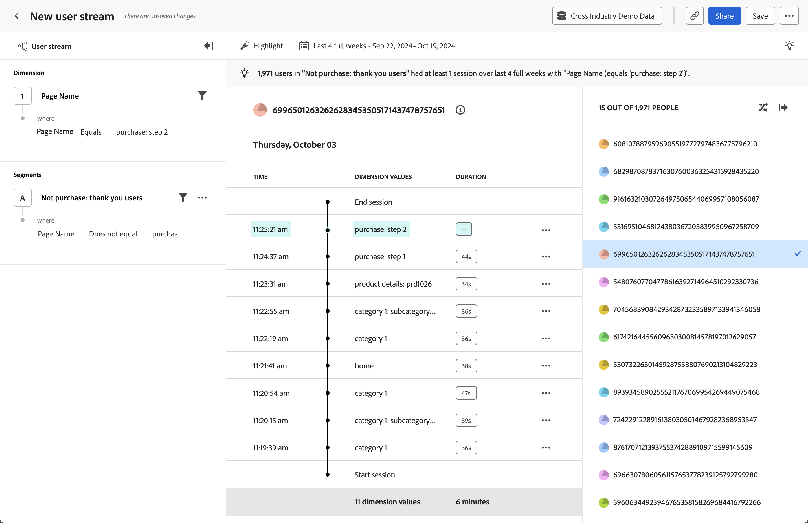

# Analyse de la [!UICONTROL chronologie] {#timeline}

<!-- markdownlint-disable MD034 -->

>[!CONTEXTUALHELP]
>id="workspace_guidedanalysis_timeline_button"
>title="Chronologie"
>abstract="Observez les événements de session au niveau de l’utilisateur ou de l’utilisatrice au fil du temps."

<!-- markdownlint-enable MD034 -->

L’analyse  **[!UICONTROL Chronologie]** vous permet d’observer les événements de session au niveau de la personne au fil du temps, afin de trouver des modèles d’expérience et de raconter de meilleures histoires d’utilisation. Le rail de gauche vous permet de filtrer le flux par valeurs de propriété et segments. Le rail de droite vous permet de sélectionner, dans une liste randomisée, les utilisateurs et utilisatrices qui correspondent aux critères de filtre. La zone centrale affiche le flux de la personne sélectionnée par session, composé de la date et de l’heure, des valeurs de propriété et de la durée. La durée n’est pas disponible pour le dernier événement d’une session donnée.

>[!NOTE]
>
>L’analyse [!UICONTROL Chronologie] nécessite que le composant standard **[!UICONTROL ID de personne]** soit disponible dans la [vue de données](/help/data-views/component-reference.md#optional). L’inclusion de l’ID de personne dans une vue de données est gérée par votre administrateur ou administratrice Customer Journey Analytics, ce qui permet à votre organisation de contrôler entièrement la confidentialité des personnes pouvant accéder à ces données.
> Si aucune vue de données n’est associée au composant [!UICONTROL ID de personne], le message suivant s’affiche :
>
>* **Admins** : *la propriété PersonID est requise pour cette analyse. Ajoutez l’ID de personne à la vue de données.*
>* **Non-admins** : *La propriété PersonID est requise pour cette analyse. Contactez votre administrateur ou administratrice Customer Journey Analytics pour ajouter l’ID de personne à la vue de données.*

>[!VIDEO](https://experienceleague.adobe.com/en/docs/customer-journey-analytics-learn/tutorials/guided-analysis/timeline)

## Cas d’utilisation

Les cas d’utilisation de cette analyse sont les suivants :

* **Exploration par friction** : si vous constatez une forte baisse dans l’analyse [analyse en entonnoir](funnel.md), vous pouvez créer un segment de ces utilisateurs et utilisatrices et appliquer le segment dans cette analyse pour étudier les causes potentielles.
* **Comportement d’erreur** : si les utilisateurs et utilisatrices rencontrent une erreur de produit, vous pouvez découvrir ce qu’ils faisaient avant ou après avoir vu cette erreur.
* **Validation de la collecte de données** : les administrateurs et administratrices des données peuvent filtrer cette analyse sur leur propre ID de personne pour vérifier que l’implémentation de leur organisation fonctionne comme prévu.

## Interface

Consultez [Interface](../overview.md#interface) pour une vue d’ensemble de l’interface d’analyse guidée. Les paramètres suivants sont spécifiques à cette analyse :

### Rail de requête

Le rail de requête vous permet de configurer les composants suivants :

* **[!UICONTROL Dimension]** : dimension pour laquelle vous souhaitez afficher les valeurs diffusées. Le flux au centre affiche les valeurs de la dimension sélectionnée. Vous pouvez également appliquer des filtres pour réduire le flux à des données plus pertinentes. Les opérateurs valides pour le filtre comprennent [!UICONTROL Est égal à], [!UICONTROL N’est pas égal à], [!UICONTROL Commence par], [!UICONTROL Se termine par], [!UICONTROL Contient], [!UICONTROL Ne contient pas &#x200B;], [!UICONTROL Existe] et [!UICONTROL N’existe pas].
* **[!UICONTROL Segments]** : segments que vous souhaitez analyser. Le segment sélectionné filtre vos données pour se concentrer uniquement sur les personnes qui correspondent à vos critères de segment. Si vous souhaitez limiter l’analyse à un ID de personne spécifique, vous pouvez le filtrer dans le panneau de droite. Un segment est pris en charge pour cette analyse.

### Paramètres du graphique

L’analyse [!UICONTROL Chronologie] propose les paramètres de graphique suivants, qui peuvent être ajustés dans le menu au-dessus du graphique :

* **[!UICONTROL Montrer en tant que]** : affiche les valeurs de propriété de votre choix.
   * [!UICONTROL Tout afficher] : affiche toutes les valeurs de propriété dans une session.
   * [!UICONTROL Surligner] : met visuellement en surbrillance les valeurs de propriété dans une session qui correspondent aux filtres de requête.
   * [!UICONTROL Afficher seulement] : affiche uniquement les valeurs de propriété dans une session qui correspondent aux filtres de requête.

### Période

Période souhaitée pour votre analyse. Ce paramètre comporte deux composants :

* **[!UICONTROL Intervalle]** : granularité de la date selon laquelle vous souhaitez afficher les données de tendance. Ce paramètre n’a aucune incidence sur les analyses hors tendances telles que Chronologie.
* **[!UICONTROL Date]** : date de début et de fin. Les paramètres prédéfinis de période flottante et les périodes personnalisées enregistrées précédemment sont disponibles pour votre commodité. Vous pouvez également utiliser le sélecteur de calendrier pour choisir une période fixe.

<!--

## Example

See below for an example of the analysis.

-->
