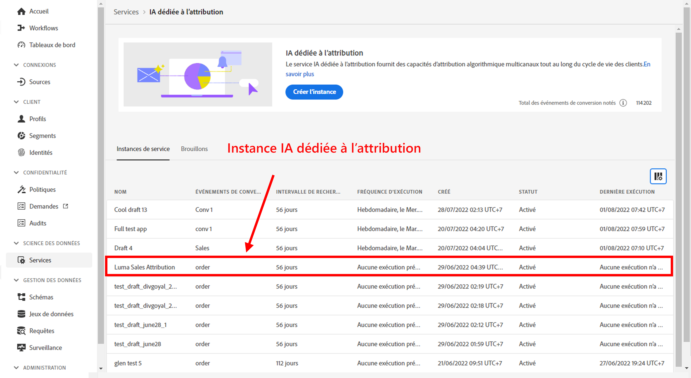
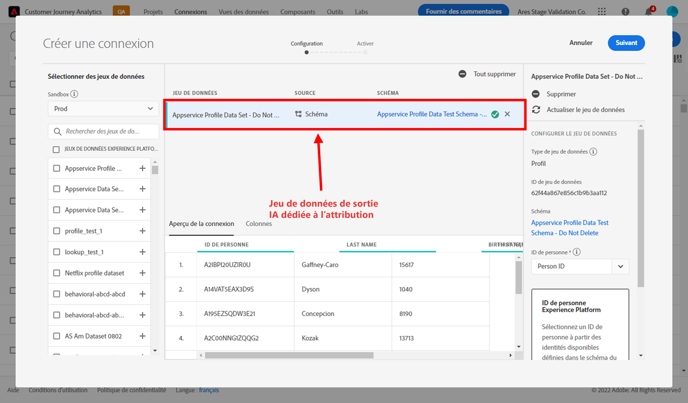
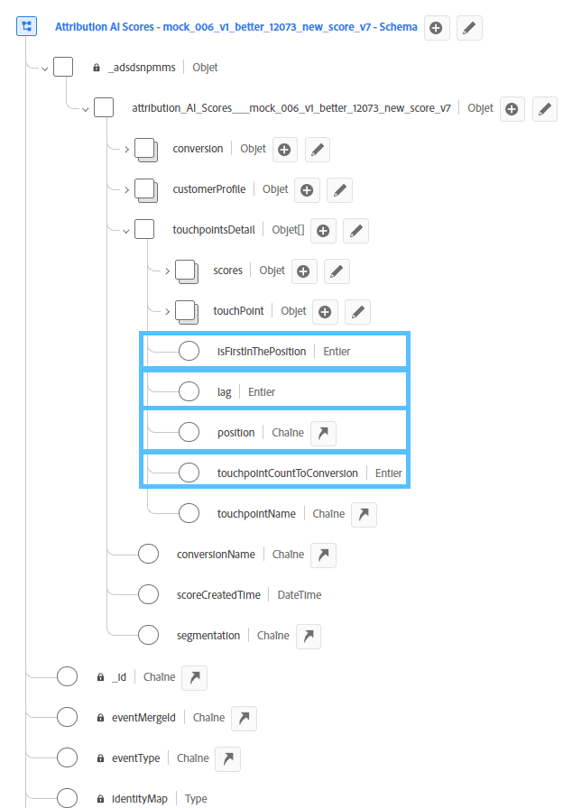
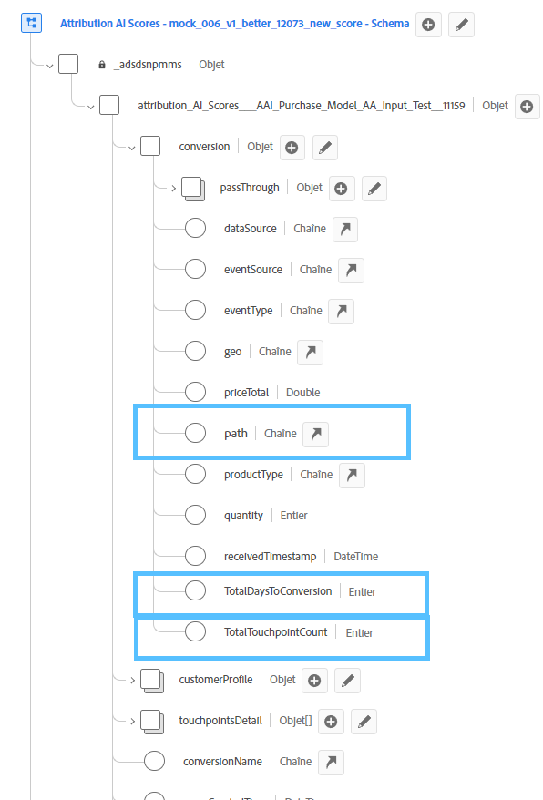
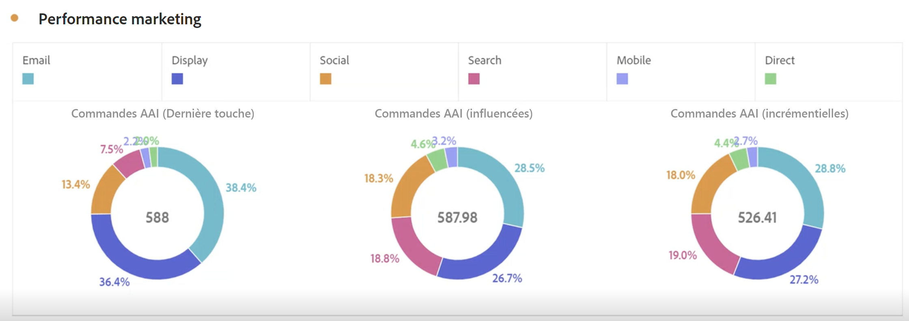
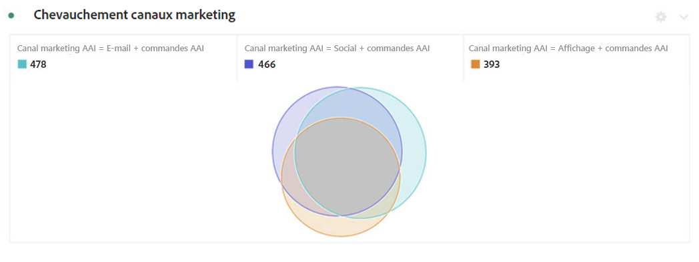
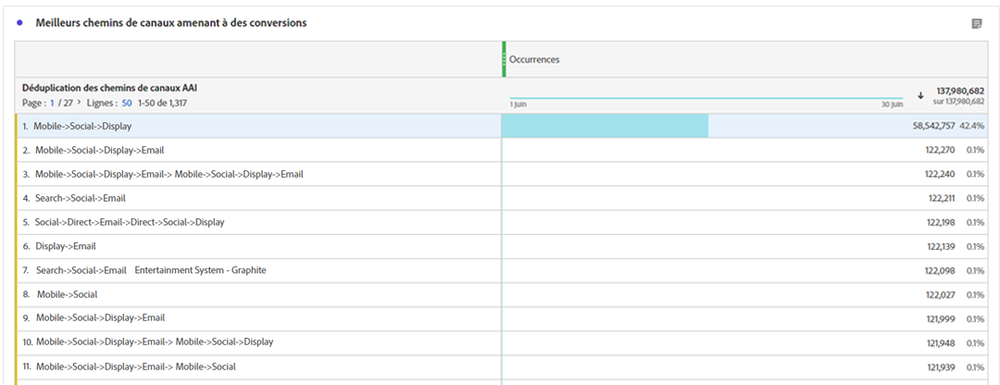
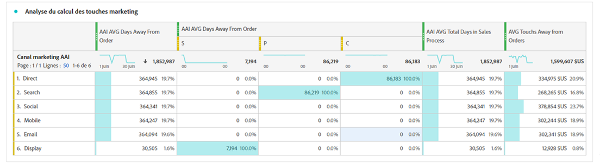

# Intégrer l’IA dédiée à l’attribution à CJA

Dans le cadre des services intelligents d’Adobe Experience Platform, l’[IA dédiée à l’attribution](https://experienceleague.adobe.com/docs/experience-platform/intelligent-services/attribution-ai/overview.html?lang=fr) est un service d’attribution algorithmique à plusieurs canaux qui calcule l’influence et l’impact incrémentiel des interactions des clients par rapport à des résultats spécifiés. Grâce à l’IA dédiée à l’attribution, les professionnels du marketing peuvent mesurer et optimiser les dépenses publicitaires et marketing en comprenant l’impact de chaque interaction client sur chaque phase du parcours des clients.

L’IA dédiée à l’attribution s’intègre à Customer Journey Analytics (CJA) dans la mesure où elle exécute des modèles par rapport aux points de contact marketing et aux sources de données de conversion des clients. CJA importe ensuite la sortie de ces modèles en tant que jeu de données ou peut être intégré au reste de vos jeux de données CJA. Les jeux de données activés pour Attribution AI peuvent ensuite être utilisés dans les vues de données et les rapports dans CJA.

L’IA dédiée à l’attribution prend en charge 3 schémas Experience Platform : Événement d’expérience, Adobe Analytics et Événement d’expérience client.

L’IA dédiée à l’attribution prend en charge deux catégories de scores : les scores algorithmiques et les scores basés sur des règles.

## Scores algorithmiques

Les scores algorithmiques incluent les scores incrémentiels et influencés.

* Les **[!UICONTROL score] influencés** divisent la totalité du crédit de conversion entre les canaux marketing.
* Les **[!UICONTROL scores] incrémentiels** prennent tout d’abord en compte une ligne de base de conversion que vous auriez atteinte, même sans marketing. Cette ligne de base dépend des observations de l’IA sur les schémas, le caractère saisonnier, etc., associées à la reconnaissance de la marque, la fidélité et le bouche à oreille actuels. Le crédit restant est divisé entre les canaux marketing.

## Scores basés sur des règles

Les scores basés sur des règles incluent :

* **[!UICONTROL Première touche]** attribue un crédit de 100 % au point de contact affiché pour la première fois dans l’intervalle de recherche en amont d’attribution.
* **[!UICONTROL Dernière touche]** attribue un crédit de 100 % au point de contact le plus récent avant la conversion.
* **[!UICONTROL Linéaire]** attribue le même crédit à chaque point de contact visible menant à une conversion.
* **[!UICONTROL En U]** attribue 40 % de crédit à la première interaction, 40 % à la dernière interaction et divise les 20 % restants entre les autres points de contact. Pour les conversions avec un point de contact unique, un crédit de 100 % est attribué. Pour les conversions avec deux points de contact, un crédit de 50 % est attribué aux deux.
* **[!UICONTROL Dépréciation dans le temps]** suit une atténuation exponentielle avec un paramètre de demi-vie personnalisé, où la valeur par défaut est de sept jours. La pondération de chaque canal dépend de la durée écoulée entre l’initiation du point de contact et la conversion éventuelle. La formule utilisée pour déterminer le crédit est `2^(-t/halflife)`, où `t` correspond à la durée entre un point de contact et une conversion. Tous les points de contact sont alors normalisés à 100 %.

## Processus

Certaines des étapes sont effectuées dans Adobe Experience Platform avant d’utiliser la sortie dans CJA. La sortie se compose d’un jeu de données avec un modèle dia dédiée à l’attribution appliqué.

### Étape 1 : Créer une instance IA dédiée à l’attribution

Dans Experience Platform, créez une instance IA dédiée à l’attribution en sélectionnant et en associant les données, en définissant des événements et en formant vos données, comme décrit [ici](https://experienceleague.adobe.com/docs/experience-platform/intelligent-services/attribution-ai/user-guide.html?lang=fr).

### Étape 2 : Configurer une connexion CJA à des jeux de données IA dédiée à l’attribution

Dans CJA, vous pouvez désormais [établir une ou plusieurs connexions](/help/connections/create-connection.md) aux jeux de données Experience Platform créés pour l’IA dédiée à l’attribution. Ces jeux de données s’affichent avec le préfixe « Scores de l’IA dédiée à l’attribution » comme illustré ici :

### Étape 3 : Créer des vues de données basées sur ces connexions

Dans CJA, [créez une ou plusieurs vues de données](/help/data-views/create-dataview.md) qui contiennent les champs XDM IA dédiée à l’attribution.

Voici les champs de schéma XDM pour les points de contact :

Et voici les champs de schéma XDM pour la conversion :

### Étape 4 : Établir des rapports sur les données AAI dans CJA Workspace

Dans un projet CJA Workspace, vous pouvez extraire des mesures telles que « Commandes AAI » et des dimensions telles que « Nom de campagne AAI » ou « Canal marketing AAI », par exemple.

La sortie de score brut dans AAI comporte un schéma imbriqué, où le chemin d’accès aux champs peut être assez long pour occuper la plupart des espaces dans les tableaux ou les visualisations. Par soucis de concision, [!UICONTROL Nom d’affichage] est généré et exploité automatiquement dans CJA selon les règles ci-dessous :

* Tous les champs ont un préfixe « AAI »
* Pour les champs de point de contact :
   * Pour les champs qui font partie du score XDM, ils apparaissent dans CJA comme `AAI T {field name}`.
   * Pour les champs inclus en tant que colonne passThrough, ils s’affichent dans CJA comme `AAI T PT {field name}`.
* Pour les champs de conversion :
   * Pour les champs qui font partie du score XDM, ils s’affichent dans CJA comme `AAI C {field name}`.
   * Pour les champs inclus en tant que colonne passThrough, ils s’affichent dans CJA comme `AAI C PT {field name}`.

**Commandes avec scores influencés et incrémentiels**

Nous voyons ici un projet Workspace avec des données AAI qui affiche les commandes avec des scores influencés et incrémentiels. Explorez n’importe quelle dimension pour comprendre l’attribution par : campagne, groupe de produits, segment d’utilisateurs, zone géographique, etc.

**Performance marketing**

Comparez l’attribution des points de contact entre différents modèles d’attribution :

**Interaction des canaux**

Comprenez l’interaction des canaux pour savoir quel canal peut être le plus efficacement utilisé avec d’autres canaux à l’aide d’un diagramme de Venn :

**Chemins principaux vers la conversion**

Ce tableau présente les principaux chemins vers la conversion (dédupliqués) afin de vous aider à concevoir et optimiser des points de contact :

**Délai jusqu’à la conversion**

Nous voyons ici le délai jusqu’à la conversion lorsqu’un point de contact est présent dans la répartition. Cela permet d’optimiser le délai :

## Différences entre les fonctionnalités d’attribution d’Attribution AI et de CJA

Le tableau suivant présente certaines des différences de fonctionnalités :

| Fonction | IA dédiée à l’attribution | Attribution CJA |
| --- | --- | --- |
| Est-ce que l’attribution incrémentielle | Oui | Non |
| Permet aux utilisateurs d’ajuster le modèle | Oui | Oui |
| L’attribution s’effectue-t-elle sur plusieurs canaux (Remarque : l’IA dédiée à l’attribution n’utilise pas les mêmes données assemblées que CJA.) | Oui | Oui |
| Inclut des scores influencés | Oui | Oui |
| Modélisation ML | Oui | Oui |
| Modèles d’attribution basés sur une région | Oui | Oui |
| Peut configurer les points de contact marketing dans le modèle | Oui | Non |

{style="table-layout:auto"}
