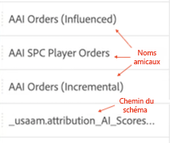
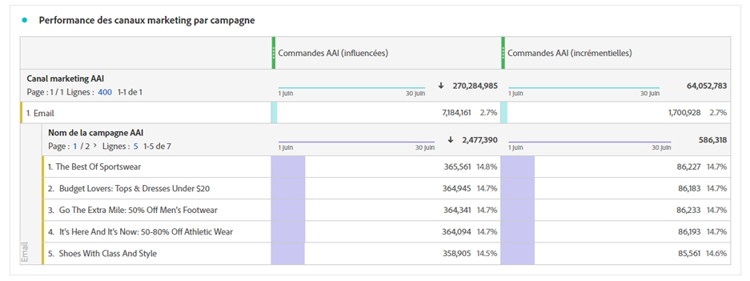
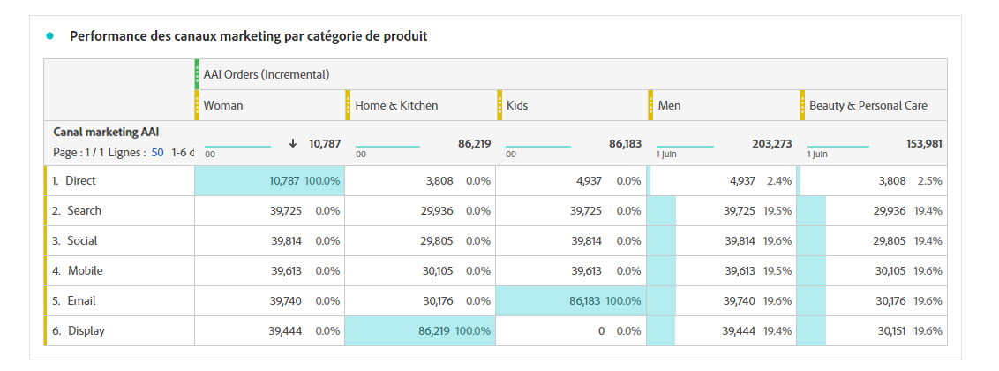

# Intégration d’Attribution AI à CJA

>[!NOTE]
>
>Cette fonctionnalité sera publiée le 25 mai 2022.

[Attribution AI](https://experienceleague.adobe.com/docs/experience-platform/intelligent-services/attribution-ai/overview.html?lang=en), dans le cadre des services intelligents de Adobe Experience Platform, est un service d’attribution algorithmique à plusieurs canaux qui calcule l’influence et l’impact incrémentiel des interactions des clients par rapport à des résultats spécifiés. Grâce à Attribution AI, les marketeurs peuvent mesurer et optimiser les dépenses publicitaires et marketing en comprenant l’impact de chaque interaction client sur chaque phase des parcours clients.

Attribution AI prend en charge deux catégories de scores : algorithmique et basé sur des règles. Les scores algorithmiques incluent les scores incrémentiels et influencés.

* **Scores influencés** divise 100 % du crédit de conversion entre les canaux marketing.
* **Scores incrémentiels** prenez tout d’abord en compte une ligne de base de conversion que vous auriez atteinte, même sans marketing. Cette référence dépend des observations de l’IA sur les motifs, le caractère saisonnier, etc., en raison de la reconnaissance de marque, de la fidélité et du bouche à oreille actuels. Le crédit restant est divisé entre les canaux marketing.

Les scores basés sur des règles incluent : [!UICONTROL Première touche], [!UICONTROL Dernière touche], [!UICONTROL Linéaire], [!UICONTROL En forme de U], et [!UICONTROL Décroissance temporelle]. Attribution AI prend en charge 3 schémas Experience Platform : Événement d’expérience, Adobe Analytics et Événement d’expérience client.

Attribution AI s’intègre à Customer Journey Analytics (CJA) dans la mesure où Attribution AI exécute des modèles par rapport aux données, puis CJA importe la sortie de ces modèles en tant qu’ensemble de données, qui peut ensuite être intégré au reste de vos jeux de données CJA. Les jeux de données activés pour Attribution AI peuvent ensuite être utilisés dans les vues de données et les rapports dans CJA.

## Processus

Certaines des étapes sont effectuées dans Adobe Experience Platform avant d’utiliser la sortie dans CJA. La sortie se compose d’un jeu de données avec un modèle Attribution AI appliqué.

### Étape 1 : Téléchargement de scores Attribution AI

Dans Adobe Experience Platform, téléchargez des scores Attribution AI, comme décrit [here](https://experienceleague.adobe.com/docs/experience-platform/intelligent-services/attribution-ai/getting-started.html?lang=en#downloading-attribution-ai-scores).

### Étape 2 : Création d’une instance Attribution AI

Dans Experience Platform, créez une instance Attribution AI en sélectionnant et en associant les données, en définissant des événements et en formant vos données, comme décrit. [here](https://experienceleague.adobe.com/docs/experience-platform/intelligent-services/attribution-ai/user-guide.html).

### Étape 3 : Configurer une connexion CJA à des jeux de données Attribution AI

Dans CJA, vous pouvez désormais [créer une ou plusieurs connexions](/help/connections/create-connection.md) aux jeux de données Experience Platform créés pour Attribution AI. Ces jeux de données s’affichent avec le préfixe &quot;Scores Attribution AI&quot;, comme illustré ici :

>[!IMPORTANT]
>
>Vous pouvez ajouter des jeux de données de profil et de recherche, ainsi que des données de centre d’appel et de gestion de la relation client à la connexion. Cependant, Adobe ne recommande pas d’ajouter des jeux de données Adobe Analytics aux jeux de données avec des scores Attribution AI dans la même connexion.

### Étape 4 : Créer des vues de données basées sur ces connexions

Dans CJA, [créer une ou plusieurs vues de données ;](/help/data-views/create-dataview.md) qui contiennent les champs XDM Attribution AI. (Ce serait génial d&#39;avoir une capture d&#39;écran ici.)

### Étape 5 : Rapport sur les données AAI dans CJA Workspace

Dans un projet Workspace CJA, vous pouvez extraire des mesures telles que &quot;Commandes AAI&quot; et des dimensions telles que &quot;Nom de campagne AAI&quot; ou &quot;Canal marketing AAI&quot;, par exemple.

Nous voyons ici un projet Workspace avec des données AAI qui affiche les commandes avec des scores influencés et incrémentiels.

## Différences entre Attribution AI et Attribution IQ

Ainsi, quand utiliser les données Attribution AI au lieu de [Attribution IQ](/help/analysis-workspace/attribution/overview.md), une fonctionnalité native de CJA ? Ce tableau présente certaines des différences de fonctionnalités :

| Fonction | IA dédiée à l’attribution | Attribution IQ |
| --- | --- | --- |
| Attribution partielle | Oui | Non |
| Permet aux utilisateurs d’ajuster le modèle | Non | Oui |
| L’attribution s’effectue-t-elle sur plusieurs canaux (Remarque : AAI n’utilise pas les mêmes données assemblées que CJA.) | Oui | Oui |
| Inclut des scores incrémentiels et influencés | Oui | Non |
| Création d’une modélisation ML | Oui | Oui |
| La modélisation ML avec des prédictions | Oui | Non |

{style=&quot;table-layout:auto&quot;}
