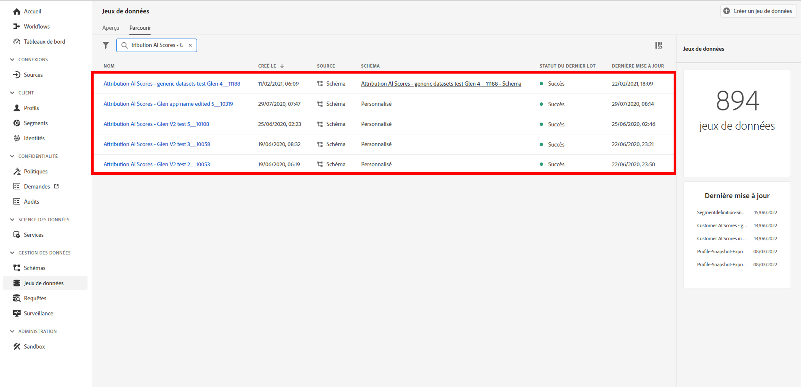

# Intégration d’Attribution AI à CJA

[Attribution AI](https://experienceleague.adobe.com/docs/experience-platform/intelligent-services/attribution-ai/overview.html?lang=en), dans le cadre des services intelligents de Adobe Experience Platform, est un service d’attribution algorithmique à plusieurs canaux qui calcule l’influence et l’impact incrémentiel des interactions des clients par rapport à des résultats spécifiés. Grâce à Attribution AI, les marketeurs peuvent mesurer et optimiser les dépenses publicitaires et marketing en comprenant l’impact de chaque interaction client sur chaque phase des parcours clients.

Attribution AI prend en charge deux catégories de scores : algorithmique et basé sur des règles. Les scores algorithmiques incluent les scores incrémentiels et influencés. Première touche, Dernière touche, Linéaire, En forme de U et Décroissance temporelle sont compris parmi les scores basés sur des règles. Attribution AI prend en charge 3 schémas Experience Platform : Événement d’expérience, Adobe Analytics et Événement d’expérience client.

Attribution AI s’intègre à Customer Journey Analytics (CJA) dans la mesure où Attribution AI exécute des modèles par rapport aux données, puis CJA importe la sortie de ces modèles en tant qu’ensemble de données, qui peut ensuite être intégré au reste de vos jeux de données CJA. Les jeux de données activés pour Attribution AI peuvent ensuite être utilisés dans les vues de données et les rapports dans CJA.

## Processus

Certaines des étapes sont effectuées dans Adobe Experience Platform avant d’utiliser la sortie dans CJA.

### Étape 1 : Téléchargement de scores Attribution AI

Dans Adobe Experience Platform, téléchargez des scores Attribution AI, comme décrit [here](https://experienceleague.adobe.com/docs/experience-platform/intelligent-services/attribution-ai/getting-started.html?lang=en#downloading-attribution-ai-scores).

### Étape 2 : Création d’une instance Attribution AI

Dans Experience Platform, créez une instance Attribution AI en sélectionnant et en associant les données, en définissant des événements et en formant vos données, comme décrit. [here](https://experienceleague.adobe.com/docs/experience-platform/intelligent-services/attribution-ai/user-guide.html).

### Étape 3 : Configurer une connexion CJA à des jeux de données Attribution AI

Dans CJA, vous pouvez désormais [créer une ou plusieurs connexions](/help/connections/create-connection.md) aux jeux de données Experience Platform créés pour Attribution AI. Ces jeux de données s’affichent avec le préfixe &quot;Scores Attribution AI&quot;, comme illustré ici :

### Étape 4 : Créer des vues de données basées sur ces connexions

Dans CJA,

## Différences entre Attribution AI et Attribution IQ

Ainsi, quand utiliser les données Attribution AI au lieu de [Attribution IQ](/help/analysis-workspace/attribution/overview.md), une fonctionnalité native de CJA ? Ce tableau présente certaines des différences de fonctionnalités :

| Fonction | IA dédiée à l’attribution | Attribution IQ |
| --- | --- | --- |
| Attribution partielle | Oui | Non |
| Permet aux utilisateurs d’ajuster le modèle | Non | Oui |
| L’attribution s’effectue-t-elle sur plusieurs canaux (Remarque : AAI n’utilise pas les mêmes données assemblées que CJA.) | Oui | Oui |
| Inclut des scores incrémentiels et influencés | Oui | Non |
| Création d’une modélisation ML | Oui | Oui |
| La modélisation ML avec des prédictions | Oui | Non |

{style=&quot;table-layout:auto&quot;}
