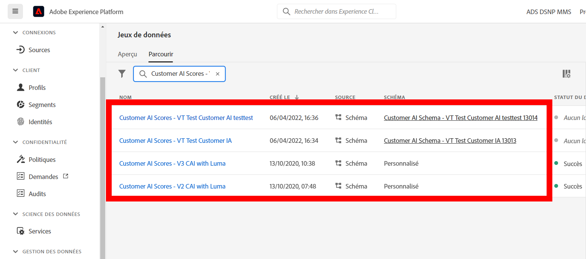
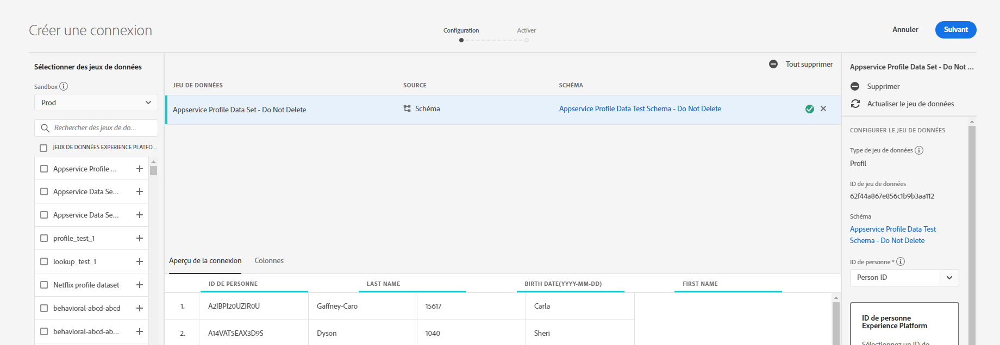
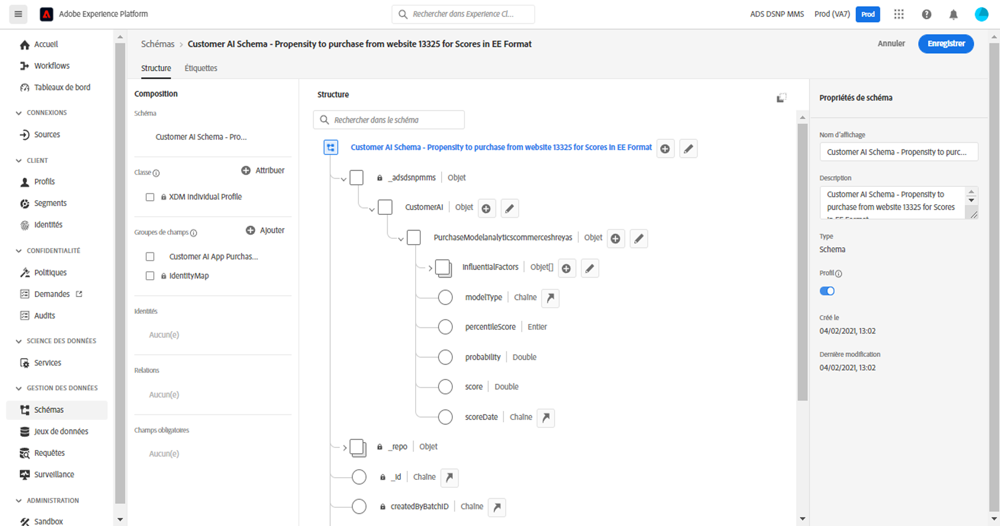
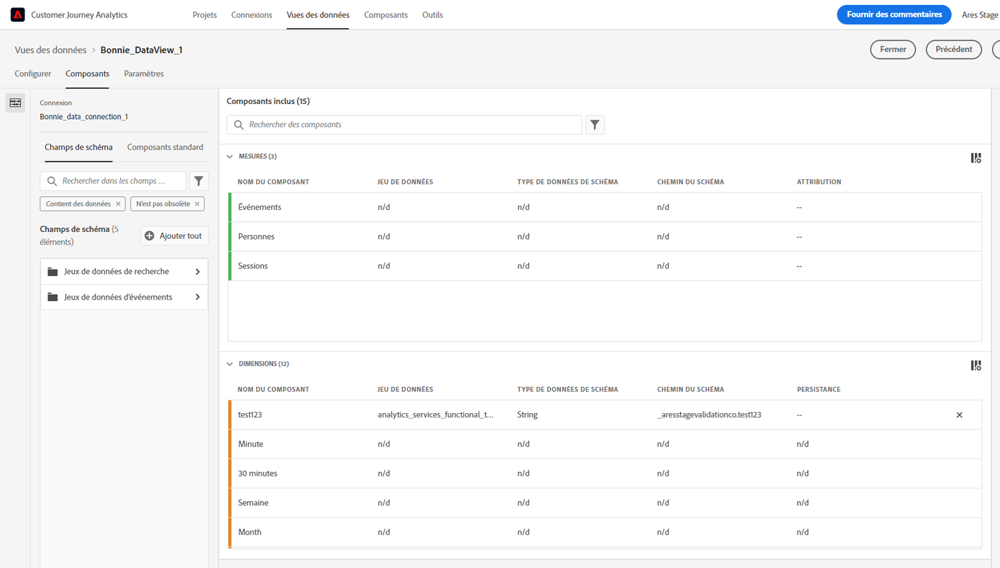
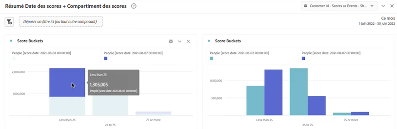
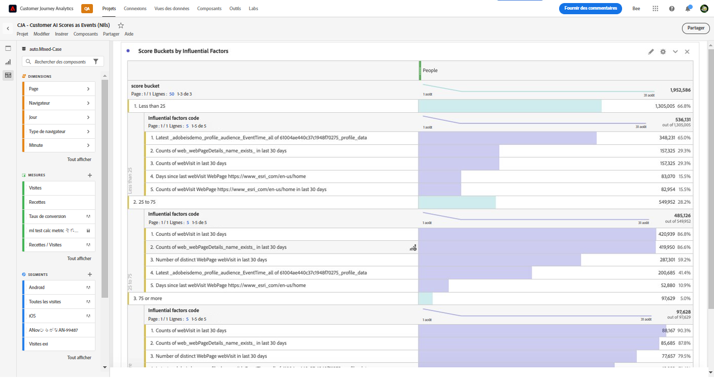
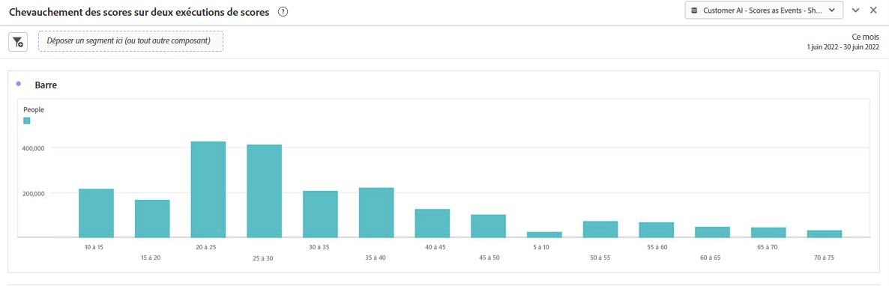
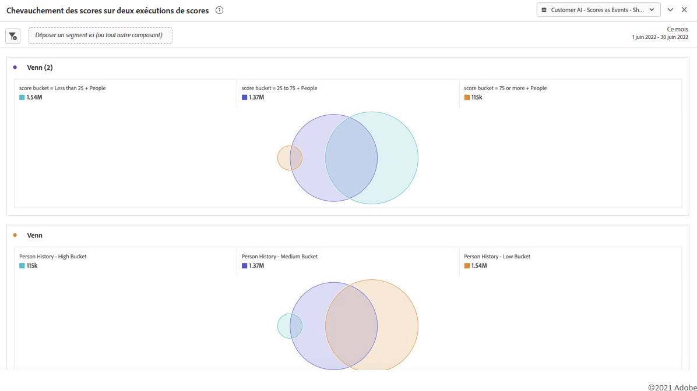

# Intégrer l’IA dédiée aux clients à CJA

[Customer AI](https://experienceleague.adobe.com/docs/experience-platform/intelligent-services/customer-ai/overview.html?lang=en), dans le cadre des services intelligents de Adobe Experience Platform, permet aux marketeurs de générer des prédictions client au niveau individuel.

À l’aide de facteurs d’influence, Customer AI peut vous indiquer ce qu’un client est susceptible de faire et pourquoi. De plus, les professionnels du marketing peuvent tirer parti des prédictions et des informations de Customer AI pour personnaliser les expériences client en diffusant les offres et les messages les plus appropriés.

Customer AI repose sur des données comportementales individuelles et sur des données de profil pour le score de propension. Customer AI est flexible dans la mesure où il peut intégrer plusieurs sources de données, notamment Adobe Analytics, Adobe Audience Manager, des données d’événement d’expérience client et des données d’événement d’expérience. Si vous utilisez le connecteur source Experience Platform pour importer les données Adobe Audience Manager et Adobe Analytics, le modèle sélectionne automatiquement les types d’événements standard pour entraîner et noter le modèle. Si vous importez votre propre jeu de données d’événement d’expérience sans types d’événement standard, tous les champs pertinents devront être mappés en tant qu’événements personnalisés ou attributs de profil si vous souhaitez les utiliser dans le modèle. Vous pouvez le faire à l’étape de configuration de Customer AI dans Experience Platform. &#x200B;

Customer AI s’intègre à Customer Journey Analytics (CJA) dans la mesure où les jeux de données compatibles avec Customer AI peuvent être utilisés dans les vues de données et les rapports dans CJA. Avec cette intégration, vous pouvez

* **Suivi des scores de propension pour un segment d’utilisateurs au fil du temps**. Exemple de cas pratique : Quelle est la probabilité qu’un client de l’hôtel achète un ticket de spectacle sur la salle de concert de l’hôtel ?
* **Analyser les événements ou attributs de succès associés aux scores de propension**. &#x200B;Exemple de cas pratique : Je veux comprendre les attributs ou les événements de succès associés aux scores de propension.
* **Suivez le flux d’entrée pour la propension des clients sur différentes exécutions de notation.**. Exemple de cas pratique : Je voudrais comprendre les personnes qui étaient initialement des utilisateurs à faible propension et qui, au fil du temps, sont devenues des utilisateurs à forte propension. &#x200B;
* **Examinez la distribution de la propension**. Cas pratique : J’aimerais comprendre la distribution des scores de propension afin d’être plus précis avec mes segments. &#x200B;Exemple : un détaillant souhaite exécuter une promotion spécifique pour 50 $ sur un produit. Il est possible qu’ils souhaitent n’exécuter qu’une promotion très limitée en raison du budget, etc. Ils analysent les données et décident de ne cibler que les plus 80 % &#x200B; de leurs clients.
* **Examinez la propension à accomplir une action pour une cohorte particulière au fil du temps.**. Cas pratique : Je voudrais effectuer le suivi d’une cohorte spécifique au fil du temps. Cela est similaire au premier, mais vous pouvez suivre une cohorte spécifique au fil du temps. &#x200B; Exemple d&#39;hospitalité : Un spécialiste du marketing peut comparer son niveau bronze à son niveau argent ou encore son niveau argent par rapport à son niveau or au fil du temps. Ensuite, ils peuvent voir la propension de chaque cohorte à réserver l’hôtel au fil du temps. &#x200B;

## Processus

Certaines des étapes sont effectuées dans Adobe Experience Platform avant d’utiliser la sortie dans CJA.

### Étape 1 : Configuration d’une instance Customer AI

Une fois vos données préparées et vos informations d’identification et schémas en place, commencez par suivre la [Configuration d’une instance Customer AI](https://experienceleague.adobe.com/docs/experience-platform/intelligent-services/customer-ai/user-guide/configure.html?lang=en) dans Adobe Experience Platform.

### Étape 2 : Configurer une connexion CJA aux jeux de données Customer AI

Dans CJA, vous pouvez désormais [créer une ou plusieurs connexions](/help/connections/create-connection.md) aux jeux de données Experience Platform créés pour Customer AI. Chaque prédiction, telle que &quot;Probabilité de mise à niveau du compte&quot;, équivaut à un jeu de données. Ces jeux de données s’affichent avec le préfixe &quot;Customer AI Scores in EE Format - name_of_application&quot;.

>[!IMPORTANT]
>
>Chaque instance de Customer AI possède deux jeux de données de sortie si le bouton d’activation est activé pour activer les scores pour CJA lors de la configuration à l’étape 1. Un jeu de données de sortie apparaît au format XDM de profil et un autre au format XDM d’événement d’expérience.

Voici un exemple de schéma XDM que CJA apporterait dans le cadre d’un jeu de données existant ou nouveau :

(Notez que l’exemple est un jeu de données de profil ; le même ensemble d’objets de schéma ferait partie d’un jeu de données d’événement d’expérience que CJA attraperait. Le jeu de données Événement d’expérience inclurait des horodatages comme date de score.) Chaque client noté dans ce modèle aurait un score, un scoreDate, etc. qui leur sont associés.

### Étape 3 : Créer des vues de données basées sur ces connexions

Dans CJA, vous pouvez maintenant passer à [création de vues de données](/help/data-views/create-dataview.md) avec les dimensions (score, date de score, probabilité, etc.) et les mesures introduites dans le cadre de la connexion que vous avez établie.

### Étape 4 : Rapport sur les scores CAI dans Workspace

Dans CJA Workspace, vous pouvez désormais créer un projet et extraire des visualisations.

**Scores de propension aux tendances**

Voici un exemple de projet Workspace avec des données de l’interface utilisateur graphique qui calcule la tendance des scores de propension d’un segment d’utilisateurs au fil du temps, dans &#x200B; graphique à barres empilées :

**Tableau avec codes de raison**

Voici un tableau qui présente les codes de raison pour lesquels un segment présente des &#x200B; de propension élevée ou faible :

**Flux d’entrée pour la propension des clients**

Ce diagramme de flux présente le flux d’entrée de la propension des clients sur différentes exécutions de notation &#x200B; :

**Distribution des scores de propension**

Ce graphique à barres présente la distribution des scores de propension &#x200B; :

**Superpositions de propension**

Ce diagramme de Venn présente les superpositions de propension sur différentes exécutions de notation :

