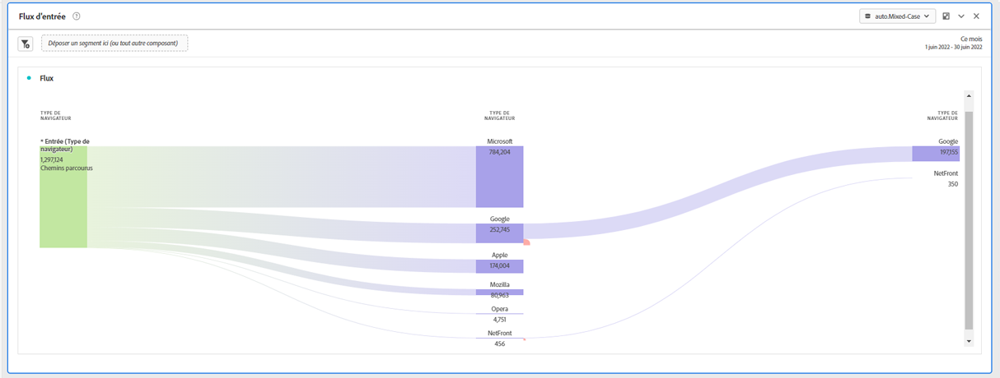

# Intégrer des données de l’IA dédiée aux clientes et clients à Adobe Customer Journey Analytics

{{release-limited-testing}}

L’[IA dédiée aux clients](https://experienceleague.adobe.com/docs/experience-platform/intelligent-services/customer-ai/overview.html?lang=fr), en tant que composant des services Adobe Experience Platform intelligents, permet aux spécialiste marketing de générer des prédictions client au niveau individuel.

À l’aide de facteurs d’influence, Customer AI peut vous indiquer ce qu’un client est susceptible de faire et pourquoi. De plus, les spécialistes marketing peuvent tirer parti des prédictions et des informations de Customer AI pour personnaliser les expériences client en diffusant les offres et les messages les plus appropriés.

L’IA dédiée aux clients repose sur des données comportementales individuelles et sur des données de profil pour le score de propension. L’IA dédiée aux clients est flexible dans la mesure où elle peut intégrer plusieurs sources de données, notamment Adobe Analytics, Adobe Audience Manager, des données d’événement d’expérience client et des données d’événement d’expérience. Si vous utilisez le connecteur source Experience Platform pour importer les données Adobe Audience Manager et Adobe Analytics, le modèle sélectionne automatiquement les types d’événements standard pour entraîner et noter le modèle. Si vous importez votre propre jeu de données d’événement d’expérience sans types d’événement standard, tous les champs pertinents devront être mappés en tant qu’événements personnalisés ou attributs de profil si vous souhaitez les utiliser dans le modèle. Vous pouvez le faire à l’étape de configuration de l’IA dédiée aux clientes et clients dans Experience Platform.

L’IA dédiée aux clientes et clients s’intègre à Customer Journey Analytics dans la mesure où les jeux de données compatibles avec elle peuvent être utilisés dans les vues de données et les rapports dans Customer Journey Analytics. Vous pouvez :

* **suivre les scores de propension pour un segment d’utilisateurs et d’utilisatrices au fil du temps** ;
   * Cas pratique : comprendre la probabilité de conversion des clientes et clients d’un segment spécifique.
   * Exemple : une personne spécialisée dans le marketing d’une chaîne d’hôtels souhaite comprendre la probabilité qu’un client ou une cliente de l’hôtel achète un billet de spectacle pour la salle de concert de l’hôtel.
* **analyser les événements de succès ou les attributs associés aux scores de propension** ;
   * Cas d’utilisation : comprendre les attributs ou les événements de succès associés aux scores de propension.
   * Exemple : une personne spécialisée dans le marketing d’une chaîne d’hôtels souhaite comprendre comment les achats de billets de spectacle pour la salle de concert d’un hôtel sont associés aux scores de propension.
* **suivre le flux d’entrée pour la propension des clientes et clients sur différentes exécutions de scores** ;
   * Cas d’utilisation : comprendre les personnes qui étaient initialement des utilisateurs et utilisatrices à faible propension et qui, au fil du temps, sont devenues des utilisateurs et utilisatrices à forte propension.
   * Exemple : une personne spécialisée dans le marketing d’une chaîne d’hôtels souhaite savoir les clientes et clients d’hôtels qui ont été initialement identifiés comme des clientes et clients ayant une faible propension à acheter un billet de spectacle, mais qui sont devenus au fil du temps des clientes et clients ayant une forte propension à acheter un billet de spectacle.
* **examiner la répartition de la propension** ;
   * Cas pratique : comprendre la répartition des scores de propension pour plus de précision dans la définition des segments.
   * Exemple : un détaillant ou une détaillante souhaite lancer une promotion spécifique pour proposer une réduction de 50 $ sur un produit. Il est possible que la personne souhaite n’exécuter qu’une promotion très limitée en raison du budget, etc. Elle analyse les données et décide de ne cibler que les clientes et clients atteignant au moins un score de 80 %.
* **examiner la propension pour accomplir une action visant une cohorte particulière au fil du temps**.
   * Cas d’utilisation : suivre une cohorte spécifique au fil du temps.
   * Exemple : une personne spécialisée dans le marketing d’une chaîne d’hôtels souhaite suivre son niveau bronze par rapport à son niveau argent ou encore son niveau argent par rapport à son niveau or au fil du temps. Ensuite, elle peut voir la propension de chaque cohorte à réserver l’hôtel au fil du temps.

Pour intégrer réellement les données d’IA dédiée aux clientes et clients à Customer Journey Analytics, procédez comme suit :

>[!NOTE]
>
>Certaines des étapes sont effectuées dans Adobe Experience Platform avant d’utiliser la sortie dans Customer Journey Analytics.

## Étape 1 : Configurer une instance IA dédiée aux clients

Une fois vos données préparées et vos informations d’identification et schémas en place, commencez par suivre le guide [Configurer une instance IA dédiée aux clients](https://experienceleague.adobe.com/docs/experience-platform/intelligent-services/customer-ai/user-guide/configure.html) dans Adobe Experience Platform.

## Étape 2 : configurer une connexion Customer Journey Analytics à des jeux de données IA dédiée aux clientes et clients

Dans Customer Journey Analytics, vous pouvez désormais [établir une ou plusieurs connexions](/help/connections/create-connection.md) aux jeux de données Experience Platform créés pour l’IA dédiée aux clientes et clients. Chaque prédiction, telle que « Probabilité de mise à niveau du compte » équivaut à un jeu de données. Ces jeux de données s’affichent avec le préfixe « Scores de l’IA dédiée aux clients au format EE - nom_de_l’application ».

>[!IMPORTANT]
>
>Chaque instance IA dédiée aux clientes et clients possède deux jeux de données de sortie si le bouton (bascule) est activé pour activer les scores pour Customer Journey Analytics lors de la configuration à l’étape 1. Un jeu de données de sortie apparaît au format Profil et un autre au format XDM Experience Event.

Voici un exemple de schéma XDM que Customer Journey Analytics apporterait dans le cadre d’un jeu de données existant ou nouveau :

(Notez que l’exemple est un jeu de données de profil ; le même ensemble d’objets de schéma ferait partie d’un jeu de données d’événement d’expérience dont Customer Journey Analytics s’emparerait. Le jeu de données Événement d’expérience inclurait des horodatages comme la date du score.) Chaque client noté dans ce modèle aurait un score, une date de score, etc.  associé.

## Étape 3 : Créer des vues de données basées sur ces connexions

Dans Customer Journey Analytics, vous pouvez maintenant [créer des vues de données](/help/data-views/create-dataview.md) avec les dimensions (score, date de score, probabilité, etc.) et les mesures introduites dans le cadre de la connexion que vous avez établie.

## Étape 4 : Établir des rapports sur les scores CAI dans Workspace

Dans Customer Journey Analytics Workspace, créez un nouveau projet et extrayez des visualisations.

### Établir une tendance des scores de propension

Voici un exemple de projet Workspace avec des données CAI qui calcule la tendance des scores de propension d’un segment d’utilisateurs au fil du temps, sous la forme d’un graphique à barres empilées :

### Tableau avec codes de motif

Voici un tableau qui présente les codes de motif pour lesquels un segment présente une propension élevée ou faible :

### Flux d’entrée pour la propension des clients

Ce diagramme de flux présente le flux d’entrée de la propension des clients sur différentes exécutions de scores :

### Répartition des scores de propension

Ce graphique à barres présente la répartition des scores de propension :

### Superpositions de propension

Ce diagramme de Venn présente les superpositions de propension sur différentes exécutions de scores :

