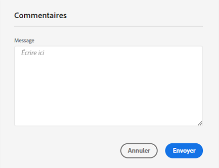
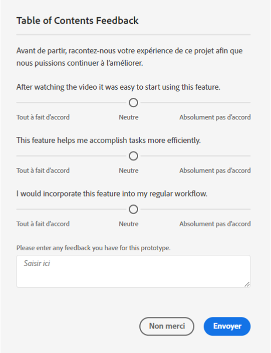

# Guide d’utilisation de [!UICONTROL Labs]

[!UICONTROL Labs] permet de concevoir plus rapidement des prototypes à partir d’idées au stade précoce. Il s’agit d’une combinaison d’outils et de processus qui accélèrent le développement de manière transparente en s’orientant sur le client. Il permet aux utilisateurs d’interagir avec des technologies émergentes, de découvrir des insights précieux et d’influencer le développement et les priorités des fonctionnalités futures. Vous pouvez utiliser Labs pour obtenir un accès anticipé aux innovations Customer Journey Analytics (CJA) et pour évaluer les fonctionnalités à venir dans le cadre de vos propres cas d’utilisation professionnels et de vos propres données.

## Configuration requise

[!UICONTROL Labs] est activé automatiquement pour tous les administrateurs. Les autres membres de l’équipe doivent contacter leurs administrateurs produit pour en demander l’accès.

Si vous ne l’avez pas déjà fait, lisez et signez les formulaires d’accord de non-divulgation et de conditions générales qui s’appliquent.

## Accès au portail [!UICONTROL Labs]

Pour accéder à [!UICONTROL Labs] :

1. Si vous ne disposez pas encore d’un accès à [!UICONTROL Workspace] et à [!UICONTROL Labs], demandez-en l’autorisation à votre administrateur.

1. Dans CJA, cliquez sur le **[!UICONTROL Labs]** .

## Évaluer un prototype

Pour lancer et évaluer un prototype :

1. Sur l’écran [!UICONTROL Labs], cliquez sur **[!UICONTROL Launch]** pour lancer le prototype que vous souhaitez afficher. Lorsque le prototype est lancé, son nom apparaît en haut à gauche de l’environnement du prototype.

   ajouter une capture d’écran ici

1. Regardez une vidéo qui présente le prototype en cliquant sur **[!UICONTROL Regarder la vidéo]** en haut à droite de l’écran. Lorsque la vidéo est terminée, cliquez sur **[!UICONTROL Fermer]**.

   ajouter une capture d’écran ici

1. Travailler avec le prototype. Lorsque vous travaillez dans l’environnement du prototype :

* Il n’est pas possible d’enregistrer ou de partager les projets créés dans l’environnement du prototype.

* Dans un prototype, vous pouvez évaluer les données avec les dimensions, les mesures, les segments et les visualisations auxquelles vous avez accès dans Workspace.

* Les modifications que vous apportez à un prototype ne modifieront pas la collecte ou le traitement des données.

* Les modifications apportées lors de la création ou de la modification de segments, par le calcul de mesures ou par des alertes persistent en dehors de l’environnement de prototype.

## Laisser un commentaire

1. Cliquez sur **[!UICONTROL Laisser un commentaire]** si vous souhaitez, à tout moment, nous faire part de vos commentaires dans la zone de message lorsque vous travaillez avec le prototype.

   

1. Cliquez sur **[!UICONTROL Soumettre]** pour envoyer vos commentaires.

1. Pour essayer un prototype différent ou pour quitter l’environnement de prototype, cliquez sur **[!UICONTROL Quitter le prototype]** en haut à droite de l’écran, puis complétez l’enquête brève au sujet du prototype. Toute modification apportée à un projet de prototype est perdue lorsque vous quittez l’environnement du prototype.

   

1. Cliquez sur **[!UICONTROL Soumettre]** pour revenir au portail principal des Aperçus.

## prototypes CJA Labs

* Générateur d’informations sur le langage naturel : Fournit un résumé en langage naturel de toutes les données que vous analysez dans un tableau à structure libre.
* Recommandations de visualisation : Recommande des visualisations qui s’associent bien à vos données.

## Informations supplémentaires

* Certains prototypes dans [!UICONTROL Labs] deviennent des fonctionnalités Customer Journey Analytics, ce qui n’est pas le cas des autres. Vos commentaires sont pris en compte dans la décision, aussi n’hésitez pas à évaluer les prototypes et à faire savoir à Adobe à quel point vous les appréciez.
* Labs est disponible pour tous les droits SKU.
