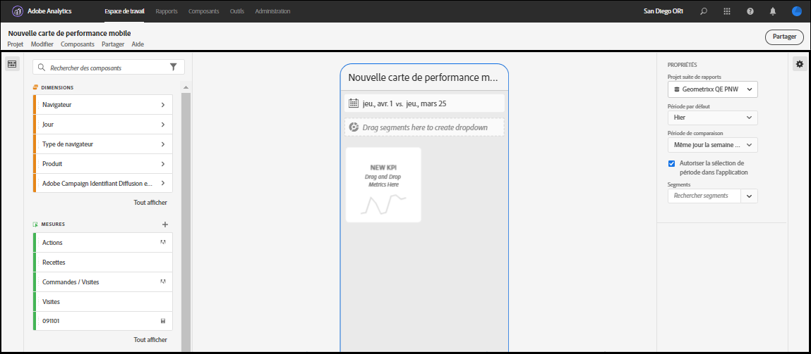
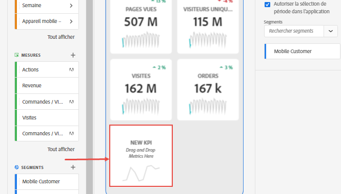
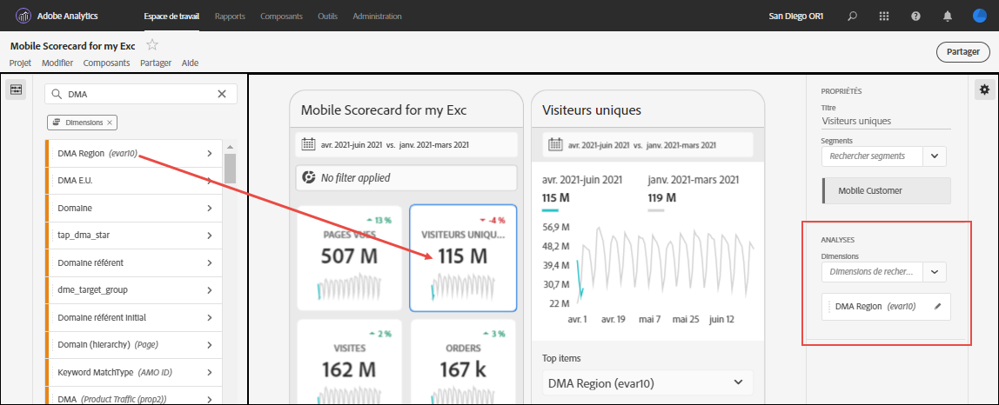
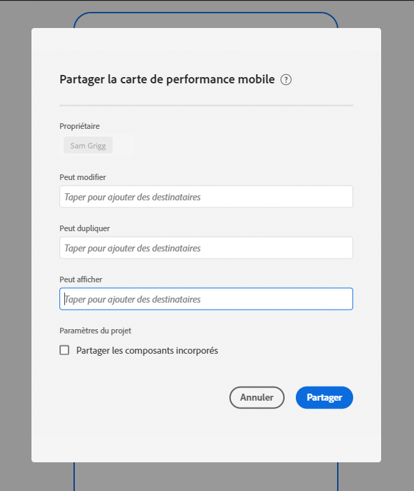

# Créer une carte de performance mobile {#create-a-mobile-scorecard}

<!-- markdownlint-disable MD034 -->

>[!CONTEXTUALHELP]
>id="mobilescorecard_annotations"
>title="Annotations"
>abstract="Vous pouvez créer des annotations dans le gestionnaire de composants d’un projet d’espace de travail."

<!-- markdownlint-enable MD034 -->

Les informations suivantes indiquent aux curateurs et curatrices des données Customer Journey Analytics comment configurer et présenter des tableaux de bord pour les utilisateurs et utilisatrices en charge de l’exécution. Regardez dʼabord la vidéo sur le créateur de cartes de performance pour les tableaux de bord Analytics :

>[!BEGINSHADEBOX]

Consultez  [Créer une carte de performance mobile](https://video.tv.adobe.com/v/3409729?quality=12&learn=on&captions=fre_fr){target="_blank"} pour une vidéo de démonstration.

>[!ENDSHADEBOX]

>[!NOTE]
>
>Les captures d’écran de la carte de performance Analytics pour cette page ont été effectuées à partir de l’interface d’utilisation d’Adobe Analytics, et non de Customer Journey Analytics. Les interfaces utilisateur sont presque identiques.

Une carte de performance Analytics affiche les visualisations de données principales pour les utilisateurs et utilisatrices en charge de lʼexécution sous la forme dʼune disposition en tuiles, comme indiqué ci-dessous :

En tant que curateur ou curatrice de cette carte de performance, vous pouvez utiliser le créateur de cartes de performance pour configurer les tuiles qui apparaissent sur la carte de performance de votre consommateur ou consommatrice en charge de lʼexécution. Vous pouvez également configurer la manière dont lʼaffichage des détails ou les répartitions sʼajustent lorsque lʼutilisateur appuie sur les mosaïques. L’interface du créateur de cartes de performance est illustrée ci-dessous :

Pour créer la carte de performance, procédez comme suit :

1. Accédez au modèle de [!UICONTROL Carte de performance mobile vierge] dans Workspace.
2. Configurer la carte de performance avec des données, puis enregistrez-la.

## Accéder au modèle de [!UICONTROL Fiche d’évaluation mobile vierge] {#template}

Vous pouvez accéder au modèle de [!UICONTROL Carte de performance mobile vierge] en créant un projet ou à partir du menu Outils.

### Créer un nouveau projet {#create}

1. Ouvrez Customer Journey Analytics, puis cliquez sur l’onglet **[!UICONTROL Workspace]**.
1. Dans le rail de gauche, cliquez sur **[!UICONTROL Projets]**.
1. Cliquez sur **[!UICONTROL Créer un projet]**, puis sélectionnez le modèle de projet **[!UICONTROL Carte de performance mobile vierge]**.
1. Cliquez sur **[!UICONTROL Créer]**.

### Menu Outils

1. Dans le menu **[!UICONTROL Outils]**, sélectionnez **[!UICONTROL Tableaux de bord Analytics (application mobile)]**.
1. Sur lʼécran suivant, cliquez sur **[!UICONTROL Créer une carte de performance]**.

## Configurez la carte de performance avec des données, puis enregistrez-la. {#configure}

Pour implémenter le modèle de carte de performance, procédez comme suit :

1. Sous **[!UICONTROL Propriétés de la carte de performance]** (dans le rail de droite), précisez la **[!UICONTROL vue de données du projet]** dont vous souhaitez utiliser les données.

   

1. Pour ajouter une nouvelle tuile à votre carte de performance, faites glisser une mesure depuis le panneau de gauche et déposez-la dans la zone **[!UICONTROL Faire glisser et déposer les mesures ici]**. Vous pouvez également insérer une mesure entre deux mosaïques en utilisant un workflow similaire.

   

1. Depuis chaque mosaïque, vous pouvez accéder à une vue détaillée qui affiche des informations supplémentaires sur la mesure comme les éléments principaux pour une liste de dimensions associées.

## Ajout de dimensions ou de mesures {#dimsmetrics}

Pour ajouter une dimension associée à une mesure, faites glisser une dimension depuis le panneau de gauche, puis déposez-la dans une mosaïque.

Par exemple, vous pouvez ajouter des dimensions appropriées (comme **[!DNL Marketing Channel]** dans cet exemple) à la mesure **[!UICONTROL Visiteurs uniques]** en effectuant une opération de glisser-déposer sur la mosaïque. Les répartitions de dimensions sʼaffichent sous la section [!UICONTROL Répartition] des **[!UICONTROL Propriétés]** propres à la mosaïque. Plusieurs dimensions peuvent être ajoutées à chaque mosaïque.

## Appliquer les segments {#segments}

Pour appliquer des segments à des mosaïques individuelles, faites glisser un segment du panneau de gauche et déposez-le directement en haut de la mosaïque.

Si vous souhaitez appliquer le segment à toutes les vignettes de la carte de performance, déposez la vignette en haut de la carte de performance. Vous pouvez également appliquer des segments en les sélectionnant dans le menu des segments situé sous les périodes. Vous [configurez et appliquez des segments à vos cartes de performance](https://experienceleague.adobe.com/docs/analytics-learn/tutorials/analysis-workspace/using-panels/using-drop-down-filters.html?lang=fr) de la même manière que dans Customer Journey Analytics Workspace.

## Ajout de périodes {#dates}

Ajoutez et supprimez des combinaisons de périodes pouvant être sélectionnées dans votre carte de performance en cliquant sur le menu déroulant des périodes.

Chaque nouvelle carte de performance démarre avec 6 combinaisons de périodes centrées sur les données du jour et de la veille. Vous pouvez supprimer les périodes inutiles en cliquant sur le x. Vous pouvez également modifier chaque combinaison de périodes en cliquant sur le crayon.

Pour créer ou modifier une date principale, utilisez la liste déroulante pour sélectionner une période disponible ou faites glisser un composant de date depuis le rail de droite et déposez-le dans la zone de dépôt.

Pour créer une date de comparaison, vous pouvez choisir parmi des paramètres prédéfinis utiles aux comparaisons d’heures fréquentes dans le menu déroulant. Vous pouvez également glisser-déposer un composant de date à partir du rail de droite.

Si la période souhaitée n’a pas encore été créée, vous pouvez en créer une en cliquant sur l’icône de calendrier.

Vous accédez ainsi au créateur de périodes, où vous pouvez créer un composant de période avant de l’enregistrer.

### Afficher ou masquer les périodes de comparaison {#show-comparison-dates}

Pour inclure des périodes de comparaison, activez le paramètre **Inclure des dates de comparaison**.

Le paramètre est *activé* par défaut. Réglez-le sur *désactivé* si vous ne souhaitez pas afficher de dates de comparaison.

## Appliquer des visualisations {#viz}

Les tableaux de bord Analytics offrent quatre visualisations qui vous donnent des informations détaillées sur les mesures et les éléments de dimension. Appliquez une visualisation différente en modifiant le [!UICONTROL type de graphique] des [!UICONTROL propriétés] d’une mosaïque. Sélectionnez simplement la mosaïque de droite, puis modifiez le type de graphique.

Ou cliquez sur l’icône [!UICONTROL Visualisations] dans le rail de gauche, puis glissez-déposez la visualisation de droite sur la mosaïque :

### [!UICONTROL Numéro du résumé]

Utilisez la visualisation Synthèse des chiffres pour mettre en évidence un grand nombre d’éléments importants dans un projet.

### [!UICONTROL Anneau]

Semblable à un graphique en secteurs, cette visualisation présente les données comme des portions d’un tout. Utilisez un graphique en anneau pour comparer les pourcentages dʼun total. Supposons, par exemple, que vous souhaitiez identifier la plateforme publicitaire responsable du nombre total de personnes uniques :

### [!UICONTROL Ligne]

Dans la visualisation en ligne, les mesures sont représentées sous la forme d’une ligne afin d’indiquer l’évolution des valeurs dans le temps. Un graphique en lignes affiche les dimensions au fil du temps, mais fonctionne avec n’importe quelle visualisation. Dans cet exemple, vous visualisez la dimension de catégorie de produits.

### [!UICONTROL Barre horizontale]

Dans cette visualisation, des barres horizontales représentent plusieurs valeurs pour une ou plusieurs mesures. Par exemple, pour voir facilement quels sont vos principaux produits, utilisez [!UICONTROL Barre horizontale] comme visualisation préférée.

## Nommer des cartes de performance {#name}

Pour nommer la carte de performance, cliquez sur l’espace de noms en haut à gauche de l’écran, puis saisissez le nouveau nom.

### Supprimer l’élément de dimension [!UICONTROL Non spécifié] {#remove-dims}

Si vous souhaitez supprimer [!UICONTROL Non spécifié] des éléments de dimension de vos données, procédez comme suit :

1. Sélectionnez la mosaïque appropriée.
1. Dans le rail de droite, sous **[!UICONTROL Analyses]**, sélectionnez la flèche vers la droite en regard de l’élément de dimension pour lequel vous voulez supprimer les éléments **[!UICONTROL Non spécifiés]**.

   

1. Cliquez sur l’icône en regard de **[!UICONTROL Non spécifié]** pour supprimer les données non spécifiées de vos comptes rendus de performances. (Vous pouvez également supprimer tout autre élément de dimension.)

## Afficher et configurer des propriétés dʼune vignette {#tiles}

Lorsque vous cliquez sur une vignette dans le créateur de cartes de performance, le rail de droite affiche les propriétés et les caractéristiques associées à cette vignette et à sa diapositive détaillée. Dans ce rail, vous pouvez fournir un nouveau **titre** pour la vignette ainsi que la configurer en appliquant des segments.

## Afficher les diapositives détaillées {#view-detail-slides}

Si vous cliquez sur les vignettes, une fenêtre pop-up dynamique monte comment l’utilisateur en charge de l’exécution voit la diapositive détaillée dans l’application. Vous pouvez ajouter des dimensions pour ventiler vos données selon vos besoins. Si aucune dimension n’a été appliquée, la dimension de répartition sera **heure** ou **jours**, en fonction de la période par défaut.

Les répartitions affinent votre analyse en répartissant les mesures par éléments de dimension, tels que :

* Mesure Visiteurs uniques ventilée par Plateforme publicitaire (AMO ID)
* Mesure Visites ventilée par Catégorie de produit (vente au détail)
* Mesure Chiffre dʼaffaires total ventilée par Nom de produit

Chaque dimension ajoutée à la mosaïque s’affiche dans un menu déroulant dans la vue détaillée de l’application. L’utilisateur en charge de l’exécution peut ensuite choisir parmi les options répertoriées dans le menu déroulant.

## Personnaliser des diapositives détaillées {#customize-detail-slide}

Les diapositives détaillées personnalisées vous permettent d’être encore plus ciblé sur les informations que vous partagez avec votre audience.

>[!BEGINSHADEBOX]

Consultez  [Vues détaillées personnalisées](https://video.tv.adobe.com/v/3413787?quality=12&learn=on&captions=fre_fr){target="_blank"} pour une vidéo de démonstration.

{{videoaa}}

>[!ENDSHADEBOX]

Vous pouvez modifier la disposition de chaque diapositive détaillée et ajouter du texte afin de mieux expliquer ce que l’utilisateur final peut voir dans les données. Vous pouvez également modifier le type de graphique à l’aide du menu déroulant.

### Modifier la disposition de la diapositive

Modifiez la disposition de la diapositive pour vous concentrer sur les informations les plus importantes. Par exemple, vous pouvez modifier la disposition pour n’afficher qu’un graphique ou un tableau. Pour modifier la disposition de la diapositive, sélectionnez l’un des formats prédéfinis.

Vous pouvez également modifier la disposition des diapositives en glissant-déposant les composants de visualisation du rail de gauche sur la zone de travail. Chaque diapositive détaillée ne peut contenir que deux visualisations à la fois.

### Ajouter un texte descriptif à une diapositive

Vous pouvez ajouter du texte pour fournir des informations significatives sur le contenu des graphiques ou des nuances sur les données.

Pour ajouter du texte à une diapositive détaillée, sélectionnez une disposition qui affiche le symbole `T` ou glissez-déposez le composant Visualisation de texte depuis le rail de gauche. L’éditeur de texte s’ouvre automatiquement lors de l’ajout d’une nouvelle visualisation de texte ou du choix d’une disposition de diapositives avec texte. L’éditeur de texte fournit toutes les options standard pour le formatage de votre texte. Vous pouvez appliquer des styles de texte tels que des paragraphes, des en-têtes et des sous-titres, ainsi qu’appliquer des polices en gras et en italique. Vous pouvez justifier du texte, ajouter des listes à puces ou numérotées et ajouter des liens. Une fois la modification terminée, cliquez sur le bouton Réduire dans le coin supérieur droit de l’éditeur de texte pour le fermer. Pour modifier le texte que vous avez déjà ajouté, cliquez sur l’icône en forme de crayon pour ouvrir à nouveau l’éditeur de texte.

## Supprimer des composants {#remove}

De même, si vous souhaitez supprimer un composant appliqué à la totalité de la carte de performance, cliquez n’importe où sur la carte en dehors des tuiles, puis supprimez-le en cliquant sur le **x** qui apparaît lorsque vous placez le pointeur de la souris sur le composant, comme indiqué ci-dessous pour le filtre **Premières visites** :

## Créer des histoires de données {#create-data-story}

Une histoire de données consiste en un ensemble de points de données complémentaires, de contexte commercial et de mesures associées construit autour d’un thème central ou d’une mesure commune.

Si, par exemple, vous cherchez à augmenter votre trafic web, la mesure la plus importante peut être le nombre de visites, suivie par le nombre de nouvelles personnes ou de personnes uniques. Pour une analyse plus poussée, vous souhaitez certainement consulter ces données réparties par page web ou par type d’appareil d’où le trafic provient. Les histoires de données contées dans les projets des cartes de performance mobiles vous permettent de faire ressortir vos mesures les plus importantes, tout en racontant la logique derrière les mesures grâce à plusieurs diapositives détaillées.

Regardez la vidéo pour en savoir plus sur la création d’histoires de données dans les projets des cartes de performance mobiles d’Analysis Workspace.

>[!BEGINSHADEBOX]

Consultez  [Histoires de données pour un projet de carte de performance mobile](https://video.tv.adobe.com/v/3420560/?quality=12&learn=on&captions=fre_fr){target="_blank"} pour une vidéo de démonstration.

{{videoaa}}

>[!ENDSHADEBOX]

**Pour créer une histoire de données** {#data-story-create}

Créez votre histoire de données en ajoutant plusieurs diapositives détaillées à une mosaïque.

1. Commencez par un projet de carte de performance mobile.
1. Sélectionnez une mosaïque à partir de laquelle vous souhaitez créer une histoire.
   
   {width=".50%"}
1. Ajoutez des diapositives pour élaborer votre histoire de données. Votre première diapositive est générée par défaut.
Pour ajouter de nouvelles diapositives, pointez ou cliquez sur une diapositive, puis sélectionnez l’une des options disponibles :
   * Appuyez sur le signe « + » pour créer une diapositive.
   * Appuyez sur l’icône de duplication pour dupliquer la diapositive existante.
1. Si vous créez une diapositive vierge, faites glisser et déposez des composants depuis le rail de gauche ou choisissez une disposition pour remplir automatiquement la diapositive avec les données de la mosaïque.
   
Pour supprimer une diapositive, appuyez sur l’icône de corbeille.

### Personnaliser une histoire de données {#customize-data-story}

Les histoires de données vous permettent de personnaliser chaque élément, afin de partager uniquement les informations que vous souhaitez partager, et d’exclure tout ce dont vous n’avez pas besoin. Vous pouvez personnaliser les mosaïques et les diapositives en ajoutant des segments, en affichant les répartitions et en modifiant la disposition et les visualisations.

**Pour personnaliser les mosaïques**

1. Appuyez sur une mosaïque. La mosaïque sélectionnée est entourée en bleu et le panneau de droite affiche ses propriétés.
1. Modifiez le titre, le type de graphique et d’autres options de mosaïque.
1. Faites glisser un composant sur la mosaïque.
   
Lorsque vous faites glisser et déposez un composant, tel qu’une visualisation, sur une mosaïque, le composant est appliqué à toutes les diapositives de l’histoire de données.
1. Pour appliquer une modification uniquement au titre, maintenez la touche Maj enfoncée pour appliquer la modification.
   

>[!NOTE]
>Les diapositives héritent des composants de la tuile, mais l’inverse n’est pas vrai.

**Pour personnaliser des diapositives individuelles**

Vous pouvez modifier la visualisation de diapositives individuelles d’une histoire de données. Vous pouvez, par exemple, remplacer une barre horizontale par un graphique en anneau dans une diapositive. Vous pouvez également modifier la disposition. Consultez la section [Personnaliser les diapositives détaillées](#customize-detail-slide).

### Prévisualiser une histoire de données {#preview-data-story}

Une fois votre histoire de données créée, appuyez sur le bouton **Prévisualiser** pour afficher votre histoire de données et interagir avec elle comme si vous étiez un utilisateur ou une utilisatrice de l’application. Pour plus d’informations sur la prévisualisation des histoires de données, consultez la section [Prévisualiser une carte de performance](#preview)

### Naviguer entre les mosaïques et les diapositives {#navigate-tiles-slides}

La barre de navigation affiche des icônes reflétant le contenu de chaque diapositive. La barre de navigation permet d’accéder facilement à une diapositive spécifique si vous disposez de nombreuses diapositives.

Pour accéder à une autre mosaïque ou diapositive, appuyez sur la barre de navigation.

{width="45%"}

Pour naviguer d’avant en arrière, utilisez les flèches de votre clavier ou sélectionnez un composant et maintenez-le à gauche ou à droite de l’écran pour le faire défiler.

## Prévisualiser des cartes de performance {#preview}

Vous pouvez prévisualiser l’aspect et le fonctionnement de la carte de performance une fois qu’elle est publiée dans l’application de tableaux de bord Adobe Analytics.

1. Cliquez sur **[!UICONTROL Prévisualisation]** dans le coin supérieur droit de l’écran.

   

1. Pour afficher la carte de performance telle qu’elle apparaîtra sur différents appareils, sélectionnez un appareil dans le menu déroulant [!UICONTROL Prévisualisation de l’appareil].

   

1. Pour interagir avec la prévisualisation, vous pouvez :

   * Cliquer avec le bouton gauche pour simuler l’appui sur l’écran du téléphone.

   * Utiliser la fonction de défilement de votre ordinateur pour simuler le défilement de l’écran du téléphone avec votre doigt.

   * Cliquer et maintenir la touche appuyée pour simuler la pression et le maintien de votre doigt sur l’écran du téléphone. Cela s’avère utile pour interagir avec les visualisations dans la vue détaillée.

## Partager des cartes de performance {#share}

Pour partager la carte de performance avec un utilisateur ou une utilisatrice en charge de l’exécution, procédez comme suit :

1. Cliquez sur le menu **[!UICONTROL Partager]**, puis sélectionnez **[!UICONTROL Partager la fiche d’évaluation]**.

1. Dans le formulaire **[!UICONTROL Partager la fiche d’évaluation mobile]**, complétez les champs en :

   * indiquant le nom de la carte de performance
   * fournissant une description de la carte de performance
   * ajoutant des balises pertinentes
   * précisant les destinataires de la carte de performance

1. Cliquez sur **[!UICONTROL Partager]**.

Après avoir partagé une carte de performance, vos destinataires peuvent y accéder depuis leurs tableaux de bord Analytics. Si, par la suite, vous apportez des modifications à la carte de performance dans le créateur de carte de performance, celles-ci seront mises à jour automatiquement dans la carte de performance que vous avez partagée. Les utilisateurs et utilisatrices en charge de l’exécution pourront accéder aux changements en actualisant la carte de performance sur leur application.

Si vous mettez à jour la carte de performance en ajoutant de nouveaux composants, vous voudrez peut-être à nouveau la partager (et cocher lʼoption **[!UICONTROL Partager les composants incorporés]**) afin de vous assurer que vos utilisateurs en charge de lʼexécution ont accès à ces modifications.

### Partager des cartes de performance à l’aide d’un lien partageable

L’utilisation d’un lien partageable facilite le partage d’une carte de performance dans un e-mail, un document ou une application de messagerie texte. Le lien partageable permet aux destinataires d’ouvrir la carte de performance sur leur bureau ou dans l’application mobile des tableaux de bord. Les liens profonds partageables facilitent encore davantage le partage de projets et stimulent l’engagement avec vos parties prenantes.

Pour partager une carte de performance à l’aide d’un lien partageable, procédez comme suit :

1. Cliquez sur le menu **[!UICONTROL Partager]**, puis sélectionnez **[!UICONTROL Partager la fiche d’évaluation]**.

   

1. Copiez le lien et collez-le dans un e-mail, un document ou une application de messagerie instantanée.

   Lorsqu’une personne destinataire utilise une application de bureau ou un navigateur pour ouvrir le lien, le projet de carte de performance mobile s’ouvre dans Workspace.

   Lorsqu’une personne destinataire ouvre le lien sur un appareil mobile, la carte de performance s’ouvre directement dans l’application des tableaux de bord Adobe Analytics.

   Si une personne destinataire n’a pas téléchargé l’application mobile, elle est redirigée vers la liste des applications dans l’App Store ou le Google Play Store, où elle peut la télécharger.

