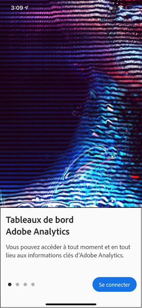

# Guide du curateur pour les tableaux de bord Analytics

Les informations suivantes indiquent aux curateurs des données Adobe Analytics comment configurer et présenter des tableaux de bord pour les utilisateurs en charge de l’exécution. Pour regarder une vidéo présentant ces informations, reportez-vous à la vidéo Créateur de fiches d’évaluation des tableaux de bord Analytics :

>[!VIDEO](https://video.tv.adobe.com/v/34544)

## Introduction

Les tableaux de bord Adobe Analytics fournissent des informations à tout moment et en tout lieu sur la base de vos données Customer Journey Analytics. L’application permet aux utilisateurs mobiles d’accéder à des cartes de performance intuitives que vous créez et partagez à partir de l’interface utilisateur de bureau du Customer Journey Analytics. Les tableaux de bord sont un ensemble de mesures clés et d’autres composants présentés dans une mise en page en mosaïque que vous pouvez appuyer pour des ventilations plus détaillées et des vues de données de tendance. Vous pouvez personnaliser les Fiches d’évaluation en fonction des données qui comptent le plus pour vous. Les tableaux de bord Analytics sont pris en charge sur les systèmes d’exploitation iOS et Android.

## En savoir plus sur ce guide

Ce guide est destiné à aider les responsables de la gestion des données des Customer Journey Analytics à configurer les Scorecards pour leurs utilisateurs exécutifs sur les tableaux de bord. Les curateurs peuvent être des administrateurs de l’entreprise ou des personnes occupant d’autres rôles chargés de configurer des Fiches d’évaluation dans l’application qui permettent aux utilisateurs en charge de l’exécution de visualiser rapidement et facilement un large rendu de données récapitulatives importantes sur leurs propres appareils mobiles. Bien que les utilisateurs en charge de l’exécution soient les utilisateurs finaux des tableaux de bord Analytics, ce guide aidera les curateurs de données à configurer efficacement l’application pour ces utilisateurs.

## Glossaire terminologique

Le tableau suivant décrit les termes nécessaires à la compréhension de l’audience, des fonctionnalités et du fonctionnement des tableaux de bord Analytics.

| Terme | Définition |
|--- |--- |
| Consommateur | Personnalité exécutive affichant les mesures et informations clés de la CJA sur un périphérique mobile |
| Curateur | Personne qui détecte et distribue les statistiques de la CJA et configure les cartes de performance à afficher par le consommateur |
| Traitement | L’acte de création ou de modification d’une Fiche d’évaluation mobile contenant des mesures, des dimensions ainsi que d’autres composants pertinents pour le consommateur |
| Fiche d’évaluation | Un affichage dans les tableaux de bord contenant une ou plusieurs mosaïques |
| Mosaïque | Un rendu d’une mesure dans un affichage de la Fiche d’évaluation |
| Ventilation | Un affichage secondaire accessible en appuyant sur une mosaïque de la Fiche d’évaluation. Cet affichage étend la mesure affichée sur la mosaïque et peut de manière facultative gérer des dimensions de ventilation supplémentaires |
| Période | La période principale pour la création de rapports dans les tableaux de bord |
| Période de comparaison | La période comparée à la période principale |

## Créer une Fiche d’évaluation à destination des utilisateurs en charge de l’exécution dans l’application

Une Fiche d’évaluation affiche les visualisations de données principales pour les utilisateurs en charge de l’exécution dans l’application sous la forme d’une mosaïque comme indiqué ci-dessous :

En tant que curateur de cette Fiche d’évaluation, vous pouvez utiliser le Créateur de Fiches d’évaluations pour configurer les mosaïques qui apparaissent sur la Fiche d’évaluation de votre consommateur. Vous pouvez également configurer la manière dont l’affichage des détails ou les ventilations s’ajustent lorsque l’utilisateur appuie sur les mosaïques. L’interface du Créateur de Fiche d’évaluation est illustrée ci-dessous :

Pour créer la Fiche d’évaluation, vous devrez effectuer les opérations suivantes :

1. Accédez au modèle de [!UICONTROL Fiche d’évaluation mobile vierge].
2. Configurer la Fiche d’évaluation avec des données, puis l’enregistrer.

### Accéder au modèle de [!UICONTROL Fiche d’évaluation mobile vierge]

Vous pouvez accéder au modèle de [!UICONTROL Fiche d’évaluation mobile vierge] de l’une des manières suivantes :

**Créer un nouveau projet**

1. Ouvrez le Customer Journey Analytics et cliquez sur **Projets**.
2. Cliquez sur le bouton **[!UICONTROL Créer un nouveau projet]**, puis sélectionnez le modèle de projet **[!UICONTROL Fiche d’évaluation mobile vierge]**.
3. Cliquez sur le bouton **[!UICONTROL Créer]**.

**Ajouter un projet**

Depuis l’écran **[!UICONTROL Projets]**, dans l’onglet **[!UICONTROL Composants]**, cliquez sur le bouton **[!UICONTROL Ajouter]**, puis sélectionnez **[!UICONTROL Fiche d’évaluation mobile.]**

**OU**

Dans le menu **[!UICONTROL Outils]**, sélectionnez **[!UICONTROL tableaux de bord Analytics (application mobile)]**. Sur l’écran suivant, cliquez sur le bouton **[!UICONTROL Créer une fiche d’évaluation]**.

### Configurer la Fiche d’évaluation avec des données, puis l’enregistrer.

Pour implémenter le modèle de Fiche d’évaluation :

1. Sous **[!UICONTROL Propriétés]** (dans le rail de droite), spécifiez une **[!UICONTROL vue de données de projet]** à partir de laquelle vous souhaitez utiliser les données.

   

2. Pour ajouter une nouvelle mosaïque à votre fiche d’évaluation, faites glisser une mesure depuis le panneau de gauche et déposez-la dans la zone **[!UICONTROL Glisser-déposer les mesures ici]**. Vous pouvez également insérer une mesure entre deux mosaïques en utilisant un workflow similaire.

   

   *Depuis chaque mosaïque, vous pouvez accéder à une vue détaillée qui affiche des informations supplémentaires sur la mesure comme les éléments principaux pour une liste de dimensions associées.*

3. Pour ajouter une dimension associée à une mesure, faites glisser une dimension depuis le panneau de gauche, puis déposez-la dans une mosaïque. Par exemple, vous pouvez ajouter des dimensions appropriées (comme **[!DNL DMA Region]** dans cet exemple) à la mesure **[!UICONTROL Visiteurs uniques]** en la faisant glisser et en la déposant sur la mosaïque. Les dimensions que vous ajoutez apparaîtront dans la section de ventilation des **[!UICONTROL Propriétés]** spécifiques à la mosaïque. Plusieurs dimensions peuvent être ajoutées à chaque mosaïque.

   

   Lorsque vous cliquez sur une mosaïque du Créateur de la Fiche d’évaluation, le rail de droite affiche les propriétés et les caractéristiques associées à cette mosaïque. Depuis ce rail, vous pouvez renseigner un nouveau **[!UICONTROL Titre]** pour la mosaïque ou configurer la mosaïque en précisant des composants au lieu de les faire glisser et de les déposer depuis le rail de gauche.

   

   En outre, si vous cliquez sur les mosaïques, une fenêtre pop-up dynamique affichera comment l’utilisateur en charge de l’exécution voit la vue de ventilation dans l’application. Si aucune dimension n’a été appliquée à la mosaïque, la dimension de ventilation sera **heure** ou **jours**, en fonction de la période par défaut.

   

   Chaque dimension ajoutée à la mosaïque apparaît dans une liste déroulante dans la vue détaillée de l’application. L’utilisateur en charge de l’exécution peut alors choisir parmi les options répertoriées dans la liste déroulante.

4. Pour appliquer des filtres à des mosaïques individuelles, faites glisser un filtre à partir du panneau de gauche et déposez-le directement sur la mosaïque. Si vous souhaitez appliquer le filtre à toutes les mosaïques de la carte de performance, déposez la mosaïque au-dessus de la carte de performance. Vous pouvez également appliquer des filtres en sélectionnant des filtres dans le menu de filtre situé sous les plages de dates. Vous [configurez et appliquez des filtres pour vos Fiches d’évaluation](https://experienceleague.adobe.com/docs/analytics-learn/tutorials/analysis-workspace/using-panels/using-drop-down-filters.html?lang=fr) de la même manière que dans Adobe Analytics Workspace.

   

5. De même, pour supprimer un composant appliqué à la totalité de la carte de performance, cliquez n’importe où sur la carte de performance en dehors des mosaïques, puis supprimez-la en cliquant sur le **x** qui s’affiche lorsque vous passez la souris sur le composant, comme illustré ci-dessous pour le filtre **Premières visites** :

   

6. Ajoutez et supprimez des combinaisons de plages de dates qui peuvent être sélectionnées dans votre carte de performance en sélectionnant la liste déroulante des plages de dates.

   

   Chaque nouvelle carte de performance début avec 6 combinaisons de plages de dates centrées sur les données d’aujourd’hui et d’hier. Vous pouvez supprimer des plages de dates inutiles en cliquant sur le x ou modifier chaque combinaison de plages de dates en cliquant sur le crayon.

   

   Pour créer ou modifier une date Principale, utilisez la liste déroulante pour sélectionner une plage de dates disponible ou faites glisser et déposez un composant de date du rail de droite dans la zone de dépôt.

   

   Pour créer une date de comparaison, vous pouvez choisir parmi des préréglages pratiques pour les comparaisons d’heure courantes dans le menu déroulant. Vous pouvez également faire glisser et déposer un composant de date à partir du rail de droite.

   

   Si la période souhaitée n&#39;a pas encore été créée, vous pouvez en créer une nouvelle en cliquant sur l&#39;icône de calendrier.

   

7. Vous accédez ainsi au créateur de plages de dates, où vous pouvez créer et enregistrer un nouveau composant de plage de dates. Pour nommer la Fiche d’évaluation, cliquez sur l’espace de noms en haut à gauche de l’écran, puis saisissez le nouveau nom.

   

## Partager la Fiche d’évaluation

Pour partager la Fiche d’évaluation avec un utilisateur en charge de l’exécution :

1. Cliquez sur le menu **[!UICONTROL Partager]**, puis sélectionnez **[!UICONTROL Partager la fiche d’évaluation]**.

2. Dans le formulaire **[!UICONTROL Partager la fiche d’évaluation mobile]**, complétez les champs en :

   * indiquant le nom de la Fiche d’évaluation ;
   * indiquant une description de la Fiche d’évaluation ;
   * ajoutant des balises pertinentes ;
   * précisant les destinataires de la Fiche d’évaluation.

3. Cliquez sur **[!UICONTROL Partager]**.

Après avoir partagé une Fiche d’évaluation, vos destinataires peuvent y accéder depuis leurs tableaux de bord Analytics. Si, par la suite, vous apportez des modifications à la Fiche d’évaluation dans le Créateur de Fiche d’évaluation, celles-ci seront mises à jour automatiquement dans la Fiche d’évaluation que vous avez partagée. Les utilisateurs en charge de l’exécution pourront accéder aux changements en actualisant la Fiche d’évaluation sur leur application.

Si vous mettez à jour la Fiche d’évaluation en ajoutant de nouveaux composants, vous voudrez peut-être partager à nouveau la Fiche d’évaluation (et cocher l’option **[!UICONTROL Partager les composants incorporés]**) afin de vous assurer que vos utilisateurs en charge de l’exécution ont accès à ces modifications.

## Configurer les utilisateurs en charge de l’exécution avec l’application

Dans certains cas, les utilisateurs en charge de l’exécution peuvent avoir besoin d’aide pour accéder à l’application et l’utiliser. Cette section fournit des informations pour vous aider à apporter cette aide.

### Aider les utilisateurs en charge de l’exécution à obtenir les accès à l’application

Pour aider les utilisateurs en charge de l’exécution à accéder à vos Fiches d’évaluation sur l’application, assurez-vous des points suivants :

* Les spécifications minimales en matière de systèmes d’exploitation mobile sur leurs appareils sont la version 10 ou ultérieure d’iOS ou la version 4.4 (KitKat) ou ultérieure d’Android.
* Ils possèdent des identifiants de connexion valides à Adobe Analytics.
* Vous avez créé et partagé correctement des Fiches d’évaluation avec eux.
* Ils ont accès à Analysis Workspace et à la vue de données sur laquelle repose la Scorecard.
* Ils ont accès aux composants que la Fiche d’évaluation inclut. Notez que lorsque vous partagez vos Fiches d’évaluation, vous pouvez sélectionnez l’option **[!UICONTROL Partager les composants incorporés]**.

### Aider les utilisateurs en charge de l’exécution à utiliser l’application

Pour aider les utilisateurs en charge de l’exécution :

1. Aidez-les à télécharger et à installer l’application. Pour ce faire, indiquez-leur les étapes suivantes pour étendre l’accès à vos utilisateurs en charge de l’exécution selon qu’ils utilisent un appareil iOS ou Android.

   **Pour les utilisateurs en charge de l’exécution sur iOS :**

   * Cliquez sur le lien suivant (il est également disponible dans Analytics sous **[!UICONTROL Outils]** > **[!UICONTROL Tableaux de bord Analytics (application mobile)]**) et suivez les invites pour télécharger, installer et ouvrir l’application :

      [Lien iOS](https://apple.co/2zXq0aN)
   **Pour les utilisateurs en charge de l’exécution sur Android :**

   * Cliquez sur le lien suivant (il est également disponible dans Analytics sous **[!UICONTROL Outils]** > **[!UICONTROL Tableaux de bord Analytics (application mobile)]**) et suivez les invites pour télécharger, installer et ouvrir l’application :

      [Lien Android](https://bit.ly/2LM38Oo)
   Une fois l’application téléchargée et installée, les utilisateurs en charge de l’exécution peuvent se connecter à l’application en utilisant leurs informations d’identification Adobe Analytics existantes. Nous prenons en charge aussi bien les Adobe ID que les Enterprise/Federated ID.

   

2. Aidez-les à accéder à votre Fiche d’évaluation. Lorsque les utilisateurs en charge de l’exécution sont connectés à l’application, l’écran **[!UICONTROL Choisir une entreprise]** apparaît. Cet écran répertorie les entreprises connectées auxquelles l’utilisateur en charge de l’exécution appartient. Pour les aider à accéder à la Fiche d’évaluation :

   * Appuyez sur le nom de l’entreprise connectée ou de l’organisation Experience Cloud auquel la Fiche d’évaluation que vous avez créée s’applique. La liste des Fiches d’évaluation affiche alors toutes les Fiches d’évaluation partagées avec la personne en charge de l’exécution pour cette entreprise connectée.
   * Aidez-les à trier cette liste selon la **[!UICONTROL Modification la plus récente]**, le cas échéant.
   * Appuyez sur le nom de la Fiche d’évaluation pour l’afficher.

   

   Si l’utilisateur en charge de l’exécution se connecte et qu’un message s’affiche indiquant que rien n’a été partagé :

   * L’utilisateur en charge de l’exécution peut avoir sélectionné la mauvaise instance Analytics.

   * La Fiche d’évaluation peut ne pas avoir été partagée avec l’utilisateur en charge de l’exécution.

      

   * Vérifiez que l’utilisateur en charge de l’exécution peut se connecter à la bonne instance Analytics et que la Fiche d’évaluation a bien été partagée.

3. Expliquez à l’utilisateur exécutif comment les mosaïques apparaissent dans les cartes de performance que vous partagez (la première carte de performance ci-dessous est définie en mode noir ; voir **[!UICONTROL Préférences]** ci-dessous si vous pensez que l’utilisateur exécutif préfère cette option de visualisation) :

   

   

   Informations supplémentaires sur les mosaïques :

   * La granularité des graphiques sparkline dépend de la longueur de la période :
      * Une tendance horaire s’affiche pour les plages d’une journée.
      * Une tendance quotidienne s’affiche pour les plages comprises entre une journée et un an.
      * Une tendance hebdomadaire s’affiche pour les plages supérieures à un an.
   * La formule de modification de la valeur de pourcentage est calculée de la manière suivante : total de la mesure (période en cours) - total de la mesure (période de comparaison)/total de la mesure (période de comparaison).
   * Vous pouvez tirer l’écran vers le bas pour actualiser la Fiche d’évaluation.

4. Appuyez sur une mosaïque pour afficher comment fonctionne une ventilation détaillée sur la mosaïque.

   

   * Appuyez sur n’importe quel point d’un graphique sparkline pour afficher les données associées à ce point sur la ligne.

   * Un tableau est inclus pour afficher les données des dimensions ajoutées à la mosaïque. Appuyez sur la flèche vers le bas pour sélectionner les dimensions. Si aucune dimension n’a été ajoutée à la mosaïque, le tableau affiche les données de graphique.

5. Pour modifier les plages de dates de votre Scorecard, appuyez sur l’en-tête Date et sélectionnez la combinaison Principale et de plage de dates de comparaison à vue.

   

6. Pour faire part de vos commentaires sur cette application :

   1. Appuyez sur l’icône des paramètres en haut à droite de l’écran de l’application.
   2. Sur l’écran **[!UICONTROL Paramètres]**, appuyez sur l’option **[!UICONTROL Commentaires]**.
   3. Appuyez pour afficher les options permettant de laisser un commentaire.

      

7. Pour modifier les préférences, appuyez sur l’option **[!UICONTROL Préférences]** affichée ci-dessus. Dans les préférences, vous pouvez activer la connexion biométrique ou définir l’application pour le mode sombre comme illustré ci-dessous :

   

**Pour signaler un bogue** :

Appuyez sur l’option, puis choisissez une sous-catégorie de bogue. Dans le formulaire de signalement d’un bogue, indiquez votre adresse électronique dans le champ supérieur et votre description du bogue dans le champ qui suit. Une capture d’écran des informations de votre compte est jointe automatiquement au message, mais vous pouvez la supprimer en appuyant sur le **X** dans l’image de la pièce jointe. Vous disposez également d’options pour effectuer un enregistrement de l’écran, ajouter davantage de captures d’écran ou joindre des fichiers. Pour envoyer le rapport, appuyez sur l’icône en forme d’avion en papier en haut à droite du formulaire.

**Pour suggérer une amélioration** :

Appuyez sur l’option et choisissez une sous-catégorie de suggestion. Dans le formulaire de suggestion, indiquez votre adresse électronique dans le champ supérieur et votre description de la suggestion dans le champ qui suit. Une capture d’écran des informations de votre compte est jointe automatiquement au message, mais vous pouvez la supprimer en appuyant sur le **X** dans l’image de la pièce jointe. Vous disposez également d’options pour effectuer un enregistrement de l’écran, ajouter davantage de captures d’écran ou joindre des fichiers. Pour envoyer la suggestion, appuyez sur l’icône en forme d’avion en papier en haut à droite du formulaire.

**Pour poser une question** :

Appuyez sur l’option et indiquez votre adresse électronique dans le champ supérieur et votre question dans le champ qui suit. Une capture d’écran est jointe automatiquement au message, mais vous pouvez la supprimer en appuyant sur le **X** dans l’image de la pièce jointe. Vous disposez également d’options pour effectuer un enregistrement de l’écran, ajouter davantage de captures d’écran ou joindre des fichiers. Pour envoyer la question, appuyez sur l’icône en forme d’avion en papier en haut à droite du formulaire.

>[!IMPORTANT]
>
>À partir d’octobre 2020, l’Adobe a progressivement déployé une série d’améliorations pour optimiser les performances de l’application &quot;tableaux de bord Adobe Analytics&quot;. Ces améliorations portent principalement sur la mise en cache des données Analytics historiques utilisées pour remplir les fiches d’évaluation avec des dates (à l’exception du jour en cours). Ces données seront mises en cache pendant 24 heures maximum dans un compte de stockage cloud public Microsoft Azure sécurisé. Veuillez contacter votre CSM si vous souhaitez vous désabonner de ces fonctionnalités d’amélioration des performances.
