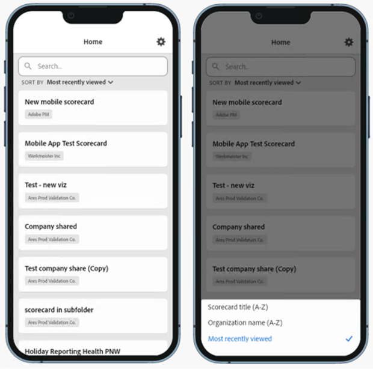

# Guide pour une prise en main rapide destiné aux utilisateurs en charge de l’exécution

Les informations suivantes fournissent aux utilisateurs en charge de l’exécution des informations sur les bonnes pratiques relatives à l’utilisation et à l’affichage des tableaux de bord Analytics.

>[!BEGINSHADEBOX]

Voir  [Aider les cadres à accéder aux cartes de performance mobiles](https://experienceleague.adobe.com/en/docs/customer-journey-analytics-learn/tutorials/dashboards/assist-executives-to-access-mobile-scorecards){target="_blank"} pour une vidéo de démonstration.

>[!ENDSHADEBOX]

Lʼobjectif de ce guide est dʼaider les utilisateurs en charge de lʼexécution à lire et à interpréter les cartes de performance dans les tableaux de bord Analytics. L’application permet aux utilisateurs en charge de l’exécution de visualiser rapidement et facilement un large rendu de données récapitulatives importantes sur leurs propres appareils mobiles.

## Configuration des tableaux de bord sur votre appareil

Pour utiliser efficacement les tableaux de bord, vous devrez demander l’aide de votre curateur de Fiches d’évaluation pour les configurer. Cette section fournit des informations pour vous aider à la configurer avec l’aide de votre curateur.

### Obtenir l’accès

Pour accéder aux Fiches d’évaluation sur les tableaux de bord, assurez-vous que :

* Vous disposez dʼidentifiants de connexion valides à Customer Journey Analytics.
* votre curateur a créé correctement les Fiches d’évaluation mobiles et les a partagées avec vous.

### Téléchargement et installation des tableaux de bord

Pour télécharger et installer l’application, suivez les étapes correspondant au système d’exploitation de votre appareil.

>[!NOTE]
>
>Bien que l’application mobile soit nommée tableau de bord Adobe Analytics dans l’App Store, elle peut être utilisée de la même manière que les cartes de performance mobiles Customer Journey Analytics.

**Pour les utilisateurs en charge de l’exécution sur iOS :**

Cliquez sur le lien suivant (également disponible dans Customer Journey Analytics sous **[!UICONTROL Outils]** > **[!UICONTROL Tableaux de bord Analytics (application mobile)]**) et suivez les invites pour télécharger, installer et ouvrir l’application :

[Lien iOS](https://apple.co/2zXq0aN)

**Pour les utilisateurs en charge de l’exécution sur Android :**

Cliquez sur le lien suivant (également disponible dans Customer Journey Analytics sous **[!UICONTROL Outils]** > **[!UICONTROL Tableaux de bord Analytics (application mobile)]**) et suivez les invites pour télécharger, installer et ouvrir l’application :

[Lien Android](https://bit.ly/2LM38Oo)

Une fois téléchargés et installés, les utilisateurs en charge de l’exécution peuvent se connecter à l’application à l’aide de leurs identifiants Customer Journey Analytics existants.

Écran de bienvenue de l’application Customer Journey Analytics 

## Utilisation des tableaux de bord {#use-dashboards}

Pour utiliser les tableaux de bord :

1. Connectez-vous à lʼapplication. L’écran de connexion apparaîtra au lancement des tableaux de bord. Suivez les invites à l&#39;aide de vos identifiants Customer Journey Analytics existants. Nous prenons en charge aussi bien les Adobe ID que les Enterprise/Federated ID.

   

1. Choisissez une entreprise. Lorsque vous êtes connecté aux tableaux de bord, lʼécran **[!UICONTROL Choisir une entreprise]** apparaît. Cet écran répertorie les entreprises connectées auxquelles vous appartenez. Appuyez sur le nom de la société associée à la carte de performance partagée avec vous.

   La liste des cartes de performance affiche toutes les cartes de performance qui sont partagées avec vous.

1. Appuyez sur la carte de performance à afficher.

   Si vous avez accès à plusieurs organisations sous une seule connexion, toutes les cartes de performance de vos organisations sont disponibles dans la liste des cartes de performance.

   Vous pouvez trier la liste des cartes de performance en fonction de leur titre, du nom de leur organisation ou de la date la plus récente. Vous pouvez même rechercher une carte de performance spécifique.

   

   Si vous vous connectez et que vous voyez un message indiquant que rien n’a été partagé, vérifiez les éléments suivants avec votre curateur :

   * Vous pouvez vous connecter au sandbox Customer Journey Analytics approprié.
   * La carte de score a été partagée avec vous.

   

1. Examinez l’affichage des mosaïques dans la Fiche d’évaluation (la première Fiche d’évaluation s’affiche en mode sombre, consultez **[!UICONTROL Préférences]** ci-dessous pour plus d’informations).

   

   Informations supplémentaires sur les mosaïques :

   * La granularité des graphiques sparkline dépend de la longueur de la période :

      * Une tendance horaire s’affiche pour les plages d’une journée.
      * Une tendance quotidienne s’affiche pour les plages comprises entre une journée et un an.
      * Une tendance hebdomadaire s’affiche pour les plages supérieures à un an.

   * La formule de modification de la valeur de pourcentage est calculée de la manière suivante : total de la mesure (période en cours) - total de la mesure (période de comparaison)/total de la mesure (période de comparaison).

   * Vous pouvez tirer l’écran vers le bas pour actualiser la Fiche d’évaluation.

   L’exemple suivant de la Fiche d’évaluation est affiché en mode normal :

   

1. Appuyez sur une mosaïque pour voir comment fonctionne une répartition détaillée sur la mosaïque.

   

1. Pour modifier les périodes de votre fiche d’évaluation :

   

   * Vous pouvez également modifier les périodes dans la vue Répartition affichée ci-dessus de la même manière.

   * Selon l’intervalle sur lequel vous appuyez (**Jour**, **Semaine**, **Mois** ou **Année**), deux options de période s’affichent : soit la période actuelle, soit celle qui la précède immédiatement. Appuyez sur l’une de ces deux options pour sélectionner la première période. Dans la liste **[!UICONTROL COMPARER À]**, appuyez sur l’une des options qui s’affiche pour comparer les données de cette période avec la première période que vous avez sélectionnée. Appuyez sur **[!UICONTROL Terminé]** en haut à droite de l’écran. Le champ **[!UICONTROL Périodes]** et les mosaïques de la Fiche d’évaluation sont mis à jour avec les nouvelles données de comparaison des périodes que vous venez de sélectionner.

1. Pour appliquer un segment à votre carte de performance, appuyez sur le menu déroulant du segment et sélectionnez un segment qui a été configuré par votre curateur. Les [segments](https://experienceleague.adobe.com/docs/analytics-learn/tutorials/analysis-workspace/using-panels/using-drop-down-filters.html?lang=fr) de l’application fonctionnent de la même manière que dans Workspace.

   

1. Obtenez les mises à jour de [!UICONTROL Fiche d’évaluation]. Si une [!UICONTROL Carte de performance] n’inclut pas toutes les mesures ou répartitions qui peuvent vous intéresser, contactez votre équipe Customer Journey Analytics pour mettre à jour la Carte de performance. Une fois la carte mise à jour, vous pouvez tirer sur la carte à l’écran pour l’actualiser et charger les données récemment ajoutées.

1. Pour faire part de vos commentaires sur cette application :

   1. Appuyez sur l’icône des paramètres en haut à droite de l’écran de l’application.
   2. Sur l’écran **[!UICONTROL Paramètres]**, appuyez sur l’option **[!UICONTROL Commentaires]**.
   3. Appuyez pour afficher les options permettant de laisser un commentaire.

      

1. Pour modifier les préférences, appuyez sur l’option **[!UICONTROL Préférences]** affichée ci-dessus. Dans les préférences, vous pouvez activer la connexion biométrique ou définir l’application pour le mode sombre comme illustré ci-dessous :

   

**Pour signaler un bogue** :

Appuyez sur l’option, puis choisissez une sous-catégorie de bogue. Dans le formulaire de signalement d’un bogue, indiquez votre adresse e-mail dans le champ supérieur et votre description du bogue dans le champ qui suit. Une capture d’écran des informations de votre compte est jointe automatiquement au message, mais vous pouvez la supprimer en appuyant sur le **X** dans l’image de la pièce jointe. Vous disposez également d’options pour effectuer un enregistrement de l’écran, ajouter davantage de captures d’écran ou joindre des fichiers. Pour envoyer le rapport, appuyez sur l’icône en forme d’avion en papier en haut à droite du formulaire.

**Pour suggérer une amélioration** :

Appuyez sur l’option et choisissez une sous-catégorie de suggestion. Dans le formulaire de suggestion, indiquez votre adresse e-mail dans le champ supérieur et votre description de la suggestion dans le champ qui suit. Une capture d’écran des informations de votre compte est jointe automatiquement au message, mais vous pouvez la supprimer en appuyant sur le **X** dans l’image de la pièce jointe. Vous disposez également d’options pour effectuer un enregistrement de l’écran, ajouter davantage de captures d’écran ou joindre des fichiers. Pour envoyer la suggestion, appuyez sur l’icône en forme d’avion en papier en haut à droite du formulaire.

**Pour poser une question** :

Appuyez sur l’option et indiquez votre adresse e-mail dans le champ supérieur et votre question dans le champ qui suit. Une capture d’écran est jointe automatiquement au message, mais vous pouvez la supprimer en appuyant sur le **X** dans l’image de la pièce jointe. Vous disposez également d’options pour effectuer un enregistrement de l’écran, ajouter davantage de captures d’écran ou joindre des fichiers. Pour envoyer la question, appuyez sur l’icône en forme d’avion en papier en haut à droite du formulaire.

## Glossaire terminologique

| Terme | Définition |
|--- |--- |
| Consommateur | Responsable affichant les mesures et informations clés de Customer Journey Analytics sur un appareil mobile |
| Curateur | Personne rompue aux données qui trouve et distribue des informations à partir de Customer Journey Analytics et configure les cartes de performance à afficher par le consommateur |
| Traitement | L’acte de création ou de modification d’une Fiche d’évaluation mobile contenant des mesures, des dimensions ainsi que d’autres composants pertinents pour le consommateur |
| Fiche d’évaluation | Un affichage dans les tableaux de bord contenant une ou plusieurs mosaïques |
| Mosaïque | Un rendu d’une mesure dans un affichage de la Fiche d’évaluation |
| Répartition | Un affichage secondaire accessible en appuyant sur une mosaïque de la Fiche d’évaluation. Cet affichage étend la mesure affichée sur la mosaïque et peut de manière facultative gérer des dimensions de répartition supplémentaires |
| Période | La période principale pour la création de rapports dans les tableaux de bord |
| Période de comparaison | La période comparée à la période principale |
