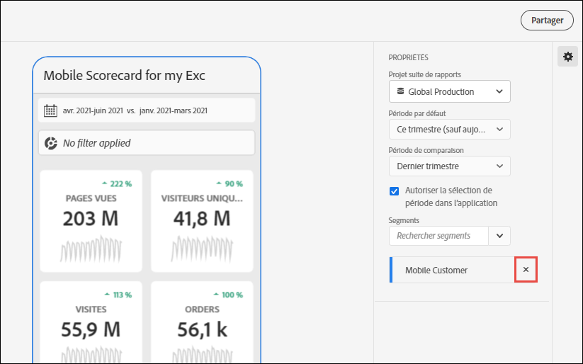
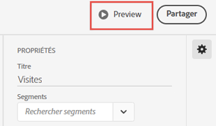
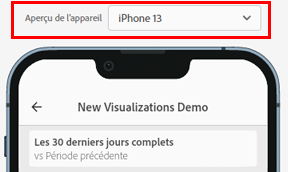

# Gérer les cartes de performance

Cette rubrique explique aux curateurs des données du Customer Journey Analytics comment afficher et gérer les éléments des cartes de performance.

## Afficher et configurer des propriétés dʼune vignette {#tiles}

Lorsque vous cliquez sur une mosaïque du créateur de cartes de performance, le rail de droite affiche les propriétés et les caractéristiques associées à cette mosaïque et à sa diapositive détaillée. Dans ce rail, vous pouvez fournir un nouveau **titre** pour la vignette ainsi que la configurer en appliquant des filtres. Les segments sont des filtres dans Customer Journey Analytics.

## Afficher les diapositives détaillées {#view-detail-slides}

Si vous cliquez sur les vignettes, une fenêtre pop-up dynamique monte comment l’utilisateur en charge de l’exécution voit la diapositive détaillée dans l’application. Vous pouvez ajouter des dimensions pour ventiler vos données selon vos besoins. Si aucune dimension n’a été appliquée, la dimension de répartition sera **heure** ou **jours**, en fonction de la période par défaut.

Les répartitions affinent votre analyse en répartissant les mesures par éléments de dimension, tels que :

* Mesure Visiteurs uniques ventilée par Plateforme publicitaire (AMO ID)
* Mesure Visites ventilée par Catégorie de produit (vente au détail)
* Mesure Chiffre dʼaffaires total ventilée par Nom de produit

Chaque dimension ajoutée à la mosaïque apparaît dans une liste déroulante dans la vue détaillée de l’application. L’utilisateur en charge de l’exécution peut alors choisir parmi les options répertoriées dans la liste déroulante.

## Personnaliser des diapositives détaillées {#customize-detail-slide}

Les diapositives détaillées personnalisées vous permettent d’être encore plus ciblé sur les informations que vous partagez avec votre audience.

>[!BEGINSHADEBOX]

Voir  [Vues détaillées personnalisées](https://video.tv.adobe.com/v/3410002?quality=12&learn=on){target="_blank"} pour une vidéo de démonstration.

>[!ENDSHADEBOX]

Vous pouvez modifier la disposition de chaque diapositive détaillée et ajouter du texte afin de mieux expliquer ce que l’utilisateur final peut voir dans les données. Vous pouvez également modifier le type de graphique à l’aide du menu déroulant.

### Modifier la disposition de la diapositive

Modifiez la disposition de la diapositive pour vous concentrer sur les informations les plus importantes. Par exemple, vous pouvez modifier la disposition pour n’afficher qu’un graphique ou un tableau. Pour modifier la disposition de la diapositive, sélectionnez l’un des formats prédéfinis.

Vous pouvez également modifier la disposition des diapositives en glissant-déposant les composants de visualisation du rail de gauche sur la zone de travail. Chaque diapositive détaillée ne peut contenir que deux visualisations à la fois.

### Ajouter un texte descriptif à une diapositive

Vous pouvez ajouter du texte pour fournir des informations significatives sur le contenu des graphiques ou des nuances sur les données.

Pour ajouter du texte à une diapositive détaillée, sélectionnez une disposition qui affiche le symbole `T` ou glissez-déposez le composant Visualisation de texte depuis le rail de gauche. L’éditeur de texte s’ouvre automatiquement lors de l’ajout d’une nouvelle visualisation de texte ou du choix d’une disposition de diapositives avec texte. L’éditeur de texte fournit toutes les options standard pour le formatage de votre texte. Vous pouvez appliquer des styles de texte tels que des paragraphes, des en-têtes et des sous-titres, ainsi qu’appliquer des polices en gras et en italique. Vous pouvez justifier du texte, ajouter des listes à puces ou numérotées et ajouter des liens. Une fois la modification terminée, cliquez sur le bouton Réduire dans le coin supérieur droit de l’éditeur de texte pour le fermer. Pour modifier le texte que vous avez déjà ajouté, cliquez sur l’icône en forme de crayon pour ouvrir à nouveau l’éditeur de texte.

## Supprimer des composants {#remove}

De même, pour supprimer un composant appliqué à la totalité de la carte de performance, cliquez n’importe où sur celle-ci en dehors des mosaïques, puis supprimez le composant en cliquant sur le **x** qui s’affiche lorsque vous placez le pointeur de la souris au-dessus de lui, comme indiqué ci-dessous pour le **Premières visites** :

## Créer des histoires de données {#create-data-story}

Une histoire de données consiste en un ensemble de points de données complémentaires, de contexte commercial et de mesures associées construit autour d’un thème central ou d’une mesure commune.

Par exemple, si vous vous concentrez sur le trafic web, la mesure la plus importante peut être le nombre de visites, mais vous pouvez également être intéressé par de nouvelles personnes, des personnes uniques, et vous pouvez vouloir afficher les données réparties par page web ou par type d’appareil d’où le trafic provient. Les histoires de données contées dans les projets des cartes de performance mobiles vous permettent de faire ressortir vos mesures les plus importantes, tout en racontant la logique derrière les mesures grâce à plusieurs diapositives détaillées.

Regardez la vidéo pour en savoir plus sur la création d’histoires de données dans les projets des cartes de performance mobiles d’Analysis Workspace.

>[!BEGINSHADEBOX]

Consultez  [Histoires de données pour les projets de cartes de performance mobiles](https://video.tv.adobe.com/v/3416392/?quality=12&learn=on){target="_blank"} pour une vidéo de démonstration.

>[!ENDSHADEBOX]

**Pour créer une histoire de données** {#data-story-create}

Créez votre histoire de données en ajoutant plusieurs diapositives détaillées à une mosaïque.

1. Commencez par un projet de carte de performance mobile.
1. Sélectionnez une mosaïque à partir de laquelle vous souhaitez créer une histoire.
   
   {width=".50%"}
1. Ajoutez des diapositives pour élaborer votre histoire de données. Votre première diapositive est générée par défaut.
Pour ajouter de nouvelles diapositives, pointez ou cliquez sur une diapositive, puis sélectionnez l’une des options disponibles :
   * Appuyez sur le signe « + » pour créer une diapositive.
   * Appuyez sur l’icône de duplication pour dupliquer la diapositive existante.
1. Si vous créez une diapositive vierge, faites glisser et déposez des composants depuis le rail de gauche ou choisissez une disposition pour remplir automatiquement la diapositive avec les données de la mosaïque.
   
Pour supprimer une diapositive, appuyez sur l’icône de corbeille.

### Personnaliser une histoire de données {#customize-data-story}

Les histoires de données vous permettent de personnaliser chaque élément, afin de partager uniquement les informations que vous souhaitez partager, et d’exclure tout ce dont vous n’avez pas besoin. Personnalisez les mosaïques et les diapositives : ajoutez des filtres, affichez des répartitions et modifiez la disposition ainsi que les visualisations.

**Pour personnaliser les mosaïques**

1. Appuyez sur une mosaïque. La mosaïque sélectionnée est entourée en bleu et le panneau de droite affiche ses propriétés.
1. Modifiez le titre, le type de graphique et d’autres options de mosaïque.
1. Faites glisser un composant sur la mosaïque.
   
Lorsque vous faites glisser et déposez un composant, tel qu’une visualisation, sur une mosaïque, le composant est appliqué à toutes les diapositives de l’histoire de données.
1. Pour appliquer une modification uniquement au titre, maintenez la touche Maj enfoncée pour appliquer la modification.
   

>[!NOTE]
>Les diapositives héritent des composants de la mosaïque, mais les mosaïques n’héritent pas des composants des diapositives.

**Pour personnaliser des diapositives individuelles**

Vous pouvez modifier la visualisation de diapositives individuelles d’une histoire de données. Vous pouvez, par exemple, remplacer une barre horizontale par un graphique en anneau dans une diapositive. Vous pouvez également modifier la disposition. Consultez la section [Personnaliser les diapositives détaillées](#customize-detail-slide).

### Prévisualiser une histoire de données {#preview-data-story}

Une fois votre histoire de données créée, appuyez sur le bouton **Prévisualiser** pour afficher votre histoire de données et interagir avec elle comme si vous étiez un utilisateur ou une utilisatrice de l’application. Pour plus d’informations sur la prévisualisation des histoires de données, consultez la section [Prévisualiser une carte de performance](#preview)

### Naviguer entre les mosaïques et les diapositives {#navigate-tiles-slides}

La barre de navigation affiche des icônes reflétant le contenu de chaque diapositive. La barre de navigation permet d’accéder facilement à une diapositive spécifique si vous disposez de nombreuses diapositives.

Pour accéder à une autre mosaïque ou diapositive, appuyez sur la barre de navigation.

{width="45%"}

Pour naviguer d’avant en arrière, utilisez les flèches de votre clavier ou sélectionnez un composant et maintenez-le à gauche ou à droite de l’écran pour le faire défiler.

## Prévisualiser les cartes de performance {#preview}

Vous pouvez prévisualiser l’aspect et le fonctionnement de la carte de performance une fois qu’elle sera publiée dans l’application des tableaux de bord Adobe Analytics.

1. Cliquez sur **[!UICONTROL Prévisualisation]** dans le coin supérieur droit de l’écran.

   

1. Pour afficher la carte de performance telle qu’elle apparaîtra sur différents appareils, sélectionnez un appareil dans le menu déroulant [!UICONTROL Prévisualisation de l’appareil].

   

1. Pour interagir avec la prévisualisation, vous pouvez :

   * Cliquer avec le bouton gauche pour simuler l’appui sur l’écran du téléphone.

   * Utiliser la fonction de défilement de votre ordinateur pour simuler le défilement de l’écran du téléphone avec votre doigt.

   * Cliquer et maintenir la touche appuyée pour simuler la pression et le maintien de votre doigt sur l’écran du téléphone. Cela s’avère utile pour interagir avec les visualisations dans la vue détaillée.

## Partager des cartes de performance {#share}

Pour partager la carte de performance avec un utilisateur en charge de l’exécution :

1. Cliquez sur le menu **[!UICONTROL Partager]**, puis sélectionnez **[!UICONTROL Partager la fiche d’évaluation]**.

1. Dans le formulaire **[!UICONTROL Partager une carte de performance mobile]**, renseignez les champs en procédant comme suit :

   * indiquant le nom de la carte de performance
   * fournissant une description de la carte de performance
   * ajoutant des balises pertinentes
   * précisant les destinataires de la carte de performance

1. Cliquez sur **[!UICONTROL Partager]**.

Après avoir partagé une carte de performance, vos destinataires peuvent y accéder depuis leurs tableaux de bord Analytics. Si vous apportez des modifications ultérieures à la carte de performance dans le créateur de cartes de performance, elles seront automatiquement mises à jour dans la carte de performance partagée. Les utilisateurs en charge de l’exécution pourront voir les modifications après l’actualisation de la carte de performance sur leur application.

Si vous mettez à jour la carte de performance en ajoutant de nouveaux composants, vous voudrez peut-être à nouveau la partager (et cocher lʼoption **[!UICONTROL Partager les composants incorporés]**) afin de vous assurer que vos utilisateurs en charge de lʼexécution ont accès à ces modifications.

### Partager des cartes de performance à l’aide d’un lien partageable

L’utilisation d’un lien partageable facilite le partage d’une carte de performance dans un e-mail, un document ou une application de messagerie texte. Le lien partageable permet aux destinataires d’ouvrir la carte de performance sur leur bureau ou dans l’application mobile des tableaux de bord. Les liens profonds partageables facilitent encore plus le partage de projets et stimulent l’engagement avec vos parties prenantes.

Pour partager une carte de performance à l’aide d’un lien partageable

1. Cliquez sur le menu **[!UICONTROL Partager]**, puis sélectionnez **[!UICONTROL Partager la fiche d’évaluation]**.

   

1. Copiez le lien et collez-le dans un e-mail, un document ou une application de messagerie instantanée.

   Lorsqu’un destinataire utilise une application de bureau ou un navigateur pour ouvrir le lien, le projet de carte de performance mobile s’ouvre dans Workspace.

   Lorsqu’un destinataire ouvre le lien sur un appareil mobile, la carte de performance s’ouvre directement dans l’application des tableaux de bord Adobe Analytics.

   Si un destinataire n&#39;a pas téléchargé l&#39;application mobile, il est redirigé vers la liste des applications dans l&#39;App Store Store ou Google Play Store, où il peut la télécharger.

## Supprimer l’élément de dimension [!UICONTROL Non spécifié] {#remove-dims}

Si vous souhaitez supprimer [!UICONTROL Non spécifié] des éléments de dimension de vos données, procédez comme suit :

1. Sélectionnez la mosaïque appropriée.
1. Dans le rail de droite, sous **[!UICONTROL Analyses]**, sélectionnez la flèche vers la droite en regard de l’élément de dimension pour lequel vous voulez supprimer les éléments **[!UICONTROL Non spécifiés]**.

   

1. Cliquez sur l’icône en regard de **[!UICONTROL Non spécifié]** pour supprimer les données non spécifiées de vos comptes rendus de performances. (Vous pouvez également supprimer tout autre élément de dimension.)

## Afficher les légendes intelligentes dans les cartes de performance {#captions}

Les légendes intelligentes peuvent aider les non-analystes à mieux comprendre leurs données sans l’aide des analystes. Les légendes intelligentes utilisent le machine learning avancé et l’IA générative pour fournir de précieuses informations en langage naturel pour les visualisations.

Ces légendes extraient des informations statistiques clés dans les données et les expriment en langage naturel, aidant ainsi le non-analyste à développer sa maîtrise des données.

Les légendes intelligentes sont disponibles pour toutes les visualisations dans l’application mobile. Elles comprennent les graphiques en courbes, en anneau, à barres et récapitulatifs.

Pour afficher des légendes intelligentes dans une carte de performance mobile :

1. Dans une carte de performance, cliquez dans une mosaïque. Par exemple, dans cette carte de performance, cliquez sur dans le graphique linéaire en bas.

   

1. Appuyez sur l’icône bleue en haut à droite pour générer les légendes. Les légendes s’affichent sous le graphique linéaire.

   

1. Balayez vers la droite pour afficher toutes les légendes intelligentes.

   Les légendes intelligentes peuvent indiquer des pics de données, des anomalies, des tendances, des déclins, des corrélations et d’autres phénomènes.

1. Appuyez sur l’indicateur noir à l’intérieur d’une légende pour signaler un problème, tel qu’un contenu préjudiciable ou illégal.

   

1. Cliquez sur le X pour quitter la boîte de dialogue **[!UICONTROL Résultats du rapport]**.
