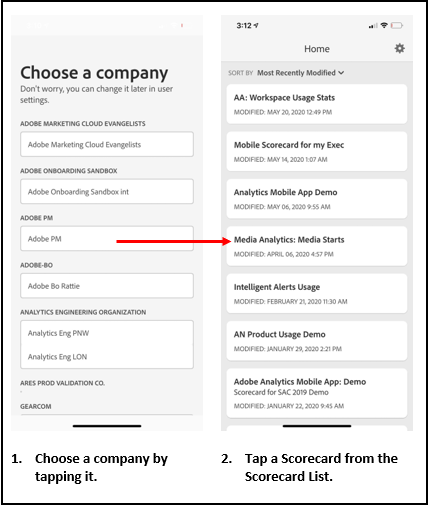
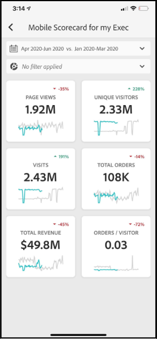
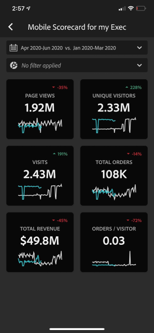
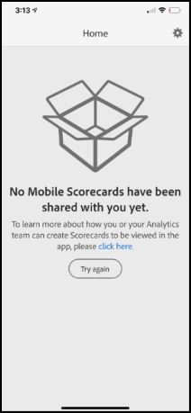

# Préparation des utilisateurs en charge de lʼexécution à lʼutilisation des tableaux de bord

Dans certains cas, les utilisateurs en charge de l’exécution peuvent avoir besoin d’aide pour accéder à l’application et l’utiliser. Cette section fournit des informations pour aider les curateurs à apporter cette aide.

## Vérifiez que les utilisateurs de l’application ont accès à Adobe Analytics

1. Configurez de nouveaux utilisateurs dans l’[CX Enterprise Admin Console](https://experienceleague.adobe.com/docs/analytics/admin/admin-console/permissions/product-profile.html?lang=fr).

1. Pour pouvoir partager des cartes de performance, vous devez accorder aux utilisateurs de l’application les autorisations d’accès aux composants de la carte de performance tels qu’Analysis Workspace, aux vues de données sur lesquelles les cartes de performance sont basées, ainsi qu’aux segments, mesures et dimensions.

## Configuration requise pour les utilisateurs de lʼapplication

Pour vous assurer que les utilisateurs en charge de lʼexécution ont accès à vos cartes de performance dans lʼapplication, vérifiez les éléments suivants :

* Les spécifications minimales en matière de systèmes d’exploitation mobile sur leurs appareils sont la version 10 ou ultérieure d’iOS ou la version 4.4 (KitKat) ou ultérieure d’Android.
* Ils disposent d’une connexion valide à Customer Journey Analytics.
* Vous avez créé et partagé correctement des cartes de performance mobiles avec eux.
* Ils ont accès aux composants inclus dans la carte de performance. Notez que lorsque vous partagez vos cartes de performance, vous pouvez sélectionnez lʼoption **[!UICONTROL Partager les composants incorporés]**.

## Aider les utilisateurs en charge de lʼexécution à télécharger et à installer lʼapplication

>[!NOTE]
>
>Bien que l’application mobile soit nommée tableau de bord Adobe Analytics dans l’App Store, elle peut être utilisée de la même manière que les cartes de performance mobiles Customer Journey Analytics.

**Pour les utilisateurs en charge de l’exécution sur iOS :**

Cliquez sur le lien suivant (également disponible dans Customer Journey Analytics sous **[!UICONTROL Outils]** > **[!UICONTROL Tableaux de bord Analytics (application mobile)]**) et suivez les invites pour télécharger, installer et ouvrir l’application :

`[iOS link](https://apple.co/2zXq0aN)`

**Pour les utilisateurs en charge de l’exécution sur Android :**

Cliquez sur le lien suivant (également disponible dans Customer Journey Analytics sous **[!UICONTROL Outils]** > **[!UICONTROL Tableaux de bord Analytics (application mobile)]**) et suivez les invites pour télécharger, installer et ouvrir l’application :

`[Android link](https://bit.ly/2LM38Oo)`

Une fois téléchargés et installés, les utilisateurs en charge de l’exécution peuvent se connecter à l’application à l’aide de leurs informations d’identification Customer Journey Analytics existantes. Nous prenons en charge les Adobe ID et Enterprise/Federated ID.

Écran de bienvenue des tableaux de bord Adobe Analytics 

## Aider les utilisateurs en charge de lʼexécution à accéder à votre carte de performance

1. Demandez aux utilisateurs en charge de lʼexécution de se connecter à lʼapplication.

   Lʼécran **[!UICONTROL Choisir une société]** sʼaffiche. Cet écran répertorie les entreprises connectées auxquelles l’utilisateur en charge de l’exécution appartient.

1. Demandez-leur d’appuyer sur le nom de la société de connexion ou de l’organisation CX Enterprise qui s’applique à la carte de performance que vous avez partagée.

   La liste des Cartes de performance affiche alors toutes les cartes de performance partagées avec la personne en charge de lʼexécution pour cette société de connexion.

1. Enfin, demandez-leur de trier cette liste selon la **[!UICONTROL Modification la plus récente]**, le cas échéant.

1. Il ne leur reste plus quʼà appuyer sur le nom de la Carte de performance pour lʼafficher.

   

### Explication de lʼinterface utilisateur des cartes de performance

Expliquez à lʼutilisateur en charge de lʼexécution comment les mosaïques apparaissent dans les cartes de performance que vous partagez.

Informations supplémentaires sur les mosaïques :

* La granularité des graphiques sparkline dépend de la longueur de la période :
* Une tendance horaire s’affiche pour les plages d’une journée.
   * Une tendance quotidienne s’affiche pour les plages comprises entre une journée et un an.
   * Une tendance hebdomadaire s’affiche pour les plages supérieures à un an.
   * La formule de modification de la valeur de pourcentage est calculée de la manière suivante : total de la mesure (période en cours) - total de la mesure (période de comparaison)/total de la mesure (période de comparaison).
   * Vous pouvez tirer l’écran vers le bas pour actualiser la Fiche d’évaluation.

1. Appuyez sur une mosaïque pour afficher comment fonctionne une répartition détaillée sur la mosaïque.

   

   * Appuyez sur n’importe quel point d’un graphique sparkline pour afficher les données associées à ce point sur la ligne.

   * Un tableau est inclus pour afficher les données des dimensions ajoutées à la mosaïque. Appuyez sur la flèche vers le bas pour sélectionner les dimensions. Si aucune dimension n’a été ajoutée à la mosaïque, le tableau affiche les données de graphique.

1. Pour modifier les périodes de votre carte de performance, appuyez sur l’en-tête de date et sélectionnez la combinaison de période de comparaison et de période principale que vous voulez afficher.

   

## Modifier les préférences de l’application

Pour modifier les préférences, appuyez sur l’option **[!UICONTROL Préférences]** affichée ci-dessus. Dans les préférences, vous pouvez activer la connexion biométrique ou définir l’application pour le mode sombre comme illustré ci-dessous :

## Résolution des problèmes

Si l’utilisateur en charge de l’exécution se connecte et qu’un message s’affiche indiquant que rien n’a été partagé :

* L’utilisateur en charge de l’exécution peut avoir sélectionné le mauvais sandbox Customer Journey Analytics, ou
* La carte de performance peut ne pas avoir été partagée avec l’utilisateur en charge de l’exécution.

Vérifiez que l’utilisateur en charge de l’exécution peut se connecter au sandbox Customer Journey Analytics approprié et que la carte de performance a été partagée.
