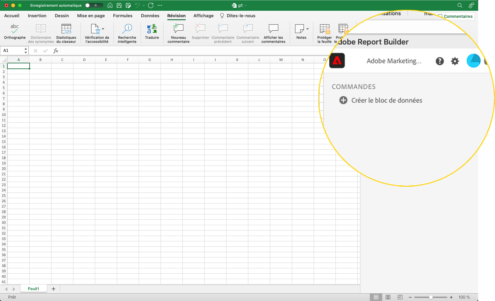
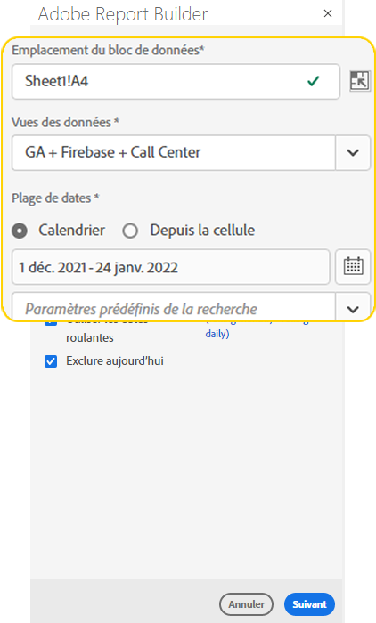
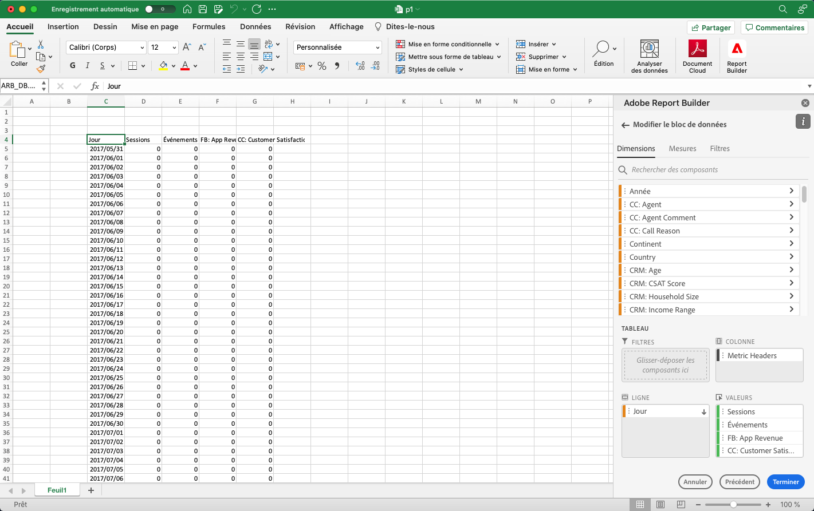
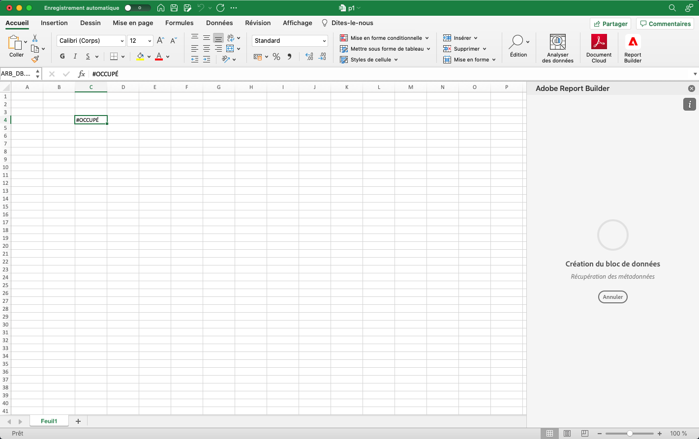
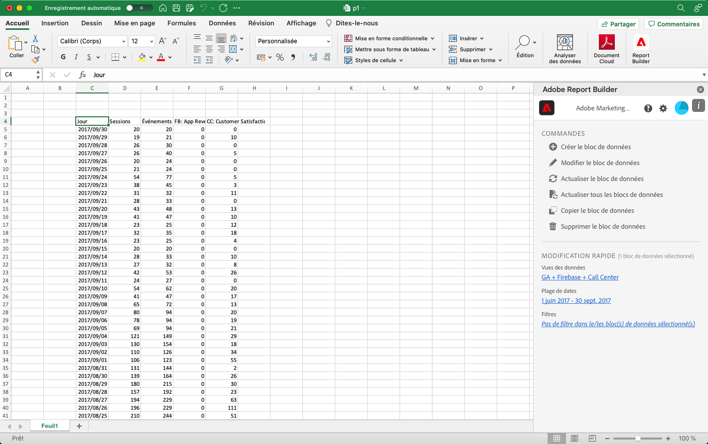

# Création d’un bloc de données

Un *bloc de données* est la table des données créée par une seule requête de données. Un classeur de Report Builder peut contenir plusieurs blocs de données. Lorsque vous créez un bloc de données, vous devez d&#39;abord le paramétrer, puis le construire.

## Configuration du bloc de données

Configurez les paramètres de bloc de données initiaux pour l’emplacement du bloc de données, les vues de données et une plage de dates.

1. Cliquez sur **Créer un bloc de données**.

   

1. Définissez l’ **emplacement du bloc de données**.

   L’option d’emplacement de bloc de données définit l’emplacement de la feuille de calcul où le créateur de rapports ajoute les données à votre feuille de calcul.

   Pour spécifier l’emplacement du bloc de données, sélectionnez une seule cellule dans la feuille de calcul ou saisissez une adresse de cellule telle que a3, \\\$a3, a\\$3 ou sheet1!a2. La cellule spécifiée sera le coin supérieur gauche du bloc de données lors de la récupération des données.

1. Sélectionnez les **vues de données**.

   L’option Vues de données vous permet de choisir une vue de données dans un menu déroulant ou de référencer une vue de données à partir d’un emplacement de cellule.

1. Définissez la **plage de dates**.

   L’option Période vous permet de choisir une période. Les plages de dates peuvent être fixes ou variables. Pour plus d’informations sur les options de période, voir &quot; lien vers la période &quot;.

1. Cliquez sur **Suivant**.

   

   Une fois le bloc de données configuré, vous pouvez sélectionner des dimensions, des mesures et des filtres pour le créer. Les onglets Dimensions, Mesures et Filtres s’affichent au-dessus du volet Générateur de tableau.
<!--
    
  -->

## Création du bloc de données

Pour créer le bloc de données, sélectionnez les composants de rapport, puis personnalisez la mise en page.

1. Ajout de Dimensions, de mesures et de filtres.

   Faites défiler la liste des composants ou utilisez le champ **search** pour localiser les composants. Faites glisser et déposez des composants dans le volet Tableau ou double-cliquez sur le nom d’un composant dans la liste pour l’ajouter automatiquement au volet Tableau.

   Double-cliquez sur un composant pour l’ajouter à une section par défaut du tableau.

   - Les composants de Dimension sont ajoutés à la section Ligne ou Colonne si une dimension figure déjà dans les colonnes.
   - Les composants de date sont ajoutés à la section Colonne .
   - Les composants de filtre sont ajoutés à la section Filtres .

1. Organisez les éléments dans le volet Tableau pour personnaliser la disposition de votre bloc de données.

   Faites glisser et déposez des composants dans le volet Tableau pour réorganiser les composants ou cliquez avec le bouton droit sur le nom d’un composant et sélectionnez dans le menu Options.

   Lorsque vous ajoutez des composants au tableau, un aperçu du bloc de données s’affiche à l’emplacement du bloc de données dans la feuille de calcul. La mise en page de l’aperçu du bloc de données est automatiquement mise à jour lorsque vous ajoutez, déplacez ou supprimez des éléments du tableau.

   

1. Cliquez sur **Terminer**.

   Un message de traitement s’affiche pendant la récupération des données d’analyse.

   

   Report Builder récupère les données et affiche le bloc de données renseigné dans la feuille de calcul.

   
