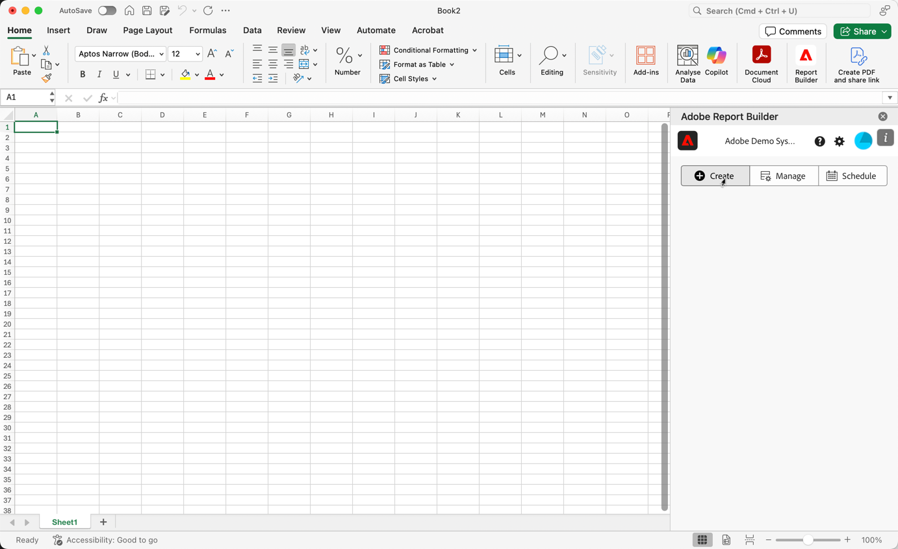

# Créer un bloc de données

Un *bloc de données* est le tableau de données créé par une requête de données unique. Un classeur Report Builder peut contenir plusieurs blocs de données. Lorsque vous créez un bloc de données, vous devez dʼabord le configurer avant de le créer.

## Configuration du bloc de données

Configurez les paramètres initiaux du bloc de données : son emplacement, les vues de données et une période.

1. Sélectionnez  **[!UICONTROL Créer]**.

   {zoomable="yes"}

1. Définissez lʼ&#x200B;**[!UICONTROL Emplacement du bloc de données]**.

   L&#39;option d&#39;emplacement des blocs de données définit l&#39;emplacement de la feuille de calcul où Report Builder ajoute les données à votre feuille de calcul.

   Pour spécifier l&#39;emplacement du bloc de données, sélectionnez une seule cellule dans la feuille de calcul ou saisissez une adresse de cellule, telle que `a3`, `\\\$a3`, `a\\\$3` ou `sheet1!a2`. La cellule spécifiée devient le coin supérieur gauche du bloc de données lors de la récupération des données.

   Utilisez  pour sélectionner un emplacement de bloc de données à partir de la cellule sélectionnée dans la feuille.

1. Choisissez les **[!UICONTROL Vues de données]**.

   Lʼoption relative aux Vues de données vous permet de choisir une vue de données dans un menu déroulant, ou de référencer une vue de données à partir dʼun emplacement de cellule.

   Sélectionnez  pour créer une vue de données à partir d’une cellule.

1. Définissez la **[!UICONTROL Période]**.

   L’option **[!UICONTROL Période]** vous permet de choisir une période. Les périodes peuvent être fixes ou variables.

   Sélectionnez **[!UICONTROL Calendrier]** pour sélectionner une période à l’aide de  ou saisissez manuellement une période. Vous pouvez éventuellement sélectionner un paramètre prédéfini dans le menu déroulant **[!UICONTROL _Paramètres prédéfinis de recherche_]**.

   Sélectionnez **[!UICONTROL À partir de la cellule]** pour définir des données de début et de fin en fonction d&#39;une cellule de la feuille active.

   Pour plus d’informations sur les options de période, voir [&#x200B; Sélectionner une période &#x200B;](select-date-range.md).

1. Sélectionnez **[!UICONTROL Suivant]**.

   

   Une fois le bloc de données configuré, sélectionnez des dimensions, des mesures et des segments pour le créer. Les onglets **[!UICONTROL Dimensions]**, **[!UICONTROL Mesures]** et **[!UICONTROL Segments]** s’affichent au-dessus du volet **[!UICONTROL Tableau]**.

## Création du bloc de données

Pour créer le bloc de données, sélectionnez les composants du rapport et personnalisez leur disposition.

1. Ajoutez les composants **[!UICONTROL Dimensions]**, **[!UICONTROL Mesures]** et **[!UICONTROL Segments]**.

   Faites défiler les listes de composants ou utilisez le champ  **[!UICONTROL _Rechercher des composants_]** pour localiser les composants. Faites glisser et déposez des composants dans le volet [!UICONTROL Tableau] ou sélectionnez deux fois le nom d’un composant dans la liste pour l’ajouter au volet [!UICONTROL Tableau].

   Sélectionnez deux fois un composant pour l’ajouter à une section par défaut du tableau.

   - Les composants Dimension sont ajoutés à la section  **[!UICONTROL Row]** ou à la section  **[!UICONTROL Column]** si une dimension figure déjà dans les colonnes.
   - Les composants de date sont ajoutés à la section  **[!UICONTROL Column]**.
   - Les composants de segment sont ajoutés à la section  **[!UICONTROL Segments]**.
   - Les composants de mesures sont ajoutés à la section  **[!UICONTROL Valeurs]**.

1. Organisez les éléments dans le volet Tableau pour personnaliser la disposition de votre bloc de données.

   Faites glisser et déposez des composants dans chaque liste du volet Tableau pour réorganiser les composants ou sélectionnez  et sélectionnez  Déplacer vers le haut,  Déplacer vers le bas, etc. pour déplacer les composants dans une liste.

   Lorsque vous ajoutez des composants au tableau, une prévisualisation du bloc de données sʼaffiche à lʼemplacement du bloc de données dans la feuille de calcul. La disposition de la prévisualisation du bloc de données est automatiquement mise à jour lorsque vous ajoutez, déplacez ou supprimez des éléments du tableau.

   

1. Vous pouvez éventuellement définir la **[!UICONTROL Date de début]** en tant que dimension pour identifier la date de début de votre bloc de données. L’ajout des données de début en tant que dimension s’avère utile si vous disposez d’un rapport régulièrement planifié avec une période variable. Ou si vous disposez d’une période non conventionnelle et que vous devez être explicite sur la date de début.

   

1. Vous pouvez éventuellement afficher ou masquer les en-têtes de ligne et de colonne. Pour ce faire, procédez comme suit :

   1. Sélectionnez l’icône **[!UICONTROL Tableau]** paramètres .

      

   1. Cochez ou désélectionnez l’option **[!UICONTROL Afficher les en-têtes de ligne et de colonne]**. Les en-têtes s’affichent par défaut.

1. Vous pouvez également masquer ou afficher les libellés de dimension et les en-têtes de mesure. Pour ce faire, procédez comme suit :

   1. Sélectionnez  sur le libellé de la dimension ou l’en-tête de colonne pour afficher le menu contextuel.

      

   1. Sélectionnez  **[!UICONTROL Hide]** ou  **[!UICONTROL Show]** pour activer/désactiver le libellé de dimension ou l’en-tête de colonne. Tous les libellés sont affichés par défaut.

1. Sélectionnez **[!UICONTROL Terminer]** pour terminer la configuration de votre bloc de données.

1. Un message de traitement **[!UICONTROL #BUSY]** s’affiche lors de la récupération des données d’analyse.

   

1. Report Builder récupère les données et affiche le bloc de données renseigné dans la feuille de calcul.

   

>[!MORELIKETHIS]
>
>[Sélectionner une vue de données](select-data-view.md)
>[Sélectionnez une période](select-date-range.md)
>[Filtrer les dimensions &#x200B;](filter-dimensions.md)
>[Utiliser les segments](work-with-filters.md)
>
