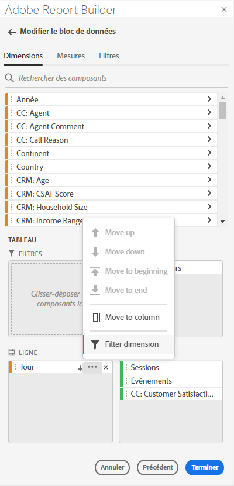
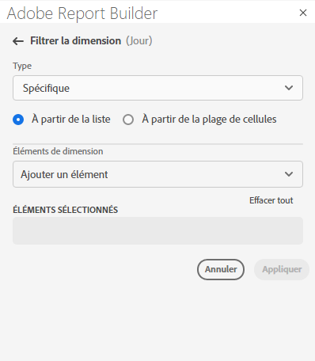
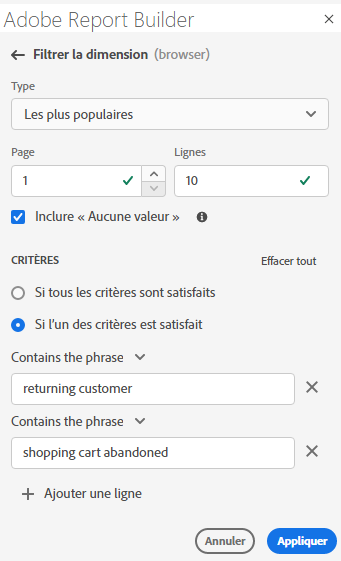
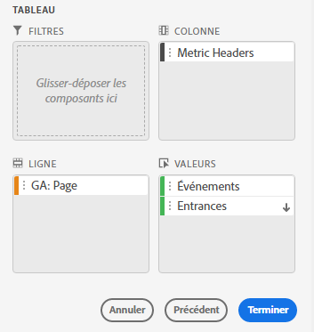
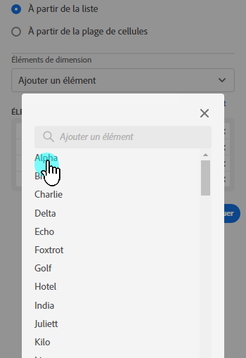
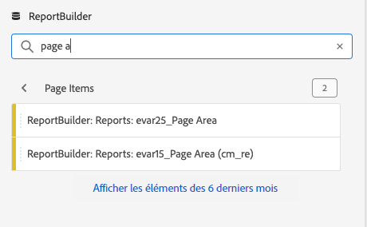
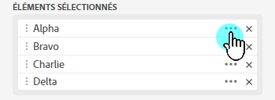
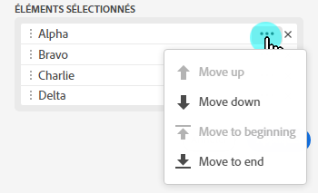
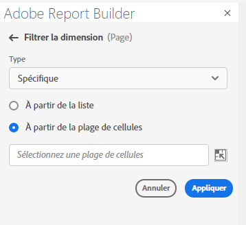
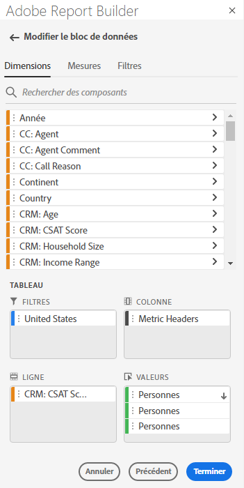

# Filtrage des dimensions

Par défaut, chaque élément de dimension du tableau renvoie les 10 premiers éléments de cette dimension.

Pour modifier les éléments de dimension renvoyés pour chaque dimension :

1. Sélectionnez un bloc de données et cliquez sur Modifier le bloc de données dans le panneau COMMANDES.

1. Cliquez sur Suivant pour afficher l’onglet Dimensions.

1. Cliquez sur l’icône **…** en regard d’un nom de composant dans le tableau.

   

1. Sélectionnez **Filtrer la dimension** dans le menu contextuel pour afficher le volet **Filtrer la dimension**.

1. Sélectionnez **Les plus populaires** ou **Spécifique**.

   

1. Sélectionnez les options appropriées en fonction du type de filtre choisi.

1. Cliquez sur **Appliquer** pour ajouter le filtre.

   Report Builder affiche une notification pour confirmer le filtre ajouté.

Pour afficher les filtres appliqués, passez la souris sur une dimension. Les dimensions sur lesquelles des filtres ont été appliqués affichent une icône de filtre à droite de leur nom.

## Type de filtre

Il existe deux manières de filtrer les éléments de dimension : Les plus populaires et Spécifique.

## Les plus populaires

L’option Les plus populaires vous permet de filtrer les éléments de dimension de manière dynamique en fonction de valeurs de mesure. Ce filtrage renvoie les éléments de dimension avec le meilleur classement en fonction des valeurs de mesure. Par défaut, les 10 premiers éléments de dimension sont répertoriés. Ils sont triés en fonction de la première mesure ajoutée au bloc de données.

### Options Page et Lignes

Utilisez les champs **Page** et **Lignes** pour diviser les données en groupes ou pages séquentiel(le)s. Vous pouvez ainsi ajouter à votre rapport des valeurs de lignes autres que les valeurs les mieux classées. Cette fonctionnalité est particulièrement utile pour extraire des données au-delà de la limite des 50 000 lignes.

#### Paramètres Page et Lignes par défaut

- Page = 1
- Lignes = 10

Les paramètres Page et Lignes par défaut indiquent que chaque page comporte 10 lignes de données. La page 1 renvoie les 10 premiers éléments, la page 2 renvoie les 10 éléments suivants, etc.

Le tableau ci-dessous répertorie des exemples de valeurs de page et de lignes, ainsi que la sortie qui en résulte.

| Page | Ligne | Sortie |
|------|--------|----------------------|
| 1 | 10 | 10 premiers éléments |
| 2 | 10 | Éléments 11 à 20 |
| 1 | 100 | 100 premiers éléments |
| 2 | 100 | Éléments 101 à 200 |
| 2 | 50 000 | Éléments 50 001 à 100 000 |

#### Valeurs minimales et maximales

- Page de début : min = 1, max : 50 millions
- Nombre de lignes : min = 1, max : 50 000

### Inclure « Aucune valeur »

Dans Customer Journey Analytics, certaines dimensions collectent une entrée « aucune valeur ». Ce filtre permet d’exclure ces valeurs des rapports. Par exemple, vous pouvez créer une classification telle que la classification Nom du produit en fonction de la clé SKU du produit. Si un SKU de produit spécifique n’a pas été configuré avec sa classification de nom de produit spécifique, sa valeur de nom de produit est définie sur « aucune valeur ».

Inclure « **Aucune valeur** » est sélectionné par défaut. Désélectionnez cette option pour exclure les entrées sans valeur.

### Filtrage par critères

Vous pouvez filtrer les éléments de dimension en fonction du respect de tous les critères ou du respect d’au moins l’un d’entre eux.

Pour définir des critères de filtrage

1. Sélectionnez un opérateur dans la liste déroulante.

   

1. Saisissez une valeur dans le champ de recherche.

1. Cliquez sur Ajouter une ligne pour confirmer la sélection et ajouter un autre élément de critère.

1. Cliquez sur l’icône de suppression pour supprimer un élément de critère.

   Vous pouvez inclure jusqu’à 10 éléments de critère.

### Modification du filtre et de l’ordre de tri

Une flèche s’affiche en regard de la mesure utilisée pour filtrer et trier le bloc de données. La direction de la flèche indique si la mesure est triée par ordre croissant ou décroissant.

Pour modifier l’ordre de tri, cliquez sur la flèche en regard de la mesure. 

Pour modifier la mesure utilisée pour filtrer et trier le bloc de données :

1. Passez la souris sur le composant de mesure souhaité dans le générateur de tableau pour afficher d’autres options.

2. Cliquez sur la flèche de la mesure souhaitée. 

   

## Filtrage spécifique

L’option Spécifique vous permet de créer une liste fixe d’éléments de dimension pour chaque dimension. Utilisez le type de filtrage **Spécifique** pour spécifier les éléments de dimension exacts à inclure dans votre filtre. Vous pouvez sélectionner des éléments dans une liste ou dans une plage de cellules.

### À partir de la liste

1. Sélectionnez l’option **À partir de la liste** pour rechercher et sélectionner des éléments de dimension.

   Lorsque vous sélectionnez l’option **À partir de la liste**, la liste est d’abord remplie avec les éléments de dimension comportant le plus d’événements.

   

   La liste **Éléments disponibles** est triée dans l’ordre des éléments de dimension comportant le plus d’événements à ceux comportant le moins d’événements.

1. Saisissez un terme de recherche dans le champ **Ajouter un élément** pour effectuer une recherche dans la liste.

1. Pour rechercher un élément non inclus dans les 90 derniers jours de données, cliquez sur **Afficher les éléments des 6 derniers mois** afin d’étendre la recherche.

   

   Une fois les données des six derniers mois chargées, Report Builder met à jour le lien vers **Afficher les éléments des 18 derniers mois**.

1. Sélectionnez un élément de dimension.

   Les éléments de dimension sélectionnés sont automatiquement ajoutés à la liste **Éléments sélectionnés**.

   

   Pour supprimer un élément de la liste, cliquez sur l’icône de suppression.

   Pour déplacer un élément dans la liste, faites glisser et déposez l’élément ou cliquez sur … pour afficher le menu de déplacement.

   

1. Cliquez sur **Appliquer**

   Report Builder met à jour la liste pour afficher le filtrage spécifique appliqué.

### À partir de la plage de cellules

Sélectionnez l’option **À partir de la plage de cellules** pour choisir une plage de cellules contenant la liste des éléments de dimension à faire correspondre.

Lorsque vous sélectionnez une plage de cellules, tenez compte des restrictions suivantes :

- La plage doit comporter au moins une cellule.
- La plage ne peut pas contenir plus de 50 000 cellules.
- La plage doit se trouver dans une seule ligne ou colonne ininterrompue.

Votre sélection peut contenir des cellules vides ou des cellules avec des valeurs qui ne correspondent pas à un élément de dimension spécifique.

### À partir de l’onglet Dimensions du Générateur de tableaux

Dans l’onglet **Dimensions**, cliquez sur l’icône de chevron en regard d’un nom de dimension pour afficher la liste des éléments correspondants.

Vous pouvez faire glisser et déposer des éléments sur le **Tableau** ou double-cliquer sur le nom d’un élément pour l’ajouter au générateur de **Tableau**.
