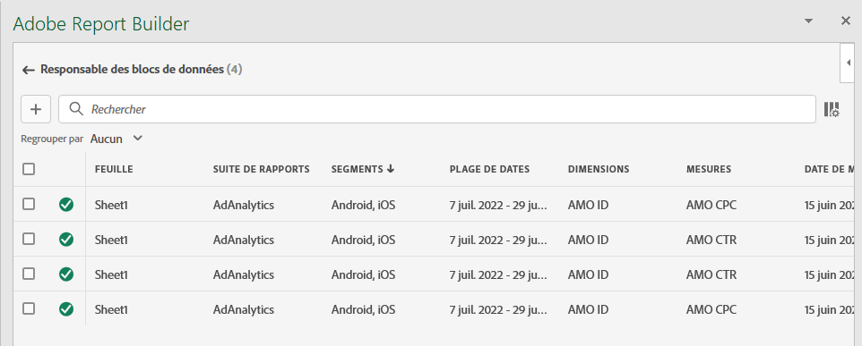
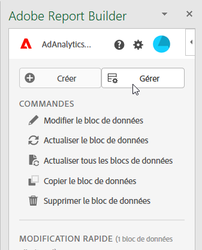
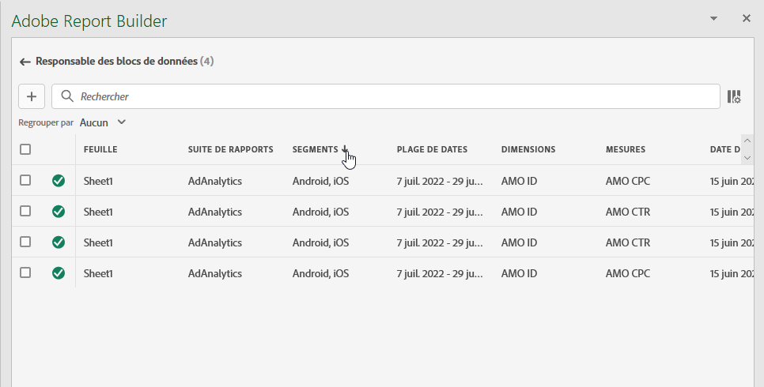
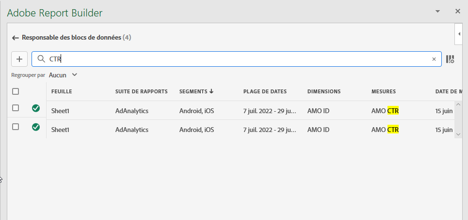
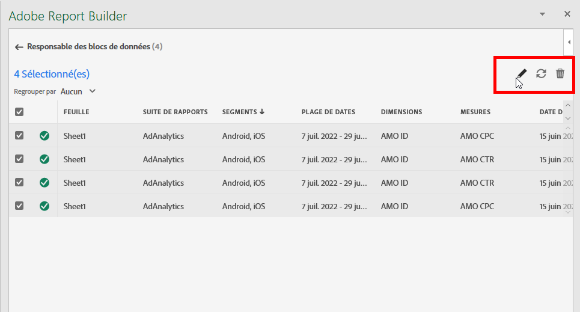
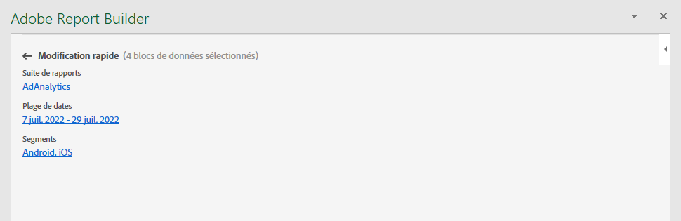
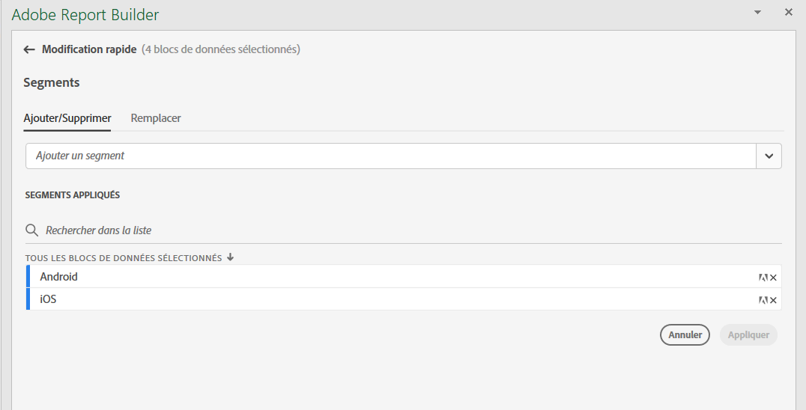
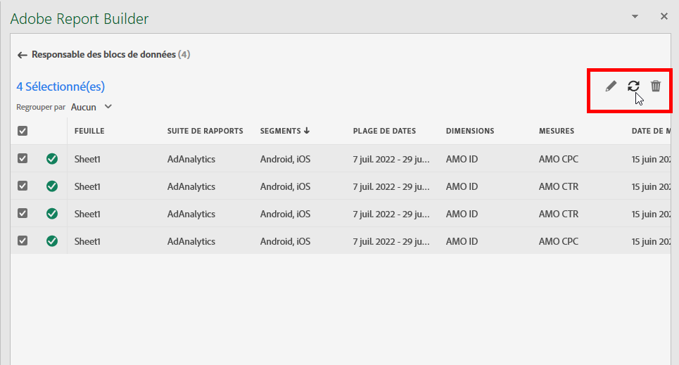
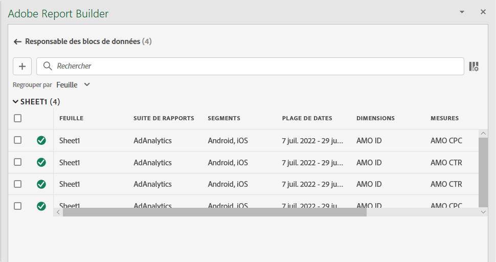
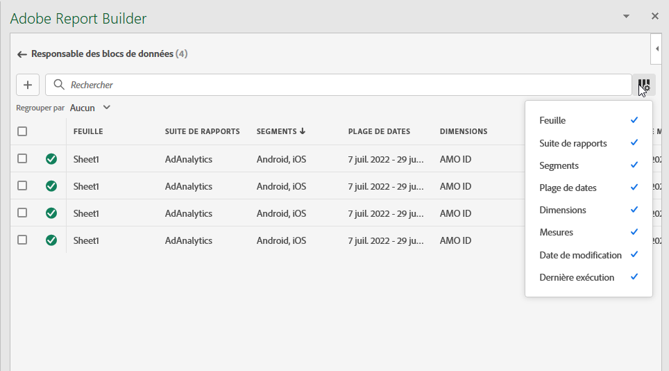

# Gestion des blocs de données dans Report Builder

Vous pouvez afficher et gérer tous les blocs de données d’un classeur à l’aide du Gestionnaire de blocs de données. Le Gestionnaire de blocs de données fournit des fonctionnalités de recherche, de filtrage et de tri qui vous permettent de localiser rapidement des blocs de données spécifiques. Après avoir sélectionné un ou plusieurs blocs de données, vous pouvez modifier, supprimer ou actualiser les blocs de données sélectionnés.

## Afficher les blocs de données

Cliquez sur **Gérer** pour afficher la liste de tous les blocs de données d’un classeur.

Le Gestionnaire de blocs de données répertorie tous les blocs de données présents dans un classeur. 

## Tri de la liste Blocs de données

Vous pouvez trier la liste bloquée de données par colonne affichée. Vous pouvez, par exemple, trier la liste bloquée de données par Report Suites, Filtres, Période et autres variables.

Pour trier la liste bloquée de données, cliquez sur un en-tête de colonne.

## Recherche dans la Liste bloquée de données

Utilisez le champ Rechercher pour localiser tout élément dans le tableau du bloc de données. Par exemple, vous pouvez rechercher des mesures contenues dans les blocs de données ou la suite de rapports. Vous pouvez également rechercher des dates apparaissant dans les colonnes de date, de date de modification ou de date de dernière exécution.

## Modifier les blocs de données

Vous pouvez modifier la vue de données, la période ou les filtres appliqués à un ou plusieurs blocs de données.

Par exemple, vous pouvez remplacer un filtre existant par un nouveau filtre dans un ou plusieurs blocs de données.

1. Sélectionnez les blocs de données à mettre à jour. Vous pouvez cocher la case de niveau supérieur pour sélectionner tous les blocs de données ou sélectionner des blocs de données individuels.

   

1. Cliquez sur l’icône d’édition pour afficher la fenêtre Modification rapide .

   

1. Sélectionnez un lien de filtre pour mettre à jour les vues de données, les périodes ou les filtres.

   

## Actualiser les blocs de données

Cliquez sur l&#39;icône d&#39;actualisation pour actualiser les blocs de données de la liste.

Pour vérifier si un bloc de données est actualisé, cliquez sur l’icône Actualiser l’état . Coche dans un cercle vert  indique que l’actualisation du bloc de données a réussi. Un bloc de données qui n’a pas été actualisé affiche une icône d’avertissement. .  Cela permet d’identifier facilement si des blocs de données comportent des erreurs.

## Suppression d’un bloc de données

Cliquez sur l’icône représentant une corbeille pour supprimer un bloc de données sélectionné.

## Blocs de données de groupe

Vous pouvez regrouper des blocs de données à l’aide de la variable **Group by** ou cliquez sur le titre d’une colonne. Pour trier les blocs de données par colonne, cliquez sur le titre de la colonne. Pour regrouper des blocs de données par groupes, sélectionnez un nom de groupe dans le **Group by** menu déroulant. Par exemple, la capture d’écran ci-dessous présente les blocs de données regroupés par feuille. Il affiche les blocs de données regroupés par Sheet1 et Sheet2.  Cela s’avère utile, par exemple, dans le cas d’utilisation du remplacement de filtre. Si plusieurs filtres sont appliqués à chaque bloc de données, il est utile de créer un groupe contenant tous les blocs de données à remplacer. Vous pouvez ensuite facilement les sélectionner et les modifier tous en même temps.

## Modification de la vue Gestionnaire de blocs de données

Vous pouvez modifier les colonnes visibles dans la fenêtre Gestionnaire de blocs de données .

Cliquez sur la liste des colonnes.  pour sélectionner les colonnes répertoriées dans le Gestionnaire de blocs de données. Sélectionnez le nom de la colonne à afficher. Désélectionnez le nom de la colonne pour la supprimer de la vue.

